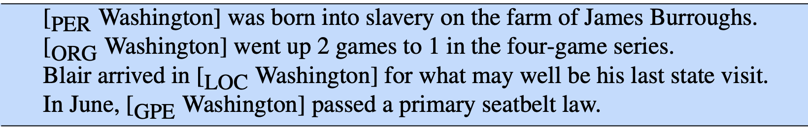
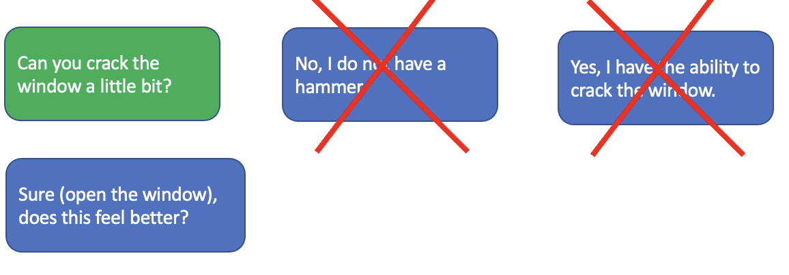
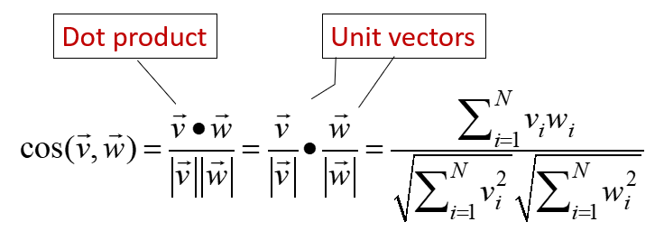
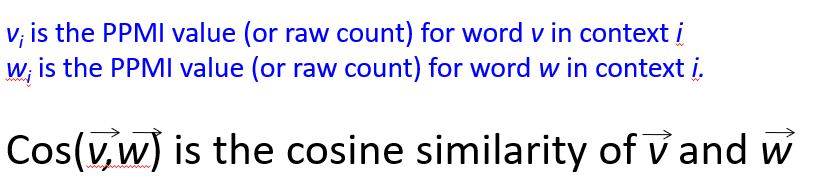
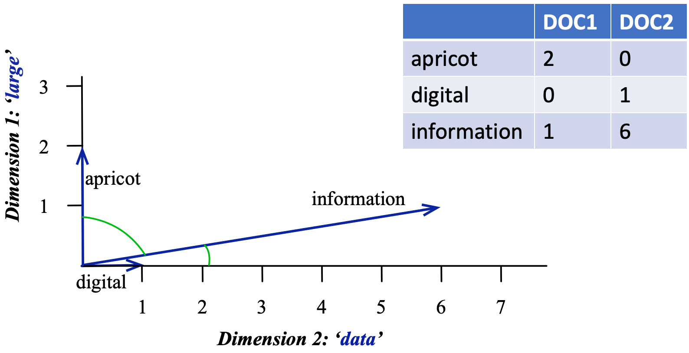
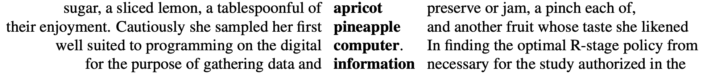
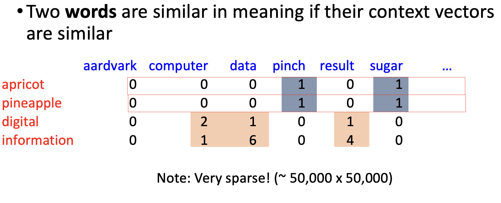

# 9/30 Lecture 1

### What is NLP

- **Wiki: Natural language processing** (**NLP**) is a field of computer science, artificial intelligence, and computational linguistics concerned with the interactions between computers and human (natural) languages.

### Go beyond the keyword matching

- Identify the structure and meaning of words, sentences, texts and conversations
- Deep understanding of broad language
- NLP is all around us

### NLP is a pretty old topic!


##### Google Translate

- Launched in 2006, App in 2011, WordLens 2015 (Take a picture and translate)

##### Machine Translation

- Translate language

##### Question Answering

- Watson computer wins at Jeopardy in February 2011
- Siri launched in October 2011

##### Sentiment/Opinion Analysis

- First research paper: 2002
- TwitrRatr: 2018

##### Text Classfication

##### Information Extraction

##### Conversational Assistant Systems

##### My Model Wrote A Sonnet For You!

### ChatGPT

- Let’s have a try! https://chat.openai.com/ 

- **Input**: When I found out my grandma was in the hospital I felt a particular color. When someone cut me off in traffic I felt a different color. What is the most likely color I would see if I combined these two colors?
  - `blue is sad, red is anger, combine these would be **purple**`

- **Input**: Michael is at that really famous museum in France looking at its most famous painting. However, the artist who made this painting just makes Michael think of his favorite cartoon character from his childhood. What was the country of origin of the thing that the cartoon character usually holds in his hand?
  - ChatGPT answer: 
    - Michael is likely at the Louvre in France, looking at the **Mona Lisa**, painted by Leonardo da Vinci. If Leonardo da Vinci makes Michael think of his favorite childhood cartoon character, that character is likely **Leonardo** from the **Teenage Mutant Ninja Turtles**. Leonardo, the turtle, is known for wielding **katana swords**, which are traditionally from **Japan**. Therefore, the country of origin of the thing that the cartoon character usually holds in his hand is **Japan**.

### Goals of the course

- Introduce you to NLP problems & solutions 
- Models, algorithms, and tools that are out there to solve language-related problems you want to tackle
- How to design and evaluate your own task/model/algorithm/tool
  - Using data and statistics
  - Using your own creativity
  - Using the latest advances

- At the end you should:
  - Agree that language is subtle & interesting 
  - Feel some ownership over the models/algorithms/tools
  - Understand research papers in the field

### What are the challenges?

#### Ambiguity: Favorite Headlines

- Iraqi Head Seeks Arms `Head and arms` 
- Juvenile Court to Try Shooting Defendant `try means trail`
- Teacher Strikes Idle Kids
- Stolen Painting Found by Tree `Find near the tree`
- Kids Make Nutritious Snacks `kids are nutritious snacks`
- Local High School Dropouts Cut in Half `if you drop out from high school you will be cut`

#### Part-of-Speech (POS) Tagging and Ambiguity

- “Back” can be an adjective, noun, particle, or verb.
  - The **back** *door* (adjective)
  - *On my* **back** (noun)
  - *Win the voters* **back** (particle)
  - *Promised to* **back** *the bill* (verb)

#### Named Entity Recognition (NER) and Ambiguity

- Type ambiguity
  - Example: 

#### Syntactic Parsing and Ambiguity


### Course Information

##### Levels of Language

- **Phonetics/phonology/morphology**: what words (or subwords) are we dealing with? 

  - cat, cats, dog, dogs(z), box, boxes. 

- **Semantics**: What’s the literal meaning?

  - What does a sentence mean?

    - Papa eats the caviar with a spoon.

      

- **Syntax**: What phrases are we dealing with? Which words modify one another?

  ​	

- **Pragmatics**: What should you conclude from the fact that I said something? How should you react?

  - What does *the speaker* mean? (context: in a stuffy room)

    

    

### Course Information

- Website: https://violetpeng.github.io/cs263_fall24.html
  - Last two weeks are course project final presentation
    - Count to participation
  - Assignment 1 release on Wednesday (individual assignment)
    - Read a paper, run a demo from th paper and present it
    - We will pick out the good demo to Expo

- Participation have 10% of the grade
  - Piazza, peer review for homework and final project

- Group project, 4 people

- Two in-class quiz

  - one single-sided page of notes allowed

- Extra-credit:

  - Outstanding in-class participator and piazza receive grade bump

    

# 10/2 Lecture

Assignment 1 and project description is released today.

Sign up for paper to present, reproduce the code and write a demo

peer review and class/TA/Piazza participation

### Introduction to lexical semantics

#### How do we represent a word?

- How do we “understand” a word?

- How can we know the relation/distance/similarity between words **computationally**?

  `In number? In vector? In Graph?`

##### Representing words as discrete symbols

- Naïve way: represent words as atomic symbols: student, talk, university (BoW)

- Represent word as a **“one-hot”** vector (**独热**) 
   [ 0       0           0           1                 0  …     0 ]

  egg   student  talk  university   happy   buy   

   `egg = [1 0 0 0 0]`
   
   `student = [0 1 0 0 0]`
   
   `talk = [0 0 1 0 0]`
   
   `Insufficient and words have no connection with each other`
   
- How large is (what’s the dimension of) this vector?
  - Vector dimension = number of words in vocabulary 
    - PTB data: ~50k, 
    - Google 1T data: 13M

##### Issues

- Dimensionality is large; vector is sparse
- No similarity
  - $V_{happy}$  = [0 0 0 1 0 ... 0 ]
  - $V_{sad}$    = [0 0 1 0 0 ... 0 ]
  - $V_{milk}$   = [1 0 0 0 0 ... 0 ]
  - $V_{happy} • V_{sad}  = V_{happy} • V_{milk}$ = 0
- Cannot represent new words

##### How about unseen words/phrases

- Example: Shakespeare corpus consists of N=884,647 word tokens and a vocabulary of V=29,066 word types
- Only 30,000 word types occurred
  - Words not in the training data ⇒ no representation, 0 probability

#### What is Lexical Semantics

Word meanings that can help decide:

- Word Similarity 
  - Distributional (Vector) Models of Meaning
- Word Relations
- Word Sense Disambiguation
- Semantic Roles

##### Intuition of Semantic Similarity

| Semantically Close | Semantically Distant |
| ------------------ | -------------------- |
| bank-money         | doctor-mall          |
| apple-fruit        | painting-January     |
| tree-forest        | math-river           |
| bank-river         | apple-penguin        |
| pen-paper          | nurse-fruit          |
| run-walk           | pen-river            |
| mistake-error      | clown-rocket         |
| car-wheel          | car-algebra          |

##### Why Are Two Words Related?

- Meaning
  - Two concepts are close in terms of meaning (want-desire)
- World knowledge
  - Two concepts have similar properties, often occur together, or occur in similar contexts (pencil-pen, pen-ink, dog-cat)
- Psychology
  - We often think of the two concepts together (voting-home address, red-luck[in some culture]) 

#### Validity of Semantic Similarity

- Is semantic distance `(how far apart word meanings are)` a valid linguistic phenomenon? -> how would you approach this problem?
- Experiment (Rubenstein and Goodenough, 1965)
  - Compiled a list of word pairs
  - Subjects asked to judge semantic distance (from 0 to 4) for each pair
- Results
  - Rank correlation between subjects is ~ 0.9
  - People are **consistent**!

- What can we use semantic similarity for? (discussion)

###### Word similarity for plagiarism detection


`Semantic similarity will help catch plagiarism`

###### Word similarity for historical linguistics: semantic change over time


`From start, gay means happy and until now gay means homosexual. Use semantic similarity help help us understand the semantic change over the time`

###### Word similarity reflects gender stereotype


### Theoretical foundation of distributional semantics

- **Intuitions**: Zellig Harris (1954):
  - “oculist and eye-doctor … occur in almost the same environments”
  - “If A and B have almost identical environments we say that they are synonyms.”
- Firth (1957): 
  - “You shall know a word by the company it keeps!”

`Theory: We can know the semantic similarity with the words comes with them.`

###### Intuition for distributional word similarity

- Words that occur in the same contexts tend to have similar meanings

  

###### More intuition for distributional word similarity

```
A bottle of tesgüino is on the table
Everybody likes tesgüino
Tesgüino makes you drunk
We make tesgüino out of corn.
```

- From context words humans can guess **tesgüino** means
  - an alcoholic beverage like **beer**
- Intuition for algorithm:
  - Two words are similar if they have similar word contexts.

### Two classes of vector representation

- Sparse vector representations
  1. Mutual-information weighted word co-occurrence matrices

- Dense vector representations:
  2. *Singular value decomposition (and Latent Semantic Analysis)*
  3. Neural-network-inspired models (skip-grams, CBOW)
  4. *Brown clusters*

##### Shared intuition

- Model the meaning of a word by “embedding” in a vector space.
- The meaning of a word is a vector of numbers
  - Vector models are also called “**embeddings**”.
  - `Not a one hot vector`
- Contrast: word meaning is represented by a vocabulary index (“word number 545”  ->  one hot vector)
  - The drawbacks of one-hot vector is discussed in the previous lecture.

#### Sparse Vector Representations

Word-document matrix

Word-word matrix

PPMI and Cosine similarity

##### Term-document matrix

- Each cell: count of term $t$ in a document $d:tf_{t,d}$ :
  - <u>Each document</u> is a *count vector* in $ℕ^v$: a column below `As You Like It [1 2 37 6] (竖排)`
  - Each word is a count vector in $ℕ^d$: a row below `Fool: [37 58 1 5] （横排）`

|         | As You Like It | Twelfth Night | Julius Caesar | Henry V |
| ------- | -------------- | ------------- | ------------- | ------- |
| battle  | 1              | 1             | 8             | 15      |
| soldier | 2              | 2             | 12            | 36      |
| fool    | 37             | 58            | 1             | 5       |
| clown   | 6              | 117           | 0             | 0       |

​	`From this matrix, we can see Battle and Soldier are closer to each other than Battle and Fool (Similarity of the words)`

- Two **documents** are similar if their vectors are similar
  - `Example: Julius Caesar [8 12 1 0]` and `Henry V [15 36 5 0]`
- Two **words** are similar if their vectors are similar
  - Example: `fool [37 58 1 5]` and `clown [6 117 0 0]`

### Measuring similarity: cosine

`cosine similarity over dot product (it's normalized!) `

- Divide the dot product by the length of the two vectors!

  

- This turns out to be the cosine of the angle between them!

  

### Recap: Dot Product between Vectors

- To calculate the dot product


### Cosine for computing similarity

- Recap for Cosine Similarity






###### Visualizing vectors and angles



`Dimension 1 is DOC1, Dimension 2 is DOC2`

##### Issues about the term-document matrix

- Document can be very long
  - Some far-away words appear in the same documents are no longer that relevant/similar.
- There are usually <u>only a small number of documents</u> 
  - The dimension of the count vector for each word is small.
  - The statistics would be less robust/reliable.

### The word-word or word-context matrix

- Instead of entire documents, use smaller contexts
  - Paragraph
  - Window of ± 4 words
- A word is now defined by a vector over counts of context words
- Instead of each vector being of length D
- Each vector is now of length $|V|$
- The word-word matrix is $|V|\times|V|$

##### Word-Word matrix Input: sample contexts ± 7 words



##### Output: word-context matrix



### Word-word matrix

- We showed only 4x6, but the real matrix is 50,000 x 50,000

  - So it’s very **sparse** -- Most values (~98%) are 0.

- The size of windows depends on your goals

  - The shorter the windows , the more **syntactic** the representation
    - ± 1-3 very syntactic

  - The longer the windows, the more **semantic** the representation
    - ± 4-10 more semantic

  - Even longer, you will get **topical** representations
    - ± 10+ more topical

### Problem with raw counts

- Raw word frequency is not a great measure of association between words (why)?
  - It’s very skewed
    - “the” and “of” are very frequent, but maybe not the most discriminative
- We’d rather have a measure that asks whether a context word is **particularly informative** about the target word.
  - Positive Pointwise Mutual Information (PPMI)

### Pointwise Mutual Information

**Pointwise mutual information**:

​	Do events x and y co-occur more than if they were independent?


**PMI between two words**:

​	 Do words x and y co-occur more than if they were independent? 


- What’s the range of PMI?	$-\infty$ to $+\infty$

- But the negative values are problematic
  - It’s not clear people are good at “unrelatedness”

- So we just replace negative PMI values by 0

- Positive PMI (PPMI) between word1 and word2:


###### Exercise


$p(w=information, c=data)=6/19=0.32$

$p(w=information) = 11/19 = 0.58$

$p(c=data) = 7/19 = 0.37$

