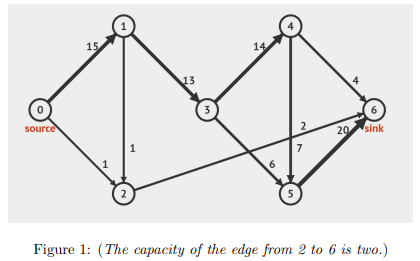
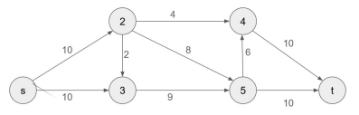

# CSCI 570 Spring 2025 Homework 8

### Question 1

Consider a flow network with source 0, sink 6, and the following edges:

- Draw the **first, second, and final** residual graphs $G_f$ using the Edmonds-Karp implementation of Ford-Fulkerson algorithm corresponding to the max flow problem.
- Determine the max-flow value. 
- Provide **all** of the min-cuts.

###### Answer:

- First BFS Augmenting Path

  - Path: 0 → 1 → 3 → 4 → 6
  - Bottleneck: $\min(15,\,13,\,14,\,4) = 4$
  - Send flow: 4 units along this path.

- Second BFS Augmenting Path

  - Path: 0 → 1 → 3 → 5 → 6
  - Bottleneck: $\min(15-4,\,13-4,\,6,\,20) = 6$
  - Send flow: 6 units along this path.

  (Total flow is now $4 + 6 = 10$.)

- Third BFS Augmenting Path

  - Path: 0 → 2 → 6
  - Bottleneck: $\min(1,\,2) = 1$
  - Send flow: 1 unit.

  (Total flow is $10 + 1 = 11$.)

- Fourth BFS Augmenting Path

  - Path: 0 → 1 → 2 → 6
  - Bottleneck: $\min(\,15 - (4+6+ ?),\,1,\,2 - 1\,)$ = 1
  - Send flow: 1 unit.

  (Total flow is $11 + 1 = 12$.)

- Fifth BFS Augmenting Path

  - Path: 0 → 1 → 3 → 4 → 5 → 6
  - Bottleneck: $\min(\text{(residual capacities)}) = 3$
  - Send flow: 3 units.

  (Total flow is 12 + 3 = 15.)

  After this, a new BFS will find no path of positive capacity from 0 to 6 in the residual graph.

Hence, the maximum flow value is **15**.

All min cuts (partitions (S,T) with 0 ∈ S and 6 ∈ T) of capacity 15 are:

(a)  S = {0, 1} and T = {2, 3, 4, 5, 6}, which cuts edges 0→2, 1→2, 1→3.

(b)  S = {0, 1, 2} and T = {3, 4, 5, 6}, which cuts edges 1→3, 2→6.

### Question 2

Consider a flow network with source s, sink t, and the following edges: 

- Draw the **first, second, and final** residual graph $G_f$ using the scaled version of Ford-Fulkerson algorithm corresponding to the max flow problem. 
  - Give the value of ∆ for the first iteration, and the residual graph $G_f$ after the first iteration. 
  - Give the value of ∆ for the second iteration, and the residual graph $G_f$ after the second iteration. 
  - Give the final $G_f$. 
- Find the max-flow value. 
- Find all of the min-cuts.

###### Answer

- First iteration (Δ = 8) 

  - Find any s–t path in the residual graph that can carry at least 8 units. A suitable path is s → 2 → 5 → t, with bottleneck 8. Push 8 units of flow along that path.

    After this push: Edge s→2 has 2 units of residual capacity left (10 − 8 = 2), and 2→5 is fully used up (res. cap. = 0). Edge 5→t now has 2 units left (10 − 8 = 2). Back‐edges 2→s, 5→2, and t→5 each gain 8 units of residual capacity.

- Second iteration (Δ = 4) 

  - Look for a path of capacity ≥ 4.  One is s → 3 → 5 → 4 → t, whose bottleneck is 6 (all edges on that route have at least capacity 6). Push 6 units along s→3→5→4→t. After this push: s→3 has 4 left (10 − 6 = 4), 3→5 has 3 left (9 − 6 = 3), 5→4 is now 0 (6 − 6 = 0), 4→t has 4 left (10 − 6 = 4). No more paths can carry ≥ 4, so we halve Δ to 2.

- Third iteration (Δ = 2) 

  - Now look for paths of capacity ≥ 2. (a) s → 2 → 4 → t  has bottleneck min(2,4,4) = 2, so push 2. (b) Another path is s → 3 → 5 → 2 → 4 → t with bottleneck 2 again, so push 2. That adds 4 more units (2 + 2), bringing total flow to 18. We cannot push any additional flow ≥ 2, so halve Δ to 1.

- Fourth iteration (Δ = 1) 

  - A path of capacity ≥ 1 is s → 3 → 5 → t, with bottleneck 1 left. Push 1 along that path. This brings the total flow to 19.  No more augments ≥ 1 are possible.

**Final Max Flow**: The total flow is **19**.

**Min‐cut**: In the final residual graph, the only nodes still reachable from s are {s, 3}, because: s→2 is fully used (res. capacity 0), and s→3 has capacity left, but from 3 we cannot progress forward to 5 (that edge is fully used).

Hence a minimum cut is (S, T) with **S = {s, 3} and T = {2, 4, 5, t}**. The edges crossing from S to T in the original network are: s→2 (capacity = 10), 3→5 (capacity = 9)

Their total is 19, matching the max flow.  That is the (unique) min‐cut.

### Question 3

##### Part (a): Assignment Feasibility

You are given: 

- n entities $e_1, e_2, ... , e_n$. 

- k groups $g1, g2, . . . , gk$. 

- For each entity $e_j$ , a subset $p_j ⊆ {g_1, g_2, . . . , g_k}$ with $|p_j | ≥ m$, where m is a positive integer. 

- For each group $g_i$ , a capacity $q_i$ (maximum number of entities it can contain). You want to determine if it is possible to assign each entity $e_j$ to **at least** m groups from its subset $p_j$ , such that no group $g_i$ contains more than $q_i$ entities. 

  **Task: Design** an algorithm to check if such an assignment exists and **prove** its correctness. 

  (Hint: The prrof will have two directions. 1) Forward Direction: If feasible, then [statement]. 2) Backward Direction: If [statement] then feasible.) 

##### Part (b): Selection with Constraints 

Assume a feasible solution to part (a) exists, and each entity $e_j$ is assigned to **exactly** m groups from $p_j$ . Select exactly one entity as a “representative” for each group $g_i$ from the entities assigned to it. No entity can be a representative for more than r groups, where r < m. Determine if such a selection of representatives is possible. 

**Task**: Design an algorithm to check if this selection exists and prove its correctness. 

(Hint: Use the solution from part (a) as a starting point.) 

(Hint: The prrof will have two directions. 1) Forward Direction: If feasible, then [statement]. 2) Backward Direction: If [statement] then feasible.)

###### Answer:

**Part A**

Construct a flow network as follows:

1. Create a source node S and a sink node T.
2. Create one node per entity (call them Eⱼ), and one node per group (call them Gᵢ).
3. Connect S → Eⱼ with capacity m, meaning each entity can distribute up to m “units” of assignment flow.
4. For each eⱼ and each group gᵢ ∈ pⱼ, connect Eⱼ → Gᵢ with capacity 1 (an entity can only “use up” one slot in any group to which it is assigned).
5. Connect each Gᵢ → T with capacity qᵢ (the group’s capacity constraint).

- ALGORITHM: FORD–FULKERSON 
  - Compute the maximum flow from S to T in the above network. 
  - Let n·m = ∑ⱼ m be the total number of memberships needed (each of the n entities must fill exactly m slots). 
  - If the maximum flow = n·m, then there is a feasible assignment (each entity can be assigned to m groups without exceeding group capacities). Otherwise, no such assignment exists.

- PROOF OF CORRECTNESS 
  - Forward Direction: If a feasible assignment exists (each entity in at least m of its allowed groups, no group over capacity), then we send 1 unit of flow from an entity’s node to each of the m groups it occupies, respecting capacity. This yields a valid flow of total n·m. 
  - Backward Direction: If the max-flow is n·m, then from each entity Eⱼ we see exactly m outgoing flow units distributed among groups in pⱼ. Interpreting each unit of flow as “eⱼ is assigned to that group,” we get a valid assignment with no group’s capacity exceeded.

**Part B**

Construct a flow network as follows:

1. Create a source node S and a sink node T.
2. Create one node per entity (call them Eⱼ), and one node per group (call them Gᵢ).
3. Connect S → Eⱼ with capacity m, meaning each entity can distribute up to m “units” of assignment flow.
4. For each eⱼ and each group gᵢ ∈ pⱼ, connect Eⱼ → Gᵢ with capacity 1 (an entity can only “use up” one slot in any group to which it is assigned).
5. Connect each Gᵢ → T with capacity qᵢ (the group’s capacity constraint).

- ALGORITHM: FORD–FULKERSON 
  - Compute the maximum flow from S to T in the above network. 
  - Let n·m = ∑ⱼ m be the total number of memberships needed (each of the n entities must fill exactly m slots). 
  - If the maximum flow = n·m, then there is a feasible assignment (each entity can be assigned to m groups without exceeding group capacities). Otherwise, no such assignment exists.

- PROOF OF CORRECTNESS
  - Forward Direction: If a feasible assignment exists (each entity in at least m of its allowed groups, no group over capacity), then we send 1 unit of flow from an entity’s node to each of the m groups it occupies, respecting capacity. This yields a valid flow of total n·m. 
  - Backward Direction: If the max-flow is n·m, then from each entity Eⱼ we see exactly m outgoing flow units distributed among groups in pⱼ. Interpreting each unit of flow as “eⱼ is assigned to that group,” we get a valid assignment with no group’s capacity exceeded.

### Question 4 

Given a flow network $G = (V, E)$ with source s, sink t, and unit-capacity edges ($u_e$ = 1 for all e ∈ E), and an integer k, find a set $F ⊆ E, |F| = k$, to minimize the max s-to-t flow in $G′ = (V, E − F)$. 

**Task:** Give an algorithm to solve this problem. Prove the correctness

###### Answer

Algorithm

1. Find a maximum flow in the original unit-capacity network using Ford–Fulkerson. Let the value be $M$. In a unit-capacity network, this gives $M$ edge-disjoint $s$-$t$ paths.
2. Remove one edge from exactly $k$ of those $M$ disjoint paths (if $M \ge k$).
   - If $M < k$, remove one edge from each of the $M$ paths (and the flow becomes 0, using only $M$ out of the $k$ removals).

Correctness

- In a unit-capacity network, a flow of size $M$ corresponds to $M$ edge-disjoint paths.
- Removing any edge destroys at most one of these disjoint paths, so with $k$ removals we can kill at most $k$ paths.
- Hence the maximum flow can be reduced by at most $k$, from $M$ to $M-k$ (or to 0 if $M \le k$).
- By choosing one edge from each of $k$ paths, we achieve a new maximum flow of at most $M-k$. Thus this strategy is optimal.

### Question 5

A dating service receives data D from p men and q women. These data determine which pairs of men and women are mutually compatible and which are not. Since the dating service’s commission is proportional to the number of dates it arranges, it would like to determine the maximum number of compatible couples that can be formed. (Note that each man or woman is assigned at most one date.) 

**Task:** Design an algorithm to determine the maximum number of mutually compatible dates that can occur simultaneously. Proof is not required.

###### Answer

1. Build a bipartite graph with the $p$ men on one side and the $q$ women on the other.
2. For each compatible man–woman pair, add an edge between them.
3. Compute a maximum bipartite matching in this graph using Ford–Fulkerson algorithm.
4. Output the matching (the set of edges chosen), which gives the maximum possible number of mutually compatible dates.

Because each man and woman appears at most once in the matching, each person is in at most one date. Hence the size of this maximum matching is exactly the maximum number of simultaneously arranged, compatible dates.