# **USC CSCI-577a Software Engineering**

Week 01: Introduction / January 12, 2026

Dr. Mahdi Eslamimehr & Dr. Jae Young Bang

## What is Software Engineering? ---

### What is Software Engineering (SE)?

- The term is 50+ years old
  - First discussed at NATO Software Engineering Conferences
    - Garmisch, Germany, October 7-11, 1968
    - Rome, Italy, October 27-31, 1969
- Computer science as the scientific basis
- Many aspects have been made systematic
  - Methods, methodologies, techniques
  - Programming languages
  - Tools
  - Development processes

### Software Engineering in a Nutshell (1/2)

- Development of software systems whose size/complexity warrants team(s) of engineers
  - “Software Engineering or Multi-Person Construction of Multi-Version Programs” [Parnas 1975]

> Software Engineering 
>
> or 
>
> Methods for the Multi-Person Construction of Multi-Version Programs
>
> ...
>
> The title of this paper is intended to suggest that software engineering is programming under at least one of the following two conditions:
>
> (1) More than one person is involved in the construction and/or use of the program and
>
> (2) more than one version of the program will be produced.

### Software Engineering in a Nutshell (2/2)

- Scope
  - Study of software process
  - Development principles, techniques, and notations
- Goal
  - Production of quality software, delivered on time, within budget, satisfying customers' requirements and users' needs

### Ever-Present Difficulties

- Few guiding scientific principles
- Few universally applicable methods
- As much **managerial / psychological / sociological** as technological

#### Why These Difficulties?

- SE is a unique brand of engineering
  - Software is malleable
  - Software construction is human-intensive (at least “has been”)
  - Software is intangible
  - Software problems are unprecedentedly complex
  - Software directly depends upon the hardware

### Software Engineering $\neq$ Programming (1/2)

- Programming
  - Single developer
  - Simple apps
  - Short lifespan
  - Single or few stakeholders
    - Architect = Developer = Manager = Tester = Customer = User
  - One-of-a-kind systems
  - Built from scratch
  - Minimal maintenance

### Software Engineering $\neq$ Programming (2/2)

- Software engineering
  - Teams of engineers with multiple roles
  - Complex systems
  - Indefinite lifespan
  - Numerous stakeholders
    - Architect  $\neq$  Developer  $\neq$  Manager  $\neq$  Tester  $\neq$  Customer  $\neq$  User
  - System families
  - Reuse to amortize costs
  - Maintenance accounts for over 60% of overall development costs
    - It is an axiom in SE / Imagine a system being used for several decades

### Economic and Management Aspects of SE

- Software production = development + maintenance (evolution)
- Quicker development is not always preferable
  - Higher up-front costs may defray downstream costs
  - Poorly designed/implemented software is a critical cost factor

#### Mythical Man-Month by Fred Brooks

- Published in 1975, republished in 1995
  - Experience managing development of IBM OS/360 in 1964-65
- Central argument
  - Large projects suffer **management problems** different in kind than small ones, due to **division in labor**
  - Critical need is the preservation of the conceptual integrity of the product itself
- Central conclusions
  - Conceptual integrity achieved through **chief architect**
  - Implementation achieved through well-managed effort
- Brooks's Law
  - Adding personnel to a late project makes it later

### Software Development Lifecycle Waterfall Model

### Software Development Lifecycle Spiral Model

### Software Development Lifecycle Incremental Commitment Spiral Model

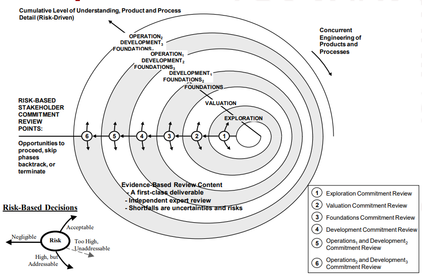

#### Other Development Lifecycle Models

- Agile: Iterative and increment development
- V-Shaped: Waterfall-like but emphasis on testing
  
- And many more
- **Every organization has their own**

### Software Qualities

- Qualities (aka “-ilities”) are goals in the practice of software engineering
- Different dimensions
  - External vs. Internal qualities
  - Product vs. Process qualities
- These qualities are important – terminology we will be using throughout the semester!

#### External vs. Internal Qualities

- **External** qualities are visible to the user
  - Reliability, efficiency, usability
- **Internal** qualities are the concern of developers
  - They help developers achieve external qualities
  - Verifiability, maintainability, extensibility, evolvability, adaptability

#### Product vs. Process Qualities

- **Product** qualities concern the developed artifacts
  - Maintainability, understandability, performance
- **Process** qualities deal with the development activity
  - Products are developed through process
  - Maintainability, productivity, timeliness

#### Some Software Qualities (1/7)

- Correctness
  - Ideal quality
  - Established regarding the requirements specification
- Reliability
  - Statistical property
  - Probability that software will operate as expected over a given period of time

#### Some Software Qualities (2/7)

- Robustness
  - “Reasonable” behavior in unforeseen circumstances
  - Subjective
  - A **specified** requirement is an issue of correctness;  
  An **unspecified** requirement is an issue of robustness
- Usability
  - Ability of end-users to easily use software
  - Extremely subjective

#### Some Software Qualities (3/7)

- Understandability
  - Ability of developers to easily understand produced artifacts
  - Internal product quality
  - Subjective
- Verifiability
  - Ease of establishing desired properties
  - Performed by formal analysis or testing
  - Internal quality

#### Some Software Qualities (4/7)

- Performance
  - Equated w/ efficiency—given resources, how well it performs
  - Assessable by measurement, analysis, and simulation
- Evolvability
  - Ability to add or modify functionality
  - Problem: evolution of implementation is too easy
  - Evolution should start at requirements or design

#### Some Software Qualities (5/7)

- Reusability
  - Ability to construct new software from existing pieces
  - Occurs at all levels: from people to process, from requirements to code
- Interoperability
  - Ability of software (sub)systems to cooperate with others
  - High interoperability means easy integration into larger systems
  - Common techniques: APIs, plug-in protocols, etc.

#### Some Software Qualities (6/7)

- Scalability
  - Ability of a software system to grow in size while maintaining its properties and qualities
  - Assumes maintainability and evolvability
  - Goal of component-based development (e.g., microservices)

#### Some Software Qualities (7/7)

- Heterogeneity
  - Ability to compose a system from pieces developed in multiple programming languages, on multiple platforms, by multiple developers, etc.
  - Necessitated by reuse
  - Goal of component-based development
- Portability
  - Ability to execute in new environments with “reasonable” effort
  - May be planned for by isolating environment-dependent components
  - Necessitated by the emergence of highly-distributed systems (e.g., the Internet)
  - An aspect of heterogeneity

### Infamous Software Failures

- These are “legendary” failures

#### AT&T Lines Go Dead (1990)

- Cost
  - 75,000,000 phone calls missed
  - 200,000 airline reservations lost
- Disaster
  - Single switch at one of AT&T's 114 switching centers suffered a minor mechanical problem & shut down the center
  - When the center came back up, it sent a message to other switching centers, which in turn caused them to shut down
  - This brought down the entire AT&T network for 9 hours
- Cause
  - A single line of buggy code in a complex software upgrade implemented to speed up calling caused a ripple effect that shut down the network

#### Ariane Goes “Boom” (1996)

- Cost
  - \$500,000,000
- Disaster
  - ESA's Ariane 5 unmanned rocket was intentionally destroyed seconds after launch
  - Also destroyed was its cargo of four scientific satellites
- Cause
  - When the guidance system tried to convert the sideways rocket velocity from 64-bits to 16-bits format, an overflow error resulted

#### Y2K (1999-2000)

- Cost
  - \$500,000,000,000
- Disaster
  - Businesses spent billions on programmers to fix a glitch in old software
  - But one man's disaster is another man's fortune
- Cause
  - To save computer storage space, old software systems often stored the years as two-digit numbers
  - The software interpreted "00" to mean 1900 rather than 2000
  - All sorts of bugs were thought likely

### 2007 Skype Blackout

> #### Skype blackout due to surge of reboots
>
> A two-day outage that left millions of Skype users unable to use the popular Internet phone service was caused by an abnormally high number of restarts after people had downloaded a Windows security update, the company said Monday.
>
> The worldwide outage, which began Thursday and ended Saturday, left millions of Skype users unable to log on to make phone calls or send instant messages.
>
> Instead, he said, the disruption “was triggered by a massive restart of our users’ computers across the globe within a very short time frame as they rebooted after receiving a routine set of patches through Windows Update,” Arak wrote.
>
> Microsoft Corp. released its monthly patches last Tuesday, and many computers are set to automatically download and install them. Installation requires a computer restart.
>

### 2022 Southwest Scheduling Crisis

> Antiquated computer infrastructure and software systems used for managing and crewing flights contributed heavily to the quantity of flight cancellations

### 2024 CrowdStrike Incident

#### 2024 CrowdStrike incident

> On 19 July 2024, American cybersecurity company CrowdStrike distributed a faulty update to its Falcon Sensor security software that caused widespread problems with Microsoft Windows computers running the software. As a result, roughly 8.5 million systems crashed and were unable to properly restart[1] in what has been called the largest outage in the history of information technology[2] and "historic in scale".[3]

### 2025 Cloudflare Outage

**Software engineering is hard.**

# **USC CSCI-577a** **Software Engineering**

Week 03: SE Philosophy – ICSM – Agile  
Jan 26, 2026  
Dr. Mahdi Eslamimehr & Dr. Jae Young Bang

## In the Last Episode of CSCI-577a ...Lecture

- What is **Software Engineering**?
  - Development of software systems whose size/complexity warrants team(s) of engineers
- **Goal**
  - Production of quality software, delivered on time, within budget, satisfying customers' requirements and users' needs
- Software engineering  $\neq$  programming
- Economy in SE, software development lifecycle models
- Software qualities (goals)
  - External: qualities that are visible to the user
  - Internal: concern of developers
  - Product: qualities that concern the developed artifacts
  - Process: qualities that deal with the development activity
- Infamous software failures

## In the Today's Episode of CSCI-577a ...Lecture

- Software engineering philosophy
  - Software process models (including ICSM and Agile – we will focus on these two)
  - Value-based software engineering (“VBSE”)
- Incremental Commitment Spiral Model (“ICSM”)
  - The four ICSM principles
  - A failure story
- Agile
  - Agile concepts
  - Agile anti-patterns
- Lots of references – review them if you want to take a deep dive!

### Why Study Classic SE Theory in the LLM Era?

- The “software crisis” framing predates AI: reliability, schedule, and scale failures motivated software engineering as a discipline
- LLMs change code production, but not the socio-technical constraints that dominate outcomes (stakeholders, coordination, and trade-offs)
- Deployed systems must continually evolve; complexity tends to grow unless actively controlled (evolution laws)
- Historical process models provide tested heuristics (risk-driven iteration, evidence-based milestones) for governing AI-assisted development

### Implications for AI-Assisted Software Engineering

- Empirical studies show productivity gains for bounded coding tasks (e.g., Copilot users completing a standardized task faster in a controlled experiment)
- However, code assistants can output incorrect or insecure code; security-sensitive contexts require systematic review and testing
- GenAI adds governance risks (e.g., confabulation, data leakage), motivating explicit risk management controls
- Course takeaway: use LLMs as accelerators within evidence- and risk-based processes (requirements clarity, architecture, V&V, and security practices)

## Software Engineering Philosophy ---

### Software Engineering Philosophy

- Software engineering philosophy
  - **Software process models**
  - Value-based software engineering

### Software Process Models: Outline

- What is a process model?
- Well-known process models
  - Spiral family of models
  - V-Model
  - RUP / OpenUp
  - SAFe / LeSS / DAD / Nexus ...
  - Lean, Scrum, XP, Kanban ...

#### Before Software Process Models: “Code-and-Fix”

- Free-form working environments
- Usually for hobby projects or school assignments
- Lack of structure
- Uncertain design requirements
- Incompleteness in its nature
- Simple programming – simple, repetitive code
- Indie development – video games, solo developer apps, etc.
- Hackathon

#### Software (or System) Process

- **Software process**
  - A set of related **activities, methods, practices, and rules** used to develop, operate, maintain, and improve software and its associated artifacts
- Milestones, timelines, and deliverables
- Suggests how to handle the following activities
  - Project planning and oversight
  - Operational concepts and business workflow
  - System & software requirements analysis
  - System & software design
  - Software implementation and unit testing
  - System integration and other testings
- Not just “core development” process
  - Supporting, cross-cutting processes
    - Software configuration management
    - Peer reviews and product evaluation
    - Quality assurance
    - Corrective action
    - Technical and management reviews
    - Risk management
    - Metrics
    - Subcontractor management
    - Independent Verification & Validation
    - Team coordination
    - Process improvement

#### Software Development Process and Life Cycle

- **Software development process**
    - The subset of the software process that focuses on **building, delivering, and maintaining** a software product, including concrete activities, roles, artifacts, and tools used by a specific org or project
  - The actual set of software development activities performed within an organization
  - How a team actually develops software in practice
- **Software dev life cycle (SDLC)**
    - A conceptual representation of the **stages** a software system passes through from inception to retirement
  - “SDLC is a conceptual framework or process that considers the structure of the stages involved in the development of an application from its initial feasibility study through to its deployment in the field and maintenance.”

#### Software Development Life Cycle Model

- **SDLC Model**
  - A **framework** that defines how the SDLC stages are organized, ordered, overlapped, and iterated, incl. feedback & decision points
- Generally used to **describe the steps** that are followed within a software development life cycle
- Popular models
  - Waterfall models
  - Spiral models
  - Iterative and incremental models
  - Rapid app development models
    - Agile, XP, Lean Dev, ...
- **There is no one perfect model for all software development**
- **These models are like ready-made clothing**
- **You don't wear a dressy suit at a baseball game**
- **You don't wear a swimsuit at a steakhouse**

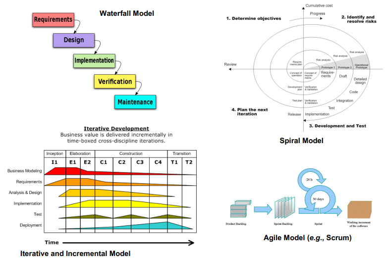

### The Spiral Family of Models (By USC CSSE)

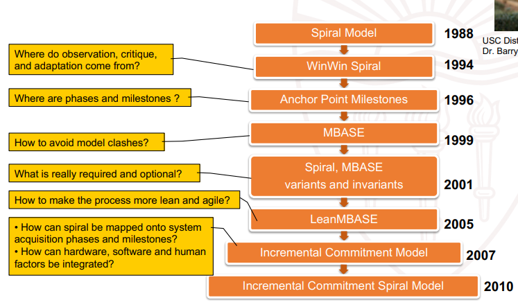

#### A Spiral Model of Software Development and Enhancement

#### Spiral Model (1988) (1/2)

Barry W. Boehm, TRW Defense Systems Group

- Boehm, Barry W. "A spiral model of software development and enhancement." *Computer* 21.5 (1988): 61-72.
- It was a monumental work in software engineering—8k+ citations

#### Spiral Model (1988) (2/2)

- Waterfall model
  - Focus on front load elaboration
- Spiral model
  - Risk-driven
  - Complete a round by review
  - Round 0 – Feasibility study
  - Round 1 – Concepts of operations
  - Round 2 – Top level requirements and specification

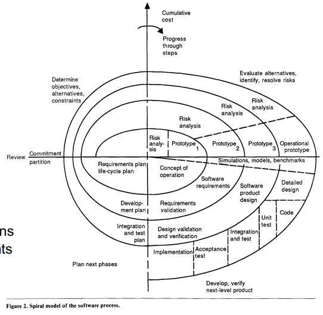

#### WinWin Spiral Model (1994) (1/2)

- Boehm, Barry, and Prasanta Bose. "A collaborative spiral software process model based on theory W." Proceedings of the Third International Conference on the Software Process. IEEE, 1994.

#### WinWin Spiral Model (1994) (2/2)

- Use the **Theory W (win-win)** approach to converge on a system's next level objectives, constraints, and alternatives.

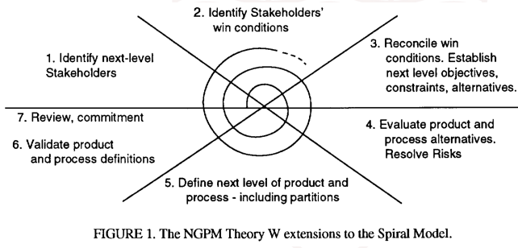

##### Anchor Point Milestones (1996)

- Boehm, Barry. "Anchoring the software process." IEEE software 13.4 (1996): 73-82.
- Lack of intermediate milestones
  - **Anchor Points:**
    - LCO: Life Cycle Objectives
    - LCA: Life Cycle Architecture
    - IOC: Initial Operational Capability
  - Concurrent-engineering spirals between anchor points

### Model-Based Architecting and Software Engineering (MBASE) (1/2)

- Boehm, Barry, and Dan Port.  
"Conceptual modeling challenges for model-based architecting and software engineering (MBASE)." *Conceptual Modeling: Current Issues and Future Directions*. Berlin, Heidelberg: Springer Berlin Heidelberg, 1999. 24-43.
- **MBASE** integrates **product models** (software architecture), **process models** (development lifecycle), and **property models** (performance, security, ...) together to maintain consistency between them

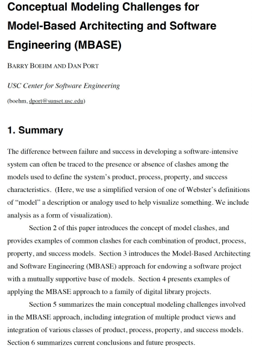

### Model-Based Architecting and Software Engineering (MBASE) (2/2)

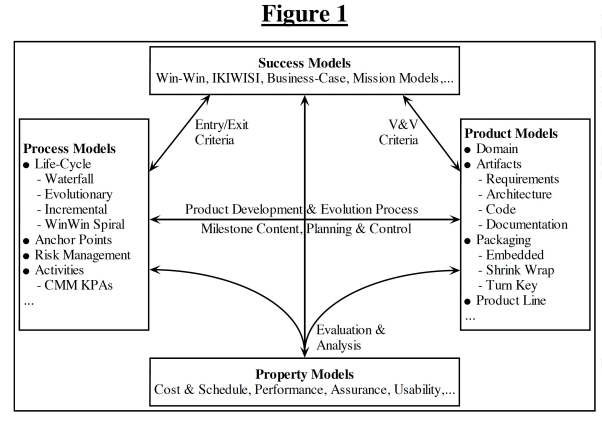

#### The Incremental Commitment Model (ICM) (2007) (1/2)

- Boehm, Barry, and Jo Ann Lane. "Using the incremental commitment model to integrate system acquisition, systems engineering, and software engineering." CrossTalk 19.10 (2007): 4-9.

- Incremental commitment-based decision making to ensure projects remain viable throughout their lifecycle

  

#### The Incremental Commitment Model (ICM) (2007) (2/2)

#### The Incremental Commitment Spiral Model (ICSM) (2010)

- Koolmanojwong, Supannika. The incremental commitment spiral model process patterns for rapid-fielding projects. Diss. University of Southern California, 2010.
- Pew, Richard W, and Anne S. Mavor, eds. Human-system integration in the system development process: A new look. National Academies Press, 2007.
- Risk assessment determines the scope and direction of each cycle
- **Continuous risk evaluation** that leads to more granular control over project evolution
- More suitable than vanilla ICM for **rapidly changing environments and domains**

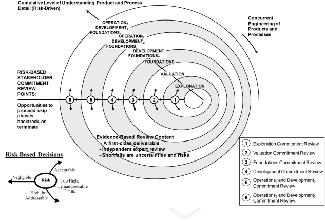

#### V-Model

- **Extension of the Waterfall model** that pairs each development phase with a corresponding test phase
- Commonly used in systems and safety-critical engineering
- **Emphasizes early test planning** but does not explicitly model concurrent engineering
- Poor fit for evolutionary or highly iterative development
- Verification and validation are defined early but executed later

#### Double-V Model

- Show concurrent development
- Supports system of systems
- Forsberg, Kevin; Harold Mooz, Howard Cotterman (2005), *Visualizing Project Management*, Third Edition, New York, NY: J. Wiley & Sons, Inc.

#### V with Multiple Deliveries

- The “V” is divided into smaller chunks
- You see multiple Vs
- A subset of the Vs may “go back” concurrently

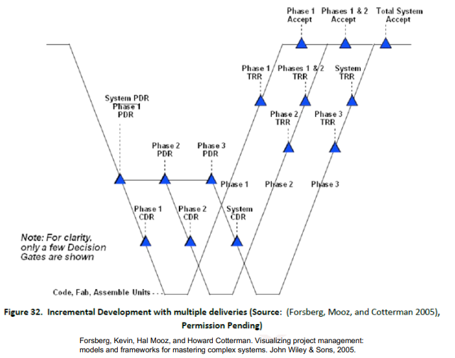

#### Rational Unified Process (RUP)

- Iterative software development process framework by Rational (an IBM division)
- **Six Best Practices**
  - Develop iteratively
  - Manage requirements
  - Use components
  - Model visually
  - Verify quality
  - Control changes

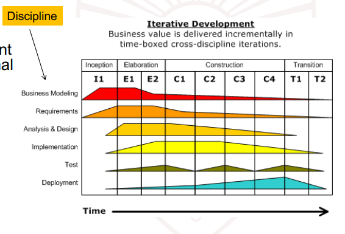

#### Genealogy of the RUP

- Kruchten, Philippe. The rational unified process: an introduction. Addison-Wesley Professional, 2004.

#### OpenUP

- OpenUP
  - A streamlined, open-source derivative of RUP
  - A lean Unified Process that applies iterative and incremental approaches within a structured lifecycle
- Keeps RUP's core philosophy but removes much of its weight, prescriptiveness, and tooling dependency

## Agile Methodologies

- Scrum
- eXtreme Programming (XP)
- Dynamic System Development Method (DSDM)
- Lean Development
- Feature-Driven Development (FDD)
- Crystal
- Adaptive Software Development (ASD)
- Martin, Robert Cecil. Agile software development: principles, patterns, and practices. Prentice Hall PTR, 2003.

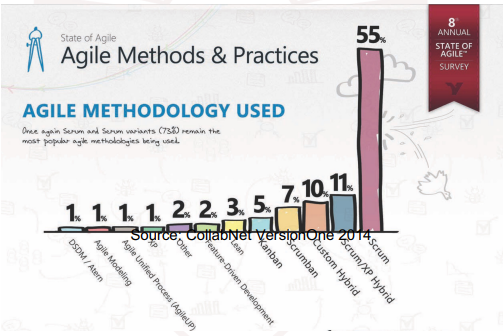

### Lean Principles

- From Toyota Production System – translated into software development
- Seven lean principles
  - Eliminate waste – anything that does not add value
  - Amplify learning – continuous update about the project
  - Decide as late as possible – delay decisions, gather more information
  - Deliver as fast as possible – daily deliveries, daily standup meeting
  - Empower the team – get good people, listen, communicate
  - Build integrity in – build good products
  - Optimize the whole - “Think big, act small, fail fast; learn rapidly”

### Example Wastes in Software Development

- **Partially Done Work** – tend to become obsolete; no idea it will eventually work; waste resources; should do risk-reduction and waste-reduction
- **Extra Processes** – paperwork necessary?
- **Extra Features** – waste time and resources
- **Task Switching** – put people in multiple projects
- **Waiting** – causes delay; decide as late as possible
- **Motion** – even walking down the hall waste time; sit in the same room
- **Defects** – detect defect as soon ASAP
- **Management activities** – instead of tracking status, make sure work flows properly; reduce tracking time

### Scrum Process

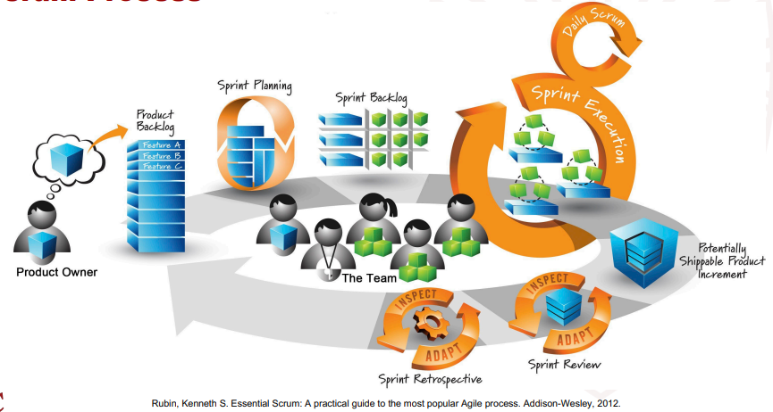

#### Scaling Agile

- “Vanilla Agile,” e.g., a single Scrum team, does not scale by itself
- Agile with structures for scaling
  - SAFe
  - LeSS
  - DA
  - Nexus

#### Scaled Agile Framework (SAFe)

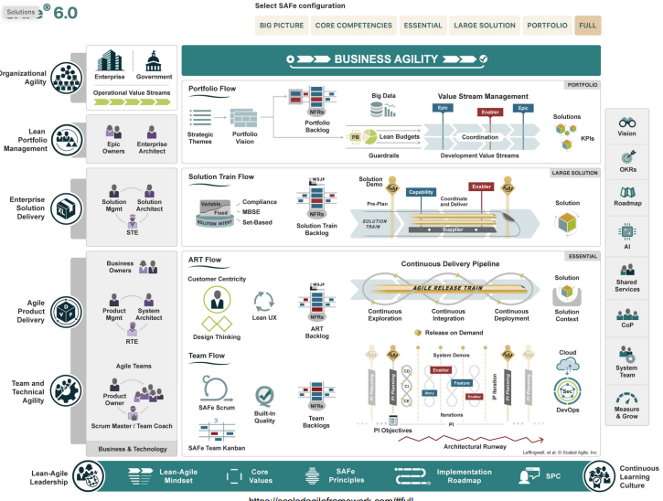

#### Large Scale Scrum (LeSS)

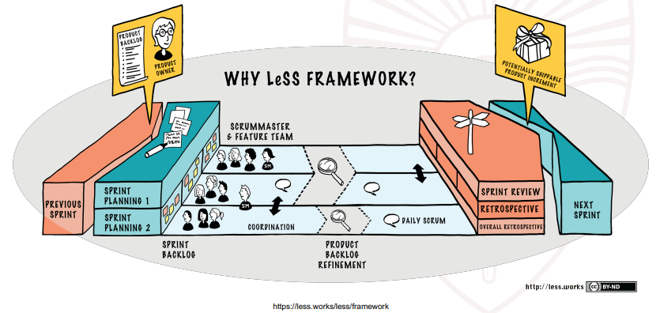

#### Disciplined Agile (DA) Framework

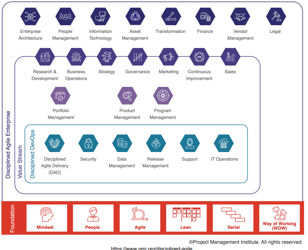

#### Nexus: Agile for Large-Scale Projects

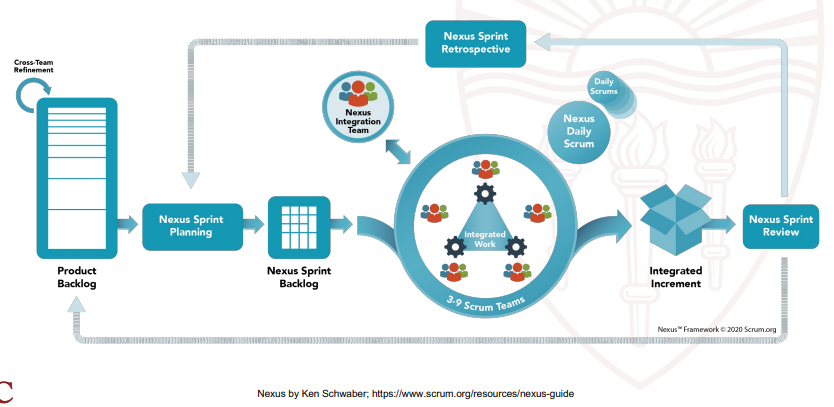

Nexus™ Framework © 2020 Scrum.org

#### Scrum vs. ICSM

- Take a look at those overlapping concepts ...

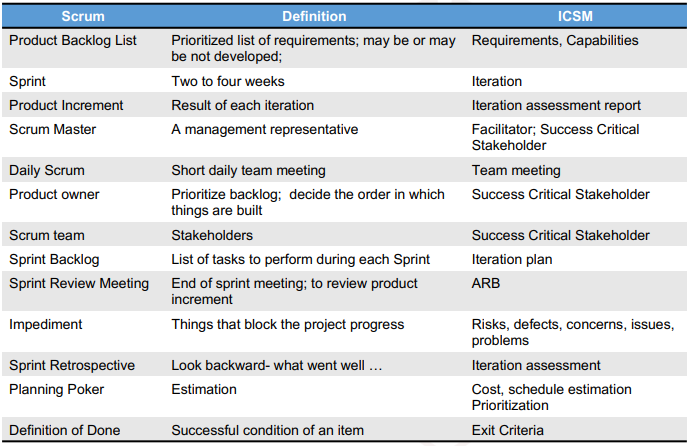

### XP – eXtreme Programming

- Agile methodology that pushes core engineering practices to their extreme
- Frequent release
- Shorter timebox
- Frequent communication
- Expecting requirements changes
- Drawbacks
  - Unstable requirements
  - Requires strong engineering discipline
  - High customer availability

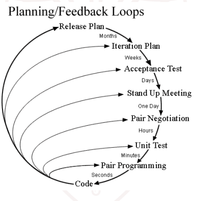

#### XP Principles

- These principles are rather developer-oriented

  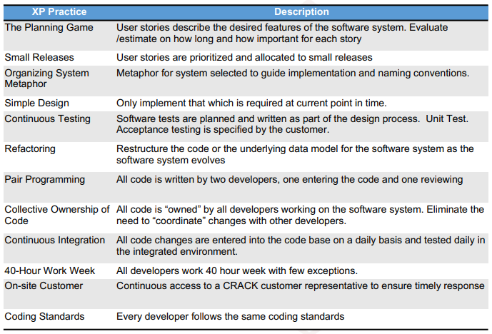

#### Scrum vs. XP

- Scrum defines how a team organizes and manages work, while XP defines how the team engineers the software with disciplined technical practices
- The Scrum concept only has
  - Four ceremonies (or “meetings”)
    - Daily scrum
    - Sprint Planning
    - Sprint Review
    - Sprint Retrospective
  - Three artifacts
    - Product Backlog
    - Sprint Backlog
    - Increment (aka “potentially shippable product”)
  - Three roles
    - Product owner
    - Scrum master
    - Development team members
- XP has more technical practices

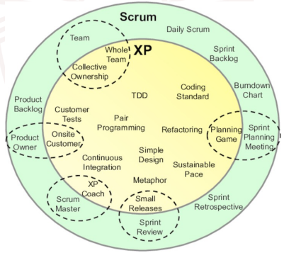

### Reducing Waste in Software Development

- Three types of wastes from Toyota production system
  - Muda (無駄) – non-value added tasks
    - E.g., unnecessary gold plating
    - Avoid Muda by using high planning and coordination
  - Mura (斑) – unevenness or irregularity in workflows
    - E.g., one component being produced more than needed
    - Avoid Mura by using pull-based scheduling (such as Kanban)
  - Muri (無理) – overburdening or failure load on people, equipment, or systems
    - Avoid Muri by balancing workloads and standardizing work
- Lean concepts influenced XP practices and later software Kanban adoption
  - Elimination of excessive planning
  - Reducing “Red” (baseline tests in TDD)
- This introduces Kanban (meaning “signboard”) to achieve further elimination of waste

#### Kanban

- Software development **framework**
- Provides transparency in workflow
- Focuses on “managing flow”
- Limits Work-In-Progress
  - Complete a feature before starting a new one
- Iteration and estimate are optional
- Could be used on top of other processes

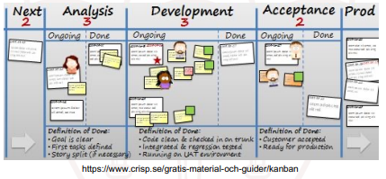

#### Kanban Implementation Example (Trello)

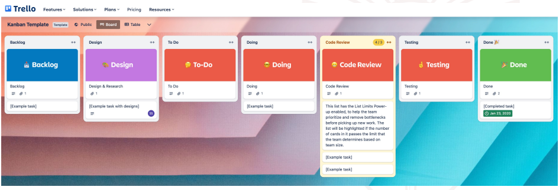

#### Kanban Concepts

- Visualize workflow
  - More than work, but interaction and coordination
- Limit work-in-progress
- Measure and manage flow
  - Use metrics such as throughput, lead/cycle time, work in progress
- Make process policies explicit
  - Clear on who is doing what and when

#### Kanban: Visualize Workflow & Limit WIP (1/2)

- Observe workflow
  - What is happening?
  - Where is the bottleneck?
- Check performance
  - Lead/cycle times, throughput, WIP trends
- Identify improvement opportunities

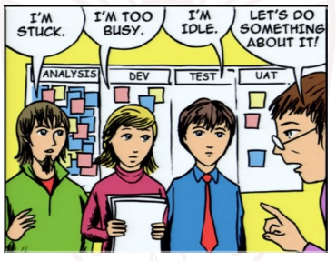

- At a morning standup meeting.....

#### Kanban: Visualize Workflow & Limit WIP (2/2)

- What can be improved here ?
  - Bottleneck, Variability, Waste
- Craftsmanship & Leadership
  - to improve the process and use performance as evidence to support

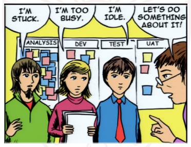

## Software Engineering Philosophy

- Software engineering philosophy
  - Software process models
  - **Value-based software engineering**

### What is Value-Based Software Engineering?

- What is Value-Based Software **Engineering**?
  - The science, skill, and profession of acquiring and applying scientific, economic, social, and practical knowledge, in order to design and also build structures, machines, devices, systems, materials and processes

### What is Value-Based Software Engineering?

- What is Value-Based **Software Engineering**?
  - The application of a systematic, disciplined, quantifiable approach to the design, development, operation, and maintenance of software, and the study of these approaches; that is, the application of engineering to software

Source: Wikipedia; note that it is one of the many definitions of software engineering.

### What is Value-Based Software Engineering?

- What is **Value**-Based Software Engineering?
  - The regard that something is held to deserve; the importance or preciousness of something
  - Material/monetary-worth of something
  - The worth of something compared to the price paid or asked for it
  - The usefulness of something considered in respect of a particular purpose
  - Etc.

### What is Value-Based Software Engineering?

- What is **Value-Based Software Engineering**?
  - Goal of software engineering is to create products, services, and processes that **add value**
  - VBSE brings **value considerations** to the foreground so that software engineering decisions at all levels can be optimized to meet or reconcile explicit objectives of the involved stakeholders

### Why Should You Care About VBSE?

- Software has unique internal and external characteristics:
  - Highly **flexible** and **volatile**
  - Heavy dependence on **collaboration** amongst creative and skilled **people**
  - Necessitates construction and management approach radically different from traditional engineering
  - Basic engineering principles of discipline, economy, rigor, quality, utility, repeatability and predictability (to some extent) still apply
- Value considerations affect **trade-offs** with much more subtlety, severity, and variety as opposed to engineering of tangible products
- Trade-offs ultimately govern the outcome of the project!
- VBSE draws attention to these trade-offs
  - Impossible to reason about in value neutral setting

### **Who Should Practice VBSE?**

- Just about everyone
  - CTO/CIOs, Product and Project Managers making high-level (value-adding) decisions
  - Process & measurement experts, requirements engineers, business analysts, QA/usability experts, technical leads, etc.
  - Software engineering researchers, educators, and graduate students teaching or studying software processes, evaluating existing and new practices, technologies, methods, or products
- Basically all academics, managers, practitioners, and students of software engineering who realize that software isn't created in a void and involves numerous participants 😊

### Deep Dive into VBSE

- Understanding “Theory W” (VBSE’s engine)
- VBSE’s 4+1 Theory
- VBSE Agenda
- VBSE: Seven Key Elements

#### Theory W: Enterprise Success Theorem

- It is a **management approach** in software engineering
  - “Your enterprise will succeed **if** and **only if** it makes winners of your success-critical stakeholders”
- Arguments about “if”:
  - Everyone that counts is a winner
  - Nobody significant is left to complain
- Arguments about “only if”:
  - Nobody wants to lose
  - Prospective losers will refuse to participate, or will counterattack
  - The usual result is lose-lose

Boehm, Barry W., and Apurva Jain. "An initial theory of value-based software engineering." Value-Based Software Engineering (2006): 15-37.

#### Theory W: WinWin Achievement Theorem

- Making winners of your **success-critical stakeholders (SCSs)** requires:
  - Identifying all of the SCSs
  - Understanding how the SCSs want to win
  - Having the SCSs negotiate a win-win set of product and process plans
  - Controlling progress toward SCS win-win realization, including adaptation to change

#### VBSE Theory: 4+1 Structure

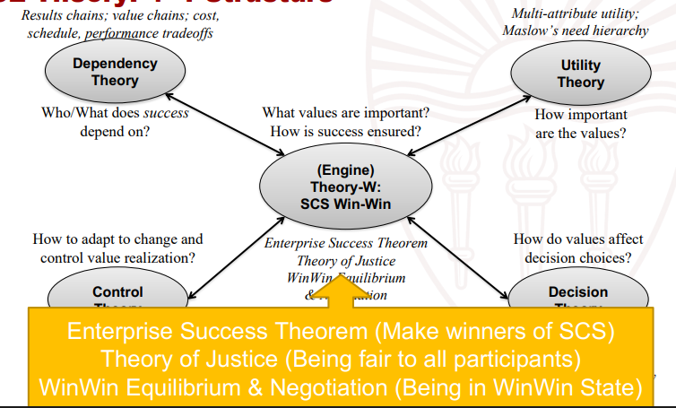

#### VBSE Theory: 4+1 (Steps)

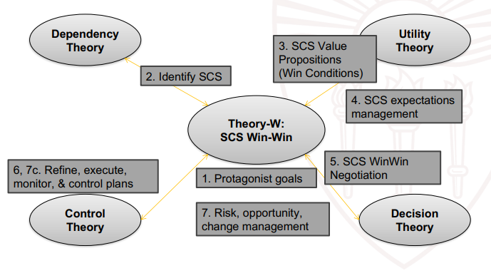

#### VBSE Theory: 4+1 (Steps)

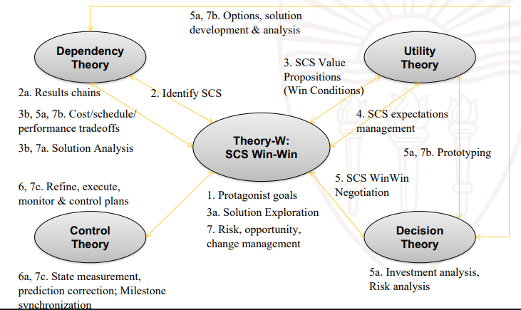

#### VBSE Agenda

- Objective
  - Integrating **value considerations** into the full range of existing & emerging **software engineering principles** in a manner so that they “compatibly” reinforce one another
- VBSE seven elements (refer to the VBSE book\* for details)
  - Benefits Realization Analysis
  - Stakeholder Value Proposition Elicitation & Reconciliation
  - Business Case Analysis
  - Continuous Risk and Opportunity Management
  - Concurrent System & Software Engineering
  - Value-Based Monitoring & Control
  - Change as Opportunity

### Documenting What You Know

- High concurrency/backtracking when practicing the VBSE 4+1 Model
- “Tacit Knowledge” generated amongst team members
- How do the other SCSs know what it is you know and whether you really know what you claim to know?
- **In terms of the CSCI-577a team project:**
  - How do the teaching staff know what you know?
  - By documenting the findings/solutions in the appropriate artifacts and validate the same during the periodic grading

### Incremental Commitment Spiral Model ---

### Incremental Commitment Spiral Model (ICSM): Outline

- For success, principles trump diagrams
  - But for application, diagrams are easier to use (and misuse)
- The four Incremental Commitment Spiral Model (ICSM) Principles
  - Stakeholder-based guidance
  - Incremental commitment and accountability
  - Concurrent multidiscipline engineering
  - Evidence- and risk-based decisions

#### Original Spiral and Misinterpretations

- Common misconceptions
  - Hack some prototypes
  - Fit spiral into waterfall
  - Incremental waterfalls
  - Suppress risk analysis
  - No concurrency, feedback
  - One-size-fits-all model

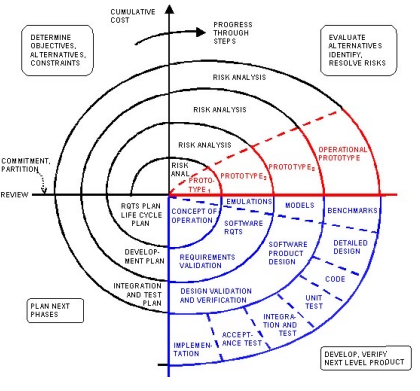

#### Principles Trump Diagrams: Spiral

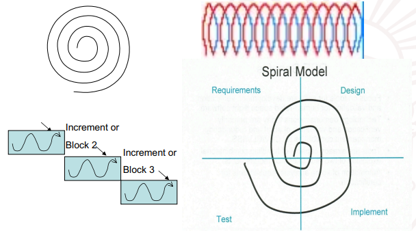

- Where are the stakeholders, commitments, concurrency, and risk?

### The Four ICSM Principles

- Stakeholder value-based guidance
- Incremental commitment and accountability
- Concurrent multidiscipline engineering
- Evidence- and risk-based decisions

#### Principle 1: Stakeholder Value-Based Guidance (“W”)

- It is a management approach in software engineering
  - “Your enterprise will succeed if and only if it makes winners of your success-critical stakeholders”
- Arguments about “if”:
  - Everyone that counts is a winner
  - Nobody significant is left to complain
- Arguments about “only if”:
  - Nobody wants to lose
  - Prospective losers will refuse to participate, or will counterattack
  - The usual result is lose-lose

##### Win-lose Generally Becomes Lose-lose

| Proposed Solution            | “Winner”             | Loser     |
|------------------------------|----------------------|-----------|
| Quick, Cheap, Sloppy Product | Developer & Customer | User      |
| Lots of “bells and whistles” | Developer & User     | Customer  |
| Driving too hard a bargain   | Customer & User      | Developer |

- Actually, nobody wins in these situations – **everyone loses**

#### Principle 2: Incremental Commitment and Accountability

- Total Commitment: Roulette
  - Put your chips on a number
    - *E.g.*, a value of a key performance parameter
  - Wait and see if you win or lose
- Incremental Commitment: Poker, Blackjack
  - Put some chips in
  - See your cards, some of others' cards
  - Decide whether, how much to commit to proceed
  - You can fold if you don't think you will win

#### Principle 2: Failure Story

- Bank of America Master Net: Trust Management System (TMS)
- B of A an early leader in banking automation
  - Electronic check processing, 1950s-1960s
- Lost automation leadership by late 1970s
  - CEO agenda to “leapfrog into 1990s”
- Tried \$6M in-house next-generation TMS development
  - Extensive next-generation public relations push
  - Results: missing capabilities; lack of scalability
  - Embarrassing with respect to public relations push
- CEO appointed new TMS department head
  - Modernize or discontinue TMS business

##### **B of A TMS Second Try: Master Net**

- Develop full-capability requirements
  - Union of customer wish lists: 3.5 million lines of code
  - \$22 million budget; 9 month to full operational capability
- Look for best external TMS developer
  - Premier Systems: several successful small-bank TMSs
  - Lack of B of A system engineers to analyze proposals
- Contracted with Premier Systems March 1984
  - \$22 million; full commitment to deliver by December 1984
- December 1984: 100 programmers on-board
  - Far from complete, even for demonstrations
  - Many key stakeholder win condition conflicts

#### ICSM Principles Counterexample: B of A Master Net

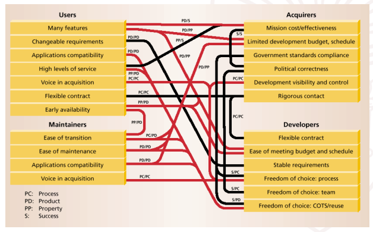

##### **B of A / Premier TMS Development, 1985-88**

- Serious corporate image problem if discontinued
  - Added budget, developed 1985-86 schedule
- Organized major 1986 demonstration of working capabilities
  - Could not demonstrate performance scalability
  - Still far from complete; many performance problems by end 1986
- 1987: Full-commitment TMS cutover to Master Net
  - Serious performance, reliability problems, system crashes
  - Premier Prime computer vs. B of A IBM interoperability problems
  - Clients dropping off: 800->700 accounts; \$38B->\$34B assets
- May 1988: Transfer of TMS business to other banks
  - Final 50-month project schedule, \$80 million cost

#### The Cones of Uncertainty

- Need incremental definition and development

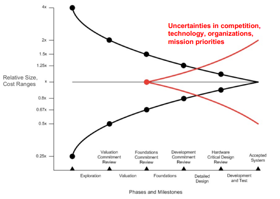

### ICSM Stages and Phases

- Stage I: Incremental system definition
  - **Exploration Phase:** Concurrently identifies and clarifies system capability needs, constraints, and candidate solution options
  - **Valuation Phase:** Analyzes alternative solutions and identifies preferred alternative
  - **Foundations Phase:** Develops management and technical foundations for the selected alternative
- Stage II: Incremental system development
  - **Development Phase:** Procurement, iterative detailed design and development, integration, and test of current-increment components
  - **Production and Operations Phase:** System “units” produced, integrated, and put into operations

#### The Incremental Commitment Spiral Process: Phased View

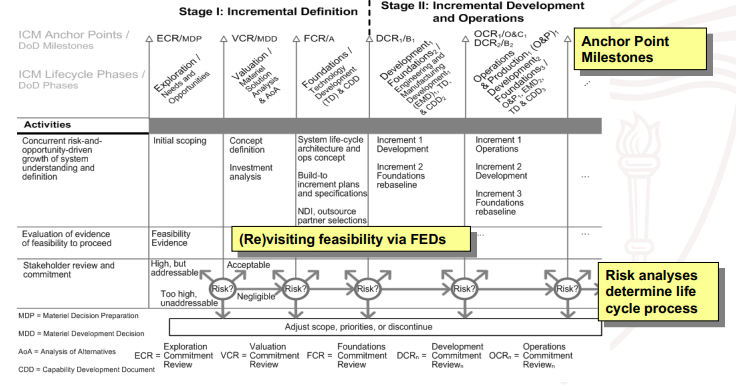

#### Principle 3: Concurrent Multidiscipline Engineering

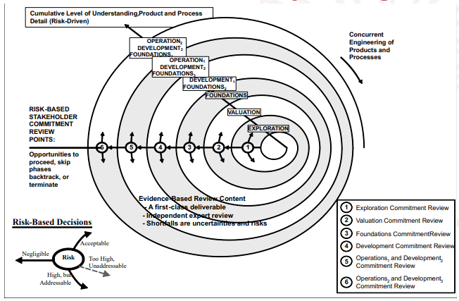

#### ICSM Activity Levels for Complex Systems

- A number of system aspects are **being concurrently engineered** at an increasing level of understanding, definition, and development
- The magnitude and shape of the levels of effort will be **risk-driven** and likely to **vary from project to project**
- They are likely to have mini risk/opportunity-driven peaks and valleys, rather than the smooth curves shown for simplicity in this slide
- The main intent of this view is to emphasize the **necessary concurrency** of the primary success-critical activities shown as rows

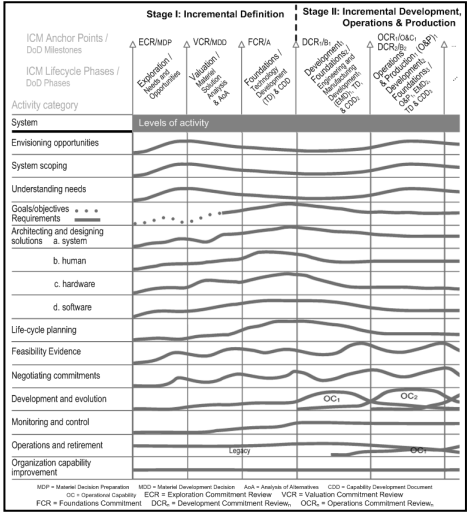

#### Principle 4: Evidence- and Risk-Based Decisions

- The decision criteria for a “go/no-go” commitment
- Evidence provided by developer and validated by independent experts that:
  - If the system is built to the specified architecture, it will
    - Satisfy the requirements: capability, interfaces, level of service, and evolution
    - Support the operational concept
    - Be buildable within the budgets and schedules in the plan
    - Generate a viable return on investment
    - Generate satisfactory outcomes for all of the success-critical stakeholders
- All major risks resolved or covered by risk management plans
- Serves as basis for stakeholders’ commitment to proceed
  - “Are we ready to commit to go to the next phase?”

#### Feasibility Evidence a First-Class ICSM Deliverable

Feasibility Evidence Description (FED) template of ICSM

## Table of Contents

- **Feasibility evidence** is not just an optional appendix
- Includes plans, resources, monitoring
  - Identification of models, simulations, prototypes, benchmarks, usage scenarios, experience data to be developed or used
  - Earned Value tracking of progress vs. plans
- Serves as way of synchronizing and stabilizing concurrent activities in hump diagram

#### Master Net and the Four ICSM Principles

- Stakeholder value-based guidance
  - Overconcern with voice of customer: 3.5 MSLOC of **requirements**
  - No concern with maintainers & operators: Premier Systems (prime contractor) vs. IBM
- Incremental commitment and accountability
  - Total commitment to infeasible budget and schedule
  - No contract award fees or penalties for under/overruns
- Concurrent multidiscipline engineering
  - No prioritization of features for incremental development
  - No prototyping of operational scenarios and usage
- Evidence and risk-driven decisions
  - No evaluation of Premier Systems scalability, performance
  - No evidence of ability to satisfy budgets and schedules

#### ICSM Meta-Principle: Risk Balancing

- How much is enough?
  - System scoping, planning, prototyping, COTS evaluation, requirements detail, spare capacity, fault tolerance, safety, security, environmental protection, documenting, configuration management, quality assurance, peer reviewing, testing, use of formal methods, and feasibility evidence
- Answer
  - Balancing the risk of doing too little and the risk of doing too much will generally find **a middle-course sweet spot** that is about the best you can do

#### Different Risk Patterns Yield Different Processes

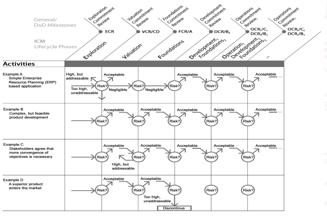

- ICSM is not a one-size-fits-all model
- It is risk-driven, and can turn out to be different in pattern

#### ICSM Patterns: How Phases Can Be Combined

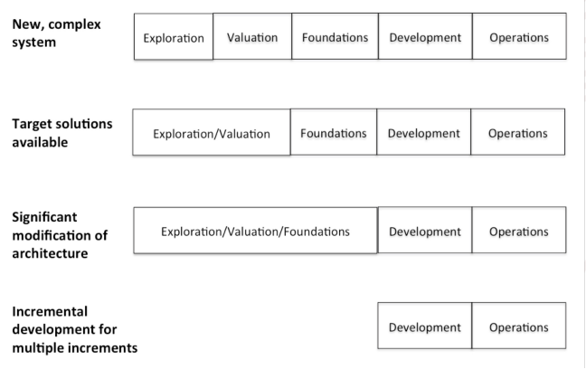

#### Why the Incremental Commitment Spiral Model (ICSM)?

- Builds on the strengths of current process models but avoids their shortfalls

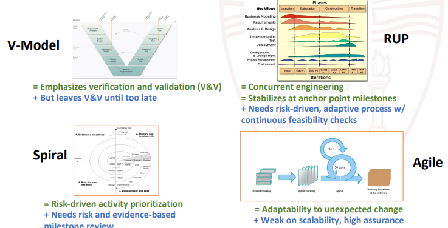

### Agile: Introduction ---

### Agile: Outline

- **Agile Concepts**
- Agile Antipatterns

#### What is “Agile?” (1/2)

- It is a software development umbrella term and guiding philosophy that comes with a set of principles
- The Agile Manifesto: <https://agilemanifesto.org>

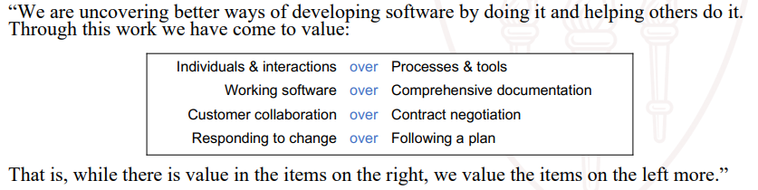

#### What is “Agile?” (2/2)

- Agile development promotes
  - Adaptive planning
  - Evolutionary development and delivery
  - Time-boxed iterative approach
  - Rapid and flexible response to change

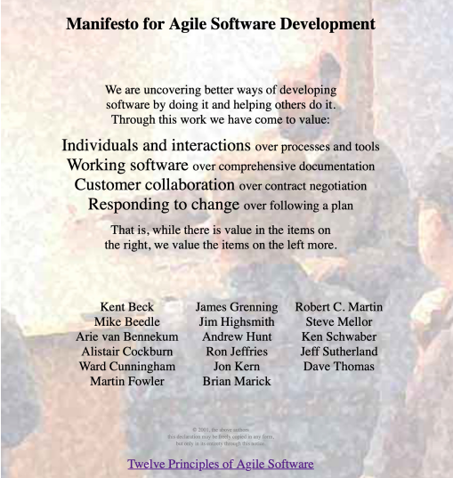

#### The 12 Principles of Agile Software Development (1/2)

- Our highest priority is to **satisfy the customer** through early and continuous delivery of valuable software.
- **Welcome changing requirements**, even late in development. Agile processes harness change for the customer's competitive advantage.
- **Deliver working software frequently**, from a couple of weeks to a couple of months, with a preference to the shorter timescale.
- Business people and developers must **work together daily** throughout the project.
- Build projects around **motivated individuals**. Give them the environment and support they need, and trust them to get the job done.
- The most efficient and effective method of conveying information to and within a development team is **face-to-face conversation**.

#### The 12 Principles of Agile Software Development (2/2)

- **Working software** is the primary measure of progress.
- Agile processes promote **sustainable development**. The sponsors, developers, and users should be able to maintain a constant pace indefinitely.
- Continuous attention to **technical excellence** and good design enhances agility.
- **Simplicity**—the art of maximizing the amount of work not done—is essential
- The best architectures, requirements, and designs emerge from **self-organizing teams**.
- At regular intervals, the team **reflects** on how to become more effective, then tunes and adjusts its behavior accordingly.

### Agile Methodologies

- Scrum
  - eXtreme Programming (XP)
  - Dynamic System Development Method (DSDM)
  - Lean Development
  - Feature-Driven Development (FDD)
  - Crystal
  - Adaptive Software Development (ASD)
- Martin, Robert Cecil. *Agile software development: principles, patterns, and practices*. Prentice Hall PTR, 2003.

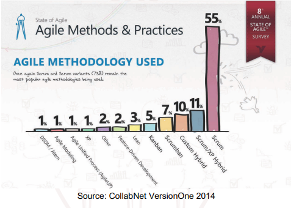

#### Scrum Process

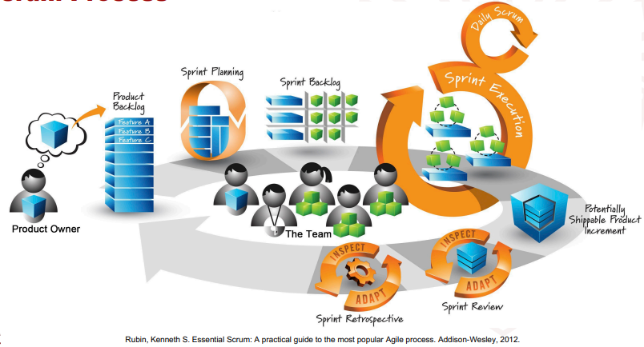

##### Scrum Team

- Product owner
  - The champions for their product
  - Understanding of business, customer market requirements
- Scrum master
  - The champions of scrum within their teams
  - Coaching teams, product owners, and the business on the scrum process
- Dev team
  - The champions for sustainable development practices
  - The ones who make things work
  - Usually five to seven members

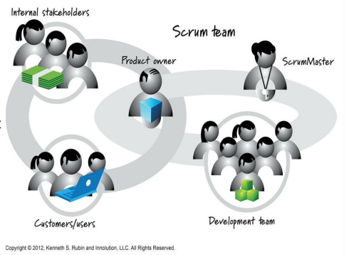

##### Sprint Planning

- The Scrum team holds Sprint Planning
  - Agree upon **sprint goal**
    - What the upcoming sprint is supposed to achieve
- The development team reviews product backlog and determines the high priority items that the team can accomplish in a sprint
- With **sustainable pace**
  - A pace at which the team can comfortably work for an extended period of time

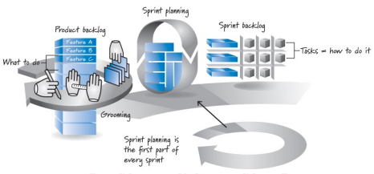

##### Product Backlog

- List of requirements (user stories)
- Priority level
- May include estimation (story points)

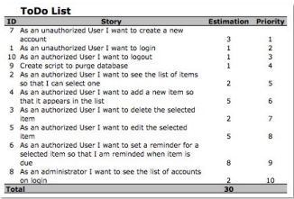

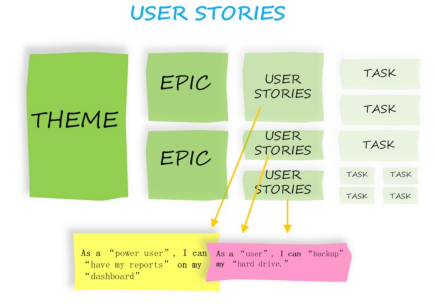

##### Sprint Review

- Inspect the product that is being built
- Participants
  - Scrum team, stakeholders, sponsors, customers
- Focus on reviewing the just-completed features or underlying architecture
- Bi-directional info flow

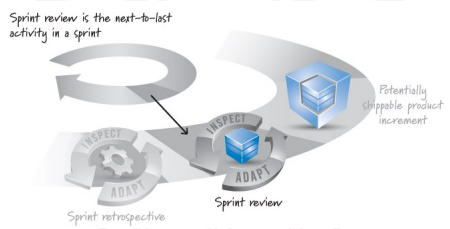

##### Sprint Retrospective

- Frequently occurs after the sprint review and before the next sprint planning
- Focus on inspect adapt the **process**
- Team, Scrum Master, and Product Owner discuss what is not working
- Focus on **continuous improvement**
- Identify process improvement actions
- 15 - 30 minutes, up to three hours

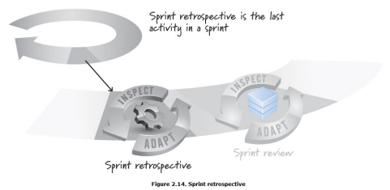

##### Increment (“Potentially Shippable Product”) vs. Done

- Sprint results = Increment (aka “potentially shippable product”)
- Use “definition of done” (DoD)
  - Check whether the increment is “done” using DoD

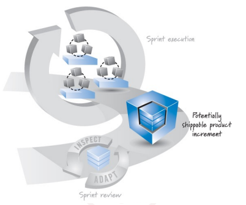

##### Definition of Done: Examples

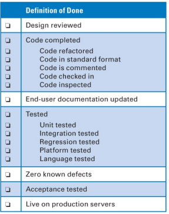

- Upgrade verified while keeping all user data intact.
- Potentially releasable build available for download
- Summary of changes updated to include newly implemented features
- Inactive/unimplemented features hidden or greyed out (not executable)
- Unit tests written and green
- Source code committed on server
- Jenkins built version and all tests green
- Code review completed (or pair-programmed)
- How to Demo verified before presentation to Product Owner
- Ok from Product Owner

#### Scrum vs. ICSM

| Scrum                 | Definition                                                        | ICSM                                        |
|-----------------------|-------------------------------------------------------------------|---------------------------------------------|
| Product Backlog List  | Prioritized list of requirements; may be or may be not developed; | Requirements, Capabilities                  |
| Sprint                | Two to four weeks                                                 | Iteration                                   |
| Product Increment     | Result of each iteration                                          | Iteration assessment report                 |
| Scrum Master          | A management representative                                       | Facilitator; Success Critical Stakeholder   |
| Daily Scrum           | Short daily team meeting                                          | Team meeting                                |
| Product owner         | Prioritize backlog; decide the order in which things are built    | Success Critical Stakeholder                |
| Scrum team            | Stakeholders                                                      | Success Critical Stakeholder                |
| Sprint Backlog        | List of tasks to perform during each Sprint                       | Iteration plan                              |
| Sprint Review Meeting | End of sprint meeting; to review product increment                | ARB                                         |
| Impediment            | Things that block the project progress                            | Risks, defects, concerns, issues, problems  |
| Sprint Retrospective  | Look backward- what went well ...                                 | Iteration assessment                        |
| Planning Poker        | Estimation                                                        | Cost, schedule estimation Prioritization |
| Definition of Done    | Successful condition of an item                                   | Exit Criteria                               |

#### XP – eXtreme Programming

- Agile methodology that pushes core engineering practices to their extreme
- Frequent release
- Shorter timebox
- Frequent communication
- Expecting requirements changes
- Drawbacks
  - Unstable requirements
  - Requires strong engineering discipline
  - High customer availability

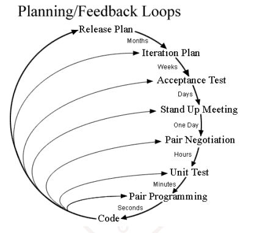

##### XP Principles

| XP Practice                  | Description                                                                                                                             |
|------------------------------|-----------------------------------------------------------------------------------------------------------------------------------------|
| The Planning Game            | User stories describe the desired features of the software system. Evaluate /estimate on how long and how important for each story      |
| Small Releases               | User stories are prioritized and allocated to small releases                                                                            |
| Organizing System Metaphor   | Metaphor for system selected to guide implementation and naming conventions.                                                            |
| Simple Design                | Only implement that which is required at current point in time.                                                                         |
| Continuous Testing           | Software tests are planned and written as part of the design process. Unit Test. Acceptance testing is specified by the customer.       |
| Refactoring                  | Restructure the code or the underlying data model for the software system as the software system evolves                                |
| Pair Programming             | All code is written by two developers, one entering the code and one reviewing                                                          |
| Collective Ownership of Code | All code is “owned” by all developers working on the software system. Eliminate the need to “coordinate” changes with other developers. |
| Continuous Integration       | All code changes are entered into the code base on a daily basis and tested daily in the integrated environment.                        |
| 40-Hour Work Week            | All developers work 40 hour week with few exceptions.                                                                                   |
| On-site Customer             | Continuous access to a CRACK customer representative to ensure timely response                                                          |
| Coding Standards             | Every developer follows the same coding standards                                                                                       |

#### Scrum vs. XP

- Scrum defines how a team organizes and manages work, while XP defines how the team engineers the software with disciplined technical practices
- The Scrum concept only has
  - Four ceremonies (or “meetings”)
    - Daily scrum
    - Sprint Planning
    - Sprint Review
    - Sprint Retrospective
  - Three artifacts
    - Product Backlog
    - Sprint Backlog
    - Increment (aka “potentially shippable product”)
  - Three roles
    - Product owner
    - Scrum master
    - Development team members
- XP has more technical practices

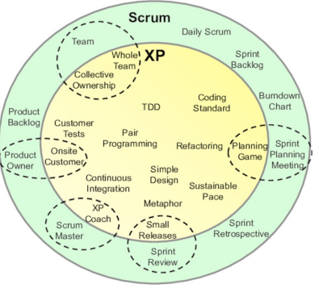

### Typical Risks for Software Development: Agile Pros

- Typical risks for software development
  - Poor communication with stakeholders
  - Lack of user involvement
  - Failure to manage user expectations
  - Misunderstanding of user requirements
  - Failure to accommodate changes in requirements and scope
- **Agile is able to deal with these issues effectively by**
  - Shorter iterations to accommodate changes and clarify user requirements
  - Face-to-face and constant communication with clients to improve understandings

#### Risks for Agile Software Development: Development and Deployment risks

- **Technical Debt:** Negative effect to software's future due to past decisions and short-term compromises about the software
  - Quickly accumulate due to the quick pace of software development and strict timeboxing
  - Mitigations:
    - a) keep a list of technical debt,
    - b) allocate one or more iteration to mitigate the debt,
    - c) prioritize the technical issues and address immediately
- **Increased defects in new agile teams**
  - Mitigations:
    - a) allocate experienced senior developers to agile teams
    - b) provide on-the-job-training and support new developers
- **The separation of development and operations (and IT infrastructure)**
  - Devs and Customers connect well, but does not connect with Ops
  - Ops responds too slow or the Devs pushes continuously
  - Considerable Rework due to Dev aren't fully aware of the Ops environment, Incompatible environments
  - Increasing use of OTS / OSS requires considerable effort to maintain
  - Devs focus on new capabilities rather than fixing defects, while Ops has to ensure that the system is up and running properly
  - when focus one new business needs, servers and network upgrades receive insufficient priority
  - Mitigations:
    - a) ensure that one of the Devs team is from Ops team
    - b) allocate at least an extra week in each iteration to address Ops issues

#### Risks for Agile Software Development: Project management risks

- **Unstandardized project management tools:**
  - Different project management tools across the enterprise
  - Several agile teams moved away from whiteboard and sticky notes, due to the quality of the sticky notes and it is quite cumbersome to keep moving the sticky notes
  - Similar to version control systems and user acceptance testing tools
  - Mitigation:
    - a) Adopt a common set of supported Agile lifecycle tools across the enterprise
- **Lack of knowledge retention**
  - Since agile prefers face-to-face meeting over written documentation, it assumes that the member will stay on the team throughout the project or will continue to oversee the later version of the software
  - Team velocity and quality drop noticeably when the team got a new member
  - Developing the new versions could take longer as the team tries to understand the logic behind the code or certain design decision
  - Mitigations:
    - a) Use wikis to document and explain key decisions
    - b) create and use software code libraries and encourage software reuse
    - c) encourage the use of social media among and cross teams.

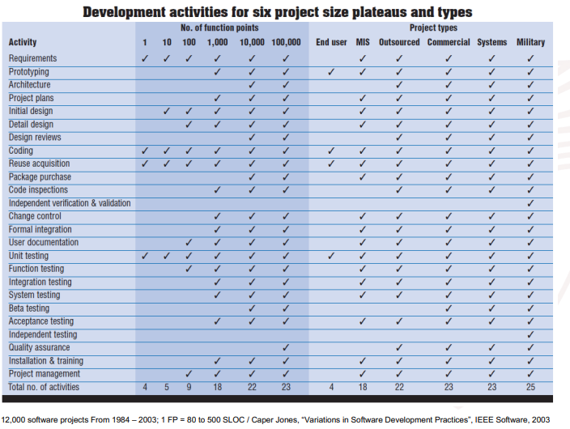

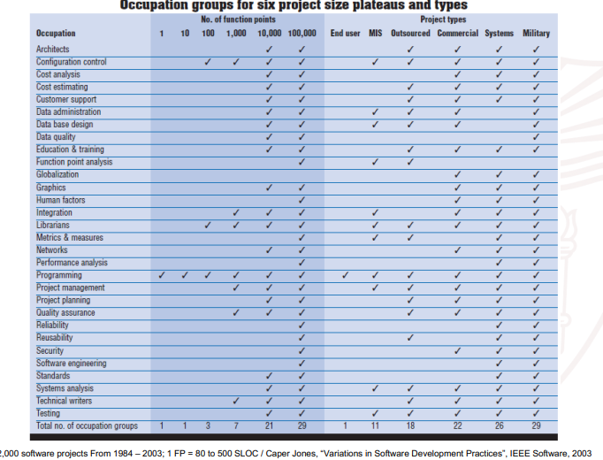

### Choices of SW Dev Methodologies

- Based on 158 respondents, mostly from IT sector

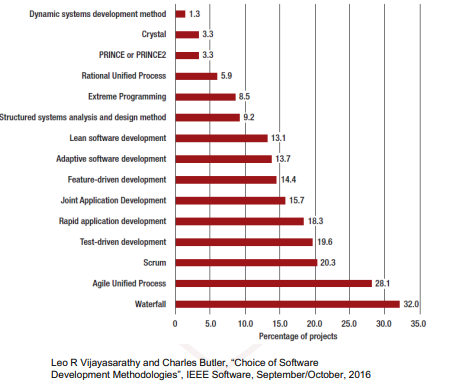

#### Choices of SW Dev Methodologies (1/3)

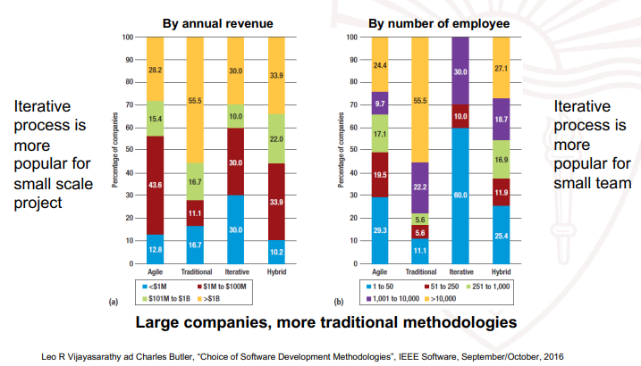

#### Choices of SW Dev Methodologies (2/3)

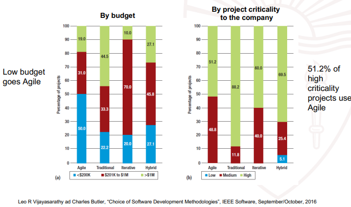

#### Choices of SW Dev Methodologies (3/3)

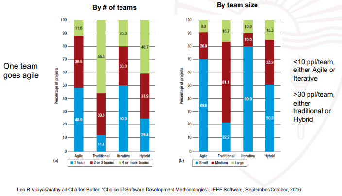

### Scaling Agile: Agile Frameworks at Enterprises

- Scaled Agile Framework (SAFe) is the most likely choice for an enterprise
- No framework is also popular

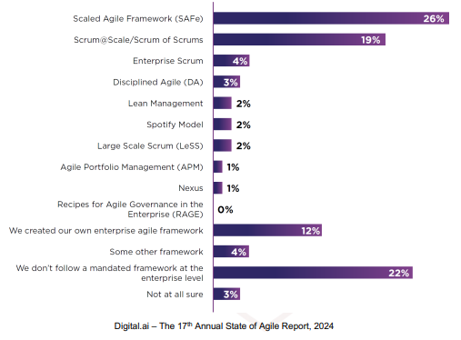

### Agile: Outline

- Agile Concepts
- **Agile Antipatterns**

#### Agile Antipatterns

- What is an antipattern?
  - “[A] common response to a recurring problem that is usually ineffective and risks being highly counterproductive.”

#### Common Software Engineering Anti-Patterns (1/2)

- Brooks's law
  - Adding more resources to a project to increase velocity, when the project is already slowed down by coordination overhead
- Feature creep
  - Uncontrolled changes or continuous growth in a project's scope, or adding new features to the project after the original requirements have been drafted and accepted
- Gold plating
  - Continuing to work on a task or project well past the point at which extra effort is not adding value
- God object
  - Concentrating too many functions in a single part of the design (class)

#### Common Software Engineering Anti-Patterns (2/2)

- Dead code
  - Code that is there but no one is sure why
- Premature optimization
  - Code early, optimize early and assume that it efficient
- Dependency hell
  - Conflicts among dependency version requirements
- Soft code
  - Strong business logic or value from external resources in configuration files rather than a source code, e.g., macros, command line arguments
    - Abstracting too many values and features lead to complexity and maintenance issues

#### Anti-Patterns on New Agile Projects (1/3)

- **Agile Theater:** “Doing Agile” vs. “Being Agile”
  - Follow Agile ceremonies. But just a stage-play, no change behind the scenes
  - Going through motions without understanding what intended outcomes should be
    - Design review for each Sprint
    - Fluid Sprints – no time box or extended Sprint length
    - Not planned well
    - Expectations that stories can move in and out or that Sprint stays open if work is not completed
- **Recommendation**
  - **Be Agile**, often need to change mindset or organizational culture
  - Follow Agile manifesto values
  - Understand the objectives and benefits before tailoring the Agile process
  - Study Agile lessons learned from other programs
  - Look for solutions that are documented, repeatable, and proven to be effective

##### Anti-Patterns on New Agile Projects (2/3)

- **Scrum-but** : “We’re doing Scrum, but we ...” [do something that is completely the opposite of what it says to do in Scrum]
  - Extensive up-front design
  - Large user story to fit in a Sprint
  - Silo teams
  - Part-time team members
- **Agile-on-the-fly**: start applying Agile quickly without thinking or careful planning
  - Blindly follow practices of other programs

- **Recommendation**
  - If teams are new to Agile, it’s recommended that they adopt it properly first
  - Need training, mindset change, full team (including management) buy-in, on-going coaching

#### Anti-Patterns on New Agile Projects (3/3)

- **Assuming Agile planning is entirely ad hoc and as-you-go**
  - Agile planning is intended to be flexible, but not chaotic
  - One program planned “Releases” but had only the vaguest notion of what those Releases would contain
    - Resulting in lack of structure and priority in their Sprint planning
  - **Recommendation**
    - Planning should be oriented to achieve an MVP and then enhance that capability incrementally in subsequent Sprints and Releases
    - Never be in a state where the product isn’t working. Plan every iteration to enhance and deliver additional mission capabilities.
- **Not building in quality**
  - Not enough testing, especially regression testing
- **Recommendation**
  - Start with the end in mind, use acceptance criteria, definition of done
  - Make sure via regression testing (preferably automated) that the system’s other functionalities have not been inadvertently impacted
  - Embed testers as part of the development team

# **USC CSCI-577a Software Engineering**

Week 05: / Feb 9, 2026

Dr. Mahdi Eslamimehr & Dr. Jae Young Bang

## In the Last Episode of CSCI-577a ...Lecture

- Software engineering philosophy
  - Software process models (including ICSM and Agile)
  - Value-based software engineering (“VBSE”)
- Agile
  - Agile concepts
  - Agile anti-patterns
- Incremental Commitment Spiral Model (“ICSM”)
  - The four ICSM principles
    - Stakeholder value-based guidance
    - Incremental commitment and accountability
    - Concurrent multidiscipline engineering
    - Evidence- and risk-based decisions
  - A failure story

## In the Today's Episode of CSCI-577a ...Lecture

- Part I
  - Analysis and Planning
    - Risk analysis
    - Cost estimation
    - Technical debt
- Part II
  - Software architecture: the basics
    - Software architecture
    - Architectural models
    - Architectural styles & patterns
    - Architecture analysis
    - Architecture implementation
- Part III
  - Prototyping and Testing
    - Prototyping
      - Purpose, types, dimensions
    - Testing
      - Goals and key concepts
      - Methods
      - Levels
      - Techniques
      - Non-functional requirements
- Part IV
  - DevOps
    - Goals and benefits
    - CI/CD pipeline
      - Continuous exploration, integration, deployment, and release

## Lecture Part I

Software Analysis and Planning

### Software Analysis and Planning: Outline

- Let's do all these **not to fail** a software project, which is success!
- Risk analysis
- Cost estimation
- Technical debt identification and resolution
- Different software development processes might perform these analysis and planning at slightly different stages, explicitly or implicitly

### Software Analysis and Planning: Risk Analysis ---

#### Risk

- **Definition:**
  - “possibility of loss or injury” [Marriam-Webster]
- Risk is **not** a problem – it may or may not be realized into a problem
- Risks involve uncertainties
  - And can be dealt with proactively
  - If the risk is realized, then it is a problem
    - It is no longer a risk at that point

#### Is This a Risk? (1/2)

- We just started integrating the software (in a project for a customer)
  - We found out that COTS\* products A and B just cannot talk to each other
- We've got too much tied into A and B to change
- Our best solution is to build wrappers around A and B to get them to talk via Protobuf\*\*
- This will take 3 months and \$300K
- It will also delay integration and delivery by at least 3 months
- \*COTS: Commercial off-the-shelf
- \*\*Protocol Buffers (Protobuf): <https://protobuf.dev/>

#### Is This a Risk? (2/2)

- We just started integrating the software
  - We found out that COTS\* products A and B just cannot talk to each other
- We've got too much tied into A and B to change
- No, at this point, it is already a **problem**
  - Being dealt with reactively
- Risks involve uncertainties
  - And can be dealt with proactively
  - **Earlier**, this problem was a risk

#### Earlier, This Problem Was A Risk

- A and B are our strongest COTS choices
  - But there is some chance that they cannot talk to each other
  - **Probability of loss  $P(L)$**
- If we commit to using A and B
  - And we find out in integration that they cannot talk to each other
  - We'll add more cost and delay delivery by at least 3 months
  - **Size of loss  $S(L)$**
- **Risk Exposure = Probability of loss  $P(L)$  \* Size of loss  $S(L)$** 
  - $RE = P(L) * S(L)$

#### Risk Management

- We should manage risk throughout a software development lifecycle
- How can risk management help you deal with risks?
  - Buying information
  - Risk avoidance
  - Risk transfer
  - Risk reduction
  - Risk acceptance

##### Risk Management: Buying Information

- Example
  - “Let’s spend \$30K and 2 weeks prototyping the integration of A and B”
- This will **buy** information on the magnitude of  $P(L)$  and  $S(L)$
- If  $RE = P(L) * S(L)$  is small, we’ll accept and monitor the risk
- If  $RE$  is large, we’ll use one/some of the other strategies

#### Risk Management: Other Strategies

- **Risk Avoidance**
  - COTS product C is almost as good as B, and it can talk to A
  - Delivering on time is worth more to the customer than the small performance loss
- **Risk Transfers**
  - If the customer insists on using A and B, have them establish a risk reserve
  - To be used to the extent that A and B can't talk to each other
- **Risk Reduction**
  - If we build the wrappers and the Protobuf implementation right now, we add cost but minimize the schedule delay
- **Risk Acceptance**
  - If we can solve the A and B interoperability problem, we'll have a big competitive edge on the future procurements
  - Let's do this on our own money, and patent the solution

#### Is Risk Management Fundamentally Negative?

- It usually is, but it shouldn't be
- As illustrated in the Risk Acceptance strategy, it is equivalent to Opportunity Management
  - **Opportunity Exposure  $OE = P(\text{Gain}) * S(\text{Gain}) = \text{Expected Value}$**
- Buying information and the other risk management strategies have their Opportunity counterparts
  - $P(\text{Gain})$ : Are we likely to get there before the competition?
  - $S(\text{Gain})$ : How big is the market for the solution?
- Have this positive scenario in mind when you deal with risks

#### What Else Can Risk Risk Management Help You Do?

- By continually assessing risk and opportunity exposures, you can:
  - Determine “How much is enough?” for your products and processes
    - Functionality, documentation, prototyping, COTS evaluation, architecting, testing, formal methods, agility, discipline, ...
    - What’s the risk exposure of doing too much or too little?
  - Tailor and adapt your life cycle processes
    - Determine what to do next (specify, prototype, COTS eval, business case analysis)
    - Examples: Risk-driven spiral model and extensions (win-win, anchor points, ...)
  - Get help from higher management
    - Organize management reviews around top-10 risks

#### Day One Temptations to Avoid - I

- *“It’s too early to think about risks. We need to:*
  - *finalize the requirements,*
  - *maximize our piece of the pie,*
  - *converge on the risk management org, forms, tools, and procedures, and*
  - *not put the cart before the horse”*
- **The real horse is the risks, and it’s leaving the barn**
  - Don’t sit around laying out the seats on the cart while this happens
  - Work this **concurrently**

##### Day One Temptations to Avoid - II

- *“We don’t have time to think about the risks. We need to:*
  - *get some code running right away,*
  - *put on an effective demo for the customers, and*
  - *be decisive, lead, and make commitments”*
- The Contrarian’s Guide to Leadership (Sample, 2002; USC president)
  - Never make a decision today that can be put off till tomorrow
  - Don’t form opinions if you don’t have to—think gray

##### Day One Temptations to Avoid - III

- Unwillingness to admit risks exist
  - This will leave an impression that
    - you don't know exactly what you're doing
    - your bosses and customers don't know exactly what they're doing
  - Success-orientation—"I'm not going to talk about failure"
  - The "shoot the messenger" syndrome—blaming the bearer of the bad news
- Tendency to postpone the hard parts
  - Maybe they'll go away
  - Maybe they'll get easier, once we do the easy parts
- Unwillingness to invest money and time up front

#### Risk Management Plans

- For each risk item, try answering the following questions:
  - **Why?**: Risk item importance, relation to project objectives
  - **What, When?**: Risk resolution deliverables, milestones, ...
  - **Who, Where?**: Responsibilities, organization
  - **How?**: Approach (prototypes, surveys, models, ...)
  - **How much?**: Resources (budget, schedule, key personnel)

#### Risk Analysis – Wrapping Up

- Risk is not a problem (yet)
- Risks involve uncertainties
  - And can be dealt with proactively
  - Deal with risks proactively and do not let them be realized into problems
- Manage risks
  - Buying information
  - Risk avoidance
  - Risk transfer
  - Risk reduction
  - Risk acceptance

### Software Analysis and Planning: Cost Estimation ---

#### Software Cost Estimation Methods

- What is cost estimation?
  - Prediction of both the person-effort and elapsed time of a project
- Known methods:
  - Algorithmic
  - Expert judgement
  - Estimation by analogy
  - Top-down
  - Bottom-up
  - And *many others*
- Best approach is a combination of methods
  - Compare and iterate estimates, reconcile differences, *continually*
- COCOMO (original from 1981)
  - The “COnstructive COst MOdel”
  - Derived from empirical data
- COCOMO II (released in 2000) is the update to COCOMO 1981
- COCOMO III in the works
- COCOMO is the most known, thoroughly documented and calibrated cost model
- Is it still applicable in today's AI-assisted software projects?

#### Software Estimation Accuracy

- Effect of uncertainties over time
- We will see this “cone” several times today

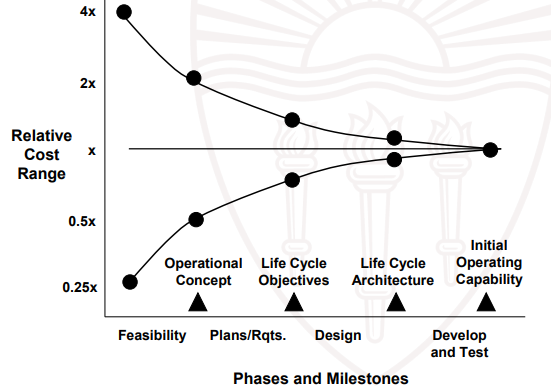

#### Top-Down and Bottom-Up Approaches

##### - **The top-down approach**

- A high-level approach that uses historical data from similar projects to estimate overall costs

###### - Process

- Use previous project data as a baseline
- Adjust estimates based on project differences (scale, complexity)
- Provide a rough estimate quickly

###### - Pros

- Fast and efficient for early project planning
- Useful for initial budgeting

###### - Cons

- Less detailed and may miss unique project aspects
- Dependent on the availability of relevant historical data

##### - **The bottom-up approach**

- A detailed approach that involves breaking down the project into individual tasks or work packages

###### - Process

- Identify and list all deliverables and tasks.
- Estimate the cost and effort for each small task
- Sum the costs to get the total project estimate

###### - Pros

- High granularity and accuracy.
- Ideal when the project scope is well-defined

###### - Cons

- Time-consuming and resource-intensive.
- Requires detailed work breakdown

#### COCOMO II

- COCOMO and COCOMO II (by Boehm)
  - Built on a foundation of historical data and regression analysis
  - Predicts effort by combining a base, size-related equation with factors that adjust for project-specific conditions
  - COCOMO II (updated in 2000)
  - COCOMO III in the works
- Key Features
  - Effort Estimation
    - Predicts project effort, cost, schedule
  - Scale Factors & Cost Drivers
    - Project size, complexity, team capability, environmental factors, etc.

- Usage & Benefits:
  - Ideal for early-stage planning and budgeting
  - Provides a structured framework for comparing project estimates
  - Enhances accuracy by reflecting non-linear impacts of project attributes
- Considerations:
  - Requires accurate input data and calibration for reliable outcomes.
  - Sensitive to variations in cost drivers and scale factors.

##### COCOMO Black Box Model

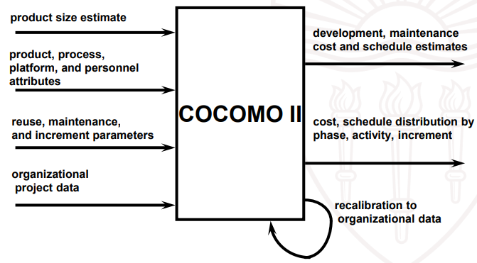

#### COCOMO II Web Implementation

- <http://softwarecost.org/tools/COCOMO/>
- By Ray Madachy at the Naval Postgraduate School

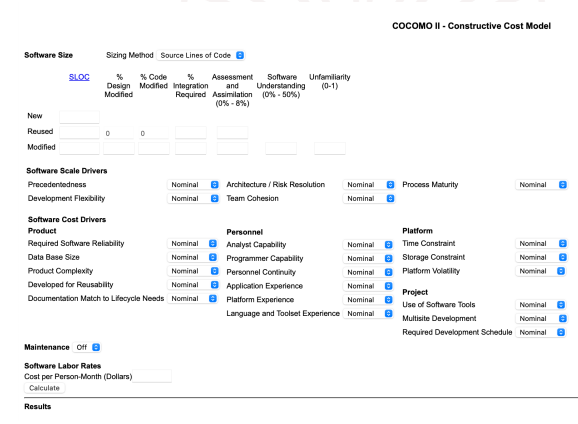

#### COCOMO Effort Formulation

$$\text{Effort (person-months)} = A (\text{Size})^E \prod_{i=1}^{\# \text{ of cost drivers}} EM_i$$

- Where:
  - **A** is a constant derived from historical project data (currently  $A = 2.94$  in COCOMOII.2000)
  - **Size** is the amount of software functionality delivered to the user, expressed through a measurable proxy, such as KSLOC or converted from function points or object points
  - **E** is an exponent for the diseconomy of scale dependent on five additive **scale factors** according to  $b = .91 + .01 * \sum SF_i$ , where  $SF_i$  is a weighting factor for  $i^{\text{th}}$  scale driver
  - **EMi** is the effort multiplier for the  $i^{\text{th}}$  cost driver
    - The geometric product results in an overall effort adjustment factor to the nominal effort
- **Caveat for today**
  - Using software size in KSLOC is no longer an effective way of measuring it
  - “Size” might need to be discounted given how incredibly cheap writing code has become

##### COCOMO Schedule Formulation

$$\text{Schedule (months)} = C (\text{Effort})^{(.28+0.2(E-0.91))} \times \text{SCED\%/100}$$

- Where:
  - **Schedule** is the calendar time in months from the requirements baseline to acceptance
  - **C** is a constant derived from historical project data (currently  $C = 3.67$  in COCOMOII.2000)
  - **Effort** is the estimated person-months excluding the SCED effort multiplier
  - **E** is the exponent in the effort equation
  - **SCED%** is the compression / expansion percentage in the SCED cost driver
- This is the COCOMOII.2000 calibration
- Formula can vary to reflect process models for reusable and COTS software, and the effects of application composition capabilities

#### COCOMO II Output Ranges

- Provides a standard deviation optimistic & pessimistic estimates
- Reflects sources of input uncertainties (“cone of uncertainty”)
- Applies to **effort** or **schedule** in each stage
  - Stage 1 (application composition)
  - Stage 2 (early design)
  - Stage 3 (post-architecture)

| Stage | Optimistic Estimate | Pessimistic Estimate |
|-------|---------------------|----------------------|
| 1     | 0.50 E              | 2.0 E                |
| 2     | 0.67 E              | 1.5 E                |
| 3     | 0.80 E              | 1.25 E               |

#### Reused and Modified Software

- Effort for adapted software (reused or modified) is not the same as for new software
- Approach
  - **Convert adapted software into equivalent size of new software**

##### Nonlinear Reuse Effects

- The reuse cost function does not go through the origin due to a cost of about 5% for assessing, selecting, and assimilating the reusable component
- Small modifications generate **disproportionately large costs** primarily due the cost of understanding the software to be modified, and the relative cost of interface checking

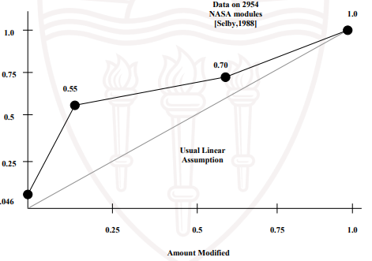

##### COCOMO Reuse Model (1/2)

- A nonlinear estimation model to convert adapted (reused or modified) software into equivalent size of new software:

$$AAF = 0.4(DM) + 0.3(CM) + 0.3(IM)$$

$$ESLOC = \frac{ASLOC[AA + AAF(1 + 0.02(SU)(UNFM))]}{100}, AAF \leq 0.5$$

$$ESLOC = \frac{ASLOC[AA + AAF + (SU)(UNFM)]}{100}, AAF > 0.5$$

##### COCOMO Reuse Model (2/2)

$$AAF = 0.4(DM) + 0.3(CM) + 0.3(IM)$$

$$ESLOC = \frac{ASLOC[AA + AAF(1 + 0.02(SU)(UNFM))]}{100}, AAF \leq 0.5$$

$$ESLOC = \frac{ASLOC[AA + AAF + (SU)(UNFM)]}{100}, AAF > 0.5$$

- **ASLOC** - Adapted Source Lines of Code
- **ESLOC** - Equivalent Source Lines of Code
- **AAF** - Adaptation Adjustment Factor
- **DM** - Percent Design Modified. The percentage of the adapted software's design which is modified in order to adapt it to the new objectives and environment.
- **CM** - Percent Code Modified. The percentage of the adapted software's code which is modified in order to adapt it to the new objectives and environment.

- **IM** - Percent of Integration Required for Modified Software. The percentage of effort required to integrate the adapted software into an overall product and to test the resulting product as compared to the normal amount of integration and test effort for software of comparable size.
- **AA** - Assessment and Assimilation effort needed to determine whether a fully-reused software module is appropriate to the application, and to integrate its description into the overall product description. See table.
- **SU** - Software Understanding. Effort increment as a percentage. Only used when code is modified (zero when DM=0 and CM=0). See table.
- **UNFM** - Unfamiliarity. The programmer's relative unfamiliarity with the software which is applied multiplicatively to the software understanding effort increment (0-1).

#### COCOMO II Web Implementation

- <http://softwarecost.org/tools/COCOMO/>
- By Ray Madachy at the Naval Postgraduate School

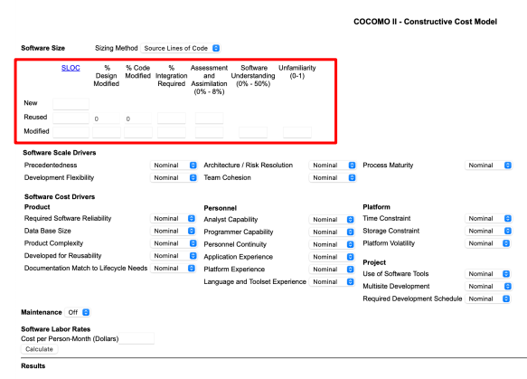

##### Assessment and Assimilation Increment (AA)

| AA Increment | Level of AA Effort                                   |
|--------------|------------------------------------------------------|
| 0            | None                                                 |
| 2            | Basic module search and documentation                |
| 4            | Some module Test and Evaluation (T&E), documentation |
| 6            | Considerable module T&E, documentation               |
| 8            | Extensive module T&E, documentation                  |

##### Software Understanding Increment (SU)

- Take the subjective average of the three categories
- Do not use SU if the component is being used unmodified ( $DM=0$  &  $CM=0$ )

> DM = Design Modified, CM = Code Modified

|                       | Very Low                                                 | Low                                                          | Nominal                                                     | High                                                                     | Very High                                                                               |
|-----------------------|----------------------------------------------------------|--------------------------------------------------------------|-------------------------------------------------------------|--------------------------------------------------------------------------|-----------------------------------------------------------------------------------------|
| Structure             | Very low cohesion, high coupling, spaghetti code.        | Moderately low cohesion, high coupling.                      | Reasonably well-structured; some weak areas.                | High cohesion, low coupling.                                             | Strong modularity, information hiding in data / control structures.                     |
| Application Clarity   | No match between program and application world views.    | Some correlation between program and application.            | Moderate correlation between program and application.       | Good correlation between program and application.                        | Clear match between program and application world-views.                                |
| Self-Descriptiveness  | Obscure code; documentation missing, obscure or obsolete | Some code commentary and headers; some useful documentation. | Moderate level of code commentary, headers, documentations. | Good code commentary and headers; useful documentation; some weak areas. | Self-descriptive code; documentation up-to-date, well-organized, with design rationale. |
| SU Increment to ESLOC | 50                                                       | 40                                                           | 30                                                          | 20                                                                       | 10                                                                                      |

##### Programmer Unfamiliarity (UNFM)

- Only applies to modified software

| UNFM Increment | Level of Unfamiliarity |
|----------------|------------------------|
| 0.0            | Completely familiar    |
| 0.2            | Mostly familiar        |
| 0.4            | Somewhat familiar      |
| 0.6            | Considerably familiar  |
| 0.8            | Mostly unfamiliar      |
| 1.0            | Completely unfamiliar  |

##### Cost Factors

- Significant factors of development cost:
  - **Scale drivers** are sources of exponential effort variation
  - **Cost drivers** are sources of linear effort variation
    - Product, platform, personnel and project attributes
  - Effort multipliers associated with cost driver ratings
- Defined to be as objective as possible
- Each factor is rated between very low and very high per rating guidelines
  - Relevant effort multipliers adjust the cost up or down

##### Scale Factors

- Precedentedness (PREC)
  - Degree to which system is new and past experience applies
- Development Flexibility (FLEX)
  - Need to conform with specified requirements
- Architecture/Risk Resolution (RESL)
  - Degree of design thoroughness and risk elimination
- Team Cohesion (TEAM)
  - Need to synchronize stakeholders and minimize conflict
- Process Maturity (PMAT)
  - SEI CMM process maturity rating

###### Scale Factor Rating

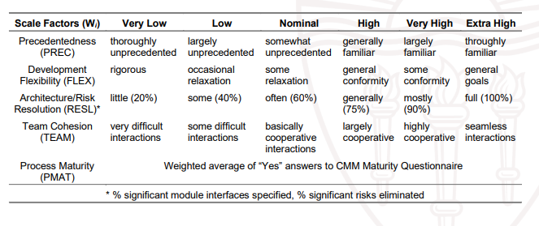

#### COCOMO II Web Implementation

- <http://softwarecost.org/tools/COCOMO/>
- By Ray Madachy at the Naval Postgraduate School

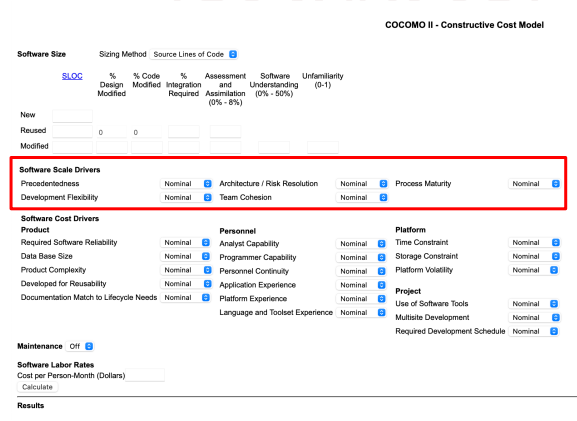

##### Cost Drivers

- **Product Factors**
  - Reliability (RELY)
  - Data (DATA)
  - Complexity (CPLX)
  - Reusability (RUSE)
  - Documentation (DOCU)
- **Platform Factors**
  - Time constraint (TIME)
  - Storage constraint (STOR)
  - Platform volatility (PVOL)

- **Personnel Factors**
  - Analyst capability (ACAP)
  - Program capability (PCAP)
  - Applications experience (APEX)
  - Platform experience (PLEX)
  - Language and tool experience (LTEX)
  - Personnel continuity (PCON)
- **Project Factors**
  - Software tools (TOOL)
  - Multisite development (SITE)
  - Required schedule (SCED)

##### Product Factors (1/6)

- Required Software Reliability (RELY)
  - Measures the extent to which the software must perform its intended function over a period of time.
  - Ask: what is the effect of a software failure

|      | Very Low             | Low                            | Nominal                             | High                | Very High          | Extra High |
|------|----------------------|--------------------------------|-------------------------------------|---------------------|--------------------|------------|
| RELY | slight inconvenience | low, easily recoverable losses | moderate, easily recoverable losses | high financial loss | risk to human life |            |

##### Product Factors (2/6)

- Data Base Size (DATA)
  - Captures the effect large data requirements have on development to generate test data that will be used to exercise the program
  - Calculate the data/program size ratio (D/P):

$$
\frac{D}{P} = \frac{DataBaseSize(Bytes)}{ProgramSize(SLOC)}
$$

|      | Very Low | Low                     | Nominal             | High                  | Very High    | Extra High |
|------|----------|-------------------------|---------------------|-----------------------|--------------|------------|
| DATA |          | DB bytes/ Pgm SLOC < 10 | $10 \leq D/P < 100$ | $100 \leq D/P < 1000$ | $D/P > 1000$ |            |

##### Product Factors (3/6)

- Product Complexity (CPLX)
  - This is a single factor that may consist one of more of its sub-areas:
    - Control operations
    - Computational operations
    - Device-dependent operations
    - Data management operations
    - User interface management operations
- Select and use the area or combination of areas that characterize the product
- See the module complexity tables in the next two slides

##### Product Factors (4/6)

- Module Complexity Ratings
  - Use a subjective weighted average of the attributes, weighted by their relative product importance
  
    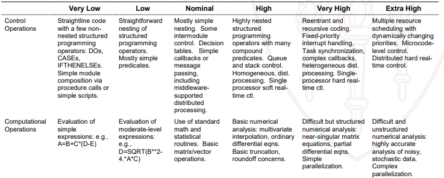

##### Product Factors (5/6)

- Module Complexity Ratings
  - Use a subjective weighted average of the attributes, weighted by their relative product importance

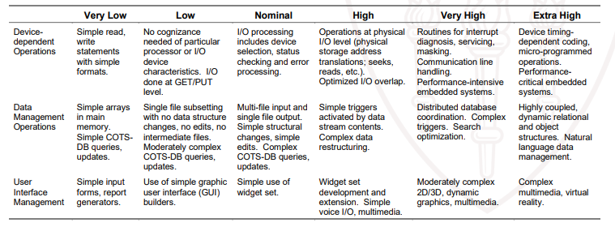

##### Product Factors (6/6)

- Required Reusability (RUSE)
  - Accounts for the additional effort needed to construct components intended for reuse

|      | Very Low | Low  | Nominal        | High           | Very High           | Extra High                    |
|------|----------|------|----------------|----------------|---------------------|-------------------------------|
| RUSE |          | none | across project | across program | across product line | across multiple product lines |

- Documentation match to life-cycle needs (DOCU)
  - What is the suitability of the project's documentation to its life-cycle needs

|      | Very Low                        | Low                             | Nominal                         | High                           | Very High                           | Extra High |
|------|---------------------------------|---------------------------------|---------------------------------|--------------------------------|-------------------------------------|------------|
| DOCU | Many life-cycle needs uncovered | Some life-cycle needs uncovered | Right-sized to life-cycle needs | Excessive for life-cycle needs | Very excessive for life-cycle needs |            |

#### COCOMO II Web Implementation

- <http://softwarecost.org/tools/COCOMO/>
- By Ray Madachy at the Naval Postgraduate School

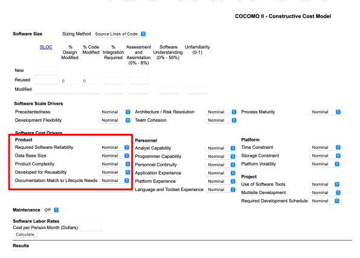

##### Personnel Factors (1/3)

- Analyst Capability (ACAP)
  - Analysts work on requirements, high level design and detailed design
  - Consider analysis and design ability, efficiency and thoroughness, and the ability to communicate and cooperate

|      | Very Low        | Low             | Nominal         | High            | Very High       | Extra High |
|------|-----------------|-----------------|-----------------|-----------------|-----------------|------------|
| ACAP | 15th percentile | 35th percentile | 55th percentile | 75th percentile | 90th percentile |            |

- Programmer Capability (PCAP)
  - Evaluate the capability of the programmers as a team rather than as individuals. Consider ability, efficiency and thoroughness, and the ability to communicate and cooperate

|      | Very Low        | Low             | Nominal         | High            | Very High       | Extra High |
|------|-----------------|-----------------|-----------------|-----------------|-----------------|------------|
| PCAP | 15th percentile | 35th percentile | 55th percentile | 75th percentile | 90th percentile |            |

##### Personnel Factors (2/3)

- Applications Experience (AEXP)
  - Assess the project team's equivalent level of experience with this type of application

|      | Very Low   | Low      | Nominal | High    | Very High | Extra High |
|------|------------|----------|---------|---------|-----------|------------|
| AEXP | ≤ 2 months | 6 months | 1 year  | 3 years | 6 years   |            |

- Platform Experience (PEXP)
  - Assess the project team's equivalent level of experience with this platform including the OS, graphical user interface, database, networking, and distributed middleware

|      | Very Low   | Low      | Nominal | High    | Very High | Extra High |
|------|------------|----------|---------|---------|-----------|------------|
| PEXP | ≤ 2 months | 6 months | 1 year  | 3 years | 6 year    |            |

##### Personnel Factors (3/3)

- Language and Tool Experience (LTEX)
  - Measures the level of programming language and software tool experience of the project team

|             | <b>Very Low</b> | <b>Low</b> | <b>Nominal</b> | <b>High</b> | <b>Very High</b> | <b>Extra High</b> |
|-------------|-----------------|------------|----------------|-------------|------------------|-------------------|
| <b>LTEX</b> | $\leq 2$ months | 6 months   | 1 year         | 3 years     | 6 years          |                   |

- Personnel Continuity (PCON)
  - The scale for PCON is in terms of the project's annual personnel turnover

|             | <b>Very Low</b> | <b>Low</b> | <b>Nominal</b> | <b>High</b> | <b>Very High</b> | <b>Extra High</b> |
|-------------|-----------------|------------|----------------|-------------|------------------|-------------------|
| <b>PCON</b> | 48% / year      | 24% / year | 12% / year     | 6% / year   | 3% / year        |                   |

#### COCOMO II Web Implementation

- <http://softwarecost.org/tools/COCOMO/>
- By Ray Madachy at the Naval Postgraduate School

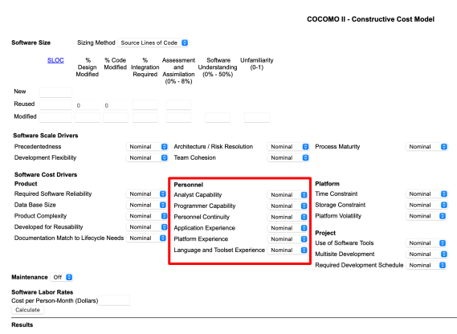

##### Platform Factors (1/2)

- Platform
  - Refers to the target-machine complex of hardware and infrastructure software (e.g., virtual machine)
- Execution Time Constraint (TIME)
  - Measures the constraint imposed upon a system in terms of the percentage of available execution time expected to be used by the system

|      | Very Low | Low | Nominal                                     | High | Very High | Extra High |
|------|----------|-----|---------------------------------------------|------|-----------|------------|
| TIME |          |     | $\leq 50\%$ use of available execution time | 70%  | 85%       | 95%        |

##### Platform Factors (2/2)

- Main Storage Constraint (STOR)
  - Measures the degree of main storage constraint imposed on a software system or subsystem

|      | Very Low | Low                                  | Nominal | High | Very High | Extra High |
|------|----------|--------------------------------------|---------|------|-----------|------------|
| STOR |          | $\leq 50\%$ use of available storage |         | 70%  | 85%       | 95%        |

- Platform Volatility (PVOL)
  - Assesses the volatility of the platform (the complex of hardware and software the software product calls on to perform its tasks)

|      | Very Low | Low                                                    | Nominal | High                          | Very High                     | Extra High                     |
|------|----------|--------------------------------------------------------|---------|-------------------------------|-------------------------------|--------------------------------|
| PVOL |          | major change every 12 mo.; minor change every 1 mo. |         | major: 6 mo.; minor: 2 wk. | major: 2 mo.; minor: 1 wk. | major: 2 wk.; minor: 2 days |

#### COCOMO II Web Implementation

- <http://softwarecost.org/tools/COCOMO/>
- By Ray Madachy at the Naval Postgraduate School

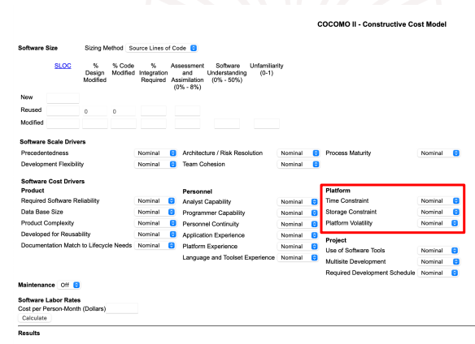

##### Project Factors (1/2)

- Use of Software Tools (TOOL)
  - Assess the usage of software tools used to develop the product in terms of their capabilities and maturity

| Very Low          | Low                                                | Nominal                                      | High                                                  | Very High                                                                                 | Extra High |
|-------------------|----------------------------------------------------|----------------------------------------------|-------------------------------------------------------|-------------------------------------------------------------------------------------------|------------|
| edit, code, debug | simple, frontend, backend CASE, little integration | basic lifecycle tools, moderately integrated | strong, mature lifecycle tools, moderately integrated | strong, mature, proactive lifecycle tools, well integrated with processes, methods, reuse |            |

##### Project Factors (2/2)

- Multisite Development (SITE)
  - Assess and average two factors: site collocation and communication support

|                         | Very Low            | Low                             | Nominal                        | High                                    | Very High                                          | Extra High                |
|-------------------------|---------------------|---------------------------------|--------------------------------|-----------------------------------------|----------------------------------------------------|---------------------------|
| SITE: Collocation    | International       | Multi-city and Multi-company | Multi-city or Multi-company | Same city or metro. area             | Same building or complex                        | Fully collocated          |
| SITE: Communications | Some phone, mail | Individual phone, FAX        | Narrowband email            | Wideband electronic communication | Wideband elect. comm, occasional video conf. | Interactive multimedia |

- Required Development Schedule (SCED)
  - Measure the imposed schedule constraint in terms of the percentage of schedule stretch-out or acceleration with respect to a nominal schedule for the project

|      | Very Low       | Low | Nominal | High | Very High | Extra High |
|------|----------------|-----|---------|------|-----------|------------|
| SCED | 75% of nominal | 85% | 100%    | 130% | 160%      |            |

#### COCOMO II Web Implementation

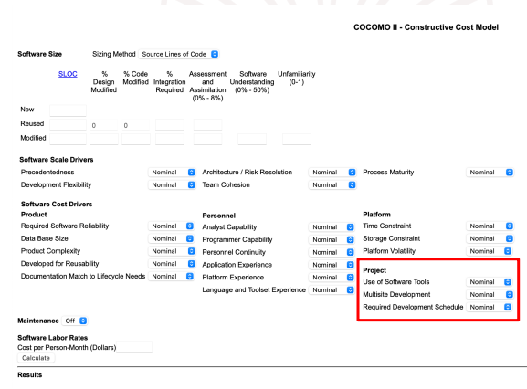

#### Cost Estimation – Wrapping Up

- What is cost estimation?
  - Prediction of both the person-effort and elapsed time of a project
- It is “estimation”
  - There is always a chance that the result is off
- Best approach is a combination of methods
  - Compare and iterate estimates and reconcile differences, **continually**

### Software Analysis and Planning: Technical Debt ---

#### What Are the Cost of a Software?

- Think about the whole life cycle
- “Total cost of ownership”
  - A **financial estimate** whose purpose is to help consumers and enterprise managers determine direct and indirect costs of a product or system
    - Including the costs to research, develop, acquire, own, operate, maintain, and dispose of a system

#### Potential Total Cost of Ownership

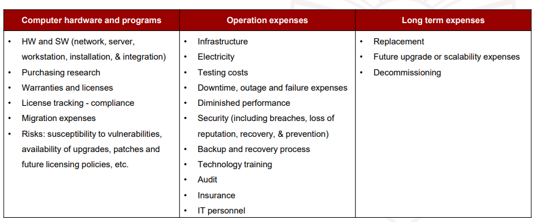

**Technical Debt**

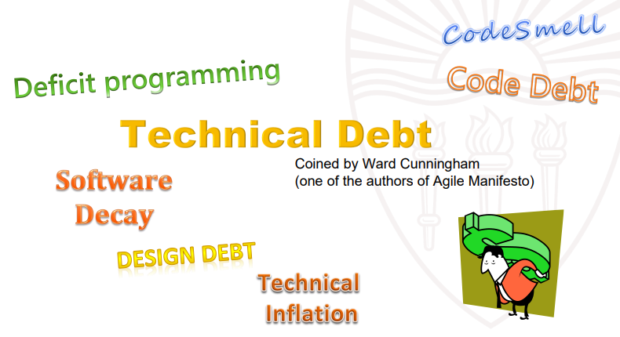

#### Examples of Technical Debt (1/4)

- “We will fix it, when it comes to that part.”
- “I don’t have time to remove that bug.”
- “Put in the backlog, we will fix it in the next sprint.”

#### Examples of Technical Debt (2/4)

- “You do part 1, I will do part 2. We will integrate later.”
- “I have done this kind of project before, trust me.”
- “But... But they are the best COTS in the market.”

#### Examples of Technical Debt (3/4)

- “I did not know we have this constraint.”
  - “Did you ask?”
  - “I think I did.”
- “Either you move the tree, or I curve the train track. It will cost around \$300K. Easy easy.”

#### Examples of Technical Debt (4/4)

- “The system works perfectly. I tested it so many times. Yes, in December.”

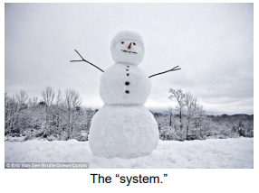

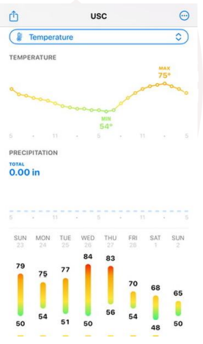

#### What is Technical Debt?

- “Shipping first time code is like going into debt. A little debt speeds development so long as it is paid back promptly with a rewrite ... The danger occurs when the debt is not repaid. **Every minute spent on not-quite-right code counts as interest on that debt.** Entire engineering organizations can be brought to a stand-still under the debt load of an unconsolidated implementation, object-oriented, or otherwise.”

— Ward Cunningham, 1992

#### Major Causes of Technical Debt

- Conspiracy of Optimism
- Business pressures
- Easiest-first; neglecting rainy day use cases
- Delayed Refactoring
- Neglect of ICSM Principles
  - Stakeholder value-based guidance
  - Incremental commitment and accountability
  - Concurrent system engineering
  - Evidence and risk-driven decisions

#### Categorizing Technical Debt

- Technical Quadrant – Martin Fowler
- Sources of Technical Debt

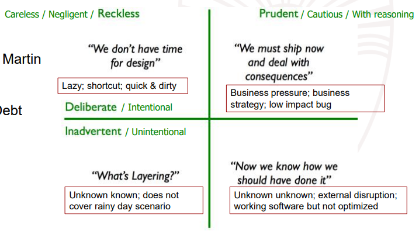

#### Sources of Technical Debt

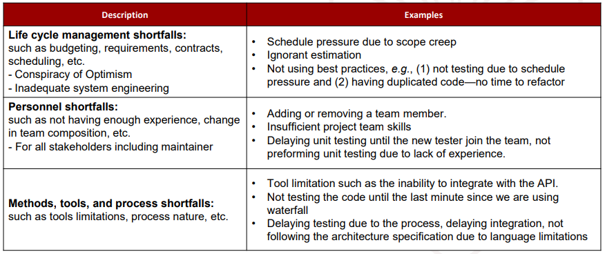

#### Fixing Technical Debt

- Big Bang
  - No new features for a month/year?
  - Spend some time cleaning up the mess
- Dedicated Team
  - Have another team dedicated
- Boy Scout
  - Remove technical debt little and often
  - If no tests, add some. If poor test, improve them. If bad code, refactor it
  - The boy scout rule – leave the camp cleaner than you found it
- Use technical debt tools: SONAR, CAST, SQALE

### The Bottom Line

- Creating technical debt may be a good practice
  - Meeting market windows
  - Prototyping to determine user needs, satisfaction
  - Short-term fixes, targets of opportunity
- But needs pay-down later
  - To avoid mounting debt and interest
- Need balanced investment in fixes, new features

## Lecture Part II

Architecture-Based Software Engineering

## Software Architecture-Based Software Engineering: Outline

- Software architecture is increasingly critical because AI-assisted development dramatically accelerates code production
- A strong architectural foundation is essential to maintain coherence, scalability, security, and maintainability amid rapidly generated complexity
- Architecture-based software engineering
- Software architectural styles and patterns
- Software architecture analysis
- Software implementation

### Software Architecture-Based Software Engineering

- Definition:
  - *Software architecture-based software engineering* is an approach where the software architecture is treated as a central, first-class artifact throughout the entire software lifecycle
- Explicit Modeling
  - Formal, high-level architectural models capture design decisions and system interactions.
- Lifecycle Integration
  - Architecture evolves alongside the system—from requirements to maintenance.
- Automated Analysis & Synthesis
  - Tools and formal methods support analysis, early flaw detection, and even automated code generation.
- Bridging Abstraction Levels
  - Connects high-level design with detailed implementation for managing complexity.

#### What is Software Architecture?

- Definition
  - A *software system's architecture* is the set of principal design decisions about the system
- Software architecture is the **blueprint** for a software system's construction and evolution
- A conceptual essence of a software system
- A living thing that evolves over the lifecycle of a software system
- Three fundamental understandings
  - Every application has an architecture
  - Every application has at least one architect
  - Architecture is not a phase of development

#### What is “Principal?”

- “**Principal**” implies a degree of importance that grants a design decision “architectural status”
  - Not all design decisions are architectural
  - Not all design decisions necessarily impact a system’s architecture
  - Example of a non-principal design decision:
    - “Do I use an array or linked list for a data?”
- How one defines “principal” will depend on what the stakeholders define as the system goals

#### Example Design Decisions

- **Structure:** The architectural elements should be organized and composed exactly like this ...
- **Functional behavior:** Data processing, storage, and visualization will be performed in this strict sequence.
- **Interaction:** Communication among all system elements will occur only using event notifications.
- **Non-functional properties:** The system's dependability will be ensured by replicated processing modules.
- **Implementation:** The user interface components will be built using Flutter.

#### Temporal Aspect of Software Architecture

- Every set of principal design decisions can be thought of as a different architecture
- Design decisions are made and unmade over a system's lifetime
  - Architecture has a temporal aspect
- At any given point in time the system has only one architecture
- A system's architecture will change over time

#### Software Model and Modeling

- Definition:
  - An ***architectural model*** is an artifact that captures some or all of the design decisions that comprise a system's architecture.
- Definition:
  - ***Architectural modeling*** is the reification and documentation of those design decisions.

#### Software Models

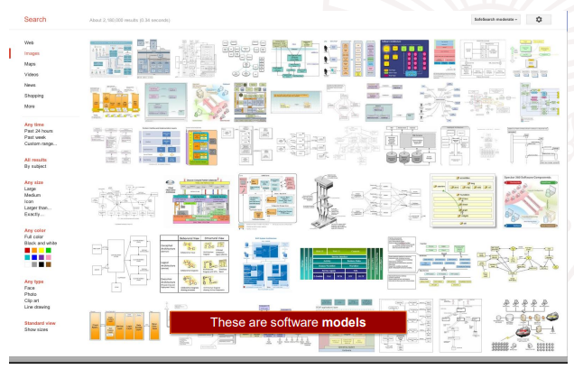

#### Software Architecture's Elements

- A software system's architecture typically is not (and should not be) a uniform monolith
- A software system's architecture should be a **composition** and **interplay** of different elements
  - Processing
  - Data, aka information or state
  - Interaction
- The above is encapsulated into following elements:
  - **Components**
  - **Connectors**
  - **Configurations**

##### Components

- Elements that encapsulate processing and data in a system's architecture are referred to as software components
- Definition
  - A ***software component*** is an architectural entity that
    - encapsulates a subset of the system's functionality and/or data
    - restricts access to that subset via an explicitly defined interface
    - has explicitly defined dependencies on its required execution context
- Components typically provide application-specific services

##### Connectors

- In complex systems interaction may become more important and challenging than the functionality of the individual components
- Definition
  - A ***software connector*** is an architectural building block tasked with effecting and regulating interactions among components
- In many software systems connectors are usually simple procedure calls or shared data accesses
  - Much more sophisticated and complex connectors are possible!
- Connectors typically provide application-independent interaction facilities

##### Examples of Connectors

- Procedure call connectors
- Shared memory connectors
- Message passing connectors
- Streaming connectors
- Distribution connectors
- Wrapper/adaptor connectors

##### Configurations

- Components and connectors are composed in a specific way in a given system's architecture to accomplish that system's objective
- Definition
  - An ***architectural configuration***, or topology, is a set of specific associations between the components and connectors of a software system's architecture

#### Architectural Style

- Definition:
  - An ***architectural style*** is a named collection of architectural design decisions that
    1. are applicable in a given development context,
    2. constrain architectural design decisions that are specific to a particular system within that context, and
    3. elicit beneficial qualities in each resulting system.
- Reflect less domain specificity than architectural patterns
- Example architectural styles
  - Object-Oriented, Layered, Client-Server, Data-Flow, Batch-Sequential, Pipe and Filter, Blackboard, Microservices, Peer-to-Peer, ...

#### Architectural Pattern

- Definition:
  - An ***architectural pattern*** is a named collection of architectural design decisions that are applicable to a recurring design problem, parameterized to account for different software development contexts in which that problem appears.
- Applied at a low level and within a narrow scope
- Example architectural patterns:
  - State-Logic-Display (aka Three-Tier), Model-View-Controller (for GUI), Sense-Compute-Control (aka Sensor-Controller-Actuator), ...

#### What Is Architectural Analysis?

- ***Architectural analysis*** is the activity of discovering important system properties using the system's architectural models
  - **Early, useful answers** about relevant architectural aspects
  - Available prior to system's construction
- Important to know: which questions to ask, why to ask them, how to ask them, and how to ensure that they can be answered
- **Note:** Not all models will be equally effective in helping to determine whether a given architecture satisfies a certain requirement
  - Informal and formal models

#### Architectural Analysis Goals

- The four “C”s
  - Completeness
    - “Is the architecture complete?”
  - Consistency
    - Ensures that different model elements do not contradict one another
  - Compatibility
    - Ensures that the architectural model adheres to guidelines and constraints of (1) a style, (2) a reference architecture, and/or (3) an architectural standard
  - Correctness
    - Ensures that (1) the architectural model fully realizes a system specification and (2) the system’s implementation fully realizes the architecture

#### Types of Analysis

- Static analysis
  - Inferring the properties of a software system from one or more of its models, without actually executing the models
  - Example: syntactic analysis
  - Can be automated (e.g., compilation) or manual (e.g., inspection)
- Dynamic analysis
  - It involves actually executing or simulating the execution of a model of the software system
  - The model's semantic underpinning must be executable or amenable to simulation
- Scenario-driven analysis
  - Large and complex systems – it is often infeasible to assert a given property for the entire system over the entire space of possible states
  - A specific use case scenario is identified, & the analysis focuses on it
  - Can be both static and dynamic
  - It is to make inferences from limited evidence – careful!

### Architecture-Based SE: Wrapping Up

- Pros
  - Continual analysis & verification of system qualities
  - Enhanced communication & clear documentation
  - Support for automation in analysis and code synthesis
  - Effective separation of concerns for managing complexity
  - Facilitates systematic evolution and maintenance
- Cons
  - Potentially higher overhead in modeling and upkeep
  - Dependence on specialized tools and formal methods
  - Risk of discrepancies between model and code
  - Possibility of over-engineering for simpler projects

## Lecture Part III

Prototyping and the Basics of Testing

## Prototyping and the Basics of Testing: Outline

- Prototyping and testing
  - Essential today because rapid iteration is a legit way to validate assumptions before AI-accelerated development turns projects into expensive mistakes
- Prototyping
- Testing
- More about Testing

### Prototyping and Testing

- Why do we do **prototyping** and **testing**?
  - To reduce risk
    - Help minimize risk by uncovering potential problems before the final product is released
  - To seek feedback
    - Prototyping seeks user or stakeholder feedback on design ideas and features
    - Testing obtains feedback about the correctness, performance, and reliability
  - To inform development decisions
    - Prototyping informs decisions on product scope and usability
    - Testing informs decisions on whether the development is ready to advance

#### What is a Prototype?

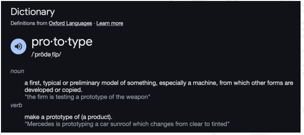

- In software engineering, it means “an early sample, model, or release of a product”

#### Why Prototype?

- “**Buying information**”—risk management
  - Inexpensive so it's okay to fail early
- To gather more accurate requirements
- To better understand the underlying technicalities (e.g., the algorithm)
- To explore feasibility for estimation and planning
- To increase user's (and other stakeholders') involvement
  - To resolve conflicts among stakeholders
- ...

#### Types of Prototype

- Throwaway prototyping
  - Also known as closed-ended prototyping or rapid prototyping
  - Informal, paper prototyping, storyboard, or UI (click dummy)
- Evolutionary prototyping
  - Build a robust prototype and constantly refine it
  - “First draft,” “second draft,” “third draft,” ....
- Incremental prototyping
  - “Building block”
  - Add/integrate new component, when all is in place, the solution is complete

#### Dimension of Prototypes

- Horizontal
  - Broad view of the entire system, focusing on user interaction, but no underlying functionality
- Vertical
  - Complete elaboration of a single subsystem or function (in-depth functionality, but only for selected few features)

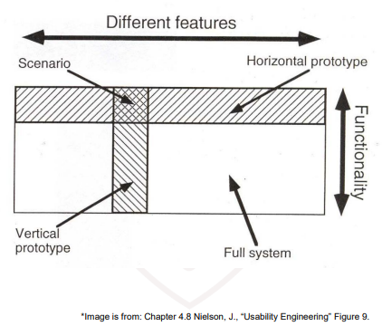

##### What to prototype? – User Interface

- Horizontal
  - For visualizing and validating requirements
- Concept exploration
  - Key user flows  $\Rightarrow$  storyboard with “frames” and “scenes”
- Static
  - Screenshots
  - Wireframes
  - PowerPoint
- Mostly Throwaway type
- Example graphical UI prototyping tools
  - Figma
  - Sketch
  - Balsamiq Mockups
  - Proto.io
  - UXPin
  - Framer
  - Axure RP

##### What to prototype? – Functionality

- “Executable or working” prototypes
- Vertical prototyping
  - Implementing a complete use cases and/or state machines
  - “Let’s spend \$30K and 2 weeks prototyping the integration of A and B”
- May evolve to the whole system
- May be quick and dirty
- Make complex algorithm/concept clear

#### What Is “Testing?”

#### Testing Terminology

- Application Under Test (AUT)  
Software that is being tested
- Test input
  - Data provided to AUT
- Expected output
  - What we expect to see
- Test case
  - Test input + expected output
- Test suite
  - A collection of test cases

- Failure
  - Observable incorrect behavior of a program
- Fault (bug)
  - Related to the code
  - Necessary (but not sufficient) condition for the occurrence of a failure
- Error
  - Cause of a fault
  - Usually a human error

#### Terminology: Verification vs Validation

- **Verification:** “Are we building the product right?”
  - Demonstrating correctness, completeness, and consistency of the software artifacts
  - To what degree the implementation is consistent with its (formal or semi-formal) specification

- **Validation:** “Are we building the right product?”
  - To what degree the software fulfills its (informal) requirements
  - The software should do what the user really requires

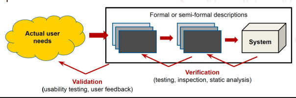

#### Scope of Testing

- **Exhaustive testing**
    - Exhaustive (aka brute-force) testing involves testing all possible combinations of inputs, conditions, or paths in the application
  - Maximum coverage, high confidence, systematic
  - High cost, resource intensive
- **Random testing**
    - Random testing involves selecting inputs or test scenarios according to some random distribution rather than systematically covering cases
  - Simple and easy, broad and unbiased coverage, scalable
  - No guaranteed coverage, hard to cover rare bugs, potentially redundant

Both are often impractical!

#### A Good Test Case

- One that prioritizes high-risk and high-impact areas
  - One that has a probability of finding an undiscovered fault
  - One that uncovers faults without having to examine the whole source code
  - Should be “best of breed” ← best representative of its kind
  - Should be reusable
  - Should fit the project constraints (*e.g.*, time, budget, resources, etc.)
  
  
  
- The test cases should cover both functional and non-functional requirements
  - The test cases should span the entire software development lifecycle

### Testing Methods

- The **black box** testing
  - Test to specification
  - Is based on a specification of the software (e.g., a functional spec)
  - Data-driven testing
  - Code is ignored
    - Only use specification document to develop test cases

- The **white box** testing
  - Test to code
  - Is based on the code; more precisely on coverage of the control or data flow
  - Logic-driven testing
  - Specification is ignored
    - Only examine the code.

There are also methods like peer review, inspection, and walkthrough, but will not be discussed today

#### Black Box Testing

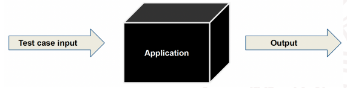

- Generate a test case **based on a specification** of the software
- Code is ignored: only use specification document to develop test cases
- In the presence of formal specifications, it can be automated
- Techniques:
  - Equivalence partitioning
  - Boundary conditions

##### Black Box Testing: Equivalence Partitioning (1/2)

- Idea: Divide the input data of a software unit into partitions of equivalent data from which test cases can be derived
- Ideal case: all test cases in a group have the same outcome

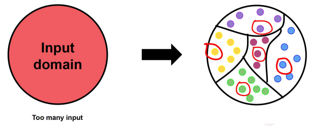

##### Black Box Testing: Equivalence Partitioning (2/2)

- Scenario: One of the fields on a form contains a textbox which accepts numeric values in the range of 18 to 25
  - One number below the range, within the range, and over the range
  - Null
  - String

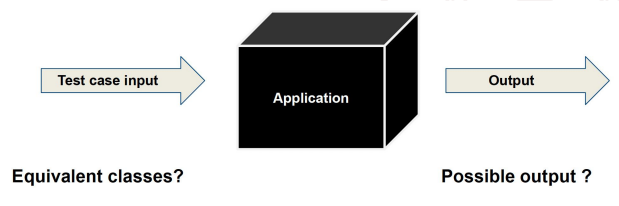

##### Black Box Testing: Boundary Conditions

- Idea: Error tends to occur **at the boundaries of the partition class**  $\Rightarrow$  select test cases that exercise such data boundaries
- A technique that refines equivalence partitioning

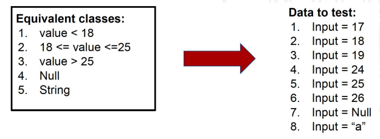

#### White Box Testing

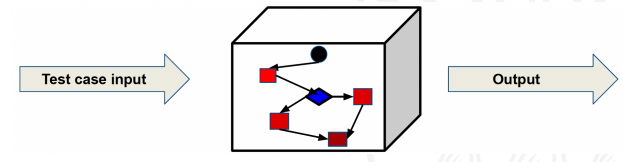

- Selection of test suite is based on some elements in the code
- Testing based on control-flow and data-flow criteria
- Helps to identify design weakness in the code
- Example of white-box testing criteria:
  - Control flow (statement, branch, loop)
  - Condition (basic, multiple)

##### White Box Testing: Statement Coverage

- Req: All statements in the programs should be executed at least once

- Q1: What test case give you 100% statement coverage?
  - (X = 3)
- Q2: Does having 100% statement coverage == no fault?

##### White Box Testing: Branch Coverage

- Req: Each one of the possible branch from each decision point is executed at least once

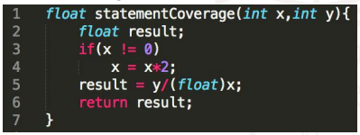

- Q1: What test case(s) give you 100% branch coverage?
  - {(x=2,y=3), (x=2,y=-3)}
- Q2: Does having 100% branch coverage == no fault?

##### White Box Testing: Basic Condition Coverage

- Req: Each boolean term that appears in a basic condition takes the value TRUE and the value FALSE at least once

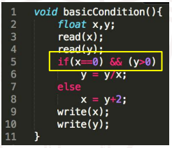

- These 2 test cases satisfy Req above:
  - $(x = 0, y = -2) \rightarrow$  expr: x term = true, y term= false
  - $(x = 2, y = 3) \rightarrow$  expr: x term = false, y term = true
- Q1: Does having 100% basic condition coverage == no fault?

##### White Box Testing: Branch & Basic Condition Coverage

- Req: Branch and truth values assumed by basic condition, *i.e.*, each basic condition takes the value either TRUE or FALSE at least once, and the outcome should be either TRUE or FALSE (to cover branch)

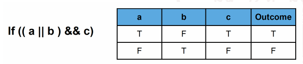

- Although we can achieve coverage for both Branch and Basic Condition, some conditions are being masked
- In this case, condition **a** and **b** do not matter unless they are both F

### Wrapping Up: Testing (1/2)

- Q: When do we stop testing?
  - A: Until some aspects of the program is covered according to the considered criterion
- Q: What about test selection criteria?
  - A: We certainly want a criterion that gives test suites that improve confidence
  - Use both types of the criteria as they are complementary
    - Black-box testing → based on specification
    - White-box testing → based on the code
- Q: How to generate test cases?
  - A: Look at the test requirement of the selected criterion and derive your test cases based on it

#### Wrapping Up: Testing (2/2)

- Q: How to check an output of a test?
  - A: Compare it with the expected output or the correct result given by the oracle, so we can indicate that the test is passed or failed
- Q: Thoroughness of testing?
  - A: Can be measured in terms of the percentage of “coverable” items (as defined by the criteria) that are covered by the test suite
  - Examples
    - Execution of statements
    - Execution of paths
    - All customer requirements

#### Testing Levels

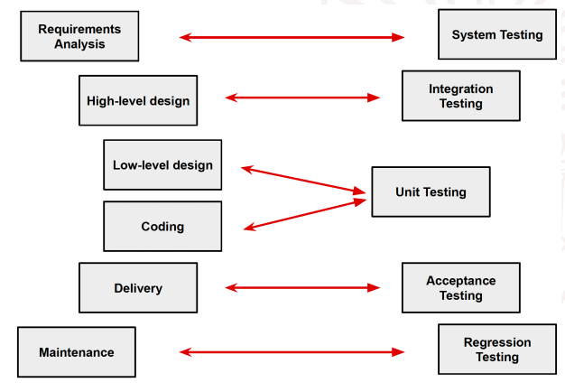

#### Unit Testing

- The most “micro” scale of testing
- Test done on **particular functions** or **code module**
- Utilizes white-box (and/or black-box) testing method
- Isolates the module that we want to test, so we know that the errors occur in the module we are testing
- Done by developers (not by testers) since it requires knowledge of the internal program design and code
- Test cases should be able to check the data flow in the function (*i.e.*, all branch, all conditions, etc.)
- Also should include boundary cases (aka rainy day scenario, corner cases, off-nominal cases)

##### Integration Testing

- Testing of **combined parts** of an application to determine their functional correctness
- Occurs after Unit Testing
- Utilizes black-box testing method

#### System Testing

- Idea/Goal: Ensure that the system functions **together with all the components** of its environment **as a total system**
- Utilizes black-box testing method
- Ensures that the system releases can be deployed in the current environment
- Test both functional and non-functional requirements (load testing, stress testing, performance testing, etc.)

##### Acceptance Testing

- Idea/Goal: To verify that the system **meets the user requirements**
- Done after system testing
- Performed by the end user or client
- Involves a lot of manual testing (but can also be automated)
  - Use cases and use case scenarios are useful here
  - Testers use the software on different scenarios and record the results
- Two levels of testing:
  - Alpha Testing
    - Testing team verifies the application in the presence of end users within the organizational environment
  - Beta Testing
    - Done by the end user in the real environment (released to limited number of end-users)

##### Regression Testing

- Regression Testing is **re-running** functional and non-functional tests to ensure that previously developed and tested software **still performs as expected after a change**
- Problem addressed: When a change is made to the program, what is the best way to test it?
  - Crucial during maintenance phase
  - Can be automated, but you should keep all the test cases from the get-go
  - Helps to figure out if a change made to the program introduced any faults

### Verifying Software Quality (Quality of Service, or QoS)

- **Functional Requirements** (easy)
  - Something that the system must do
  - “What” the system does
  - Things that can be captured in use cases
  - Can be traced to one or more modules
    - For example:
      - As a user, I should be able to “see a list of products” on the site
      - As a user, I should be able to “upload a file larger than 2 MB”
- **Non-Func Requirements** (difficult)
  - “How well” aspects of the system
  - Not describe “what” the system will do, but “how well” will the system do it
  - The system can still work if cannot satisfy the non-functional requirement.
  - Difficult to trace; “related to” and “impact” the system as a whole
  - Other names
    - “Quality of Service (**QoS**)”
    - “Level of Service”
    - “Software Quality”

##### Example Qualities of Service

- Security
  - Usability
  - Testability
  - Compliance
  - Reliability
  - Extensibilities
  - Privacy
  - Portability
  - ...
- **Note:** To make it easier to test, QoS requirements often have a measurable metric(s) attached
  - For example:
    - The system shall have **less than one hour** down time a week
    - The system shall support **more than 5000 concurrent** sessions

#### How to Write Better QoS Requirements

- Recall: QoS requirements often have a measurable metric attached to them
- Make your QoS requirements **S.M.A.R.T.**
  - **Specific:** Consistent, concise, and precise
  - **Measurable**
  - **Attainable:** Achievable (up time 24/7, 365 days a year, etc.)
  - **Realizable:** 95% uptime (ask, e.g., “does the budget allow this QoS?”)
  - **Traceable:** Need to understand why we need this

##### Specific

- “The mission planning system shall support several planning environments for generating the mission plan”
  - *What are the planning environments?*
- “The application should render correctly on mobile platforms”
  - *Which mobile platforms?*
- “The website should have an average response time of one on major web browsers”
  - *What is the measurement of “one?”*
- Think:
  - Are these requirement specific enough?
  - What are the problems?

##### Measurable

- “The checkout system should be optimized for the incoming load”
  - What kind of optimization are we looking for?
  - What is the volume of the “load?”
- Think:
  - Can the requirement be verified that it is implemented?
  - Can it be broken down into a smaller and better way to measure?
    - If yes, do it

##### Attainable

- Whether it is possible for the system to exhibit that requirements
  - “The system shall be 100% reliable and 100% available”
  - “The system shall have a minimum response to a query of one second irrespective of system load”
- Must be very expensive to meet these requirements or will never be accepted
- Think:
  - Is there a theoretical solution to the problem? Done before?
  - Any feasibility study? Any physical constraints?

##### Realizable

- Achievable given what is known about the constraints
- “98% reliability, 4 second response time”
  - But limited budget, short schedule?
- Think:
  - Do you have sufficient resources, time, and/or budget?
  - Can you afford to manage them?
  - If constraints aren't known, use status, e.g., add “desirable” at the beginning
    - After prototyping and you have evidence, then update the status

##### Traceable

- Traceable to and/or from concepts, specs, designs, implementations, test cases
- Need to know why we need this requirements in the first place (*i.e.*, business justification)

#### ISO:IEC 25010 - Software Product Quality

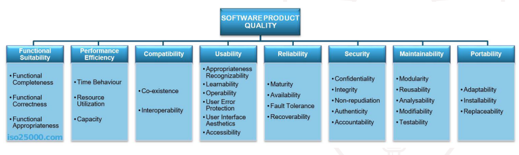

### Prototyping and Testing: Final Thoughts

- **Prototyping**
  - Purpose: Risk reduction, feedback, informed decisions
  - Types: Throwaway, evolutionary, incremental
  - Dimensions: Horizontal (UI), vertical (functionality)
- **Testing**
  - Goals: Correctness, performance, reliability
  - Key Concepts: Verification ("building the product right") vs. Validation ("building the right product")
  - Methods: Black box (based on specification) and white box (based on code)
- **Testing Levels**
  - Unit, Integration, System, Acceptance, Regression
- **Software Quality (QoS) Testing**
  - Functional ("what") vs. Non-Functional ("how well") requirements
  - SMART QoS: Specific, Measurable, Attainable, Realizable, Traceable

## Lecture Part IV

DevOps

## DevOps – Bridging Development and Operations

- Definition:
  - “DevOps is a **set of practices** intended to reduce the time between committing a change to a system and the change being placed into normal production, while ensuring high quality.” \*
- DevOps combines development (Dev) and operations (Ops) \*\*
  - To increase
    - Efficiency,
    - Speed, and
    - Security of software development and delivery

### DevOps: Outline

- Continuous Delivery Pipeline (in case of Agile)
  - Continuous Exploration
  - Continuous Integration
  - Continuous Deployment
  - Release on Demand
- While DevOps aligns well with the Agile principles, any software development processes can adopt DevOps practices

#### Why DevOps?

- Align stakeholders' goals and directions
  - Business, operations, development, security, architecture, compliance, ...
- Benefits
  - Faster lead time
  - Fewer defects
  - Faster recovery
  - More frequent deployments

#### Continuous Delivery Pipeline (CDP)

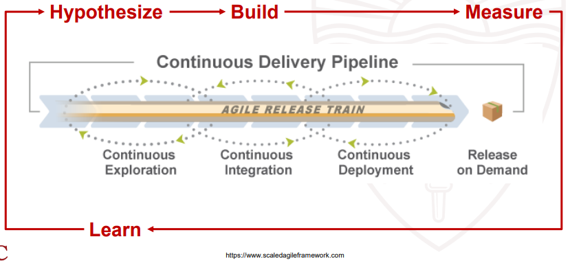

#### Continuous Exploration

- Hypothesize
- Collaborate & Research
- Architect
- Synthesize

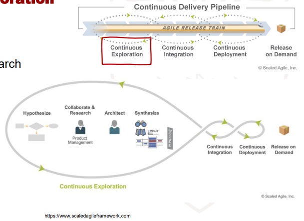

##### Continuous Exploration (1/4)

- Hypothesize
  - Coming up with new hypotheses
    - Build-Measure-Learn
    - Define
      - Minimal Marketable Features (MMFs)
      - Minimum Viable Products (MVPs)
- Maintain accountability
- Planning and prioritizing

#### Continuous Exploration (2/4)

- Collaborate & Research
  - Market research
  - Customer visits
  - Use personas — fictional, yet evidence-based representations of typical users
    - “Agents?”

#### Continuous Exploration (3/4)

- Architect
  - The architecture needs to be **designed for continuous delivery train**
  - Architect for testability
    - For example, Microservices & containerization, serverless architecture
    - Loose coupling, API-driven architecture
  - Separate deploy and release
    - Hide all new functionality under feature toggles (aka “kill switches”)
  - Decouple release elements
    - Different parts of the solution require different release strategies
  - Architect for operations
    - Build telemetry (automatic collection of monitoring data)
  - Dashboard / logging
    - Build for fast recovery

#### Continuous Exploration (4/4)

- Synthesize
  - Come up with features
    - Include acceptance criteria and address “-ilities,”
  - Behavior-Driven Development (BDD)
    - Using “Given-when-then” syntax
    - Acceptance criteria that is executable
  - Economic prioritization
  - Release planning

#### Continuous Integration

- Develop the solution
- Build continuously
- Test end-to-end
- Validate on a staging environment

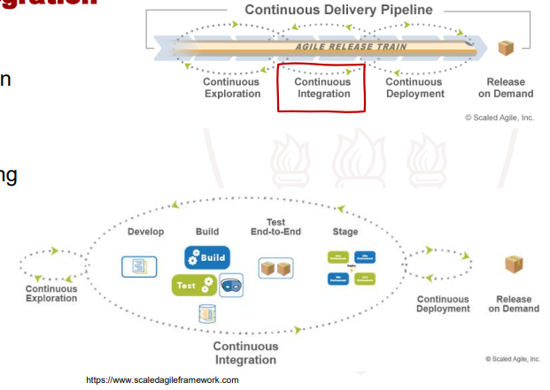

#### Continuous Integration (1/4)

- Develop the solution
  - Feature decomposition
  - Test-Driven Dev (TDD) / Behavior-Driven Dev (BDD)
  - Version control (e.g., Git, Mercurial, etc.)
  - Application telemetry
    - Logging, monitoring, system health metrics

#### Continuous Integration (2/4)

- Build continuously
  - Continuous code integration
  - Build and test automation
    - Build often, preferably on every commit
    - Run unit test, code analysis as part of the Build
    - Broken build are the highest priority
  - Avoid long-lived multiple open branches, team should merge back as quickly as they can; work off a single trunk

#### Continuous Integration (3/4)

- Test end-to-end
  - Test and production environment synchronized
    - Maintain all configuration changes under version control
    - Invest in high fidelity for more accurate testing
  - Test automation
  - Test data management
    - Emulate production data for realistic tests
  - Service virtualization
    - Simulate a product environment
    - Maintain environment data in source control
  - -ilities
    - Security, reliability, scalability, etc.

#### Continuous Integration (4/4)

- Validate on staging
  - Maintain a staging environment
    - Match the production environment; deploy every Sprint
  - Blue/Green deployment
    - Two identical production environments: One live, one idle
    - Deploy to the idle one; after thoroughly tested and stable, then divert the traffic
  - System demo from staging environment

#### Enabling a Culture of Continuous Integration

- **Integrate often**
- Make integration results **visible**
- Fixing failed integrations is a top priority
- Establish common cadence
- Develop and maintain proper infrastructure
- Apply supportive software engineering practices

#### Continuous Deployment

- Deploy to production
- Verify the solution
- Monitor
- Respond and recover

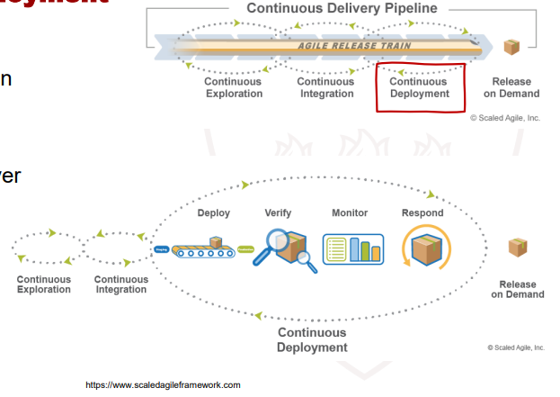

#### Continuous Deployment (1/4)

- Deploy to production
  - Dark Launches
    - To release production-ready features to a subset of users or subset of production environment prior to a full release
    - To deliver function with limited access
    - To decouple deployment from release, to get real user feedback, to assess infrastructure performance
  - Feature Toggles
    - To show function based on context
    - To enable/disable a feature during run time
    - To enable rapid rollback of problem features
    - Be careful of toggle overload and testing complexity
  - Blue/Green Deployment: (near) zero downtown release
  - Selective Deployment
    - Ability to deploy to specific production environments based on criteria such as geography, user role

#### Continuous Deployment (2/4)

- Verify the solution
  - Production Testing (Testing in Production; “TiP”)
  - Test solutions in production when they are still in “dark”

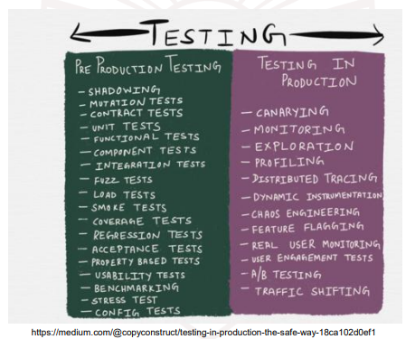

#### Continuous Deployment (3/4)

- Monitor
  - Full-stack telemetry
  - Visual displays
  - Federated monitoring
    - consolidated monitoring across applications in the solution that creates a holistic view of problems and performance

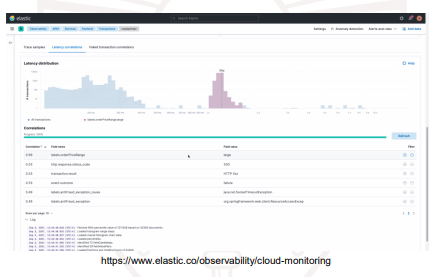

#### Continuous Deployment (4/4)

- Respond and recover
  - Proactive detection: automated analyses to identify failures proactively
  - Cross-team collaboration
  - Session replay: replay a scenario where a failure occurred
  - Rollback and fix forward
  - Version control: revert back to an old version quickly

#### Release on Demand

- Release
- Stabilize the solution
- Measure the business value
- Learn and react

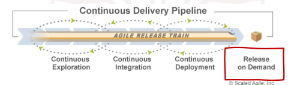

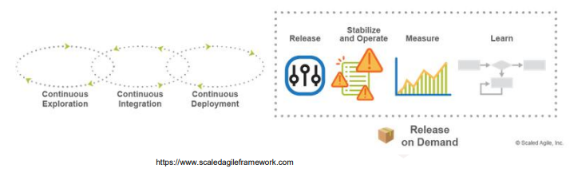

##### Release on Demand (1/4)

- Release
  - Feature toggles
  - Decouple release elements
  - Dark launches
  - Canary release
    - Gradually rolling out the change to a small subgroup of users, before rolling it out to the entire platform/infrastructure and making it available to everybody
    - Add or remove user segments based on business decisions
    - Similar to phased rollout, incremental rollout
    - Can be used to perform A/B Testing

#### Release on Demand (2/4)

- Stabilize the solution
  - Site Reliability Engineering
    - Shared ownership of the system stability between Dev and Ops
    - Manage Service Level Indicators and Service Level Objectives
  - Failover/disaster recovery
    - Failover: ensure to resume quickly to avoid service interruption
    - Disaster recovery: planned and architected into the service and practiced
  - Continuous security monitoring
    - *E.g., intrusion / attack detection, security as code, penetration testing*
  - Architect for operations
  - Monitor –ilities

#### Release on Demand (3/4)

- Measure the business value
  - Application telemetry
    - Track and measure data usage against the hypothesis
  - Evaluate hypotheses
    - Measure leading and lagging indicators
  - Use several metrics to measure end-state working solutions
  - Evaluate the MVPs

##### Release on Demand (4/4)

- Learn and react
  - Assess the MVPs, decide to continue or stop
  - Form new MVPs
  - Relentless Improvement
    - Team-level retrospectives
    - Program and solution-level inspection and adaptation
  - Ensure visibility so the team can identify bottlenecks and problem areas

### DevOps: Summary

- Definition
  - A set of practices to reduce the time between code change and production release while ensuring high quality.
- Goals
  - Increase efficiency, speed, and security of software development and delivery. Align stakeholders.
- Benefits
  - Faster lead time, fewer defects, faster recovery, more frequent deployments.
- Continuous Delivery Pipeline:
  - Continuous Exploration
  - Continuous Integration
  - Continuous Deployment
  - Release on Demand
- Key Practices:
  - Continuous Testing
  - TDD (Test Driven Development)
  - BDD (Behavior Driven Development)
  - Production Testing

# **USC CSCI-577a Software Engineering**

Week 8: Theory III / Mar 2, 2025

### In the Last Episode of CSCI-577a ...Lecture

- Part I
  - Analysis and Planning
    - Risk analysis
    - Cost estimation
    - Technical debt
- Part II
  - Software architecture: the basics
    - Software architecture
    - Architectural models
    - Architectural styles & patterns
    - Architecture analysis
    - Architecture implementation
- Part III
  - Prototyping and Testing
    - Prototyping
      - Purpose, types, dimensions
    - Testing
      - Goals and key concepts
      - Methods
      - Levels
      - Techniques
      - Non-functional requirements
- Part IV
  - DevOps
    - Goals and benefits
    - CI/CD pipeline
      - Continuous exploration, integration, deployment, and release

### In the Today's Episode of CSCI-577a ...Lecture

- **Software maintenance**
  - Nature of software maintenance
  - Success factors in maintenance
- **Software engineering best practices**
  - The triple constraint
  - Best practices for software development teams
- **Common mistakes in SE**
- **“Laws” of software engineering**
  - Lessons from the past; old & new
- **Software engineering ethics**
  - Definition and context
  - Principles and examples
  - Ethics challenges for your future careers
- **Future of software engineering**
  - Motivation and Context
  - A 20th and 21st Century Views
  - Going forward in the AI era

## **Software Maintenance**

### Software Maintenance: Outline

- Software maintenance definition and context
- Nature of software maintenance
- Critical success factors in software maintenance
- Software Maintenance in the AI Era

### Software Maintenance: Definition

**3.1.12 software maintenance:** Modification of a software product after delivery to correct faults, to improve performance or other attributes, or to adapt the product to a modified environment.

- IEEE standard [IEEE 1219-1998:s3.1.12]: “Modification of a software product **after delivery** to **correct faults**, to **improve performance** or other attributes, or to **adapt** the product to a modified environment.”
- Newer standard—ISO/IEC/IEEE 14764:2022: “**totality of activities required to provide support to a software system**”
- Develop; deliver; **maintain**
- Not easy to cleanly separate the maintenance effort from other activities
- Distinctions blurred with evolutionary and incremental development
  - Develop I1
  - Develop I2; maintain I1; plan I3
  - Develop I3; maintain I1+I2; plan I4
  - ...

#### Importance of Software Maintenance

- Systems are tightly coupled with their environment
  - Environment changes **require changing its software systems**
- Technologies and requirements are continuously changing
  - Software systems must be maintained to reserve their values
- Maintenance is important in market competition
  - New software has advantage over the existing one
    - Software system must be upgraded to keep its market share
  - Economic benefits have backed software maintenance and reuse [Boehm 1981, 1999]

#### Nature of Maintenance

- These are what happen as “maintenance”
  - Software product is **sustained** throughout its operational life cycle
  - **Modification requests are logged and tracked**
  - **The Impact** of the proposed changed is **determined**
  - Code and artifacts are **modified**
  - **Testing** is conducted
  - New version of software product is **released**
  - Need **training** and daily support

#### The Iron Law of Software Maintenance

- Useful software systems will spend twice as much on software maintenance as they did for development
- For CS 577a projects, if they were actually maintained over its lifecycle:
  - `Development = (12 weeks) (10 hr/week) (10 persons) = 1,200 person-hour`
  - `Maintenance = (2) (1,200 PH) ($150/PH) = $360,000`

Potential maintenance cost

#### Magnitude of Software Maintenance

- Majority of software costs incur after the first operational release [Boehm 1981]

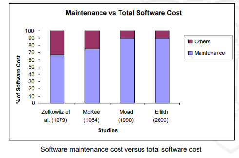

#### Life Cycle Cost Ratios (% of Operation & Maintenance)

- Hardware [Redman 2008]
  - 12% – Missiles (average)
  - 60% – Ships (average)
  - 78% – Aircraft (F-16; fighter jet)
  - 84% – Ground vehicles (Bradley Fighting Vehicle; armored infantry transport)
- Software [Koskinen 2010]
  - 75-90% – Business, Command-Control
  - 50-80% – Complex platforms as above
  - 10-30% – Simple embedded software

#### Lehman-Belady “Laws” of Software Evolution

- Continuing change
  - Unless continually changed, the software becomes less useful
- Increasing complexity
  - Unless maintained, the complexity continues to increase
- Cyclic self-regulation
  - *E.g.*, as software evolves, developers naturally aim to keep complexity and manageability in balance
- Invariant work rate
  - The average global rate of work activity does not change over the system's lifecycle
- Conservation of familiarity
  - Stakeholders must maintain system familiarity; excessive growth hampers the familiarity
- Continuing growth
  - Functionality must continue to grow to keep satisfying users
- Declining quality
  - Unless rigorously maintained, the quality declines over time
- Feedback system
  - The evolution process must have a feedback system for iteration

### Effects of COTS on Software Maintenance

- **COTS products**: commercial off-the-shelf products (e.g., 3rd party libraries, SaaS, ...)
- You have **no control** over COTS evolution
- Maintenance headaches scale exponentially with number of COTS
- You need a proactive COTS-based-system evolution strategy
  - Go for dominant **open standards**
  - Factor evolution requirements into COTS selection
  - Evaluate COTS vendors' evolution track records
  - Use flexible architectures
    - Microservices, REST, software bus, layering, event/message-based
    - Encapsulation: use COTS wrappers
  - Technology watch investments
  - Synchronized COTS upgrade/release strategy

### Common Mistakes in Software Maintenance

| Worst Practices                                                                                                       | Effect on Productivity |
|-----------------------------------------------------------------------------------------------------------------------|------------------------|
| Not identifying and cleaning up error-prone code – the 20% of code that contains 80% of bugs                          | -50%                   |
| Code with embedded data and hard-coded variables – which contributes to “mass update” problems when this data changes | -45%                   |
| Staffing maintenance teams with inexperienced people                                                                  | -40%                   |
| High complexity code that is hard to understand and change (often the same code that is error-prone)                  | -30%                   |
| Lack of good tools for source code navigation and test coverage                                                       | -28%                   |
| Inefficient or nonexistent change control methods                                                                     | -27%                   |

#### Example: Challenges in Maintaining a Website (Costly!)

- Broken external links
- 404 and broken internal links
- Browser compatibility – web browsers continue to change
- Technology shifts – desktops to smartphones to tablets
- Denial of Service attack
- Data privacy, data backup and recovery
- Speed: load, refresh, processing
- Crashed servers
- Downtime
- Responsive design
  - Different devices, different interaction (shortcut, pointer, pen)
  - Different devices, different usage scenario

### Software Maintenance Categories

|           | Correction | Enhancement |
|-----------|------------|-------------|
| Proactive | Preventive | Perfective  |
| Reactive  | Corrective | Adaptive    |

- **Preventive maintenance:** Modification of a software product after delivery to detect and correct latent faults in the software product before they become effective faults
- **Corrective maintenance:** Reactive modification of a software product performed after delivery to correct discovered problems
- **Perfective maintenance:** Modification of a software product after delivery to improve performance or maintainability
- **Adaptive maintenance:** Modification of a software product performed after delivery to keep a software product usable in a changed or changing environment

#### Designing Maintainable Products

- Modularize around sources of change
- Risk-manage choices of COTS products and cloud services
  - Fewer is generally better
  - Compatible, stable, well supported, refreshed
- Deliver maintenance & diagnostic software
  - Debug aids, test tools and cases, CM support
  - Version control: having many versions to maintain is costly
- Follow good code and document standards

#### DevOps for Agile

- Continuous delivery to Production environment
- Continuous feedback from Ops
- Continuous monitoring
  - Logging, threat modeling, vulnerabilities
- In order to do above, you need to maintain:
  - Test scripts
  - Synchronization between different environments
  - Selective deployments – maintain configuration management

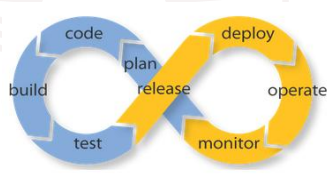

#### Continuous Monitoring

- Goals
  - **Enhance transparency** and visibility of operations
  - Help monitor software operation, especially performance issues
  - Help track user behavior
- Main targets
  - Server status and health
  - Application performance log
  - System vulnerabilities
  - Development milestones
  - User activity/behavior

#### Continuous Monitoring – What to Monitor

- Three main types
  - Infrastructure: data centers, networks, hardware, servers
  - Application: uptime, transaction time, API responses
  - Network: firewalls, routers switches, servers, VMs
- Other types
  - Configuration: environment-specific config
  - Middleware: message services, queue services
  - Third-party: services availability, response time
  - Security: Vulnerability, event monitoring

### Software Maintenance in the AI Era

- AI is transforming maintenance, but not replacing the need for it
  - AI boosts throughput (+7.5% to +21.8% PRs/week in field trials)
  - **Code churn (revisions in 2 wks) is projected to 2x;** shows maintenance burden
  - AI adoption has shown a **negative relationship with delivery stability**
  - Acceleration without robust testing and feedback loops creates instability
- AI-generated code often violates the **DRY** principle and **lacks architectural awareness**, creating long-term maintainability challenges
- What students can do to adapt
  - Treat AI output as a draft, not final code; always review for architectural fit and coding standards
  - Invest in automated testing (unit/integration/E2E) and CI/CD pipelines to catch regressions early
  - Practice reading unfamiliar code; AI adds code that you did not write but you will need to maintain

## **Software Engineering Best Practices**

### Software Engineering Best Practices: Outline

- The triple constraint of project management
- Best practices for software development teams (from RUP)

#### The Triple Constraint of Project Management

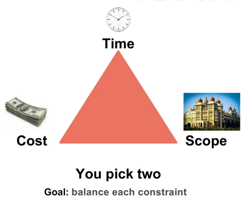

#### What If We Are Bound to Time?

- What if the **duration (time)** of the project decreases? How would we adjust?
- A project can be completed faster by:
  - Increasing budget (cost), resources
  - Reducing scope

#### What If We Are Bound to Cost?

- What if the **budget (cost)** of the project decreases? How would we adjust?
- A project's budget can be reduced by:
  - Reducing scope
  - Increasing time (due to fewer people/less resources)

#### What If We Need to Increase Scope?

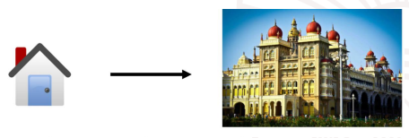

- What if we want to **increase the scope** of the project? How would we adjust?
- Increase budget or increase time

#### Best Practices for Software Development Teams

- Rational Unified Process: Best Practices for Software Development Teams
  - Proven approaches to software development
  - “Best Practices” – not so much because you can precisely quantify their value, but rather, because they are **observed to be commonly used in industry by successful organizations**
    1. Develop software iteratively
    2. Manage requirements
    3. Use component-based architectures
    4. Visually model software
    5. Verify software quality
    6. Control changes to software

#### Best Practices 1: Develop Software Iteratively

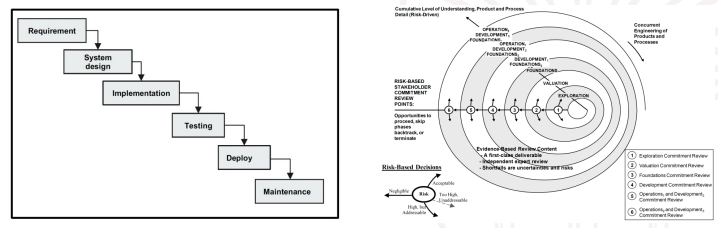

- Waterfall model: too much focus on front load elaboration
  - Inflexibility to change, especially when requirements evolve (they often do)

#### Best Practices 2: Manage Requirements

- The active management of requirements requires:
  - Eliciting, organizing, and documenting the system's functional and nonfunctional requirements, as well as constraints
    - System's **true requirements** – ones that weigh heavily on the system's economic and technical goals (aka **minimum marketable features**)
  - Evaluating changes to requirements and assessing the changes' impacts
  - Tracking and documenting trade-offs and decisions

#### Best Practices 3: Use Component-Based Architectures

- Early development and baselining of a robust executable architecture, prior to committing resources for full-scale development
- **Design a resilient arch** that is:
  - flexible,
  - accommodates change,
  - is intuitively understandable, and
  - promotes more effective software reuse
- **Components** are
  - Non-trivial modules, subsystems that fulfill a clear function
  - Elements that encapsulate processing and data in a system's architecture
- Component-based design
  - A systematic approach to defining an architecture using new and existing components
  - Components are assembled in a well-defined architecture, either ad hoc, or in a component infrastructure

#### Best Practices 4: Visually Model Software

- Allows you to hide the details and represent design decisions using “graphical building blocks”
- **Visual abstractions help you:**
  - Communicate different aspects of your software
  - See how the elements of the system fit together
  - Make sure that the building blocks are consistent with your code
  - Maintain consistency between a design and its implementation
  - Promote unambiguous communication
- Use de facto modeling notations, *e.g.*, Unified Modeling Language (UML)

#### Best Practices 5: Verify Software Quality

- Poor application performance and poor reliability are common factors which dramatically **inhibit the acceptability** of today's software applications
- **Quality should be reviewed** with respect to the requirements based on reliability, functionality, application performance and system performance
- Quality assessment should be **built into the process**, in all activities, involving all participants, using objective measurements and criteria,
  - Should not be treated as an afterthought or a separate activity performed by a separate group
- Verification and testing – refer to the Week 09 (Mar 10) lecture

#### Best Practices 6: Control Changes to Software

- Control changes – **making certain that each change is acceptable**
- Establish **secure workspaces for each developer** by providing isolation from changes made in other workspaces and by controlling changes of all software artifacts (e.g., models, code, documents, etc.)
- Challenge: coping with multiple developers organized into different teams, possibly at different sites, working together on multiple iterations, releases, products, and platforms
  - Establish a set of rules that the team should do
    - Without a disciplined control, the development process rapidly degenerates into chaos
  - Assess and actively manage the impact of changes (and risks)
    - Discover early = less problems down the road
  - Maintain traceability among artifacts
  - Automation w/ tools > CI/CD pipeline in DevOps – refer to the Week 09 (Mar 10) lecture

#### SE Best Practices: AI Reshapes the Triple Constraint

- AI compresses time and cost but introduces new quality risks
  - AI assistant access **increased weekly PR throughput by 26%**
  - Devs using AI wrote **less secure code** even after iterating; **overestimated their code's security**
  - 75%+ of devs use AI daily; >1/3 report productivity gains; **39% report little to no trust** in AI code
- (Not-so-new) best practice: verification-first engineering
  - The test suite becomes your specification and your safety net
  - Peer review is non-negotiable for both human- & AI-written code: Inspections catch most defects
- What students can do to adapt
  - Master test-driven and verification-first workflows
    - These practices become even more important when AI accelerates code production
  - Integrate static analysis into CI/CD pipelines to automatically catch AI-introduced defects

### Common Mistakes in Software Engineering

#### Classic Mistakes

- Mistakes about:
  - People
  - Process
  - Product
  - Technology
- **They fail software development projects**
- **Avoid making these mistakes to succeed your project**

##### Classic Mistakes: People

- Failure to take action to deal with a problem employee
- Adding people to a late project
- Not listening to user input
- Team members getting undermined motivation
- Lacking individual capabilities of the team members

##### Classic Mistakes: Process

- Wasting time on
  - Fuzzy early schedule, approval and budgeting, and aggressive schedule later
- Human tendency to underestimate and produce overly optimistic schedules
  - Poor time estimates
- Insufficient risk management
  - Lack of sponsorship, changes in stakeholder commitment, scope creep, and contractor failure
- Risks from outsourcing and offshoring
  - QA, interfaces, unstable requirements
  - Increased communication and coordination cost
- Not sharing knowledge with stakeholders
- Being unable to evaluate mistakes
  - Skipping Sprint reviews, retro, QA
  - Limited code review,
  - Not enough testing

##### Classic Mistakes: Product

- Requirements gold-plating
  - Unnecessary product size and/or characteristics
- Developer gold-plating
  - Developers trying out new and hot technology / features
- Feature creep
  - Continuous/uncontrolled expansion of features beyond the original scope
- Relying on temporary solutions
  - Quick fix, mounting technical debt, poor code quality
- Not considering coding standards, secure coding, cybersecurity threats
- Useless, outdated, or unrelated documentation
  - *E.g., /\* NO COMMENTS \*/*

##### Classic Mistakes: Technology

- Silver-bullet syndrome
  - Expect new technology to solve all problems
    - AI, LLM, vibe coding, etc.
- Not staying current with technology
- Overestimated savings from new tools or methods
  - Did not account for learning curve and unknown unknowns
  - “AI will make all engineers obsolete!”
- Switching tools in the middle of a project
  - Version upgrade
  - *E.g.*, operating system update on your MVP demo day

##### Findings from Retrospective Study – of 99 Projects

- Classic mistakes found:
  - Process (45%)
  - People (43%)
  - Product (8%)
  - Technology (4%)
- Top 3 found in ½ of the projects
  - Poor estimation and/or scheduling
  - Ineffective stakeholder management
  - Insufficient risk management

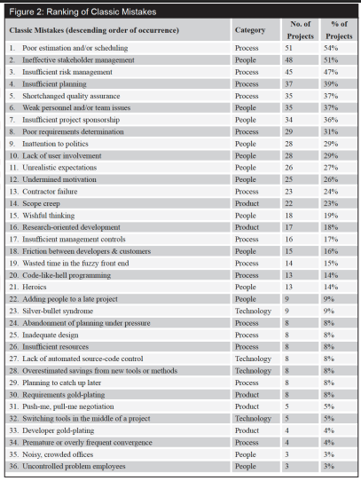

##### New Common Mistake: Blind Trust in AI

- AI introduces a new category of technology mistakes
  - Developers with AI **wrote less secure code** and exhibited **overconfidence in their solutions**
  - Copilot generated **vulnerable code** in ~40% of security-relevant scenarios
  - Large-scale GitHub analysis (7,703 files): 4,241 CWE instances across 77 vulnerability types
  - Devs report little to no trust in AI code; AI adoption negatively correlates with delivery stability
- What students can do to adapt
  - Never trust AI output without verification; apply the same rigor you would to a junior team member
  - Keep up with up-to-date security practices; AI cannot compensate for missing security knowledge
  - Develop strong code comprehension skills; AI explanations are often inaccurate/unclear
  - Use AI to generate test cases and threat models, not just production code

### **“Laws” of Software Engineering**

Learning from the past; old and new.

#### “Law” of Software Engineering (1/20)

- Daniel Bernoulli’s Principle
  - “Velocity is greatest where density is least.”
- Law of fluid dynamics that refers to the flow of viscous liquids
- In software engineering
  - Work of smaller teams proceeds faster than that of larger teams
  - It is true even more than before due to AI assist in SE

#### “Law” of Software Engineering (2/20)

- Barry Boehm’s Law
  - “Errors are more frequent during requirements and design activities and are more expensive the later they are removed.”

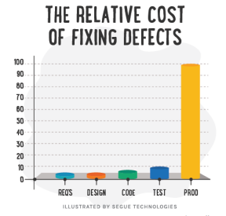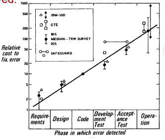

#### “Law” of Software Engineering (3/20)

- Fred Brooks's Law
  - “Adding people to a late software project makes it later.”
- Complexity of communication channels increases with application size and team size
- For small projects (e.g., with fewer than five team members), adding one more experienced person will not stretch the schedule, but adding a beginner-level team member will

#### “Law” of Software Engineering (4/20)

- Melvin Conway's Law
  - “Any piece of software reflects the organizational structure that produced it.”

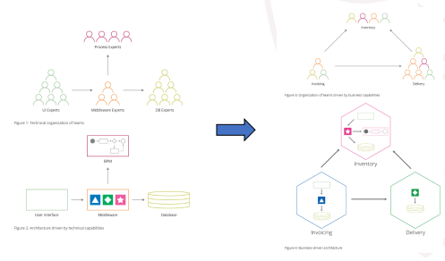

#### “Law” of Software Engineering (5/20)

- Phil Crosby's Law
  - “Quality is free.”
- It doesn't mean quality costs nothing
- For software, high quality is associated with shorter schedules and lower costs than similar projects with poor quality
- Cost you spend on getting it right (e.g., requirements analysis, design reviews, inspections, testing infrastructure) comes back to you many times over in rework you never have to do

#### “Law” of Software Engineering (6/20)

- Dan Galorath's Law
  - “Projects that get behind stay behind.”
- Deferring features is the most common solution
- Attempts to recover lost time (e.g., skipping inspections or truncating testing) will backfire and cause even more delays

#### “Law” of Software Engineering (7/20)

- Watts Humphrey's Law
  - “Users do not know what they want a software system to do until they see it working.”
- Models, mockups, simulations
- Incremental development will provide intermediate artifacts
- Somewhat similar quotes:
  - “If I had asked people what they wanted, they would have said faster horses.” – Henry Ford
  - “People don't know what they want until you show it to them.” – Steve Jobs

#### “Law” of Software Engineering (8/20)

- Caper Jones's Law
  - “Every form of defect removal activity has a characteristic efficiency level, or percentage of bugs actually detected.”
- Most forms of testing are about 35 percent efficient
  - In other words, they find one bug out of three
- Inspections are about 85 percent efficient for all defect sources
- Static analysis is about 55 percent efficient for code bugs

#### “Law” of Software Engineering (9/20)

- Goodhart's law
  - “When a measure becomes a target, it ceases to be a good measure.”
- A warning against relying too heavily on specific metrics as the basis for incentives or evaluation
  - Metrics are often a proxy for an actual goal or value
  - Optimizing for a metric itself is usually not a good idea
  - Optimize for the underlying goal or value
- If an org set a target weekly PR merge count, ...
  - The number will be “gamed” and not provide a useful meaning any more

#### “Law” of Software Engineering (10/20)

- Hofstadter's Law
  - "It always takes longer than you expect, even when you take into account Hofstadter's Law."
- Things rarely go as planned, so you're better off putting extra time in your estimates

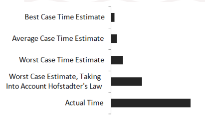

#### “Law” of Software Engineering (11/20)

- Donald Knuth's optimization principle
  - “Premature optimization is the root of all evil.”
- There is often only cost with no benefit
- Find sweet spot

#### “Law” of Software Engineering (12/20)

- Moore's Law
  - “The processing speed of computers will double every two years.”
- Some follow-ups
  - “The power of computers per unit cost doubles every 24 month.”
  - “The number of transistors on an integrated circuit will double in about 18 months.”
- “Software gets slower faster than hardware gets faster.” – Niklaus Wirth

#### “Law” of Software Engineering (13/20)

- Parkinson's Law
  - “Work expands to fill the time available for completion.”
- There's always time to make more changes until there is no more time to make changes
- Story point estimation
  - When overestimate, work will expand to fill the time
  - When underestimate, quality-inducing activities get squeezed to meet schedule

#### “Law” of Software Engineering (14/20)

- Pareto Principle
  - “More than 80 percent of software bugs will be found in less than 20 percent of software modules.”
- For large applications above 1,000 function points, 57% reported bugs were found in 32 modules out of a total of 425 modules in the application
- Often found that less than 5% of software modules contain more than 95 percent of software bugs

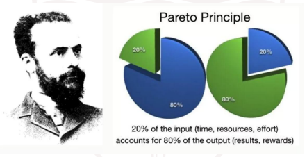

#### “Law” of Software Engineering (15/20)

- Ninety-ninety rule, Tom Cargill
  - “The first 90% of the code accounts for the first 90% of the development time. The remaining 10% of the code accounts for the other 90% of the development time.”

#### “Law” of Software Engineering (16/20)

- Facts and Fallacies of Software Engineering
  - “Modification of reused code is particularly error-prone. If more than 20 to 25 percent of a component is to be revised, it is more efficient and effective to rewrite it from scratch.”
- Challenges in comprehending the existing solution
- If it will be reused later, design for it to be reusable

#### “Law” of Software Engineering (17/20)

- Facts and Fallacies of Software Engineering
  - “Eighty percent of software work is intellectual. A fair amount of it is creative. Little of it is clerical.”
- Roughly 80% of developers time spent on thinking, 20% on jotting

#### “Law” of Software Engineering (18/20)

- Facts and Fallacies of Software Engineering
  - “Missing requirements are the hardest requirements errors to correct.”
- The “unknown unknown”
- The most persistent software errors: Those that escape the testing process and persist into the production version of the software
  - These are errors of omitted logic
  - Missing requirements result in omitted logic

#### “Law” of Software Engineering (19/20)

- Facts and Fallacies of Software Engineering
  - “Rigorous inspections can remove up to 90 percent of errors from a software product before the first test case is run.”
- Boehm and Basili claimed 60% defect removal by inspection
- Inspection can identify more than half of errors
- Inspection can't replace testing

#### “Law” of Software Engineering (20/20)

- Barry Boehm's Law
  - “Prototyping significantly reduces requirements and design errors, especially for user errors.”
- Create prototypes: They are usually only 10% of product size
- Focus on other reviews and QAs too
  - Inspections, static code analysis, etc.

#### Do the “Laws” Still Hold in the AI Era?

- Most SE laws are **amplified, not obsoleted**, by AI
- Brooks's Law
  - Adding AI does not bypass **communication complexity**; AI amplifies existing team dynamics rather than fixing dysfunction
- Goodhart's Law intensified
  - Using LOC, commits, or PR counts as productivity metrics is particularly more dangerous when **AI inflates all output metrics; organizations must measure outcomes**, not activity
- Lehman's Laws persist
  - AI-generated code still **increases system complexity** unless actively maintained; code duplication and architectural drift are observed consequences
- Boehm's Law still critical
  - Errors in AI-generated requirements/design are still **more expensive to fix later**; AI does not eliminate the cost-of-change curve
- Frederick Brooks's “No Silver Bullet” endures
  - AI addresses accidental complexity (faster coding) but **not essential complexity** (changeability, conformity, invisibility)
- What students can do to adapt
  - Use these timeless laws as a lens to evaluate AI hype; **be critical of claims that AI solves fundamental SE challenges**
  - Focus on system-level thinking and architectural design, where AI tools still fall short

## **Software Engineering Ethics**

### Software Engineering Ethics: Outline

- **Definitions and context**
  - **Power to do public harm or good**
  - **ACM/IEEE Software Engineering Code of Ethics**
- **Principles and examples**
  - Rawls' Theory of Justice
  - Relation to stakeholder win-win
  - CS 577a ethics situations
- **Ethics challenges for your future careers**
  - Global threats, nanosecond decisions
  - Coping with AI, Internet of Things, DevOps, Systems of Systems

#### Definition of “Ethics” – Webster Dictionary

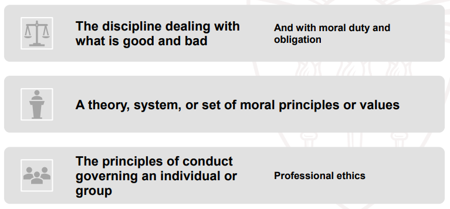

#### SE Ethics Context (1/2)

- SW engineers will have **vastly increasing power** to do public harm or good
  - System safety and security
  - Intellectual property
  - Privacy
  - Quality of work
  - Fairness
  - Liability
  - Risk disclosure
  - Conflict of interest
  - Unauthorized access
- SW engineers today can now wield AI as a force multiplier

#### SE Ethics Context (2/2)

- 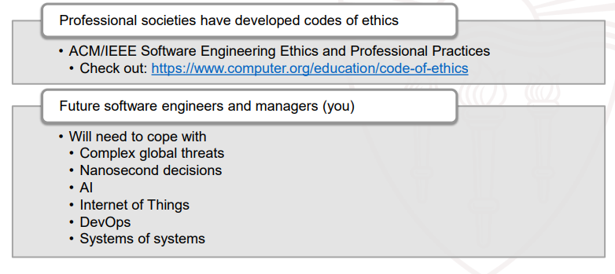

#### Power to Do Public Harm or Good – I

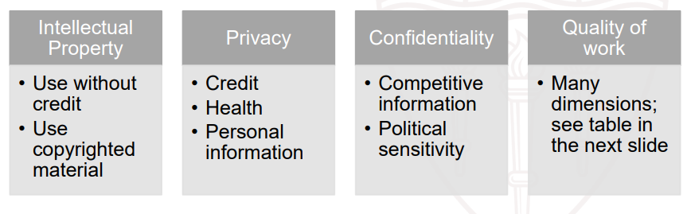

##### Quality Concerns Vary by Stakeholders' Role

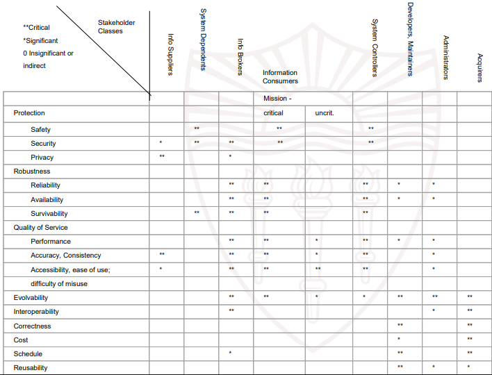

###### Example: Confidentiality

- Government agency hires company to support SW procurement
  - Provides data under nondisclosure agreement (NDA)
- Employee and company consultant prepare cost estimate
  - Employee: “I don’t see how anyone can do all this for \$8M”
- Consultant provides \$8M target cost to some bidders
- Government agency angry with company for leak
  - Whose fault? How could it be avoided?

#### Power to Do Public Harm or Good - II

- 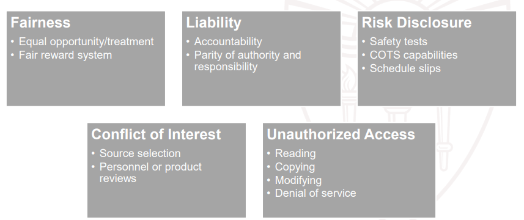

##### Examples: Fairness

- Enron software to schedule power outages, raise prices
  - *E.g.*, air conditioning for homes, offices, hospitals during heat waves
  - Suppose you had been asked to develop it?
- Urban fire dispatching system
  - Inefficient old system caused \$700M property loss
  - New-system spec. includes dispatching algorithm to minimize property loss
    - Any fairness issues?

##### Example: Safety Tests

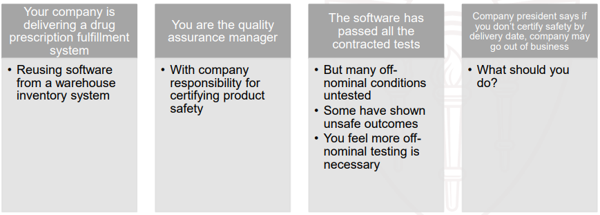

#### ACM/IEEE Software Engineering Code of Ethics - Table of Contents

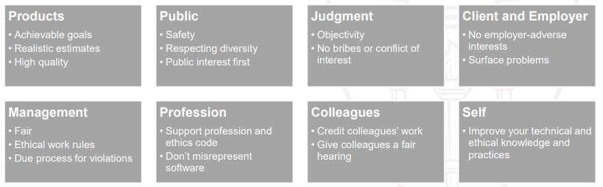

#### Code of Ethics 2. Public

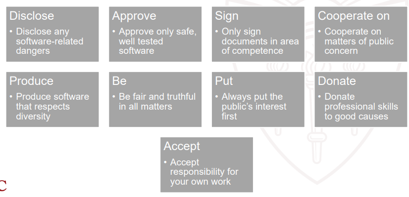

#### Code of Ethics 4. Client and Employer

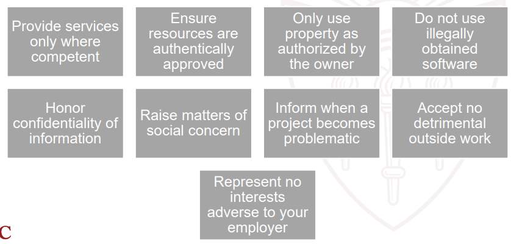

### Software Engineering Ethics: Outline

- Definitions and context
  - Power to do public harm or good
  - ACM/IEEE Software Engineering Code of Ethics
- **Principles and examples**
  - **Rawls' Theory of Justice**
  - **Relation to stakeholder win-win**
  - **CS 577a ethics situations**
- Ethics challenges for your future careers
  - Global threats, nanosecond decisions
  - Coping with AI, Internet of Things, DevOps, Systems of Systems

#### An Ethical Analysis of Software Construction and Use

- Collins et al., “*How Good Is Good Enough?*” Comm. ACM, Jan. 1994
  - Bases on Rawls’ Theory of Justice (1971)

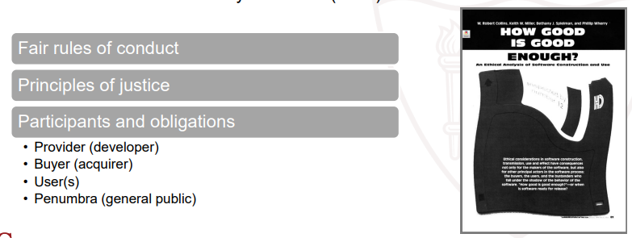

#### Rawls' Theory of Justice – Applied in SE

Aims to constitute a system to ensure the fair distribution of primary social goods

- Fair rules of conduct
  - Negotiation among interested parties
- Use “veil of ignorance”
  - Deliberately forget who you are
  - This veil prevents you from knowing any personal details
    - Gender, race, or ethnicity
    - Social class or family background
    - Talents or disabilities
    - Religion or personal values
    - Rich or poor, powerful or marginalized
- Principles
  - Least advantaged
    - Don't increase harm to them
    - Harm = probability x magnitude (~risk exposure)
  - Risking harm
    - Don't risk increasing harm
    - Don't use “low-threat” software in “high-threat” context
  - Publicity test
    - Defensible with honor before an informed public
    - Use for difficult cost-benefit tradeoffs

##### Obligations of the Software Provider (Developer)

- To the provider
  - Make a reasonable profit
- To the user
  - Clear operating instructions
  - Reasonable protections from and informative responses to use and abuse
  - Provide reasonable technical support
- To the buyer
  - Reasonable use warrantee
  - Informed consent about testing process and potential shortcomings
- To the penumbra
  - Reasonable protections against physical, emotional, and economic harm from applications
  - Open about software development process and limits of correctness

##### Obligations of the Software Buyer (Acquirer)

- To the provider
  - Negotiate in good faith, recognizing the importance of provider's fair profit
  - Learn enough about the software to make an informed decision
  - Facilitate adequate communication users
- To the penumbra
  - Buy software only with reasonable safeguards for the public
  - Open about software capabilities and limitations
- To the user
  - Provide quality software appropriate to users' needs within reasonable budget constraints
  - Prudent introduction of automation
  - Informed consent to using software
  - Represent user's interests with providers

##### Obligations of the Software User(s)

- To the provider
  - Respect ownership rights
- To the buyer
  - Active communication with the buyer
  - Good faith effort to learn and use software responsibly
  - Reasonable requests for computing power
- To other users
  - Willing cooperation in learning and using software
- To the penumbra
  - Conscientious effort to reduce any risks to the public
  - Encourage reasonable expectations about software capabilities and limitations

##### Obligations of the Software Penumbræ (General Public)

- To the provider
  - Become aware of the capabilities and limitations of software
  - Advocate a suitable economic and statutory environment for quality software
- To the buyer
  - Advocate a suitable economic and statutory environment for quality software
- To other users
  - Expect only reasonable service from users
  - Become aware of the capabilities and limitations of software
- To the penumbræ
  - Become aware of the capabilities and limitations of software
  - Advocate a suitable economic and statutory environment for quality software

#### CSCI 577a Ethics Accountability

- Common ethical question marks:
  - Assuming your priorities match those of other stakeholders
    - Users: GUI; quality factor priorities
    - Maintainers: programming language, reuse, documentation
    - Customers/Owners: legacy compatibility, advanced vs. mature technology, full business case
  - Promising more than you can deliver
  - Borrowing from other projects without credit
  - Suppressing or delaying bad news
  - Delivering just source code vs. including architecture, regression test cases, documentation for users, maintainers

#### Software Engineering Ethics: Revisiting

- Definitions and context
  - Power to do public harm or good
  - ACM/IEEE Software Engineering Code of Ethics
- Principles and examples
  - Rawls' Theory of Justice
  - Relation to stakeholder win-win
  - CSCI 577a ethics situations
- **Ethics challenges for your future careers**
  - **Global threats, nanosecond decisions**
  - **Coping with AI**

#### Ethics Challenges for Your Future Careers

- Assuming what has happened will simply continue in the future
  - *E.g.*, Moore's Law and all the “laws” we discussed
- Software (including AI) making decisions in nanoseconds
  - What are we letting an AI model prioritize?
- Powerful capabilities falling into the wrong hands
  - *E.g.*, Denial of Service
- Software getting more complicated to a degree humans cannot understand
  - How much should we trust software?

##### Example in Robotics: Asimov's Laws

- Asimov's Laws (from the 1940s)
  1. Do not injure a human or allow a human to come to harm.
  2. Obey orders given by humans, except when orders conflict with Law 1.
  3. Protect its own existence, except when this conflicts with Laws 1 and 2.
- Hard to achieve, even in simple, stable situations
  - Hard to predict what will occur in the next few milliseconds

#### Conclusions

- SW engineers will have **vastly increasing power** to do public harm/good
- Rawls' Theory of Justice enables constructive approach for integrating ethics into daily software engineering practice
  - *E.g.*, ICSM Stakeholder win-win with least-advantaged system dependents as success-critical stakeholders
- Responsibility challenges for your future careers
  - Global threats, nanosecond decisions
  - Coping with AI, Internet of Things, DevOps, Systems of Systems
  - Try to build in reversibility of bad decisions

#### AI Ethics Challenges for Software Engineers

- AI-generated code raises novel ethical concerns for SE professionals
  - **Bias amplification** (e.g., AI hiring tools getting scraped)
  - Accountability gap: When AI generates code that causes harm, **who is responsible?**
  - **IP & copyright:** LLMs trained on open-source code raise unresolved questions about IP rights
  - Security ethics: Developers using AI assistants **produce less secure code but believe they are more secure**, creating a false sense of safety for end users
  - Rawls applied to AI: The “least advantaged” stakeholders (end users, non-technical public) bear the greatest risk from AI-generated software defects
- What students can do to adapt
  - Apply the ACM Code of Ethics to AI-assisted work: You remain responsible for all code you ship
  - Practice the publicity test: Could you defend your AI usage practices before an informed public?
  - Advocate for transparency: Document when and how AI was used in development

## Future of Software Engineering

Past, Present, and Future of SE

### A View of 20th and 21st Century Software Engineering

- **Motivation and Context**
- A 20th Century View
- A 21st Century View
- Conclusions
  - Timeless principles and aging practices

### Motivation and Context

- Working definition of “software engineering”
- Importance of historical perspective
- We are losing our history
- Some historical perspectives

#### “Software Engineering” Definition

- Based on Webster definition of “engineering”
  - The application of science and mathematics by which the properties of software are made useful to people
- Many different definitions of the term, including the one from the first lecture:
  - Development of software systems whose size/complexity warrants team(s) of engineers
- Includes computer science and the sciences of making things useful to people
  - Behavioral sciences, economics, management sciences

#### Why Software Projects Fail

- Average overrun: 89.9% on cost, 121% on schedule, with 61% of content

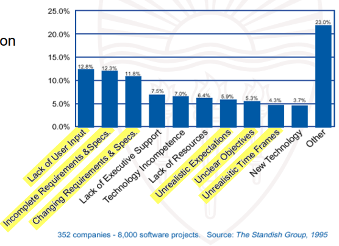

#### Importance of Historical Perspective

- George Santayana:
  - “Those who cannot remember the past are condemned to repeat it”
- Don't remember failures?
  - Likely to repeat them
- Don't remember successes?
  - Not likely to repeat them

#### We Are Losing Our History

- Great people are gone
  - Grace Hopper, Harlan Mills, Winston Royce, Edsger Dijkstra, Mark Weiser, Barry Boehm ...
- Relative inaccessibility of hardcopy literature
  - Median ICSE 2005 paper has no reference before 1984-85
    - 77% have no references before 1980

### A Hegelian View of Software Engineering Evolution

### A View of 20th and 21st Century Software Engineering

- Motivation and Context
- **A 20th Century View**
- A 21st Century View
- Conclusions
  - Timeless principles and aging practices

#### 1950's Thesis: Engineer Software Like Hardware

- Hardware-oriented:
  - Software applications: airplanes, bridges, circuits
  - Software economics in 1955
    - “We’re paying \$600/hour for that computer, and \$2/hour for you, and I want you to act accordingly.”
  - Professional societies were founded
    - Association for Computing Machinery (ACM), IEEE Computer Society
  - Software processes: SAGE (Semi-Automated Ground Environment)
    - 1 MLOC air defense system, real-time, user-intensive
    - Successful development of highly unprecedented system
    - Hardware-oriented waterfall-type process

##### The SAGE Software Development Process - (Benington, 1956)

- “We were successful because we were all engineers.”
  - Absence of non-technical interference was key to success
  - Nearly impossible today

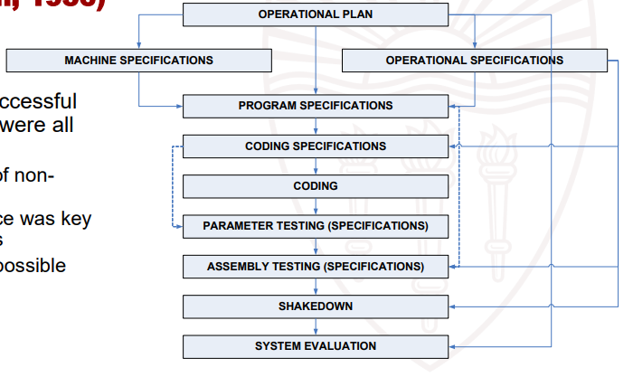

#### 1960's Antithesis

- **Software Is Not Like Hardware**
- Invisibility: like the Emperor's Magic Cloth
- Complexity: Royce, "for a \$5M procurement, need a 30-page spec for hardware, and a 1500-page spec for software"
- Conformity: executed by computers, not people
- Changeability: up to a point, then becomes difficult
- Doesn't wear out: different reliability, maintenance phenomena
- Unconstrained: can program antigravity, time travel, interpenetration, ...

#### 1960's Antithesis

- **Software Crafting – More like handcrafting than engineering**
- Flexible materials, frequent changes as above
- SW demand exceeded supply of engineers
  - Music, history, art majors
  - Counter culture: question authority
  - Cowboy programmers as heroes
  - Code-and-fix process
  - Hacker culture (Levy, 1984)
    - Collective code ownership
    - Free software, data, computing access
    - Judge programmers by the elegance of their code

#### 1960's Progress and Problems

- Better infrastructure: OS, compilers, utilities
- Computer Science Departments
- Product Families: OS-360, CAD/CAM, math/statistics libraries
- Some large successes: Apollo, ESS, Bank of America check processing
- Problems: 1968, 1969 NATO Reports
  - Failure of most large systems
  - Unmaintainable spaghetti code
  - Unreliable, undiagnosable systems

#### 1970's Antithesis

- **Formal and Waterfall Approaches**
- **Structured Methods**
  - Structured programming (Böhm-Jacopini: GO TO unnecessary)
  - Formal programming calculus: Dijkstra, Hoare, Floyd
  - Formalized Top-Down Structured Programming: Mills, Baker
- **Waterfall Methods**
  - Code and fix too expensive (100:1 for large systems)
  - Precede code by design
  - Precede design by requirements

##### The Royce Waterfall Model (1970)

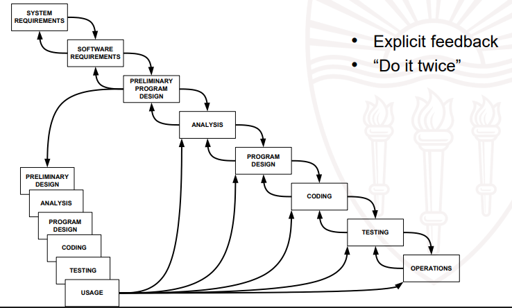

##### Increase in Software Cost-to-fix vs. Phase (1976)

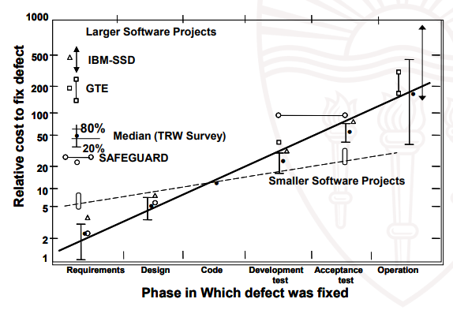

#### 1970's: Problems with Formal Methods

- Successful for small, critical programs
- Largest proven programs around 10 KSLOC
- Scalability of programmer community
  - Techniques require math expertise, \$500/SLOC
  - Average coder in 1975 survey:
    - 2 years of college, SW experience
    - Familiar with 2 languages, applications
    - Sloppy, inflexible, in over his head, and undermanaged

##### Large-Organization HW/SW Cost Trends (1973)

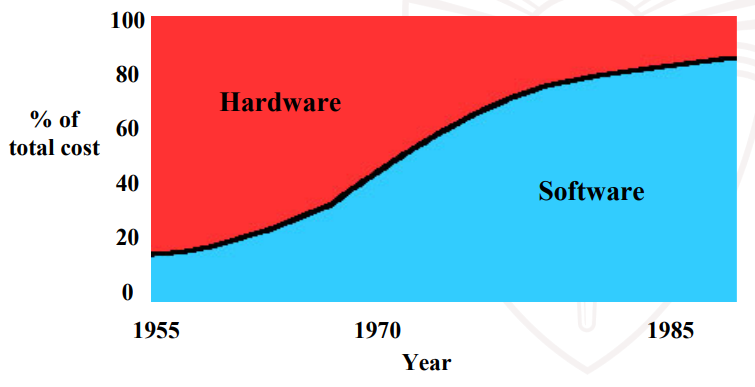

#### 1970's: Problems with Waterfall Model

- **Overly literal interpretation of sequential milestones**
  - Prototyping is coding before Critical Design Review
  - Mismatch to user-intensive systems
- Heavyweight documentation hard to review, maintain
  - 7 year project with 318% requirements change
  - Milestones passed but not validated
- Mismatch to COTS, reuse, legacy SW
- Scalability, cycle time, and obsolescence
  - Months =  $5 * \sqrt[3]{KSLOC}$  for sequential development
  - 3000 KSLOC →  $5 * 14.4 = 72$  months: 4 computer generations

### A Hegelian View of Software Engineering Evolution

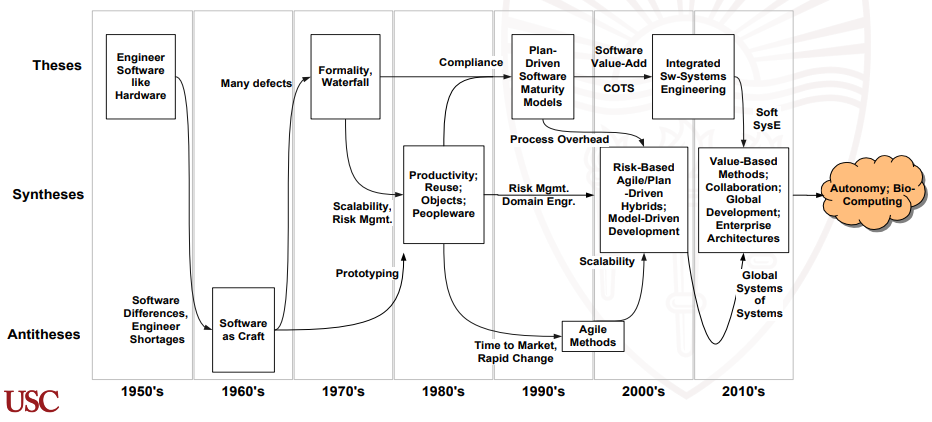

#### 1980's Synthesis: Productivity, Reuse, Objects

- Worldwide concern with productivity, competitiveness
  - Japanese example: autos, electronics, Toshiba SW reuse
- Major SW productivity enhancers
  - Working faster: tools and environments
  - Working smarter: processes and methods
  - Work avoidance: reuse, pursuing simplicity, using objects

##### Tools, Environments, and Process

- Overfocus on programming
  - Requirements, design, planning and control, office support
  - Formatted vs. formal specifications
- Process-driven software engineering environments
  - Use process knowledge as tool integration framework
  - Some overkill in locking people into roles
- Process execution support: “SW processes are SW too”
  - What’s good for products is good for processes
  - Reuse, prototyping, architecture, programming
- Process compliance support: Standards and CMMs

##### Reuse and Object Orientation

- 1950's: Math routines, utilities
- 1960's: McIlroy component marketplace, Simula – 67
- 1970's: Abstract data types
- 1980's: Smalltalk, Eiffel, C++, OO methods, reuse libraries
- 1990's: Domain engineering, product lines, UML, pub-sub architectures
- 2000's: Model-driven development, service-oriented architectures and APIs

##### No Silver Bullet: Frederick Brooks

- Automated solutions are good for “accidental” software problems
  - Inadequate or outdated tools
  - Poor development practices
  - Limitations in hardware, OS, etc.
- They do not do well on “essential” software problems
  - Changeability: adapting themselves to unanticipated changes
  - Conformity: needs to conform to hardware, operating environment
  - Complexity: integrating multiple already-complex programs
  - Intangibility: software is not embedded in space; no obvious representation
- Closest thing to silver bullet: great architects

##### People: The Most Important Factor

- **SW engineering is of the people, by the people, and for the people**
- 1970's: Weinberg's "Psychology of Computer Programming"
  - Programming is a human activity
  - Egoless programming
  - Cognitive limits and errors
- 1980's: COCOMO, Peopleware
- 1990's - 2000's: Importance emphasized in both Agile and CMM cultures
  - Individuals and interactions over process and tools

#### 1990's – Early 2000's Antithesis

- **Maturity Models and Agile Methods**
- Predictability and control: Maturity Models
  - Reliance on explicit documented knowledge
  - Heavyweight but verifiable, scalable
- Time to market and rapid change: Agile methods
  - Reliance on interpersonal tacit knowledge
  - Lightweight, adaptable, not very scalable as-is

##### Agile and Plan-Driven Home Grounds: Five Critical Decision Factors

- Size, Criticality, Dynamism, Personnel, Culture

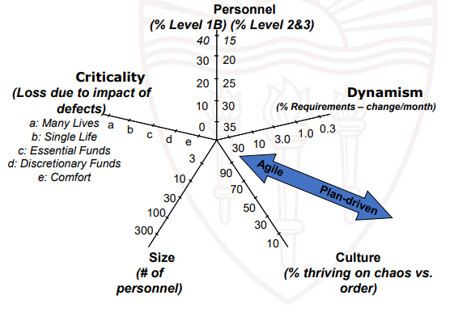

#### Other 1990's – Early 2000's Developments

- Y2K
- Risk-driven concurrent engineering
  - Win-Win spiral with anchor points; Rational Unified Process
- Nature and importance of software architecture
- COTS, open source, and legacy software
- Software as the primary competitive discriminator
  - 80% of aircraft functionality

#### COTS: The Future Is Here

- Escalate COTS priorities for research, staffing, education
- Software is not “all about programming” anymore
- New processes required

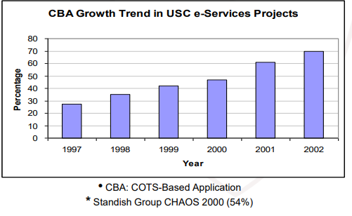

### A Hegelian View of Software Engineering Evolution

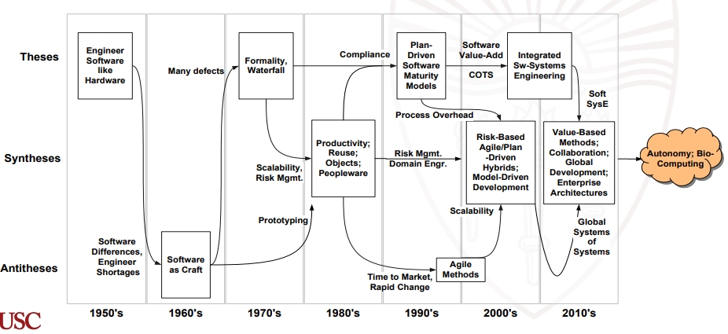

#### Mid-2000's Synthesis: Risk-Driven Hybrid Products and Process

- Increasing integration of systems engineering and SW engineering
  - Increasing trend toward software-intensive systems engineering
- Increasing focus on usability and value
  - Fit the software and hardware to the people, not vice versa
- Model-driven development and service-oriented architectures
- Hybrid agile and plan-driven product and process architectures
  - Encapsulate parts with rapid, unpredictable change
  - Concurrent build-to-spec, V&V, agile rebaselining

### A View of 20th and 21st Century Software Engineering

- Motivation and Context
- A 20th Century View
- **A 21st Century View**
- Conclusions
  - Timeless principles and aging practices

#### The Future of Systems and Software

- Eight surprise-free trends
  - Increasing integration of systems engineering and software engineering
  - User and value focus
  - Software criticality and dependability
  - Rapid, accelerating change
  - Distribution, mobility, interoperability, globalization
  - Complex systems of systems
  - COTS, open source, reuse, legacy integration
  - Computational plenty
- Two wild-card trends
  - Autonomy software
  - AI (including AI-assisted software engineering)

#### Globalization: “The World is Flat” - Friedman, 2005

- Information processing functions can be performed almost anywhere in the world
  - Low-cost global fiber-optic communications
  - Overnight global delivery services
- Significant advantages in outsourcing to low-cost suppliers
  - But also comes with significant risks
- Competitive success involves pro-actively pursuing advantages
  - While keeping risks manageable

#### Persistence of Legacy Systems

- Before establishing new-system increments
  - Determine how to undo legacy system

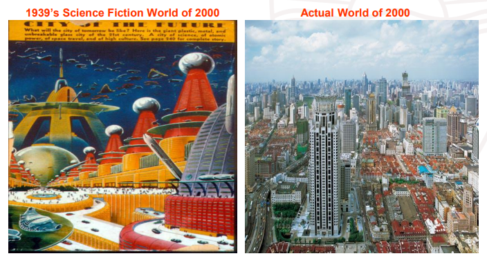

#### Computational Plenty: Process Implications

- New platforms
  - New applications: sensor networks, nanotechnology, wearable computing
- Enable powerful self-monitoring software
  - Assertion checking, trend analysis, intrusion detection, automated testing
- Enable higher levels of abstraction
  - Large language models and “vibe” coding by using prompts
  - Pattern programming, programming by example with dialogue
  - Simpler brute-force solutions: exhaustive case analysis
- Enable more powerful software tools
  - Based on domain, programming, management knowledge
  - Show-and-tell documentation
  - Game-oriented software engineering education

#### Wild Cards: Autonomy and AI

- Great potential for good
  - Robot labor
  - Adaptive control of the environment
  - Redesigning the world for higher quality of life
    - Physically, biologically, informationally
- Great potential for harm
  - Loss of human primacy: computers propose, humans decide
  - Over-empowerment of humans
    - Accidents, terrorism, wars
  - New failure modes and difficulties in verification and validation
    - Self-modifying software, autonomous AI agents, bio-computer mismatches
- Forms and timing of new capabilities still unclear

#### 2015 Trends Largely Missed in 2005

- Search and mining of ultra-large data aggregations
  - Crowdsourcing vs. traditional data acquisition
  - Agile Methods meet Complex Trusted Systems
- Rapid growth of cloud computing, service-orientation
  - Proliferation of Apps: Full interoperability
- Rapid growth of social networking technologies
  - Changes in labor force supply and demand

### A View of 20th and 21st Century Software Engineering

- Motivation and Context
- A 20th Century View
- A 21st Century View
- **Conclusions**
  - **Timeless principles and aging practices**

#### Timeless Principles (+) and Aging Practices (-)

- From the 1950's
  - + Don't neglect the sciences
  - + Look before you leap (avoid premature commitments)
  - Avoid inflexible sequential processes
- From the 1960's
  - + Think outside the box
  - + Respect software's differences
  - Avoid cowboy programming

#### Timeless Principles (+) and Aging Practices (-)

- From the 1970's
  - + Eliminate errors early
  - + Determine the system's purpose
  - Avoid top-down development and reductionism
- From the 1980's
  - + These are many roads to increased productivity
  - + What's good for products is good for processes
  - Be skeptical about silver bullets

#### Timeless Principles (+) and Aging Practices (-)

- From the 1990's
  - + Time is money and value to people
  - + Make software useful to people
  - Be quick, but don't hurry
- From the 2000's
  - + If change is rapid, adaptability trumps repeatability
  - + Consider and satisfice all of your stakeholders' value propositions
  - Avoid falling in love with your slogans (e.g., YAGNI - You Are Going to Need It)

#### Timeless Principles (+) and Aging Practices (-)

- For the 2010's
  - + Keep your reach within your grasp
  - + Have an exit strategy
  - Don't believe everything you read
    - "It's true because I read it on the Internet"

### **AI and Its Impact on Software Engineering**

What we can do to prepare

#### Productivity Gains vs. Quality and Cognition

- AI boosts throughput on well-scoped tasks
- Context determines whether AI helps or hurts
  - On existing, familiar codebases, devs were slowed; on well-scoped tasks, juniors gained most
- 1980s lesson still applies: “Be skeptical about silver bullets” (Brooks '87)
- Measure your context (error rates, NFP stats, mean time to repair, etc.), and do not blindly trust benchmarks
- Security degrades: AI-assisted users wrote less secure code on 4/5 tasks and were overconfident about it
- Cognitive debt: LLM users showed up to 55% reduced brain connectivity; 83% could not recall their own essays
- GitHub study: ~1/4 of AI-generated Python and JS code had security weaknesses
- 1960s lesson: “Avoid cowboy programming”
  - AI-generated code without review is the modern equivalent

#### Survival Skill #1: Verification-First Engineering

- “**Eliminate errors early**” has been timeless since the 1970s
  - AI makes it existential, not optional
- **Tests are your primary oracle:** Write extensive tests early
- **Peer review** is non-negotiable: Catches defects and build cognition; critical when AI obscures developer intent
- **Static analysis** can catch AI-generated security flaws; integrate it into CI/CD pipeline
- Measure outcomes (defects, incidents, mean time to repair), not the metrics that are not as useful (LOC, commits)

#### Survival skill #2: Collaborate with AI But Do Not Delegate Blindly

- **Decompose tasks**; constrain interfaces; **specify acceptance criteria** BEFORE generating code; review outputs carefully
- **Code comprehension** still matters
  - LLM explanations often inaccurate/unclear
  - Novices struggle with prompts
- **Security guardrails**: pre-defined project policies + automated checks (deterministic and/or AI) + human review

#### 2026-Ready Portfolio: What to demonstrate

- Ship one non-trivial system with CI, tests, and docs
- Show verification artifacts: test suite, coverage trend, static analysis, dependency audit
- Demonstrate secure-by-default habits: secrets, authn/authz, input validation, threat model
- Be transparent about AI use: prompts/rationales + how you verified AI-generated changes
- Prove maintainability: modular design, clear interfaces, refactoring history