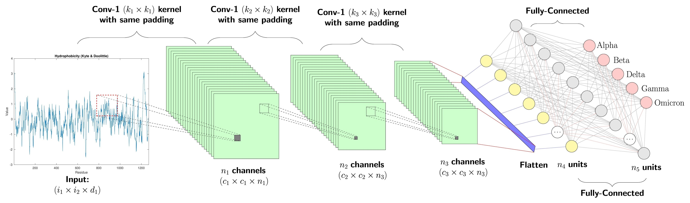
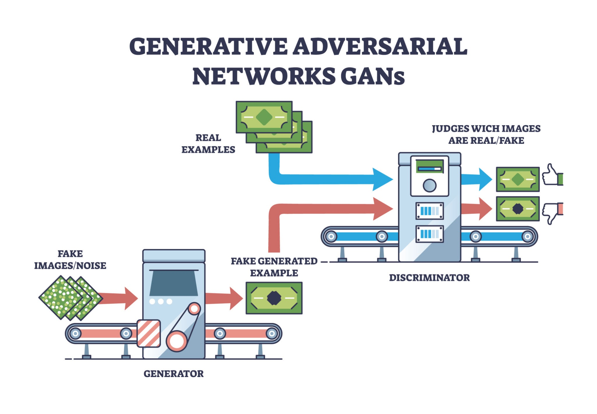

## 1/12 Lecture 1 - **CSCI 587: Geospatial Data Analysis – Lecture 1 Cheat Sheet**

### **1. Course Logistics & Structure**

- **Course Evolution:** The course transitioned from "Geospatial Information Management" to "Geospatial Data Analysis," placing heavier emphasis on modern machine learning and deep learning applied to spatial data.
- **Part 1 (Data Management):** Focuses on the fundamentals and challenges of spatial data (indexing, query types). Taught with a deep dive into 1–2 research papers per lecture.
- **Part 2 (Data Analysis):** Focuses on modern AI/ML applications (e.g., traffic forecasting). Fast-paced, covering 3–4 papers per lecture.
- **Grading Breakdown:**
  - **Midterm 1:** First half of the course (Closed book).
  - **Midterm 2:** Second half of the course (Closed book).
  - **Homework (30% total):** 3 assignments, 10% each. HW3 involves training a deep learning model.
  - **Participation (10%):** In-class attendance and engagement. You are allowed 3 unexcused absences.

------

### **2. Database Fundamentals (The Baseline)**

To understand spatial databases, you must first understand traditional database management systems (DBMS).

- **Definition:** A structured collection of data. Unlike standard file systems, databases have specific semantics and structures (e.g., relational tables).
- **Core Operations:** Insert, Update, Delete, and **Querying** (using SQL).
- **The Ultimate Goal — Efficiency:** Databases exist to execute operations fast. This is achieved primarily through **indexing** (e.g., B-trees) rather than scanning every record sequentially.

------

### **3. The Shift to Spatial Data**

Standard relational databases handle numbers and strings well but fail at representing spatial shapes (2D or 3D objects) efficiently.

- **The Inefficiency Problem:** If you store a 2D polygon in a standard relational database, you have to break it down into coordinates stored across multiple tables connected via foreign keys. Querying the shape requires multiple expensive SQL `JOIN` operations.
- **The Solution:** Spatial Database Management Systems (SDMS) introduce new, native geometric data types and optimized spatial indexes to handle this data without heavy `JOIN` overhead.

#### **Core Spatial Data Types**

1. **Points:** Represent single coordinate locations (e.g., a restaurant, a city center).
2. **Lines / Polylines:** Represent continuous paths (e.g., roads, rivers).
3. **Polygons / Regions:** Represent enclosed areas (e.g., states, census blocks, lakes). Polygons can contain "holes."

- *Note: Other representations exist depending on the application, such as graphs/networks (for road networks) or point clouds (for 3D spaces).*

------

### **4. Spatial Relationships & Queries**

When querying spatial data, relationships fall into three main categories:

| **Type**        | **Description**                                              | **Examples**                                                 |
| --------------- | ------------------------------------------------------------ | ------------------------------------------------------------ |
| **Topological** | Relationships that remain invariant (unchanged) under transformations like scaling, translation, or rotation. | Intersect, inside, adjacent, touch, disjoint, overlap, cover, equal. |
| **Metric**      | Relationships based on distance. These *change* if the map is scaled. | Distance within 10 miles. Calculated via formulas like Euclidean distance: $\sqrt{(x_2 - x_1)^2 + (y_2 - y_1)^2}$ |
| **Directional** | Relationships based on orientation. These *change* if the map is rotated. | North of, South of.                                          |

------

### **5. Spatial Indexing: "Filter and Refine"**

Determining the exact topological relationship between two complex polygons is highly computationally expensive. Spatial databases solve this using a two-step "Filter and Refine" indexing approach.

1. **Filter Phase (Fast but Approximate):**
   - The database draws a **Minimum Bounding Rectangle (MBR)** around every complex polygon.
   - It tests for overlaps using only the MBRs. Checking if two rectangles overlap is mathematically simple and computationally cheap.
   - This step quickly filters out all shapes that definitely do *not* overlap.
2. **Refine Phase (Slow but Exact):**
   - For the MBRs that *do* overlap, the database then runs the complex computational geometry algorithms on the actual underlying polygons to confirm if a true intersection exists.

------

### **6. Advanced Spatial Concepts**

- **Spatial Joins:** Joining two spatial tables based on a spatial predicate rather than matching strings/numbers.
  - *Classic Example:* Doing a spatial join on a `Roads` table (lines) and a `Rivers` table (lines) where they `Intersect` will yield the locations of **Bridges**.
- **Query Optimization:** Standard SQL optimizers rely heavily on "selectivity" (how many rows a filter removes). Spatial optimizers must also factor in the **computational cost** of the spatial operation itself, as checking exact polygon overlap is drastically more expensive than checking a simple integer threshold (e.g., Population > 500,000).
- **GIS vs. SDMS:**
  - **Geographical Information Systems (GIS):** Focuses on the user application, visualization, dashboards, and spatial analytics (e.g., ArcGIS, Palantir).
  - **Spatial DBMS:** The underlying infrastructure layer (in the middle of GIS and raw computational geometry) that focuses strictly on efficient storage, indexing, and retrieval.

------

### **7. System Landscape (Brief Overview)**

- **Open Source Standard:** **PostGIS** (an extension for PostgreSQL) remains the most common and robust open-source spatial database.
- **Commercial Standard:** Oracle Spatial.
- **Modern/Cloud-Scale:** Tools like Google BigQuery (now supports spatial), Apache Sedona, and GeoMesa are used for distributed, cloud-scale spatial computing.

------

# 1/21 Lecture 3 (Guest Lecture)

------

## **1. Core Concepts & Applications**

Computational geometry involves the scientific design, analysis, and implementation of algorithms solving geometric problems.

**Common Applications:**

- **Robotics:** Path planning and avoiding collisions as shapes move through space.
- **GIS (Geographic Information Systems):** Finding map intersections, overlaps, and routes.
- **Computer-Aided Graphics:** 3D modeling, rendering, and tessellation.
- **Scientific Computing:** Simulating car crashes (folding and collisions) and circuit layouts.

**Primitive Objects:**

- **2D:** Points, line segments, polygons, circles, ellipses, and Bezier curves.
- **3D:** Polyhedra, spheres, cylinders, and cones. Problems scale in complexity in 3D (e.g., finding the shortest path on a 3D folded surface requires unfolding it to a 2D plane).

------

## **2. Point Operations & Vector Math**

Points are the most primitive geometric objects. In algorithmic design, they are best treated as vectors originating from the origin $(0,0)$.

**Fundamental Operations:**

- **Vector Subtraction ($B - A$):** Yields a vector representing the distance and direction from point A to point B.
- **Vector Addition ($A + B$):** Yields the fourth vertex of a parallelogram where the other three vertices are the origin, A, and B.
- **Dot Product:** Yields a scalar value indicating alignment. Formula: $A \cdot B = |A||B|\cos(\theta)$. A result of $0$ means orthogonal, and a negative result means the angle is $> 90^\circ$.
- **Cross Product (2D):** Yields a scalar representing the area of a parallelogram and the left/right orientation. Formula: $x_1y_2 - y_1x_2$.

**The Left/Right Turn Test:**

To determine if point Q is to the left or right of a directed line segment from P1 to P2:

1. Create $V_1 = P_2 - P_1$
2. Create $V_2 = Q - P_1$
3. Calculate the cross product $V_1 \times V_2$.
4. A **negative** result means Q is to the **right**. A **positive** result means Q is to the **left**.

------

## **3. The Convex Hull**

The convex hull of a set of points is the smallest convex polygon that contains all points inside it or on its boundary. Think of it as snapping a rubber band around a set of nails on a board.

**Applications:**

- **Gaming / Collision Detection:** Tighter and more accurate than a simple rectangular bounding box, while still allowing linear time $O(n)$ intersection checks.
- **Linear Programming:** The simplex method searches the vertices of a convex polyhedra (the feasible region).

**Convex Hull Algorithms:**

| **Algorithm**        | **Time Complexity** | **Description**                                              |
| -------------------- | ------------------- | ------------------------------------------------------------ |
| **Brute Force**      | $O(n^3)$            | Check all pairs of points; verify if all other points fall on one side of the segment. |
| **Angle Search**     | $O(n^2)$            | Start at the lowest Y point. Find the point with the most acute angle to form an edge. Repeat. |
| **Graham Scan**      | $O(n \log n)$       | Sort points counter-clockwise by angle from the lowest point. Use a stack to track the hull, popping vertices if a "right turn" is detected. |
| **Divide & Conquer** | $O(n \log k)$       | Output-sensitive algorithm. Best when the number of points actually on the hull ($k$) is very small compared to the total points ($n$). |

------

## **4. Closest Pair of Points**

Finding the two points closest to each other on a 2D plane.

- **Brute Force:** $O(n^2)$ checking all pairs.
- **Divide & Conquer Approach ($O(n \log n)$):**
  1. Split the points in half by an X-coordinate.
  2. Recursively find the minimum distance on the left side ($\delta_1$) and the right side ($\delta_2$).
  3. Let $\delta = \min(\delta_1, \delta_2)$. The overall closest pair might cross the middle dividing line, but they *must* be within a distance of $\delta$ from that center line.
  4. Sort the points in this middle $2\delta$ band by their Y-coordinates.
  5. Because of the $\delta$ constraints, you only need to check a maximum of **6 neighboring points** on the other side for any given point, reducing the merge step to linear time.

------

## **5. Voronoi Diagrams & Delaunay Triangulation**

These two structures are mathematically dual to one another and unlock extremely fast spatial lookups.

**Voronoi Diagram ($O(n \log n)$):**

- Partitions a plane into regions (polygons) based on the distance to a specific set of points.
- Any location inside a specific polygon is strictly closer to that polygon's core point than to any other point on the map.
- **Application:** Finding the nearest airport for an emergency landing, or the closest coffee shop based on GPS coordinates.

**Delaunay Triangulation ($O(n \log n)$):**

- Connects points to their nearest neighbors to form triangles. The edges of the Voronoi diagram act as perpendicular bisectors to the edges of the Delaunay triangulation.
- **Key Property:** It maximizes the minimum angle of all triangles. This prevents "flimsy" or sharp triangles, which is crucial for stability in finite element analysis and scientific simulations.
- **Euclidean Minimum Spanning Tree (EMST):** Can be found in $O(n \log n)$ time by first computing the Delaunay triangulation (which trims the graph from $n^2$ possible edges to a linear $O(n)$ edges), and then running a standard MST algorithm.

------

## **6. Triangulating Polygons**

Breaking down a complex polygon into a series of triangles for rendering or simulation.

| **Polygon Type**      | **Algorithm Complexity** | **Notes**                                                    |
| --------------------- | ------------------------ | ------------------------------------------------------------ |
| **Convex**            | $O(n)$                   | Easily triangulated by anchoring to one vertex. The number of possible triangulations is described by Catalan numbers. |
| **Monotone**          | $O(n)$                   | Solved using a greedy plane-sweep algorithm from left to right, utilizing a stack for deferred nodes. |
| **General / Concave** | $O(n \log n)$            | The complex polygon must first be broken into monotone pieces ($O(n \log n)$), which are then triangulated in linear time. |

------

## **7. Line Segment Intersection**

Finding intersections among a large set of $N$ line segments.

**Algorithm: Plane Sweep / Line Sweep**

- **Core Observation:** Segments must be adjacent in their Y-coordinates to intersect. You only need to check for intersections between immediate neighbors.
- **Data Structure 1 (Min-Heap):** Stores "Event Points" (start of a segment, end of a segment, and newly discovered intersections), keyed by the X-coordinate to process left to right.
- **Data Structure 2 (Balanced Binary Tree):** Stores the active line segments, keyed by their Y-coordinates.
- **Process:** As the vertical sweep line hits event points, segments are inserted, removed, or swapped in the binary tree. Whenever segments become adjacent due to an event, check them for intersection.
- **Time Complexity:** $O((n + m) \log n)$, where $m$ is the actual number of intersections. This is drastically faster than the brute force $O(n^2)$ when intersections are sparse.

------

# 1/26 Lecture 4

### Lecture Cheat Sheet: Spatial Indexing Techniques

#### 1. Course & Exam Logistics

- **Exam Structure:** Exams will consist of 7–9 questions.
  - 1–2 questions will be multiple-choice/fill-in-the-blank.
  - 6–7 questions will be problem-solving (math/algorithmic type).
  - No essay questions. No sample exams will be provided (examples given at the end of lectures will suffice).
- **Course Context:** The course builds on underlying database management and computational geometry techniques (e.g., Voronoi diagrams), but the focus is on *how* to build indexing techniques on top of them, not the geometry itself.
- **Core Assumption:** The course assumes data is massive and resides on **disk** (disk-based indexing), not in memory.

#### 2. Indexing Basics & The 2D Challenge

- **What is an index?** A list of pointers (like a Yellow Pages directory) that speeds up the search for specific data.
- **1D Indexing:** In 1D arrays, sorting allows for binary search, reducing search complexity from $O(n)$ to $O(\log n)$.
- **The 2D Problem:** You cannot simply sort 2D spatial data (X, Y / Latitude, Longitude).
  - Sorting by only X or only Y is inaccurate (e.g., it might group Los Angeles and New York together if only checking latitude).
  - Sorting by Euclidean distance to the origin reduces 2D to 1D, but destroys spatial proximity relationships (things close in real life might end up far apart in the index).
- **Disk Pages vs. Single Items:** In spatial databases, index pointers don't point to a single item; they point to a **disk page** that contains multiple items. The number of items a page can hold depends on the page size and item size.

#### 3. Grid Files

- **Concept:** Divide the 2D space into a grid where each cell points to a disk page.
- **Two-Disk Access Principle (Exact Match):**
  1. Read the index directory (if not in memory) to find the pointer.
  2. Read the actual data page from the disk.
- **Splitting Mechanism:** When a page reaches its capacity, the grid splits. In a standard Grid File, the split goes **all the way across** the X or Y axis.
- **Linear Scale:** An improvement over a basic grid. The X and Y axes don't have to be cut uniformly. The "scale" (which defines the grid boundaries) is kept in memory to avoid extra disk access.
- **Shortcomings of Grid Files:**
  - **Skewed Data:** Because splits go all the way across the space, dense data in one corner forces empty grid cells in other areas.
  - **Dimensionality Curse:** Storage grows exponentially with the number of dimensions.
  - **Range Queries:** A rectangular range query might overlap with many grid cells that contain no relevant data, causing expensive and unnecessary disk I/O.

#### 4. Space-Filling Curves (Dimension Reduction)

- **Goal:** Map a 2D space into a 1D sequence while keeping points that are close in 2D space as close as possible in the 1D index.
- **Row Order:** Ineffective. Points adjacent vertically are far apart in the index.
- **Z-Ordering (Morton Curve):**
  - Uses a hierarchical, recursive "Z" pattern to navigate quadrants (0, 1, 2, 3).
  - **The Shuffle Algorithm:** You don't have to manually count to find a coordinate's 1D value. You can take the binary bits of the X and Y coordinates and "shuffle" (interleave) them. Example: X = `01`, Y = `11` $\rightarrow$ Shuffled = `0111` (7).
  - *Flaw:* Still has occasional "jumps" where items close in 2D space are placed far apart in the 1D sequence.
- **Hilbert Curve:**
  - A smoother, continuous curve that navigates up, left, right, and down without the large diagonal jumps of the Z-curve.
  - **Advantage:** Superior for preserving spatial proximity and clustering objects. Translating between 2D coordinates and the 1D Hilbert value is done via a specific transformation function (the $L$ function).

#### 5. Quadtrees

- **Concept:** Solves the Grid File's skewness problem by splitting space **locally** rather than globally. When an area gets too dense, it subdivides into four equi-sized quadrants (NW, NE, SW, SE) only in that specific local area.
- **Types of Quadtrees:**
  1. **Region Quadtree (For Areas):**
     - Used to index regions (e.g., Water vs. Not Water).
     - If a cell is 100% water or 100% land, it stops splitting. If it contains a boundary, it splits into four.
     - *Applications:* Hyperspectral satellite imagery, containment queries.
  2. **Point Quadtree (For Coordinates):**
     - Splits locally when a cell exceeds its point capacity (e.g., only 1 city allowed per cell).
     - *Applications:* Nearest neighbor searches, fast counting (if a query rectangle fully covers a parent node, you just sum the population without checking the children), heat maps.
  3. **PM Quadtree (Polygonal Map - For Lines & Points):**
     - Used when your data has both vertices (points) and edges (lines).
     - *Core Intuition:* You do not want two distinct "features" in the same cell.
     - **PM1 Rules:** You must split the cell if it contains two points, OR a point and a separate line, OR two intersecting lines.
     - **PM2 & PM3:** Relax the strict PM1 rules to prevent the tree from splitting infinitely (which creates heavily imbalanced trees and bloats the node size).
     - *Applications:* Geocoding (e.g., an Amazon or Google maps query mapping an exact X,Y coordinate to the nearest named street for a mailing address).

# 1/28 Lecture 5 Cheat Sheet: Object-Based Spatial Indexing (R-Trees)

------

#### 1. Space-Based vs. Object-Based Indexing

To understand R-trees, you must first distinguish between the two primary ways to index spatial data.

- **Space-Based Indexing (e.g., Grid, Quadtree, Z-ordering):** Starts with the bounding box of the entire "world" or dataset space (e.g., the map of Los Angeles) and partitions that space. If you add a new city, you must recreate the bounding box and rebuild the index.
- **Object-Based Indexing (e.g., R-trees):** Indexes the actual objects in the database regardless of the "world" space. It builds the structure dynamically from the objects themselves, making it easier to scale without redefining the total global area.

------

#### 2. R-Tree Fundamentals

The R-tree (introduced in 1984) is a multi-dimensional extension of the B+ tree. Instead of 1D ranges, it uses multi-dimensional ranges represented as Minimum Bounding Rectangles (MBRs).

- **Node Capacity:** Each disk page (node) can hold a specific number of objects, governed by a maximum (M) and a minimum (m).
- **Maximum (M):** Determined by the disk page size divided by the item size (pointer + coordinates).
- **Minimum (m):** Usually set to half of M. This prevents underutilization of disk pages, which would result in deep trees and expensive disk I/O operations. The root node is exempt from this minimum.
- **Leaf Nodes:** Contain the MBR coordinates of the actual objects and a direct pointer to the database record.
- **Internal Nodes:** Contain the MBR that fully encloses all child MBRs below it, plus a pointer to the child node.

------

#### 3. R-Tree Construction (Insertion & Splitting)

R-trees are built by inserting one object at a time. The order of insertion directly changes the final shape of the tree!

**Step 1: Choose Leaf**

When inserting a new object, the tree must decide which existing MBR (box) should house it.

- **The Intuition:** Pick the box that requires the **minimum area extension** to completely cover the new object. You want to keep boxes as tight and compact as possible.

**Step 2: Quadratic Split (If a node is full)**

If the chosen node already contains the maximum M objects, it must split into two new groups.

- **Pick Seeds (The first two objects):** Look at all possible pairs of objects in the overflowing node. Pick the two objects that, if grouped together, would create the most "wasted area" (empty space). Put one in Group 1 and the other in Group 2.

  > pick 最远的两个object，form 两个group

- **Pick Next:** For the remaining objects, calculate how much Group 1 would grow if the object was added, versus how much Group 2 would grow. Find the object with the **maximum difference** between these two growth values and assign it to the group that requires the least growth.

  > d1 = k goes to g1, d2 = k goes to g2, d1-d2 is the largest number

------

#### 4. R-Tree Querying

Querying always starts at the root node and moves downward, bringing disk pages into memory one by one (I/O cost).

- **Exact Match Query:** Given a specific target coordinate, check which child MBRs overlap with the target.
- **Range/Overlap Query:** Given a search box, find all objects that overlap with it.
- **The Overlap Problem:** In R-trees, sibling MBRs are allowed to overlap. If your search target falls into an overlapping region between Box A and Box B, the algorithm does not know which box holds the actual object. You are forced to search down **both** paths, increasing disk I/O.

------

#### 5. Limitations of R-Trees & The R+ Tree Solution

Because overlapping MBRs cause inefficient search paths, the R+ tree was proposed as a fix.

- **The R+ Tree Concept:** It completely forbids overlapping MBRs. If an object falls across a boundary between two boxes, the object is duplicated and clipped into both boxes.
- **Drawbacks:** * Duplication wastes space and causes nodes to fill up faster, leading to taller trees (which means more I/O access time).
  - Aggregate queries (like counting) require extra filtering steps to remove the duplicated entries.
  - It awkwardly mixes space-based cell partitioning with object-based indexing. (Rarely used in commercial systems today).

------

#### 6. R* Trees (R-Star Trees) & Optimizations

Instead of forbidding overlap entirely like the R+ tree, the R* tree introduces aggressive optimization heuristics to naturally minimize overlap and improve structure.

**Key Optimizations:**

- **Minimize Perimeter (Margin):** Given the choice, the algorithm prefers MBRs that look more like squares than long, skinny rectangles. Squares tile space much more efficiently and are less likely to overlap.
- **New Split Algorithm:** Instead of the Quadratic Split, the R* tree sorts items along an axis (X or Y), splits them to minimize the perimeter, and then finalizes the split to minimize overlap.
- **Forced Reinsertion:** When a node overflows, do not split it immediately! Instead, temporarily delete 30% of the entries in that node (specifically, the ones that shrink the MBR the most). Reinsert those deleted items from the top of the tree. Because the tree now has a better established "map" of the data space, reinserting items usually leads to a much more compact, efficient tree layout.

# 2/2 Lecture **Cheat Sheet: Nearest Neighbor (NN) Search in Spatial Databases**

## **1. Introduction to Nearest Neighbor (NN) Queries**

- **Definition**: Given a query point $Q$ (e.g., a latitude/longitude coordinate), find the spatial object/point closest to $Q$.
- **Distance Metric**: Typically relies on **Euclidean distance**.
- **k-Nearest Neighbor (k-NN)**: A variation where the query asks for the $k$ closest objects (e.g., the 5 closest coffee shops).

## **2. The Naive Approach: Range Query Expansion**

Instead of a dedicated NN algorithm, one could guess a range and use standard range queries (which R-Trees already support well).

- **Method**:
  1. Draw a small bounding box/circle centered at $Q$.
  2. Query the R-Tree. If no objects are found, expand the radius and query again.
  3. Once an object $P$ is found, do one final range query with radius equal to the distance $Q \to P$ to guarantee no other object is closer.
- **Problem**: Highly inefficient. It requires guessing the radius and running multiple separate R-Tree queries, which leads to excessive disk I/O (opening too many nodes/boxes). In higher dimensions, almost all objects appear equidistant, generating massive candidate pools.

------

## 3. Direct R-Tree Search & Pruning Metrics

https://gemini.google.com/share/63ab39d9df99

*Goal: Traverse the R-Tree directly to find the NN without opening a node (disk page) unless absolutely necessary to minimize I/O.*

To decide whether to open a Minimum Bounding Rectangle (MBR) or discard it, we rely on two key distance metrics:

### **A. MINDIST (Minimum Distance)**

- **Definition**: The absolute shortest Euclidean distance between query point $Q$ and the boundary of the MBR.
- **Property**: It serves as the **strict lower bound**. No object *inside* that MBR can be closer to $Q$ than $MINDIST$.
- **Calculation**:
  - If $Q$ is aligned with the MBR's faces, it is the perpendicular distance to the closest edge.
  - If $Q$ is outside the parallel bounds of the faces, it is the distance to the closest vertex.
  - *Note:* If $Q$ is *inside* the MBR, $MINDIST = 0$.
- **Pruning Rule**: If $MINDIST(Q, MBR) >$ distance to our current best candidate object, **do not open the MBR** (prune it).

### **B. MINMAXDIST (Min-Max Distance)**

- **The "Face Property" of MBRs**: By definition, an MBR tightly bounds its objects. Therefore, *every face (edge) of the MBR must touch at least one point of the enclosed objects*.
- **Definition**: The smallest possible upper bound of the distances from $Q$ to an object in the MBR. It guarantees there is *at least one object* in the MBR at a distance $\le MINMAXDIST$.
- **Calculation**:
  1. For each dimension (X and Y), identify the face of the MBR that is *closest* to $Q$.
  2. Calculate the distance from $Q$ to the *farthest* point on that closest face.
  3. Take the **minimum** of these maximum distances across all dimensions.
- **Pruning Rule**: If $MINDIST(Q, MBR\_A) > MINMAXDIST(Q, MBR\_B)$, we can safely prune $MBR\_A$. Why? Because $MBR\_B$ is *guaranteed* to contain an object closer to $Q$ than anything inside $MBR\_A$.

------

## **4. NN Search Algorithms in R-Trees**

### **A. Depth-First Search (DFS)**

- **How it works**: Traverses down the tree branch by branch (e.g., going down the left-most nodes first). It calculates $MINDIST$ dynamically to establish a "current best" candidate, using it to prune other branches as it travels back up the tree.
- **Drawback**: It is not "I/O Optimal". If it searches a bad branch first, it will open many unnecessary nodes before finding a tight candidate distance to start pruning effectively.

### **B. Best-First Search (Global Priority Queue)**

- **How it works**: Maintains a single, global Priority Queue (Heap) of all visited MBRs, sorted strictly by $MINDIST$.
  1. Pop the MBR with the smallest $MINDIST$ from the queue.
  2. Open it, calculate $MINDIST$ for its children, and insert them into the queue.
  3. Stop when the element popped from the queue is an actual **object** (not an MBR).
- **Advantages**:
  - **I/O Optimal**: Mathematically proven to only open the absolute minimum number of nodes required.
  - **Incremental k-NN**: Easily adaptable to k-NN. Just keep popping from the heap to get the 2nd nearest, 3rd nearest, etc.
- **The Fatal Flaw (Memory)**: The priority queue grows massively. If the dataset is large, the heap exceeds RAM capacity, forcing the OS to swap memory to disk ("thrashing"). This entirely negates the I/O savings of the algorithm.

### **C. Branch and Bound Algorithm (Local Lists)**

- **How it works**: Uses a DFS approach, but instead of a massive global heap, it maintains a **small Active Branch List (ABL)** *per node* (which easily fits in memory).
- **Process**:
  1. At each node, evaluate all child MBRs.
  2. Sort the local MBRs using an ordering metric (either $MINDIST$ or $MINMAXDIST$).
  3. Aggressively apply pruning rules using both $MINDIST$ and $MINMAXDIST$ to drop MBRs from the local list.
  4. Visit the remaining MBRs in the sorted order.
- **Sorting Metric Dilemma**:
  - Sorting by $MINDIST$ is theoretically closer to I/O optimal.
  - Sorting by $MINMAXDIST$ prioritizes boxes guaranteed to have a close point, which can sometimes find a tight candidate faster in practice.
- **Advantage**: Fixes the memory/thrashing issue of Best-First Search while still aggressively minimizing disk I/O.

------

## **Summary Comparison**

| **Algorithm**      | **Traversal Style** | **Data Structure** | **Pruning / Metric Used** | **Pros & Cons**                                              |
| ------------------ | ------------------- | ------------------ | ------------------------- | ------------------------------------------------------------ |
| **Naive Range**    | Bounding Box        | None               | None                      | **Pros:** Simple. **Cons:** Horrible I/O, lots of guessing.  |
| **Basic DFS**      | Depth-First         | Call Stack         | $MINDIST$                 | **Pros:** Low memory. **Cons:** Not I/O optimal, order-dependent. |
| **Best-First**     | Global Best         | Global Min-Heap    | $MINDIST$                 | **Pros:** I/O Optimal, great for k-NN. **Cons:** Heap grows too large, causes disk thrashing. |
| **Branch & Bound** | Depth-First         | Local ABLs         | $MINDIST$ & $MINMAXDIST$  | **Pros:** Fits in memory, highly aggressive pruning. **Cons:** Technically not strictly I/O optimal. |

# Lecture Notes 2/4: Reverse Nearest Neighbor (RNN) Queries

## I. Core Concepts & Definitions

- **Nearest Neighbor (NN):** Given a query point $Q$, find the object(s) in the database closest to $Q$.
- **Reverse Nearest Neighbor (RNN):** Given a query point $Q$, find the object(s) in the database that have $Q$ as their nearest neighbor.
  - *Perspective Shift:* Instead of looking out from $Q$, you are looking at the database objects to see which ones "prefer" $Q$.
  - *Symmetry:* NN is not necessarily symmetric. If $P$ is the NN of $Q$, $Q$ is not automatically the NN of $P$.
  - *Result Set:* Can return an empty set (if all objects have a closer neighbor than $Q$), a single object, or multiple objects.
  - **Vicinity Circle:** A conceptual circle centered on a data point $P$, with a radius equal to the distance to $P$'s nearest neighbor. If $Q$ falls inside $P$'s vicinity circle, then $Q$ is the NN of $P$, meaning $P$ is an RNN of $Q$.

### Applications

- **Emergency/Hazards:** Finding the fire locations that you are the nearest to (meaning you are in the most immediate danger from those specific fires).
- **Business/Marketing:** Finding houses that are closest to your specific restaurant location to send them targeted coupons.
- **Ridesharing (e.g., Uber):** Finding the driver that you are the closest to, so they can efficiently come pick you up.

------

## II. Baseline Approaches to RNN

Past techniques are categorized into two main groups: **Pre-computation** and **Filter-Refinement**.

### 1. Pre-computation Techniques (e.g., KM, YL)

- **How it works:** Independent of the query point, the system pre-computes the nearest neighbor for *every* point in the database and draws their vicinity circles. These circles are often stored in a spatial index like an R-tree.
- **Querying:** When $Q$ is introduced, you just perform a point-enclosure query to see which vicinity circles $Q$ falls into.
- **Pros:** Very fast query time once computed.
- **Cons:** Highly inefficient for dynamic data. If a new point is added or moves, multiple vicinity circles must be recalculated and the trees updated.

### 2. Filter-Refinement Techniques (e.g., SFT, SAA)

These algorithms generate a candidate set (filtering) and then verify which candidates are actual RNNs (refinement).

**SFT Approach**

- **Method:** Finds the $k$-Nearest Neighbors of $Q$ to use as the candidate set.
- **Cons:** It relies on guessing a parameter $k$. It suffers from **false misses** (dropping a point that is far from $Q$, but even further from everything else). Filter-refinement algorithms should strictly generate supersets (allowing false hits to be cleaned up), but never false misses.

**SAA Approach**

- **Method:** Partitions the space around $Q$ into 6 equal regions (60 degrees each). It finds the NN to $Q$ in each of the 6 regions. These (up to 6) points form the candidate set.
- **Why 6 regions?** Based on computational geometry. If you have 7 points arranged around $Q$, the perimeter ($2\pi r$) forces at least two points to be closer to each other than they are to $Q$. With 60-degree regions, the edge connecting $Q$ and candidate $A$ is guaranteed to be the longest edge in the triangle, proving no other point in that region can be closer to $A$ than $Q$.
- **Pros:** Exact results, no false misses, great for dynamic data.
- **Cons:** Fails in higher dimensions. The number of partitions required grows exponentially beyond 2D.

------

## III. The TPL Algorithm (State-of-the-Art for Arbitrary Dimensions)

TPL is an R-tree-based filter-refinement algorithm designed to work efficiently in any dimension without pre-computation.

### 1. Pruning with Perpendicular Bisectors

- **The Concept:** A perpendicular bisector between $Q$ and a point $P$ cuts the space in half. Everything on $P$'s side of the line is closer to $P$ than to $Q$.
- **Pruning MBRs (Minimum Bounding Rectangles):** If an entire R-tree node (MBR) falls on the $P$-side of the bisector, it can be completely pruned. None of its contents can have $Q$ as their NN because $P$ is guaranteed to be closer.
- **Residuals ($N_{res}$):** After applying bisectors from multiple points, the remaining unpruned area of an MBR is the residual polygon ($N_{res}$).
- **Optimization ($N_{res}M$):** Calculating intersections of complex polygons takes $O(N^2)$ time. TPL approximates the residual polygon by bounding it with a rectangle ($N_{res}M$). This reduces computation time to $O(N)$. It is slightly less tight but guarantees no false misses.

### 2. Search Strategy

- **Traversal:** Best-first search of the R-tree based on `MinDist` (minimum distance to $Q$).
- **Lists Maintained:** 1.  **Candidate List:** Potential RNNs.
  2. **Refinement List:** Points/MBRs that were pruned from being candidates, but *must be kept* to invalidate false hits later (e.g., Point $A$ is not an RNN, but Point $A$ is the reason Point $B$ gets disqualified).

### 3. Refinement Heuristics

Once filtering is done, TPL cleans the candidate list.

- **Invalidate using Points:** Discard Candidate $P$ if there is another point in refinement closer to $P$ than $Q$ is.
- **Invalidate using MBRs:** Discard Candidate $P$ if an unopened MBR in refinement has a `MinMaxDist` to $P$ that is less than the distance from $P$ to $Q$. (This guarantees at least one object inside the MBR is closer to $P$).
- **Validate (Confirm Result):** A Candidate $P$ is a confirmed RNN if no point can invalidate it, AND no MBR has a `MinDist` to $P$ less than the distance from $P$ to $Q$. (Using `MinDist` is conservative to ensure absolutely nothing inside could be closer).
- **Open MBRs:** If a candidate cannot be validated or invalidated using the above rules, you must open the overlapping MBRs from the refinement list and test the underlying points.

------

## IV. k-RNN (Reverse k-Nearest Neighbor)

- **Concept:** Finding points that have $Q$ as one of their top $k$ nearest neighbors.
- **Complexity:** Scales up rapidly. Instead of finding a single perpendicular bisector, you must look at combinations of points (e.g., finding areas where objects would be closer to *both* $P_1$ and $P_2$ than to $Q$).
- **Adjustments to TPL for k-RNN:**
  - Points get a counter (starting at $k$). The counter decreases when closer neighbors are found; eliminate the point when the counter hits 0.
  - `MinMaxDist` cannot be used to prune because it only guarantees *one* object. You must use `MaxDist` and track the minimum cardinality (number of objects) in the MBR.

# 2/9 Lecture Notes: Skyline Queries and Spatial Algorithms

## I. Quick Recap: Reverse Nearest Neighbor (RNN)

- **Definition:** Finding objects that have the query point ($Q$) as their *nearest neighbor*. It is not symmetric (if $P_1$ is closest to $Q$, $Q$ is not necessarily closest to $P_1$).
- **SAA Algorithm Intuition:** You can place a maximum of 6 objects around $Q$ at a distance $r$ such that $Q$ remains their nearest neighbor. Because the perimeter is $2\pi r$ (a bit more than 6 times the radius), a 7th object would force at least two objects to be closer to each other than to $Q$.
- **Refinement:** Filter-refinement techniques (like SAA or R-tree approaches) must keep track of "discarded" points outside the immediate filter region, as these points are needed later to disqualify false candidates during the refinement phase.

------

## II. Introduction to Skyline Queries

- **The Analogy:** Think of a city skyline. You see certain buildings because they are either tall enough or close enough not to be occluded by others.
- **Core Concept:** A Skyline Query finds objects that are **not dominated** by any other object in the database.
- **Domination:** Object $A$ dominates Object $B$ if $A$ is better than or equal to $B$ in *all* dimensions, and strictly better in at least *one* dimension.
  - *Example:* Finding a hotel based on Price and Distance. Hotel $A$ dominates Hotel $B$ if $A$ is both cheaper AND closer to the beach.
- **The Goal:** Filter out all dominated objects. The remaining objects (the "skyline") represent the best possible trade-offs.

------

## III. Basic Skyline Algorithms (One-Shot)

"One-shot" algorithms require the entire process to finish before you can definitively confirm the skyline points.

### 1. Block Nested Loop (BNL)

- **How it works:** 1. Read the first point from the database and place it in an in-memory "skyline" list.

  2. Read the next point and compare it to everything in the list.

  3. **Scenarios:**

     - It is dominated by a point in the list $\rightarrow$ Discard it.

     - It dominates point(s) in the list $\rightarrow$ Remove the dominated points from the list, add the new point.

     - Neither dominates $\rightarrow$ Add the new point to the list.

- **Pros:** Works in any dimension; doesn't require sorting or indexing.

- **Cons:** The in-memory list grows rapidly. If it exceeds RAM, it causes massive I/O thrashing (reading/writing to disk), making it very slow for large datasets.

### 2. Divide and Conquer

- **How it works:** Partitions the data space into smaller regions (e.g., 4 quadrants). Runs BNL in memory for each partition to find local skylines. Finally, it merges the local skylines, using dominance regions to eliminate points that are locally optimal but globally dominated.
- **Pros:** Solves the long-list memory problem of BNL.

------

## IV. Spatial & Progressive Skyline Algorithms

"Progressive" algorithms output guaranteed skyline points continuously as the algorithm runs, rather than making you wait until the end.

### 1. Nearest Neighbor (NN) Approach

- **Distance Metric:** Uses **Manhattan Distance** ($L_1$ norm), calculated as $|x_1 - x_2| + |y_1 - y_2|$. (Euclidean distance assumes flying; Manhattan distance models moving along grid axes).
- **How it works:**
  1. Find the Nearest Neighbor to the origin $(0,0)$ using Manhattan distance. This point is mathematically guaranteed to be a skyline point.
  2. Draw the dominance region for this point and discard everything inside it.
  3. This leaves two independent overlapping regions (e.g., everything strictly below the point, and everything strictly to the left).
  4. Recursively run the NN query in these remaining regions until empty.
- **Cons:** 
  - Creates overlapping regions that must be tracked to prevent duplicate reporting.
  - Breaks down in higher dimensions (e.g., 3D generates massive overlapping partitions, causing redundant I/O and CPU crashes).

### 2. Branch-and-Bound Skyline (BBS) - The R-Tree Method

This is the optimal state-of-the-art approach utilizing an R-tree spatial index.

- **Setup:** Uses an R-tree and a Min-Heap. The heap is sorted by `MinDist` (Manhattan distance to the origin).

  *

- **Algorithm Steps:**

  1. Insert the root's entries into the heap.
  2. Pop the top entry (the one with the lowest `MinDist`).
  3. **Dominance Check:** Is this entry inside the dominance region of any *already discovered* skyline point?
     - If YES: Discard it immediately.
     - If NO:
       - If it's an **MBR (Box):** Open it and add its children to the heap.
       - If it's a **Data Point:** It is guaranteed to be a skyline point! Add it to the skyline list and use it to generate a new dominance region.
  4. Repeat until the heap is empty.

- **Why it's great:** Extremely fast, progressive, and prunes massive unpromising MBRs early without opening them.

------

## V. Variations of the BBS Algorithm

- **Constrained Skyline Queries:** * *Scenario:* Finding a skyline, but only within a specific parameter box (e.g., Hotel price strictly between $400 and $700).
  - *Execution:* Treat the constraints exactly like a dominance region. Only open boxes that overlap with the valid constraint area. Do NOT add a point to the final result unless it is inside the constraint box *and* at the top of the heap.
- **Top-K Dominating Queries:**
  - *Scenario:* A business wants to close the top 3 hotels that dominate the *most* competitors to open up the market.
  - *Execution:* Find the initial skylines and count how many points they dominate. To find the next best dominators, remove the top skyline points and run a *constrained skyline query* on the remaining, non-dominated space to generate the next tier of candidates.

------

## VI. Experimental Methodology

When testing these algorithms, researchers look at specific setups:

- **Synthetic vs. Real Data:** Synthetic data is preferred for baseline testing because you can manipulate parameters (like distribution) to stress-test the algorithm.
- **Anti-Correlated Data:** The hardest dataset for skyline queries. (e.g., Age of a house vs. Price—older houses are cheaper, so they pull in opposite directions). This generates a massive number of skyline points. Correlated data (e.g., Size of house vs. Price) is the easiest.
- **Metrics to Track:**
  1. **Node Accesses:** Represents Disk I/O.
  2. **CPU Time:** Represents computational complexity.
- **Results:** BBS scales linearly and performs vastly better than the NN approach, though R-trees inherently struggle with sorting in very high dimensions.

------

# Lecture Note 2/11: Spatial Skyline Queries

## I. Introduction & Motivation

- **The Paradigm Shift:** Previous lectures relied heavily on R-trees for spatial queries. This lecture introduces a landmark paper (VLDB 2006) that solves a novel problem using a completely non-R-tree geometric navigation method (Voronoi diagrams).
- **The Problem Context:** You want to find a hotel that is conveniently located near multiple dynamic points of interest (e.g., a conference, the beach, and the airport). You only care about spatial distance, not hotel attributes like price.
- **The Goal:** Filter out "uninteresting" hotels. A hotel is uninteresting if another hotel is closer to *all* your points of interest. The remaining optimal hotels form the **Spatial Skyline**.

------

## II. Formalizing the Spatial Skyline Query

- **Inputs:** * A static database of data points (e.g., hotels: $P_1, P_2, P_3...$).
  - A dynamic set of query points defined on the fly (e.g., points of interest: $Q_1, Q_2, Q_3...$).
- **Spatial Domination Definition:** A point $P_1$ spatially dominates $P_2$ if the distance from $P_1$ to *every* query point is less than or equal to the distance from $P_2$ to that same query point, and strictly less for at least one query point.
- **The Naive Solution:** Iterate over all data points and compare them against every other data point for all query points.
  - **Complexity:** $O(|P|^2 \times |Q|)$ where $P$ is the dataset and $Q$ is the query set. This is disastrously slow for large databases.

------

## III. Three Key Geometric Properties

To avoid the naive $O(|P|^2 \times |Q|)$ complexity, the algorithm exploits three powerful geometric properties.

1. **The Convex Hull Property:** Build a convex hull around your query points. Any data point located strictly *inside* this convex hull is guaranteed to be a spatial skyline point. No dominance check is needed.
2. **Query Point Reduction:** Any query point located strictly *inside* the convex hull does not affect the skyline. You can completely ignore them and only calculate distances to the query points on the perimeter of the hull.
3. **The Voronoi Intersection Property:** Build a Voronoi diagram for your data points. If a data point's Voronoi cell intersects the convex hull of the query points, that data point is guaranteed to be a spatial skyline point.

------

## IV. The Voronoi-Based Algorithm

Instead of navigating space using ad-hoc R-tree bounding boxes, this algorithm navigates structurally using the Delaunay graph (the dual of the Voronoi diagram).

- **Setup Phase:** Pre-compute the Voronoi diagram and Delaunay graph of the database. When the query points arrive, build their convex hull.
- **Initialization:** Find the nearest data point to the query area (using a random walk or a spatial index). Calculate a monotone function for this point (e.g., the sum of its distances to all perimeter query points) and place it in a Min-Heap.
- **Execution Loop:**
  1. Look at the top point in the heap.
  2. Add all of its Delaunay neighbors to the heap (sorted by the monotone function).
  3. **Crucial Rule:** Only evaluate a point if it is at the top of the heap AND all of its neighbors are already in the heap. This guarantees no unexamined point further out can dominate it.
- **Evaluation Logic:**
  - Is it inside the convex hull? **Yes $\rightarrow$ Spatial Skyline** (Property 1).
  - Does its Voronoi cell intersect the convex hull? **Yes $\rightarrow$ Spatial Skyline** (Property 3).
  - If neither, do a dominance check, but *only* against the spatial skylines you have already found.
- **Termination:** Stop the search when all remaining unexplored Voronoi cells fall completely outside the "dominance circles" generated by your confirmed spatial skyline points.

------

## V. Complexity & Experimental Results

- **Complexity Improvement:** The time complexity drops from scaling with the square of the entire database $O(|P|^2)$ to scaling with the square of the number of skyline points $O(|S|^2)$.
- **The Baseline ($B^2S^2$):** The authors adapted the Branch-and-Bound Skyline (BBS) R-tree algorithm to use the convex hull properties as a fair, highly optimized baseline.
- **Performance:** The Voronoi-based algorithm outperformed the optimized R-tree baseline by a factor of 5. R-trees group boxes arbitrarily based on insertion order, whereas Voronoi diagrams structurally navigate outward from the query area, drastically reducing the number of costly dominance checks required.

# 2/18 Lecture

## The "Mic Drop" Paper: Vor-Tree

This lecture covers a hybrid spatial data structure that revolutionized spatial query processing by combining the strengths of R-Trees and Voronoi diagrams. It is referred to as a "mic drop" because it effectively outperformed 15 years of established spatial database algorithms across multiple query types using a single unified approach.

### Motivation: The Problem with Existing Approaches

Spatial query processing generally involves two phases: **Filtering** (getting close to the query point) and **Exploration** (navigating the search space to find the exact answer).

| **Data Structure**  | **Filtering Phase**                                          | **Exploration Phase**                                        | **Complexity (Filtering)** |
| ------------------- | ------------------------------------------------------------ | ------------------------------------------------------------ | -------------------------- |
| **R-Tree**          | Excellent. Uses Minimum Bounding Rectangles (MBRs) to prune space quickly. | Poor. Tiles space arbitrarily based on box grouping, leading to opening unneeded boxes (wasted I/O). | $O(\log n)$                |
| **Voronoi Diagram** | Poor. Requires a random walk across the Delaunay network to get to the query. | Excellent. Tiles space optimally based on proximity. Search options are limited strictly to neighbors. | $O(\sqrt{n})$              |

------

## The Solution: Vor-Tree Data Structure

The Vor-Tree takes the "best of both worlds" by using the R-Tree for the filtering phase and the Voronoi diagram for the exploration phase.

- **Structure:** It is essentially an R-Tree where the leaf nodes contain an extra "Voronoi record".
- **Voronoi Record Contents:**
  - **Neighbor Pointers:** Pointers (or disk page numbers) to all Voronoi neighbors.
  - **Cell Coordinates:** The exact coordinates of the vertices of the Voronoi polygon (needed to calculate intersections and boundaries).
- **Trade-off:** Requires more storage space to hold the Voronoi records, but dramatically reduces I/O costs because you open far fewer unnecessary nodes during exploration. Storage is cheap; I/O is expensive.

------

## Query Applications & Algorithms

The Vor-Tree improves efficiency across four major spatial query types by replacing the R-Tree's conservative, box-based exploration with structured, neighbor-based exploration.

### 1. K-Nearest Neighbor (KNN)

- **Goal:** Find the $K$ points closest to a single query point $Q$.
- **Vor-Tree Algorithm:** 1.  Use the R-Tree to execute a standard Best-First Search and find the 1st Nearest Neighbor.
  2. Switch to the Voronoi diagram for exploration.
  3. **Shamos Lemma:** The 2nd NN is mathematically guaranteed to be a Voronoi neighbor of the 1st NN. The $K$-th NN is always a neighbor of one of the first $K-1$ NNs.
  4. Evaluate distances of neighbors and expand the network until $K$ points are found.
- **Complexity:** $O(\log n + K)$.
- **Improvement:** Prevents the R-Tree from needlessly opening boxes that have a good "min-dist" but contain no relevant closer points. Up to 18% I/O improvement for large $K$.

### 2. K-Aggregate Nearest Neighbor (k-ANN)

- **Goal:** Find $K$ points that minimize an aggregate distance function (e.g., sum, max, min) to a *set* of query points (e.g., finding a central restaurant for a group of friends).
- **Traditional R-Tree Flaw:** Uses the min-dist to the Minimum Bounding Rectangle of the query points, which creates a very loose lower bound and causes massive unnecessary node expansion.
- **Vor-Tree Algorithm:**
  1. Calculate the geometric centroid of the query points.
  2. Use the R-Tree to navigate directly to the centroid.
  3. Begin exploring the Voronoi cells radiating outward.
- **The Smart Stop Condition:** Sort the exploration heap based on the aggregate min-dist between the *Voronoi Cell boundaries* (not the data points) and the queries. Stop exploring when you find a candidate point whose aggregate distance is better than the top of your bounding heap.
- **Improvement:** Up to a 64% (factor of 2) reduction in I/O costs.

### 3. Reverse K-Nearest Neighbor (RkNN)

- **Goal:** Find all points in the database whose own $K$-Nearest Neighbors include the query point $Q$.
- **Vor-Tree Algorithm:**
  1. Locate $Q$ in the Voronoi diagram.
  2. Partition the space around $Q$ into 6 standard sectors.
  3. Search within each sector by hopping through Voronoi neighbors.
- **The Smart Stop Condition:** The $K$-th reverse nearest neighbor is guaranteed to be less than $K$ hops away in the Delaunay network. If a point is more than $K$ hops away, it already has $K$ closer neighbors. You immediately know when to stop.
- **Improvement:** Exponential improvement over previous R-Tree methods (like TPL), which rely on computationally heavy half-plane pruning.

### 4. Spatial Skyline

- **Goal:** Find points that are not "dominated" by any other points based on distances to a set of query points.
- **Vor-Tree Improvement:** Similar to the k-ANN approach, it leverages the aggregate min-dist of the Voronoi cells to establish a much tighter, provable stop condition.
- **Result:** It halts the exploration search much earlier than previous spatial skyline algorithms, saving significant I/O.

# 2/23 Lecture Geo-AI Neural Architectures & Training Paradigms

------

### Geospatial AI Foundations

Traditional Machine Learning pipelines are often insufficient for the highly skewed distributions and complex relationships found in geospatial data (e.g., sparse rural data vs. dense urban data).

**Tobler's First Law of Geography:** "Everything is related to everything else, but near things are more related than distant things."

*Exception:* Social networks and online interactions often defy pure physical distance constraints.

**Common Geo-AI Data Modalities:**

| **Modality**        | **Description**                                              | **Examples**                                |
| ------------------- | ------------------------------------------------------------ | ------------------------------------------- |
| **Raster**          | Grid-based representation where each cell holds an information vector. | Satellite imagery, heatmaps.                |
| **Vector/Sequence** | Point-based spatial-temporal sequences.                      | GPS trajectories, time series.              |
| **Graph**           | Irregular node-and-edge networks.                            | Road networks, sensor networks.             |
| **Images**          | Media mapped to specific coordinates.                        | Geotagged social media photos, Street View. |

------

### 1. Convolutional & Graph Neural Networks (CNNs & GNNs)Shutterstock

**1D Convolution:**

- Acts as a moving window (filter) across a sequence.
- Uses a kernel of size $K$ to aggregate features step-by-step.

**2D Convolution:**

- Uses a $K \times K$ weight matrix (kernel) moving across a grid (like an image).
- Accounts for multiple channels (e.g., RGB images have 3 channels).
- Applies a non-linear activation function and bias to learn complex spatial patterns.

**Graph Neural Networks (Message Passing):**

- Generalizes convolutions to irregular graphs.
- **Mechanism:** A target node aggregates "messages" (weighted information) from its neighboring nodes.
- Closer or more relevant neighbors contribute more heavily to the target node's learned representation.

------

### 2. Recurrent Neural Networks (RNNs)

RNNs were historically the standard for modeling sequential data, such as traffic patterns or GPS trajectories.

- **Standard RNN:** Passes a hidden "memory" state from one time step to the next to contextualize the sequence.
- **The Vanishing Gradient Problem:** During backpropagation over long sequences, gradients shrink, making optimization extremely difficult.
- **LSTM (Long Short-Term Memory):** Introduces complex gating mechanisms to control what information is kept, forgotten, or passed on, successfully mitigating vanishing gradients.
- **GRU (Gated Recurrent Unit):** A simplified variant of LSTM with fewer parameters that maintains comparable performance.

------

### 3. Transformers

Transformers have largely replaced RNNs for sequential and sequential-like tasks (including spatial tracking).

- **Self-Attention:** Instead of processing sequentially, every token in a set attends to every other token. This creates a "contextualized" embedding enriched by its relationship to the rest of the set.
- **Multi-Head Attention:** Runs multiple self-attention mechanisms in parallel. Each "head" learns to focus on different aspects of the data (e.g., predicting house prices by looking at size, location, and age simultaneously).
- **Positional Embeddings:** Because self-attention treats data as an unordered set, positional embeddings (using sine/cosine functions) are injected so the model understands the relative distance and order of tokens.

------

### 4. Variational Autoencoders (VAEs)

**Standard Autoencoder:**

- Compresses input $X$ into a small bottleneck vector $Z$ (latent space) via an encoder.
- Reconstructs the original input as $X'$ via a decoder using consistency loss (e.g., Mean Squared Error).
- *Limitation:* Cannot generate new, coherent data because the latent space is discrete and not continuous.

**Variational Autoencoder (VAE):**

- Instead of a single vector $Z$, the encoder predicts a **probability distribution** (usually Gaussian).
- The model samples $Z$ from this distribution to feed the decoder, forcing the latent space to become smooth and continuous for data generation.
- *Limitation:* Often produces blurry outputs compared to newer models like Diffusion.

**The ELBO Loss & KL Divergence (Important for ML Interviews):**

- **Reconstruction Loss:** Ensures the generated output matches the input.
- **KL Divergence:** A non-symmetric metric from information theory used to measure how one probability distribution $Q$ differs from a reference distribution $P$.
- **Formula context:** $D_{KL}(Q \parallel P)$ is used to force the predicted latent distribution to closely match a standard normal distribution.

------

### 5. Generative Adversarial Networks (GANs)Getty Images

GANs are designed strictly for generation and utilize a two-player, zero-sum game setup.

- **Generator:** Attempts to create "fake" data (from random noise) that perfectly mimics the real training data.
- **Discriminator:** A binary classifier that evaluates data and tries to correctly label it as "Real" (from the dataset) or "Fake" (from the generator).
- **Training Dynamics:** Trained simultaneously. The generator improves by trying to fool the discriminator, and the discriminator improves by trying to catch the generator.
- **Challenges:** Extremely notoriously difficult to balance. Prone to "mode collapse" (the generator finds one single output that fools the discriminator and only produces that one output) and cannot easily generate text due to non-differentiable sampling steps.

# Lecture Notes 2/25: Time Parameterized (Continuous) Spatial Queries

## I. Introduction & Motivation

- **Traditional Spatial Queries:** Assume static objects and static queries. Bounding boxes and indexes (like R-Trees) are fixed.
- **The Problem:** In the real world, objects and queries move constantly (e.g., asking Siri for the nearest gas station while driving down a highway). If we use static lower bounds, they immediately become invalid as objects move.
- **The Solution:** **Time Parameterized (TP) Queries**. We model dynamics by treating object coordinates as a **function of time** based on velocity vectors.

## II. Anatomy of a TP Query Output

Instead of returning a single, static answer, a TP query returns a sequence of answers valid over different time intervals. A TP query outputs:

1. **The Current Result:** The objects satisfying the query at the current time.
2. **Validity Period (Expiration Time):** The exact future timestamp when the current result becomes invalid.
3. **The Change:** What specifically changes in the result set at the expiration time (e.g., "Object B leaves the window").

## III. Key Terminology & Computations

To calculate validity periods, the algorithm computes time bounds dimension-by-dimension, and then combines them.

- **Influence Time:** The precise timestamp an object starts to affect (change) the current query result.
  - *If the object is currently OUTSIDE the query:* Influence time = the time it **enters** the query.
  - *If the object is currently INSIDE the query:* Influence time = the time it **leaves** the query.
- **Intersection Period ($T_{start}$ to $T_{end}$):** The specific time window during which an object and the query intersect.
  - *Rule:* For a 2D/3D intersection to occur, the object and query must intersect in **ALL dimensions simultaneously**.
- **Disappearance Time:** The theoretical time when an object or bounding box shrinks to a size of zero (occurs if edges are moving toward each other at different velocities). If an object disappears, it can be excluded from future calculations.

## IV. Time Parameterized R-Tree (TP R-Tree)

- **Structure:** Similar to a standard R-Tree, but Minimum Bounding Rectangles (MBRs) and data points are associated with **velocity vectors**.
- **MBR Growth:** Because objects inside an MBR might be moving in different directions, the MBR must mathematically expand over time to guarantee it always bounds its children.
- **Evaluation:** You can use standard Branch-and-Bound algorithms, but distance metrics (like `MinDist` or `MinMaxDist`) become functions of time.

## V. Types of Time Parameterized Queries

### 1. TP Window Query

- **Definition:** A moving query window evaluating which moving objects fall inside it over time.
- **Processing:** * Deconstruct into 1D segments. Calculate when the left/right edges of the object cross the left/right edges of the query.
  - The overall query result expires at the earliest **Influence Time** of any surrounding object.

### 2. TP Nearest Neighbor (NN) Query

- **Definition:** Finding the nearest point of interest to a moving query point over time.
- **Processing:**
  - Find the current NN at $T_0$.
  - **Influence Time for NN:** The exact time $t$ when the distance from the query to a *new* object becomes less than the distance from the query to the *current* NN.
  - To optimize Branch-and-Bound, we draw the trajectory lines of the query and MBRs and calculate lower-bound distances between these line segments to safely prune nodes.

### 3. TP Join Query

- **Definition:** Finding all intersecting pairs of objects between two dynamic datasets (Dataset A and Dataset B).
- **Processing:** Similar to a "closest pair" query. Requires calculating the pairwise influence times between objects in set A and set B.

## VI. Drawbacks & Limitations

While pioneering, this foundational model has strict limitations in real-world applications:

1. **The Constant Speed Assumption:** It assumes objects move in straight lines at constant speeds. Real drivers change speeds, stop, and take turns.
2. **MBR Bloat:** Because MBRs must constantly expand to bound moving objects, R-Tree nodes eventually suffer from massive overlap, heavily degrading query performance over time.
3. **Computational Overhead:** Generating pairwise influence tables (especially for Join Queries) requires massive $M \times N$ matrix computations, which is storage and CPU intensive.

# 3/2 Lecture

## Course Logistics & Exam Info

- **Exam Structure:** The exam will contain true/false and fill-in-the-blank questions, followed by 5-6 problem-solving questions with multiple parts (A, B, C, D) that build upon each other.
- **Preparation:** Relying solely on lectures will get you a good grade, but reading the assigned papers is crucial for the final percentage, as the papers contain deeper specifics.
- **Allowed Materials:** No crib sheets are allowed. Allowing them would force the removal of easy questions (true/false) to maintain difficulty.

------

## Critique of Previous "Moving Objects" Paper

Before introducing the new topic, the professor critiques the previously studied Time-Parameterized (TP) paper to highlight what makes a strong vs. weak research paper.

- **Flawed Motivation:** The paper assumed both objects and queries were moving continuously, requiring an R-tree to constantly expand and shrink. In reality, keeping an R-tree constantly updated like this is highly impractical.
- **Contrived Assumptions:** The paper relied on a strict assumption that objects move at a constant speed in a straight line. Relaxing this assumption breaks their equations.
- **Lack of Depth:** The equations simply formalized basic, intuitive concepts (like predicting when two moving boxes will overlap) without introducing a fundamentally new technique.

------

## Continuous Nearest Neighbor (CNN) Queries

### Problem Definition

- **Scenario:** You are traveling along a road and want to know your nearest gas station at all times during the trip.
- **Setup:** Data objects (gas stations) are **static**. The query is a moving object modeled as a fixed **line segment** ($SE$).
- **Goal:** Find the exact intervals along the line segment where the nearest neighbor (NN) changes.
- **Output Format:** A list of "split points" ($S_1, S_2, S_3$). The output looks like: From $S$ to $S_1$, the NN is Station A; from $S_1$ to $S_2$, the NN is Station C.

### The Naive Approach (Sampling)

- **Method:** Ask a point-based NN query at set intervals (e.g., every 1 mile).
- **The Problem:** There is an unavoidable trade-off between efficiency and accuracy. If the resolution is too coarse, you miss the exact split points. If it is too fine, you run too many expensive NN queries.

### The Optimized TP-Inspired Approach

- **Method:** Find the NN for the start point ($A$). Then, compare $A$ to the next gas station ($C$) by drawing a **perpendicular bisector** between them.
- **The Bisector Rule:** Where the perpendicular bisector crosses your query segment is exactly where the NN changes from $A$ to $C$.
- **The Problem:** Doing this exhaustively requires drawing bisectors between the current NN and *every* other point in the database to see which bisector hits the line segment first.

------

## Geometric Optimization (The Core Lemmas)

To avoid scanning the entire database, this algorithm introduces bounding circles and mathematical lemmas to prune unhelpful data points.

**Key Concept: The Vicinity Circle**

A circle centered at a split point ($S_1$) with a radius equal to the distance to its current nearest neighbor.

**Lemma 1: Proximity Pruning (Vertical)**

- **Rule:** A data point $P$ covers a portion of the query segment *if and only if* it falls inside the vicinity circle of a split point.
- **Application:** If a gas station is completely outside all current vicinity circles, it is too far away to ever be the nearest neighbor on this route. You can safely ignore it.

**Lemma 2: Covered Continuity (Horizontal)**

- **Rule:** If a point $P$ covers a split point $S_i$, but does *not* cover the adjacent split points ($S_{i-1}$ or $S_{i+1}$), it cannot cover anything further down the line.
- **Application:** You only need to analyze $P$ in the immediate area where it enters the vicinity circles. You do not need to check it against the beginning or end of your road trip.
- **Binary Search Advantage:** Because of this continuous property, if you want to find exactly where a new point $P$ intersects, you can use a Binary Search across your split points, cutting the search time drastically.

------

## R-Tree Implementation (Branch & Bound)

When using an R-Tree, you are dealing with bounding boxes instead of points. You need heuristics to decide if a box should be opened or pruned.

- **Heuristic 1 (Fast Pruning):** Calculate the minimum distance (`MinDist`) between the query line segment and the bounding box. If this `MinDist` is strictly greater than the maximum radius of *all* current vicinity circles, **prune the box**. It is entirely outside the search zone.
- **Heuristic 2 (Tight Pruning):** Heuristic 1 might fail to prune a box that is technically close to the line, but still outside individual vicinity circles. Here, calculate the distance between the box and each specific split point ($S_i$). If the box is outside the specific vicinity circle for *every* $S_i$, **prune the box**. (This check is more expensive, so it is run second).
- **Heuristic 3 (Node Ordering):** If multiple boxes overlap your circles, always open the closest box first. Finding a closer NN early shrinks the vicinity circles, allowing you to prune the remaining boxes.

------

## Exceptions for k-Nearest Neighbor ($k$-NN)

If you change the query from $1$-NN to $3$-NN, **Lemma 2 breaks down**.

- **Why it breaks:** A point might be inside the 3rd-NN vicinity circle at the start of your trip, fall completely outside the circles in the middle of your trip, and re-enter the circles at the end of your trip.
- **Impact:** Because continuity is lost, you **cannot use binary search** to find the split points for $k$-NN queries. You must check the intersections manually.

# 3/4 Lecture Notes: Spatial Queries in Road Networks

## 1. Background & Motivation

Early spatial database research (pre-2000s) focused on **Euclidean space** (straight-line distances) using index structures like R-trees and Quad-trees for queries such as exact match, k-nearest neighbor (kNN), and spatial skylines.

Around 2001–2002, the focus shifted to **Network/Graph space** (road networks).

- **The Catalyst:** The availability of highly accurate street-level data, made possible by GPS, cameras, and LiDAR, which replaced older, inaccurate satellite imagery techniques (like rubber sheeting used in early TIGER datasets).
- **The "Hannah Montana" Problem:** Euclidean distance assumes you can travel in a straight line. In reality, you are constrained by the road network (vertices and edges).
- **Complexity Shift:** Calculating Euclidean distance requires $O(1)$ complexity (simple math on coordinates). Calculating network distance requires traversing a graph, meaning complexity becomes a function of the graph's size (nodes and edges), requiring shortest-path algorithms.

### The "Donkey Theorem" (Crucial Heuristic)

The Euclidean distance between two points is **always the lower bound** of the network distance. The shortest network path can equal the straight line, but it can never be shorter.

------

## 2. System Architecture & Data Representation

Since road networks are massive, they must be stored on disk. Standard Adjacency Matrices are too sparse (road intersections usually only have a fan-out of ~4).

Instead, a **Disk-Based Adjacency List** is used, often optimized with a **Hilbert Curve** to pack spatially close nodes into the same disk pages, minimizing I/O overhead.

The database architecture relies on four main components/data structures:

1. **Adjacency Component:** The disk-based adjacency list containing pointers to neighbor nodes and edge lengths/weights.
2. **Polyline Component:** Stores the actual geometric coordinates of the road segments.
3. **Polyline R-Tree:** Stores Minimum Bounding Rectangles (MBRs) of the polylines. Used as a fast spatial filter to narrow down which roads to check.
4. **Entity R-Tree:** A standard R-tree storing Points of Interest (POIs) or entities (e.g., hotels, Starbucks).

### Primitive Functions

- `check_entity(segment, point)`: Checks if a specific POI falls on a specific road segment (filters using MBRs, refines using actual polylines).
- `find_segment(point)`: Finds which segment a given point is on (similar to reverse geocoding).
- `find_entity_segment(segment)`: Finds all POIs located on a specific road segment (can be optimized by joining the Polyline R-Tree and Entity R-Tree).

------

## 3. Nearest Neighbor (NN) Queries

How do we find the closest POI using network distance? The lecture contrasts two primary approaches:

### IER (Incremental Euclidean Restriction)

- **Methodology:** Uses the Donkey Theorem as a filter.
  1. Find the 1st NN in Euclidean space.
  2. Calculate its actual network distance. Use this network distance as the new search radius.
  3. Iteratively find the next Euclidean NNs.
  4. Stop when the Euclidean distance to the *next* candidate is greater than the best network distance found so far (since Euclidean is the lower bound, no further point can be closer on the network).
- **Drawback:** Requires invoking a shortest-path algorithm multiple times. It performs terribly if the ordering of Euclidean NNs drastically differs from the ordering of Network NNs (e.g., the closest straight-line point is a dead-end that is miles away via the road network).

### INE (Incremental Network Expansion) - *The Baseline*

- **Methodology:** Simply uses **Dijkstra's Algorithm**.
  1. Starts at the query point and expands outward node-by-node using a priority queue (heap) sorted by distance.
  2. Stops immediately when it encounters the first valid POI.
- **Advantage:** Dijkstra is an optimal, greedy algorithm. Once it hits an object, it is guaranteed to be the shortest path.
- **Winner:** **INE consistently outperforms IER.** Despite the complexity of graph traversal, doing a single Dijkstra expansion is vastly more efficient (in both page accesses and CPU time) than iteratively calculating Euclidean distances and running multiple shortest-path checks.

------

## 4. Range Queries

How do we find all POIs within a specific network distance threshold ($E$)?

### RER (Range Euclidean Restriction)

- **Filter:** Perform a Euclidean range query to find all POIs within straight-line distance $E$. Because of the Donkey Theorem, this creates a superset ($S'$) of candidate points (no false misses, but potential false hits).
- **Refine:** Retrieve all road segments within network distance $E$. Check which points in $S'$ actually fall on these segments.
- **Termination:** Stops when $S'$ is empty or all qualifying segments are exhausted. It struggles if the density of points is high and $S'$ takes a long time to empty.

### RNE (Range Network Expansion)

- **Methodology:** 1. Use Dijkstra to expand the network from the query point up to distance $E$, generating a set of qualifying road segments.
  2. Perform a spatial join with the Entity R-Tree to find all POIs located on these specific segments.
- **Optimized RNE:** Instead of generating all segments upfront, it builds the qualifying segments dynamically as it traverses down the Entity R-Tree, ignoring segments that don't contain any POIs.
- **Winner:** **RNE generally outperforms RER.** RER's page accesses grow out of control as the number of entities per edge increases.

------

## 5. Key Takeaways

- **Network vs. Euclidean:** Euclidean space relies on single lower-bounding properties (Donkey Theorem), but mapping this to complex road networks often creates too much computational overhead.
- **Simplicity Wins:** Network expansion (Dijkstra-style algorithms) provides supreme performance over Euclidean restriction techniques. The baseline (INE) beats the heavily engineered filtering approach (IER).

# 3/9 Lecture Notes: Spatial & Network Nearest Neighbor Queries (VN3)

## 1. Introduction & Context: Euclidean vs. Network Space

- **The KNN Problem**: Given a database of points $P$ and a query point $Q$, find the $k$ objects in $P$ that are closest to $Q$.
- **Euclidean Solutions**:
  - If solved naively by scanning the whole database, the complexity is **O(N)**.
  - To solve it in **O(log N)**, we use spatial indexes.
  - *Object-based indexes*: R-trees (grouping data objects).
  - *Space-based indexes*: Quadtrees, Grids (partitioning the 2D space).
- **The Shift to Road Networks**: Euclidean distance (straight line) is only accurate if you have a helicopter. Real-world applications (like finding the nearest gas station) rely on the **shortest path** or **fastest travel time** along a road network graph.
  - *Navteq/BMW Story*: BMW paid Navteq to collect highly accurate street-level data for Kuwait navigation systems. Navteq kept the data IP and was later sold for $1 Billion, highlighting that the underlying data is often more valuable than the immediate application.

------

## 2. Inefficiencies of Early Network Approaches (INE)

Before VN3, the standard approach was **INE (Incremental Network Expansion)**.

- **How INE Works**: From the query point $Q$, it uses Dijkstra's algorithm to expand outward in all directions along the graph until it hits an object.
- **The Problem**: It is a "blind search." It wastes massive amounts of CPU/database access by exploring paths that move away from the actual nearest neighbor.
- **Impact of Density**: INE performs terribly when the target objects are sparse. If the nearest hospital is far away, INE must explore a massive portion of the city's graph before finding it.

------

## 3. Foundation: Voronoi & Network Voronoi Diagrams

To fix the inefficiencies of INE, researchers turned to Voronoi diagrams.

### Standard Voronoi Diagrams (Euclidean)

- Partitions a 2D space based on a set of "generator" points (e.g., hospitals).
- Every location inside a Voronoi polygon is closer to that polygon's generator than to any other generator.
- Boundaries are created using perpendicular bisectors.
- **Property**: The average number of edges per Voronoi polygon is at most 6.

### Network Voronoi Diagrams

- Adapts the concept to a graph (road network).
- Instead of straight lines, boundaries are defined by **Network Distance**.
- **Border Points**: Specific points on the road edges where the network distance to two adjacent generators is exactly equal. These points define the edges of the "Network Voronoi Cell."

------

## 4. The VN3 Algorithm (Voronoi-Based Network Nearest Neighbor)

VN3 solves the network KNN problem by splitting the work into an offline pre-computation phase and a fast online query phase.

### Phase 1: Offline (Pre-computation)

1. **Partition**: Build the Network Voronoi diagram for the dataset.
2. **Index**: Create a spatial index for these network cells.
3. **Pre-compute Distances**:
   - *Inter-polygon (Border-to-Border)*: Calculate the shortest network distance between all exit borders of a cell and all entry borders of adjacent cells.
   - *Intra-polygon (Border-to-Generator)*: Calculate the shortest distance from a cell's borders to its generator point.
   - Store all of these paths in a lookup table (Key-Value store).

- *Key Insight on Pre-computation Overhead*: The total number of pre-computations remains relatively constant regardless of object density. (Sparse objects = larger polygons with more borders, but fewer total polygons. Dense objects = smaller polygons with fewer borders, but more total polygons. It balances out).

### Phase 2: Online (Query Execution)

1. **Find 1st NN**: Query the spatial index to find which Network Voronoi cell $Q$ is currently inside. The generator of that cell is automatically the 1st Nearest Neighbor. (Extremely fast, usually $O(\log N)$).
2. **Find $k$-NNs**:
   - You know the 2nd NN must be one of the adjacent cells.
   - Use local Dijkstra *only* to find the distance from $Q$ to its cell's immediate border points.
   - Once at the border, use the **pre-computed lookup tables** to calculate the remaining distance to neighboring generators. No further Dijkstra expansions are needed.

------

## 5. Indexing the Network: R-Tree vs. Quadtree

How do you efficiently index the Network Voronoi cells?

- **The Mistake (R-Trees)**: The original VN3 paper tried to draw artificial 2D polygons connecting the border points and indexed them using Minimum Bounding Rectangles (MBRs) in an R-Tree.
  - *Why it failed*: Road networks are graphs, not clean 2D shapes. This resulted in massive overlapping MBRs and misclassified edges (e.g., a dead-end street could physically sit inside Polygon A, but network-wise belong to Polygon B, yielding wrong answers).
- **The Fix (Quadtrees)**: Network edges are essentially colored lines (e.g., red lines belong to Hospital A, blue lines to Hospital B).
  - *Why it works*: A Quadtree hierarchically partitions space until each box contains only one color. It leaves massive boxes in the solid center of a cell and creates tiny, high-resolution boxes right on the jagged border points. It cleanly separates the network without forcing artificial polygons.

------

## 6. Disadvantages & Limitations of VN3

While heavily outperforming INE, pre-computation models like VN3 have flaws:

1. **Class Isolation**: You must build a completely separate index and Voronoi diagram for every category of object (one for gas stations, one for restaurants, one for hospitals). You cannot easily query across categories.
2. **Dynamic Edge Weights**: If the "weight" of a road changes (e.g., real-time traffic slowing down travel time), the entire pre-computed distance table becomes invalid. VN3 works for static distances, not dynamic travel times.
3. **Moving Objects**: Highly dynamic environments (objects constantly changing locations) quickly break pre-computed models.
