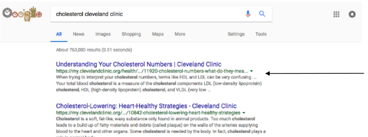

# Snippets [plain, featured, 'rich'] 

### Snippets in Google Search

- In 1998, Google introduced Snippet, a short description of, or excerpt from, a website which appears in Google search results. Snippets are created automatically based on the site's content and the query terms 

  

### Some Elementary Facts About Google Snippets

- If the snippet begins with ellipses (. . . . ) that indicates the snippet was excerpted from a larger body of text and text preceding the ellipses was omitted 
- when ellipses follow at the end of the snippet, the snippet was truncated 
- the maximum length of a snippet is 156 characters 
  - As we saw earlier, Google has played with the size 
- Google uses the meta description (if there is one) as the default for a snippet 
- if there is an Open Directory Project listing for a website, Google uses its meta description over the meta description in the web page 
  - http://www.dmoz.org
  - The Open Directory Project that uses human editors to organize websites closed as of March, 2017 

DMOZ (RIP!) looked like this: https://bytes.usc.edu/cs572/s25-555-sear-ch/lectures/snippets/clips/dmoz.mp4 


### Google Snippet Lifecycle Changes

- Classic snippet

  

- Adding images in 2016

  

- Adding videos in 2018

  

- Adding Sitelinks to snippets

  

- Adding Entity Facts)

  

- Adding Tables and Lists

  

### More Facts on Snippets

- Snippets are computed at query time 
  - They vary depending upon the query 
  - the content that ends up in the text snippet can come from anywhere on your page. First sentence, last sentence, footer, call out box 
  
- If Google determines your site is a discussion forum, in gray text they put out 
  - "[number] posts - [number] authors - Last post: [some date]"
  
    
  
- If Google determines your site is a scholarly article, in gray text they put out 
  - “by J. Smith — 2010" or “by J. Smith — Cited by 1 — Related articles” 

### Snippets Can Vary for a Single Site Depending Upon the Query

- Result for the query “what cholesterol levels mean 

  A long snippet, and a PAA


Google uses the meta description 

- A different query "cholesterol Cleveland Clinic" produces the same first result but a different snippet



### Snippets are an Instance of Summarization

- **Automatic summarization** by computer is a traditional subject of information retrieval 
- Automatic summarization is also part of machine learning and data mining 
- Document summarization tries to create a representative summary or abstract of the entire document, by finding the most informative sentences 
- There are two general approaches to automatic summarization: 
  - **extraction** Extractive methods work by selecting a subset of existing words, phrases, or sentences in the original text to form the summary 
  - **abstraction** abstractive methods build an internal semantic representation and then use natural language generation techniques to create a summary that is closer to what a human might express 
  - Research to date has focused primarily on extractive methods, which are appropriate for documents, images, and videos 


### Featured Snippets

- Featured snippets are Google's attempt to answer the query right on the search results page. 
  - Introduced in 2016, Google wants to give the user an immediate answer so they don't have to search the actual results. 
  - Featured snippets **show up above the #1 ranked spot**, and typically appear above the fold. 
  - Google pulls snippet answers from pages that rank on Page 1 of the results for that query (spots #1 through #10) - but the page that wins the featured snippet isn't necessarily the #1 resuft. Google picks the excerpt from the page that best answers the query in a simple, concise format.

### Three Types of Featured Snippets

1. Paragraph featured snippet 

   

2. List featured snippet 

   

3. Table featured snippet 

   

### Feature Snippets Results in Google Web Search: An Exploratory Study - Strzelecki, Rutecka

Paragraph snippets are the overwhelming type

Position 1, the second position on the SERP is most common.


### Modifying Your page to Produce a Featured Snippet

- Becoming a featured snippet can be achieved by simple on-page adjustments that very clearly define the topic to users 
- One of the goals of the featured snippet is to fuel voice search 
  - Create your text so it would answer a query clearly if read back on voice search?

1. Look for a place in your content to add a “What Is [Keyword]” heading tag. 
   - This sends clear signals to Google that the following text could be used for the featured snijppet 
2. Use the “is statement” e.g. 
   - "Agile methodology is a type of project management process, mainly used for software development..." 
3. Define the topic in 2 or 3 sentences 
4. Match the featured snippet format: paragraph, bulleted or numbered list, table.
5. Don't use first person, e.g. "Our avocados have many health benefits . . ." 
   - For more details see 
   - https://searchengineland.com/featured-snippets-the-9-rules-of-optimization-342627 


### Extracting a Snippet is Not Always Easy

Query: "Tesla reports financial results"


One search result and its snippet


portions of the article used to create the snippet; Note how long the article is; "financial results" equates to "earnings"


### Extracting a Snippet is Not Always Easy Nor Obvious

Query "cloud computing"

One search result and its snippet


"An easy-to-understand introduction" **occurs nowhere in the article. It is in the meta-description** "sit at your PC" occurs lower in the article.


### How Does Google Generate Snippets?

One way to find out is to go to patents.google.com and search for all patents with the term "snippets" assigned to Google 

Many are patent applications still being reviewed by the patent office 

Some are already awarded


### Lets take a closer look US Patent 8,145,617


**Title**: *Generation of document snippets based on queries and search results* 

**filed**: 2005 

**awarded**: 2012 

**Abstract**: A document retrieval system generates snippets of documents for display as part of a user interface screen with search results. The snippet may be generated based on the type of query or the location of the query terms in the document. Different snippet generation algorithms may be used depending on the query type. Alternatively, snippets may be generated **based on an analysis of the location of the query terms** in the document

### Some Guidelines for Snippet Generation

- Location Based Rules 
  - based on the location of the query terms in page. A paragraph or a portion of a paragraph might be chosen as search results snippets based on the length and distance of the paragraph from the start or end of pages. 
  - Every paragraph that includes the query terms is given a score based on the length of the paragraph and the distance of the paragraph from a predetermined location in the document, such as the beginning or the end of the document. 
    - documents that include abstracts, executive summaries or comprehensive introductions are identified and used to create a snippet 
    - Similarly, the ends of pages can be used if they include a conclusion or summarization 
- Language Dependent Rules 
  - How much of the paragraph are punctuation characters 
  - Whether the paragraph ends with punctuation or proposition 
  - Whether any of the words in the paragraph is overly long 
  - The number of bold or italicized words in the paragraph 
- Rejection rules 
  - Are shorter than a certain threshold 
  - Are mostly punctuation, or have punctuation above a certain threshold 
  - Contain italicized or bold words above a certain threshold 

### US Patent 8,145,617 Defines an Algorithm for Snippet Generation

- The algorithm 

  1. Identify the paragraphs that include the query terms 
  2. Score the paragraphs as described below determining the paragraph with the highest score 
  3. Return the phrase in that paragraph that includes the query terms 

- Quoting from the Detailed Description 

  - The snippet algorithm selects a paragraph that is near the **beginning** of the document if there is an abstract, executive summary, or long introduction. The **end** of the document is used when there is a conclusion or summarization at the end 

- Scoring includes: 

  paragraphs shorter than threshold score 0; 
  k-th paragraph from the start gets a score of

  kth-positionFactor + max(actual paragraph length, maxParagraphLen) 

  **The paragraph with the highest score is selected for the snippet** 

### US Patent 8,631,006 Snippets can be based on a User's Profile


*System and Method for Personalized Snippet Generation* 

**Filed**: April 14, 2005 

**Awarded**: Jan. 14, 2014

Snippets of text are generated based in part on a user's profile. An item, such as a document, is examined to identify terms related to the user's profile. A term profile for an identified term is compared to a user’s profile. The more closely related the identified term is to the user’s profile, the higher a similarity score will be. Alternatively, terms found in a document may have a user profile score which may be obtained by looking the term up in the user's profile. Terms having high profile similarity scores or high user profile scores are used in identifying snippets which may be relevant to a user. The high scoring terms may be added to search terms and provided to a snippet generator.


### Google's People Also Ask (PAA) Feature Introduced in 2015 for desktop and mobile


In one study, the “People Also Ask” box appeared on 364 keywords out of 1,788, 20%. 

### People Also Ask (PAA) is Growing Fast

- The “People Also Ask” box is a Google universal SERP result that answers questions related to the searcher’s initial query. 
- It is a cousin of the featured snippet 
- Each PAA box contains anywhere from one to four related questions which expand to reveal answers that Google has pulled from other websites 
- The site's URL appears below each answer, along with a “Search for” link, which guides the user to a Google SERP of the PAA question. 


### Rich Snippets

- **In 2009**, Google announced Rich Snippets, a mechanism **for website developers** to include information that Google's results algorithm will display as a snippet
- The mechanism calls for embedding structured data in web pages with the objective of displaying the structured data to a user in a visually outstanding way. 
- Rich Snippets give users a convenient summary information about their search results at a glance.
- For example,the results for Club Deluxe includes internal data such as:
  - Address, Hours, Directions


### Rich Snippets Examples: People Snippets

Here the snippets describe the pages containing the information about the individual: Facebook, LinkedIn, Google


### Rich Snippets Examples: Events

the Filmore theatre can highlight future concerts by regularly updating their webpage with the latest rich snippet information.


### Advantages of Rich Snippets

Benefits of Rich Snippets in Google Search ... 

- **Webmasters**: Provides webmasters the ability to add useful information to their web search result snippets to help Google make sense of their bits. 
- **Purpose** Provides more information to a user about the content that exists on page so they can decide which result is more relevant for their query. 
- Two good reasons for using rich snippets 
  1. **Additional traffic to a webpage** With extra information people tend to rely more on a particular search result with linked data, thus an increasing number of impressions noted on sites with Rich Snippets. 
  2. **Higher Click Through Rate** An increasing number of higher click-through rate for pages with Rich Snippets was experienced as shown in a paper by Kavi Goel, Pravir Gupta
     - http://www.dataversity.net/google-yahoo-and-bing-announce-schema-org/
- **Easy to add** simple lines of Markup to existing HTML, no affect to visual appearance of the webpage. 


### A Joint Effort by Google, Yahoo! And Bing

- In June, 2011 Google, Yahoo! and Bing agree on a single standard 
- They establish the website schema.org which defines the mechanism for creating rich snippets 
- They decide to standardize on microdata format 
- https://developers.google.com/structured-data/rich-snippets/ 


###### There is schema.org, and ALSO JSON Schema, AND JSON-LD - all of which can be [intermixed.](https://dashjoin.medium.com/json-schema-schema-org-json-ld-whats-the-difference-e30d7315686a) In addition, there is [og](https://ogp.me/)... They all have to do with enhancing/enriching content with specific keywords, for better (semantic) search and/or better presentation.


### **Rich** Snippet Technology Definitions

- Google suggests using the microdata formalism for snippets
   http://www.whatwg.org/specs/web-apps/current-work/multipage/microdata.html

  
  
   https://www.w3.org/TR/microdata/
   
    
   
   Now goes to https://html.spec.whatwg.org/multipage/
   
- Two other formalisms for creating rich snippets have been suggested:

  - RDFa (Resource Description Framework – in Attributes)
     http://en.wikipedia.org/wiki/RDFa
  - Microformat Encoding
     http://en.wikipedia.org/wiki/Microformat

### Schema.org Vocabulary

- Schema.org defines an object hierarchy 
- The most general item type is Thing with properties: name, description, url, and image 
  - Person, Place and Organization are types of Things . 
  - More specific items inherit the properties of their parent 
- Some commonly used types include: 
  - Creative works: book, movie, music recording, recipe, TV Series 
  - Embedded object: image, video
  - Organization 
  - Person
  - Place, LocalBusiness, e.g. Restaurant 
  - Product, Offer, Aggregate Offer 
  - Review, AggregateRating 


### Entities in Rich Snippet Encodings

Entities supported by Google Rich Snippets as of now.... 

- Software applications 
- Breadcrumbs 
  - a breadcrumb trail on a page indicates the page's position in the site hierarchy. A user can navigate all the way up in the site hierarchy, one level at a time, by starting from the last breadcrumb in the breadcrumb trail 
  - for example, Books > Authors > Ann Leckie > Ancillary Justice 
  - Events 
  - Music 
  - Businesses and Organizations 
  - People 
  - Products 
  - Recipes 
  - Review Ratings 
  - Reviews: should include: item being reviewed, reviewer rating, date 
  - Videos: Facebook Share 


### Rich Snippets

- **Microformats** use only existing HTML, e.g. the class attribute in HTML tags (often `<span>` or `<div>`) to assign brief and descriptive names to entities and their properties 
- **Microdata** extends HTML5 by introducing new attributes like itemprop 
- **Microformat Example**


microformat class attributes in this example include vcard, photo, title, org, adr, locality, etc 

### **A MicroData Example: A Web Page About the Movie Avatar**

- **To begin, identify the section of the page that is "about" the movie Avatar. To do this, add the itemscope element to the HTML tag that encloses information about the item, and you can specify the type of item using the itemtype attribute like this:**

```html
<div itemscope itemtype="http://schema.org/Movie">
  <h1>Avatar</h1>
  <span>Director: James Cameron (born August 16, 1954)</span>
  <span>Science fiction</span>
  <a href="../movies/avatar-theatrical-trailer.html">Trailer</a>
</div>
```

- **By adding itemscope, you are specifying that the HTML contained in the `<div>...</div>` block is about a particular item.**

### **Avatar Example Continued**

- **The `itemprop` attribute is used to label properties of a movie such as actors, director, ratings.**
- **For example, to identify the director of a movie, add `itemprop="director"` to the element enclosing the director's name.**
   *(There's a full list of all the properties you can associate with a movie at http://schema.org/Movie.)*

```html
<div itemscope itemtype="http://schema.org/Movie">
  <h1 itemprop="name">Avatar</h1>
  <span>Director: <span itemprop="director">James Cameron</span> (born August 16, 1954)</span>
  <span itemprop="genre">Science fiction</span>
  <a href="../movies/avatar-theatrical-trailer.html" itemprop="trailer">Trailer</a>
</div>
```

### Partial List of Movie Properties (Schema.org/Movie)


**'Pirates of the Caribbean'"**:

------

```html
<div itemscope itemtype="http://schema.org/Movie">
  <h1 itemprop="name">Pirates of the Caribbean: On Stranger Tides (2011)</h1>
  <span itemprop="description">
    Jack Sparrow and Barbossa embark on a quest to find the elusive fountain of youth, 
    only to discover that Blackbeard and his daughter are after it too.
  </span>

  Director:
  <div itemprop="director" itemscope itemtype="http://schema.org/Person">
    <span itemprop="name">Rob Marshall</span>
  </div>

  Writers:
  <div itemprop="author" itemscope itemtype="http://schema.org/Person">
    <span itemprop="name">Ted Elliott</span>
  </div>
  <div itemprop="author" itemscope itemtype="http://schema.org/Person">
    <span itemprop="name">Terry Rossio</span>
  </div>, and 7 more credits

  Stars:
  <div itemprop="actor" itemscope itemtype="http://schema.org/Person">
    <span itemprop="name">Johnny Depp</span>
  </div>
  <div itemprop="actor" itemscope itemtype="http://schema.org/Person">
    <span itemprop="name">Penelope Cruz</span>
  </div>
  <div itemprop="actor" itemscope itemtype="http://schema.org/Person">
    <span itemprop="name">Ian McShane</span>
  </div>

  <div itemprop="aggregateRating" itemscope itemtype="http://schema.org/AggregateRating">
    <span itemprop="ratingValue">8</span>/<span itemprop="bestRating">10</span> stars from
    <span itemprop="ratingCount">200</span> users.
    Reviews: <span itemprop="reviewCount">50</span>
  </div>
</div>
```

### **Includes**

- **Movie name**
- **Description**
- **Director**
- **Authors (Writers)**
- **Actors (Stars)**
- **Aggregate Rating** (value, best rating, rating count, review count)

### MicroData Markup for "Pirates of the Caribbean"

### More Examples: Clarifying Hard to Understand Content

### Extending Schema.org to handle PAA


### https://technicalseo.com/tools/schema-markup-generator/


- *a web interface tool for creating a rich snippet*

### https://search.google.com/test/rich-results


- Results for www.cs.usc.edu
  - 
- Results for www.usc.edu
  - 

### Google Structured Data Testing Tool


**https://search.google.com/structured-data/testing-tool**

Google has created a tool for examining a web site with microformat data and indicating if there are any errors, e.g.
 `http://www.urbanspoon.com/r/6/765421/restaurant/Pizza-My-Heart-santa-cruz`


### **Google's *Rich* Snippets Testing Tool**

 **https://developers.google.com/structured-data/testing-tool/**


### **Google Introduces New Tags for Snippet Control(1)**

- The robots meta tag is added to an HTML page's `<head>`; here are some new tags:
  - **"nosnippet"**
     This is an existing option to specify that you don't want any textual snippet shown for this page.
  - **"max-snippet:[number]"**
     *New!* Specify a maximum text-length, in characters, of a snippet for your page.
  - **"max-video-preview:[number]"**
     *New!* Specify a maximum duration in seconds of an animated video preview.
  - **"max-image-preview:[setting]"**
     *New!* Specify a maximum size of image preview to be shown for images on this page, using either `"none"`, `"standard"`, or `"large"`.
- They can be combined, for example:

```html
<meta name="robots" content="max-snippet:50, max-image-preview:large">
```

### **Google Introduces New Tags for Snippet Control(2)**

- A new way to help limit which part of a page is eligible to be shown as a snippet is the **"data-nosnippet"** HTML attribute on span, div, and section elements.
  - With this, you can prevent that part of an HTML page from being shown within the textual snippet on the page.

- **For example:**

```html
<p><span data-nosnippet>Harry Houdini</span> is undoubtedly the most famous magician ever to live.</p>
```

- **To opt out of featured snippets**
  - The **nosnippet tag** blocks all snippets (featured snippets and regular snippets) for the tagged page.
  - Text marked by the **data-nosnippet tag** won't appear in featured snippets (or regular snippets either).
  - If both `nosnippet` and `data-nosnippet` appear in a page, `nosnippet` takes priority, and snippets won't be shown for the page.


### **Summary**

- **Snippets can be divided into five categories**
  1. **Regular snippets**, displayed in organic search results
  2. **Rich snippets** come from structured data dictionary schema.org including RDFa, Microdata or JSON
  3. **Google News**, created automatically from news feeds to Google
  4. **Entity types**, come from the KnowledgeGraph, are constructed object and concepts including people, movies, places, events, books, etc
  5. **Featured snippets**, determine that a page contains a likely answer to the user’s question; the snippet is displayed. In four different forms: paragraph, table, ordered list, unordered list