### Search Engine History and Basics

##### Archie, Veronica, Gopher

- By late 1980’s many files were available by anonymous FTP. 
- In 1990, Alan Emtage, P. Deutsch, et al of McGill Univ. developed Archie (short for “archives”) 
  - Assembled lists of files available on many FTP servers. 
  - Allowed regex search of these file names. 
- In 1993, Veronica and Jughead were developed to search names of text files available through Gopher servers 
  - The **Gopher protocol** is a TCP/IP application layer protocol designed for distributing, searching, and retrieving documents over the Internet. Strongly oriented towards a menu-document design 
  - The Gopher ecosystem is often regarded as the effective predecessor of the World Wide Web


##### Excite

- Excite came from the project Architext, which was started in February, 1993 by six Stanford undergrad students.
  - They had the idea of using statistical analysis of word relationships to make searching more efficient. 
  - They were soon funded, and in mid 1993 they released copies of their search software for use on web sites. 
- Later developments 
  - Excite was bought by a broadband provider named @Home in January, 1999 for $6.5 billion, and was named Excite@Home. In October, 2001 Excite@Home filed for bankruptcy. InfoSpace bought Excite from bankruptcy court for 10 million dollar 
  - www.excite.com still exists as a portal 

##### World Wide Web Wanderer

- In June 1993 Matthew Gray while at MIT introduced the World Wide Web Wanderer. 
  - Initial goal was to measure the growth of the web by counting active web servers. He soon upgraded the software to capture actual URL's. His database became known as the Wandex. 
- The World Wide Web Wanderer was a Perl-based web crawler that was first deployed in June 1993 
- Matthew Gray now works for Google. 
- While the Wanderer was probably the first web robot, and, with its index, clearly had the potential to become a general-purpose WWW search engine it never went that far 
- The Wanderer charted the growth of the web until late 1995.

##### Aliweb

- In November of 1993 Martijn Koster created “Archie-Like Indexing of the Web”, or ALIWEB in response to the Wanderer. 
  - Some consider it to be the first Web search engine 
- ALIWEB crawled meta information and allowed users to submit their pages they wanted indexed with their own page description. 
- This meant it needed no bot to collect data and was not using excessive bandwidth. 
- One downside of ALIWEB was that people did not know how to submit their site

##### Altavista

- AltaVista debut online came during December, 1995. AltaVista brought many important features to the web scene. 
  - They were the first to allow natural language queries 
  - They offered advanced searching techniques 
  - They allowed users to add or delete their own URL within 24 hours. 
  - They even allowed inbound link checking. AltaVista also provided numerous search tips and advanced search features. 
- Later developments 
  - On February 18, 2003, Overture signed a letter of intent to buy AltaVista for 80 million dollar in stock and 60 million dollar cash. After Yahoo! bought out Overture they rolled some of the AltaVista technology into Yahoo! Search, and occasionally used AltaVista as a testing platform.

##### Lycos

- Lycos was designed at Carnegie Mellon University around July of 1994. Michael Loren Mauldin was responsible for this search engine and was the chief scientist at Lycos Inc in the early years. 
- On July 20, 1994, Lycos went public with a catalog of 54,000 documents. 
  - In addition to providing ranked relevance retrieval, Lycos provided prefix matching and word proximity bonuses. 
  - Lycos' main difference was the sheer size of its catalog: by August 1994, Lycos had identified 394,000 documents; by January 1995, the catalog had reached 1.5 million documents; and by November 1996, Lycos had indexed over 60 million documents -- more than any other Web search engine. 

- In October 1994, Lycos ranked first on Netscape's list of search engines 
- Lycos has gone through a series of owners, and it still exists as www.lycos.com 

##### Infoseek

- Infoseek also started out in 1994, founded by Steve Kirsch 
- In December 1995 they convinced Netscape to use them as their default search engine, which gave them major exposure. 
- One popular feature of Infoseek was allowing webmasters to submit a page to the search index in real time, which was a search spammer's paradise 
- They were the first search engine to sell advertising on a CPM (Cost per Thousand) impressions basis 
- Infoseek was bought by Walt Disney Company in 1998

##### Yahoo

- In 1994, two Stanford Ph.D. students David Filo and Jerry Yang posted web pages with links on them, organized into a topical hierarchy. 
- As the number of links began to grow, they developed a hierarchical listing. As the pages become more popular, they developed a way to search through all of the links. 
- Early on all the links on the pages were updated manually rather than automatically by spider or robot and the search feature searched only those links 
- Yahoo home page acted as a portal with Email, Finance, and Groups being very successful; however after 2000 usage declined 
- After many years of decline Yahoo was purchased by Verizon in 2017 for $4.48 billion, and it lives on

##### Looksmart

- Looksmart was founded in 1995 in Australia. They competed with the Yahoo! Directory by frequently increasing their inclusion rates •
- Later developments 
  - In 2002 Looksmart transitioned into a pay per click provider, which charged listed sites a flat fee per click. They syndicated those paid listings to some major portals like MSN. 
  - The problem was that Looksmart became too dependant on MSN, and in 2003, when Microsoft announced they were dumping Looksmart that basically killed their business model. 
  - In March of 2002, Looksmart bought a search engine by the name of WiseNut, but it never gained traction 
- See https://en.wikipedia.org/wiki/LookSmart

##### Inktomi

- The Inktomi Corporation came about on May 20, 1996 with its search engine Hotbot. Two Cal Berkeley cohorts created Inktomi from the improved technology gained from their research 
- Later developments 
  - In October of 2001 Inktomi accidentally allowed the public to access their database of spam sites, which listed over 1 million URLs at that time. 
  - Inktomi pioneered the paid inclusion model in which a website pays a fee to the search engine that guarantees the site will be displayed when certain search terms are entered 
  - The model was nowhere near as efficient as the pay-per-click auction model developed by Overture. Licensing their search results also was not profitable enough to pay for their scaling costs. They failed to develop a profitable business model, and sold out to Yahoo! for approximately $235 million, or 1.65 a share, in December of 2003.

##### Ask Jeeves

- In April of 1997 Ask Jeeves was launched as a natural language search engine. 
  - Ask Jeeves used human editors to try to match search queries. 
  - Ask was powered by DirectHit for a while, which aimed to rank results based on their popularity, but that technology proved too easy to spam. 
  - In 2000 the Teoma search engine was released, which uses clustering to organize sites by Subject Specific Popularity, which is another way of saying they tried to find local web communities. In 2001 Ask Jeeves bought Teoma to replace the DirectHit search technology. 
  - On March 21, 2005 Barry Diller's IAC agreed to acquire Ask Jeeves for 1.85 billion dollars. IAC owns many popular websites like Match.com, Ticketmaster.com, and Citysearch.com, and is promoting Ask across their other properties. 
  - In 2006 Ask Jeeves was renamed to Ask.

##### Google

- Google is a play on the word Googol, coined by Milton Sirotta; it refers to a 1 followed by 100 zeros, 10000000…..0 
- A googol is bigger than the number of atoms in the universe 
- Google was founded by Larry Page and Sergey Brin, two Stanford Univ. Computer Science graduate students 
- In 1998 they built a prototype system called BackRub, dropped out of school, and tried to attract investors for their new company 
- Google Inc. released a beta version on Sept. 7, 1998 
- www.google.com was officially released on Sept. 21, 1999

##### A Brief Chronology of Search Engines

- Algorithmic Search Era

  - **1991-1993**: Gopher/Archie/Veronica - Early Internet Search Engines **1994**: Yahoo, Lycos **1995**: Excite, Alta Vista **1996**: Inktomi, Hotbot **1997**: Ask Jeeves **1998**: Google
- Paid Search Era (paid search became pervasive)
  - **1998**: *Goto.com* introduces pay-per-click search results **2000**: Overture (*goto.com*) is the first to combine sponsored (paid) search results with conventional search results **2001**: Google begins AdWords and Pay-Per-Click **2002**: Google begins to include pay-per-click search results

### Search Engine Basic Behavior

##### What is Web Search?

- Providing access to heterogeneous, distributed information that is publicly available on the World Wide Web 
  - Information comes in many different formats 
  - Most of the information has not been screened for accuracy 
- Multi-billion dollar business 
- Source of new opportunities in marketing 
- Strains the boundaries of trademark and intellectual property laws 
- A source of unending technical challenges

##### Web Search Engine Definitions

- “A search engine is a program designed to help find information stored on a computer system such as the World Wide Web, inside a corporate or proprietary network or a personal computer” wikipedia 
  - **search engine** usually refers to a Web search engine, which searches for information on the public Web. 
  - Other kinds of search engine are **enterprise search engines**, which search on intranets, 
  - **personal search engines**, which search individual personal computers

##### Basic Web Search Internals

- Major Elements: 1. **The User**   2. **The Web**   3. **The Crawler/Spider**   4. **The Indexer**   5. **The Ads**   6. **The Query Processor**   

- Web Search Process: -**The Web**: Contains multiple interconnected web pages. - **Web Spider (Crawler)**: Visits web pages, collects data, and sends it to the **Indexer**. - **Indexer**: Processes the collected data and stores it in **Indexes**. - **Indexes**: Databases that store indexed web content. - **Query Processor**: Takes user queries, searches the indexes, and retrieves relevant results. - **Search Results**: Displayed to the user with relevant ads from **Ad Indexes**. 

- Diagram Representation: - User enters a query in the **Search Box**. - The **Query Processor** fetches relevant results from the **Indexes**. - The **Ad Indexes** provide paid advertisements relevant to the query.

##### Web Search Engine Elements

- Spider (a.k.a. crawler/robot) - builds corpus 
  - Collects web pages recursively 
    - For each known URL, fetch the page, parse it, and extract new URLs 
    - Repeat 
  - Additional pages come from direct submissions & other sources 
- The indexer – creates inverted indexes 
  - Various policies wrt which words are indexed, capitalization, support for Unicode, stemming, support for phrases, etc. 
- Query processor – serves query results 
- Front end – query reformulation, word stemming, capitalization, optimization of Booleans, etc. 
- Back end – finds matching documents and ranks them

The Web

No design/co-ordination • Distributed content creation, linking • Content includes truth, lies, obsolete information, contradictions … • Data is stored in structured (databases), semi-structured (tables)… • Scale larger than previous text corpora • Growth – still expanding • Content can be dynamically generated

The User

Diverse in background/training – Users sometimes cannot tell the difference between a search bar from the URL address field (Chrome conflates the two) – Users rarely use the scroll bar, so key results must be at or near the top • Diverse in access methodology – Increasingly, high bandwidth connectivity – Growing segment of mobile users: limitations of form factor – keyboard, display • Diverse in search methodology – Search, search + browse, – Average query length ~ 2.5 terms – Has to do with what they’re searching for • Poor comprehension of syntax – Early engines offered rich syntax for queries – Boolean, phrase, etc. – Current engines hide these

User’s Information Needs Are Diverse

- Informational – want to learn about something (~40%) e.g. Low hemoglobin
- Navigational – want to go to that page (~25%) e.g. United Airlines
- Transactional – want to do something (web-mediated) (~35%) 
  - Access a service e.g. Los Angeles weather
  - Downloads  e.g. Mars surface images
  - Shop e.g. Nikon CoolPix Camera
- Gray areas – Find a good hub – Exploratory search “see what’s there”  e.g. Car rental in Finland

Query Processing is Now Extremely Clever

• Query processing involves much more than just matching query terms with document terms • Semantic analysis of the query includes: 1. Determining the language of the query 2. Filtering of unnecessary words from the query (stop words) 3. Looking for specific types of queries, e.g. • Personalities (triggered on names) • Cities (travel info, maps) • Medical info (triggered on names and/or results) • Stock quotes, news (triggered on stock symbol) • Company info … 4. Determining the user’s location or the target location of the query 5. Remembering previous queries 6. Maintaining a user profile

Google Maintains Your Recent Query History

Maintain previous queries Helps to minimize typing Allow users to remove old ones

Results are Holistic A Person Query

Includes the following: Latest news Biography Photos Basic facts born married parents career

A Person Query

Includes the following: Official site Map Essential facts founded area weather time population

A Place Query

Includes the following: Official site Map Essential facts founded area weather time population

An Hotel Query	

Includes the following: Main hotel website Map Address Phone number Price of a room Directions

Google Retains a User’s Entire Query History!

They claim that only I can see my history; I have issued a total of 18,960 queries; Graphs show my queries by hour and by week; I can view my Web queries as distinct from my Image queries or my News queries, etc As a result, Google now knows a great deal about us!

Search Engines are an Industry

The search engine industry is 20+ years old, having started with WebCrawler and Lycos in 1994 who sold banner ads as their business model • Search engine revenue today – Google: 2021:$257 Billion; 2020: $181 Billion; 2019: $162 Billion; 2018: $116 Billion; 2017: $109 Billion; 2016: $90 Billion; 2015: $74.5 Billion; 2014: $66 Billion; 2013: $37 Billion – Baidu: 2021: $31 Billion; 2020: $16.4 Billion; 2019: $15 Billion; : $11.3 Billion; 2017: $13 Billion; 2016: $10.1 Billion; 2015: $10.2 Billion; 2014: 8.0 Billion – Yahoo: 2021: 5.2Billion; 2019: 6.97Billion; 2018: 3.03 Billion; 2017: 3.0 Billion; 2016: 2.98 Billion;2015: $4.9 Billion; 2014: 4.6 Billion; 2013: 4.6Billion – Bing: 2020 $7.74 Billion; 2019: $7.63 Billion; 2018: $7.01 Billion • Microsoft says that in Q1 2016 Bing became profitable

Google is a Monopoly Gatekeeper for the Internet

The US is suing Google for anti-Trust violations – Google claims it has strong competition in search!!! – Google has sweetheart deals with Apple andpays Apple $8+ Billion/year to be their default search engine • Google maintains the largest index of the web – Some websites actually deny access to crawlers other than Google and Bing as these other crawlers bring in little traffic and consume server cycles – Only Google and Bing have the resources to maintain such a large index, e.g. DuckDuckGo no longer crawls the web and uses Bing’s index


web serving basics

Web Trends and Measurements

Web Trends

Web has changed dramatically over the last 30+ years • If one is building a web search engine today it is important to understand the different dimensions of the web – Scale, complexity and growth are only a few important factors • In today’s lecture I try to quantify some of the trends to better understand where the web is going and why • many of the early slides come from Mary Meeker (formerly of) Kleiner, Perkins, Caufield and Byers, a major venture capital firm, http://www.kpcb.com/

A total of 5.03 billion people around the world use the internet today – equivalent to 63.1 percent of the world's total population

The US leads in the development of highly popular Internet websites; Baidu is a Chinese search engine Tencent is a Chinese holding company of Internet properties, among the most popular being, QQ, for chatting; Sohu.com Inc. is a Chinese online media, search, gaming, community and mobile service group. 3/14 6 of top 10 global internet properties made in USA... >86% of their users outside of america...china rising fast

China Mobile Internet Users = 817MM.+9% vs. +8% Y/Y

China Mobile Internet Usage Leaders... Tencent + Alibaba + Baidu = 71% of Mobile Time Spent

Global smartphone shipments from 2009 to 2021

There has been exponential growth in online information; 1 Zettabyte = 1,024 Exabytes 1 Exabyte = 1,024 Petabytes 1 Petabyte = 1,024 Terabytes 1 Terabyte = 1,024 Gigabytes or 1 Zettabyte = 1,000,000,000,000 gigabytes World's content is increasingly findable + shared + tagged - digital info created + share up 9x in five years

500 million photos are uploaded every day and that number is doubling every year Yahoo has recently made a major upgrade to Flickr Instagram was in 2010 purchased by Facebook for 1 billion dollar Snapchat is a photo messaging application developed by two Stanford students ($9B valuation); Photos alone = 1.8B+ uploaded and shared per day... growth remains robust as new real time platforms emerge

Content Uploaded to YouTube

 As of February 2020, more than 500 hours of video were uploaded to YouTube every minute. • This equates to approximately 30,000 hours of newly uploaded content per hour. • The number of video content hours uploaded every 60 seconds grew by around 40 percent between 2014 and 2020.

Mobile Accounts for 50% of Web Traffic

In the second quarter of 2022, mobile devices (excluding tablets) generated 58.99 percent of global website traffic, consistently hovering around the 50 percent mark since the beginning of 2017 before permanently surpassing it in 2020.

Tablet Growth = More rapid than smartphones, ipad  = ~3x iphone growth

Product Finding = often starts @ search (Amazon + Google...)

Technology Cycles - Still Early Cycle on smartphones + tablets, Now wearables coming on strong, faster than typical 10-year cycle.

Re-imagination of computing operating systems- ios+android = 60% share vs. 35% for windows

Major Cloud Providers

Amazon Web Services (AWS) leading cloud charge...

Computing Big Bangs Volume Effects = Cloud revenue re-accelerating +58% + 54% Q/Q

Google Voice Search Queries 

Google Trends imply queries associated with voice-related commands have risen >35x since 2008 after launch of iPhone & Google Voice Search

Voice-based mobile platform front-ends = voice can replace typing

.Voice = 47MM Amazon Echo Base + ~2x in One Year

Summary of Recent Trends in Web/Internet Development

Growth in number of users connected • Growth in Smartphone use • Growth in digital data, especially photos and video • Growth in Social Media as an advertising platform • Transition from desktop/laptop use to mobile • Growth in tablet usage over desktops/laptops • Decreased dominance of Microsoft Windows • Move away from server farms to cloud computing • Growth in voice communication with devices

Measuring the Web

The World Wide Web (the Web, the publicly accessible web) is so dynamic it is hard to describe it and have the description be valid for very long • In this lecture we look at what is known, – Measuring the Web by number of web sites – Measuring the Web by the Languages of Web Pages – Measuring the Web by Rate of Change of Pages – Measuring the Web by Document Content Type – Measuring the Web by linkage – Measuring the Web as a Graph – Measuring the Web by Content – (using the best statistics we can find)

Number of Websites

Jan. 2020: ~1.7 Billion sites nginx web server had the largest growth; Over 50% of websites Are hosted either by Apache or nginx; But Microsoft web servers still power 43.2% of all sites Around 75% of websites are not active, but parked http://www.internetlivestats.com/total-number-of-websites/

Number of websites in the world ே The global number of websites has more than doubled from 2015 to 2021. Websites growth rate from 1991 to 2021

Distribution Across TLDs

136 million in .com, 21million in .tk, 14 million in .de, etc what is .tk and why is it so large? (Tokelau)

Web Page Language Diversity

The Web contains pages in many different languages • Characters in a language are encoded such that each character is paired with a number • Unicode and its parallel standard, the ISO/IEC 10646 Universal Character Set, together constitute a modern, unified character encoding. • Most modern web browsers feature automatic character encoding detection. In Firefox, for example, see the View/Character Encoding submenu, shown below • In HTML one can specify the character encoding using •  • If charset is missing ISO8859-1 is taken as the default unless there is a browser setting; • Websites in non-western languages typically use UTF-8

Measuring Language Diversity

It is estimated that about 40,000 different languages have been created by human beings • Only between 6,000-9,000 are still in use • Study done by the United Nations – http://unesdoc.unesco.org/images/0018/ 001870/187016e.pdf – The methodology was to examine the pages on a search engine and attempt to identify the primary language in which the page is written – Conclusions • From 1996 – 2008 English was predominant, occupying roughly 80% of web pages • At the same time the number of Internet users who had English as their primary language dropped from 80% to 40%

Complexity of Data Types

Proliferation of Content Types Available

By some accounts, there are 16,000 to 51,000 content types* • What to do with content types? – Parse them • How? The Apache Tika™ toolkit detects and extracts metadata and text content from various documents using existing parser libraries. Tika unifies these parsers under a single interface. Tika is useful for search engine indexing • Extract their text and structure – Index their metadata • Use an indexing technology like • Lucene, http://lucene.apache.org/ • Solr, http://lucene.apache.org/solr/ • Google Search Appliance (http://www.google.com/enterprise/search/products/gsa.html) – Identify what language they belong to • N-grams

*http://filext.com/ (see if you can name the top 20 file extensions)

Content Types Indexed by Google

Considering the fact that there are thousands of file types of content stored on the web, Google actually indexes only a small number, less than 3 dozen, but they may well constitute far more than a majority of the available content

A Summary of Some Web Facts

How many websites? ~1.86 billion • How are they distributed across TLDs or across countries? – 112 million out of 148 million belong to .com or about 72% • How many web pages are there? 30 trillion unique URLs from Google found in 2012, see http://googleblog.blogspot.com/2008/07/we-knew-web-was-big.html • Which content types hold the most information: HTML, PDF, Word, Excel, PPT, others? – There are thousands of different content types • How much storage is required to hold a single snapshot of the Web? – 1 trillion web pages at 100K bytes per page requires 100 petabytes • 1 petabyte storage costs under $1,000, so $100,000 of equipment will work – Google processes 24 petabytes per day, http://en.wikipedia.org/wiki/Petabyte – The Internet Archive has more than 10 petabytes, http://en.wikipedia.org/wiki/Internet_Archive • What are the languages in which the documents are written? – According to the Internet Archive, about 55% is in English; other popular languages include: French, German, Spanish and Chinese, also see http://en.wikipedia.org/wiki/Languages_used_on_the_Internet • General properties of the Web graph – In-degree and out-degree distribution follows a power law • Categories of Content: pornography, spam, mirrors – Presumably there is a lot of the above, but little concrete data on how much

Manual Hierarchical Web Taxonomies

Yahoo originally used human editors to assemble a large hierarchically structured directory of web pages. – http://www.yahoo.com/ – Yahoo still retains the hierarchy as seen to the left; under european cars we see categories: regional with 93 matches, business & economy with 79 matches, etc

Open Directory Project

Open Directory Project, known as DMoZ, is an effort to organize the web according to an ontology; • An approach similar to Yahoo’ s; • Based on the distributed labor of volunteer editors (“net-citizens provide the collective brain”). • Used by most other search engines. • Started by Netscape. – http://www.dmoz.org/ • Distributes its data using RDF format • DMOZ shut down in 2016

Drilling Down By Category

Selecting Category “Science” Selecting Category “Computer Science”

Internet Archive

The Internet Archive has been taking a snapshot of the World Wide Web every two months since 1997 – has used Apache Nutch • The results are made available through the Wayback Machine, • Its database is approximately 4.5 petabytes • The founder is Brewster Kahle • For the past 13 years, the Internet Archive has been growing rapidly, most recently by about 100TB of data per month. • Their crawler surveys the web every two months The algorithm first performs a broad crawl that starts with a few "seed sites," such as Yahoo's directory. After snapping a shot of the home page, it then moves to any referable pages within the site until there are no more pages to capture. If there are any links on those pages, the algorithm automatically opens them and archives that content as well.

Surface Web vs. Deep Web vs. Dark Web


Search Engine Evaluation

Outline

Defining precision/recall • Mean Average Precision • Harmonic Mean and F Measure • Discounted Cumulative Gain • Elements of Good Search Results • Google's Search Quality Guidelines • Using log files for evaluation • A/B Testing

Comparing Bing and Google

\- This site is no longer active, but we can simulate the experiment Try it yourself! here are some queries: - ac versus dc current - best bottled water - worst hotel in Santa Monica - how many gears do I need on a bicycle - Clint Eastwood’s best movie

Precision/Recall

How do we measure the quality of search engines? • Precision = #(relevant items retrieved) divided by #(all retrieved items) • Recall = #(relevant items retrieved) divided by #(all relevant items)

Formalizing Precision/Recall

|               | Relevant            | Nonrelevant         |
| ------------- | ------------------- | ------------------- |
| Retrieved     | True positive (tp)  | False Positive (fp) |
| Not Retrieved | False negative (fn) | True Negative (tn)  |

Precision = tp/(tp + fp), Recall = tp/(tp + fn) 

The accuracy of an engine is defined as: the fraction of these classifications that are correct (tp + tn) / ( tp + fp + fn + tn)

For web applications, Precision is more important than Recall 

##### Precision/Recall Using Set Notation

**A** is the set of relevant documents,
**B** is the set of retrieved documents.

|                   | Relevant     | Non-Relevant   |
| ----------------- | ------------ | -------------- |
| **Retrieved**     | $A \cap B$   | $A^c \cap B$   |
| **Not Retrieved** | $A \cap B^c$ | $A^c \cap B^c$ |

**Recall**
$$
Recall = \frac{|A \cap B|}{|A|}
$$
**Precision**
$$
Precision = \frac{|A \cap B|}{|B|}
$$
Precision/Recall Two Observations

You can get high recall (but low precision) by retrieving all docs for all queries! – a rather foolish strategy • In a good system, precision decreases as the number of docs retrieved (or recall) increases – This is not a theorem, but a result with strong empirical confirmation – E.g. viewing multiple pages of Google results often does not improve precision at all

Harmonic Mean

There are three Pythagorean means – 1. arithmetic mean, 2. geometric mean, 3. harmonic mean – of course we all know how to compute the arithmetic mean – the geometric mean is the nth root of the product of n numbers • The harmonic mean tends strongly toward the least element of the list making it useful in analyzing search engine results • To find the harmonic mean of a set of n numbers 1. add the reciprocals of the numbers in the set 2. divide the sum by n 3. take the reciprocal of the result • e.g. for the numbers 3, 6, 9, and 12 – The arithmetic mean is: (3+6+9+12)/4 = 7.5 – The geometric mean is: nth-root(3*6*9*12) = 4th-root(1944) = 6.64 – The harmonic mean is: (1/3+1/6+1/9+1/12)=(.33+.16+.11+.08)/4=0.17 and 1/0.17 = 5.88

F Measure

- The harmonic mean of precision and recall is often used as an aggregated performance score for the evaluation of algorithms and systems, called the **F-score (or F-measure).**

- **Harmonic mean** of recall and precision is defined as:
  $$
  F = \frac{1}{\frac{1}{2} \left(\frac{1}{R} + \frac{1}{P}\right)} = \frac{2RP}{(R+P)}
  $$

  - The harmonic mean emphasizes the importance of small values, whereas the arithmetic mean is affected more by outliers that are unusually large.

- **More general form of F-Measure**

  - $\beta$ is a parameter that controls the relative importance of recall and precision.

  $$
  F_{\beta} = \frac{(\beta^2 + 1)RP}{(R + \beta^2 P)}
  $$

Calculating Recall/Precision at Fixed Positions

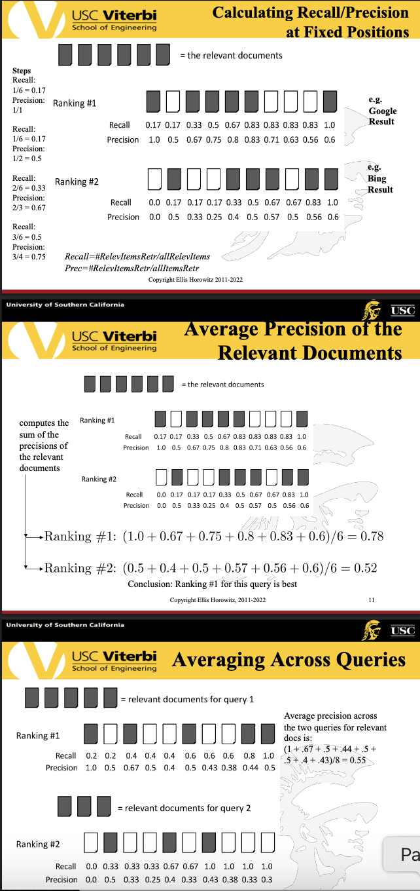

Averaging Across Queries

Mean average precision (MAP) for a set of queries is the mean of the average precision scores for each query. 

$MAP = \frac{\sum^Q_{q=1}AveP(q)}{Q}$

where Q is the number of queries • Summarize rankings from multiple queries by averaging average precision • This is the most commonly used measure in research papers • Assumes user is interested in finding many relevant documents for each query • Requires many relevance judgments in text collection

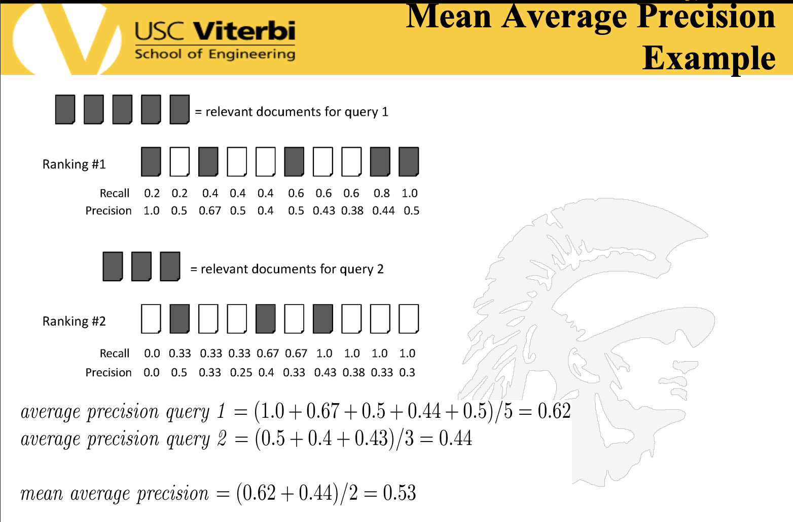

More on Mean Average Precision Calculation

Mean Average Precision (MAP) § Some negative aspects – If a relevant document never gets retrieved, we assume the precision corresponding to that relevant doc to be zero (this is actually reasonable) – Each query counts equally – MAP assumes user is interested in finding many relevant documents for each query – MAP requires many relevance judgments in the document collection

Difficulties in Using Precision/Recall

Should average over large document collection and query ensembles • Need human relevance assessments – But people aren’t always reliable assessors • Assessments have to be binary – Nuanced assessments? • Heavily skewed by collection/authorship – Results may not translate from one domain to another

A Final Evaluation Measure: Discounted Cumulative Gain

The premise of DCG is that highly relevant documents appearing lower in a search result list should be penalized as the graded relevance value is reduced logarithmically proportional to the position of the result. • The discounted CG accumulated at a particular rank position p is defined as 

$DCG_p = \sum^p_{i=1}\frac{rel_i}{log_2(i+1)} = rel_1+\sum^p_{i=2}\frac{rel_i}{log_2(i+1)}$

where $rel_i$ is the graded relevance of the result at position i • Gain is accumulated starting at the top of the ranking and may be reduced, or discounted, at lower ranks • Typical discount is 1/log (rank) – With base 2, the discount at rank 4 is 1/2, and at rank 8 it is 1/3 • An alternative formulation of DCG places stronger emphasis on retrieving relevant documents:

$DCG_p = \sum^p_{i=1}\frac{2^{rel_i}-1}{log_2(i+1)}$

Discounted Cumulative Gain Example

we want high weights for high rank documents, because searchers are likely to inspect them, and low weights for low rank documents that searchers are unlikely to ever see. The discount factor is commonly chosen as log2(rank + 1) and is used to divide the relevance grade. Using a logarithm for the position penalty makes the decay effect more gradual compared to using the position itself.

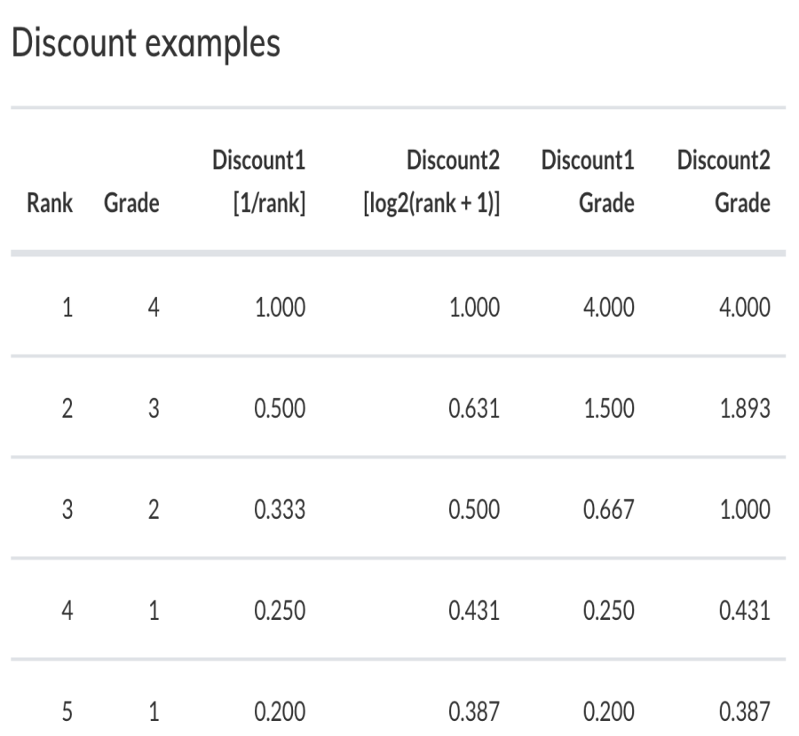

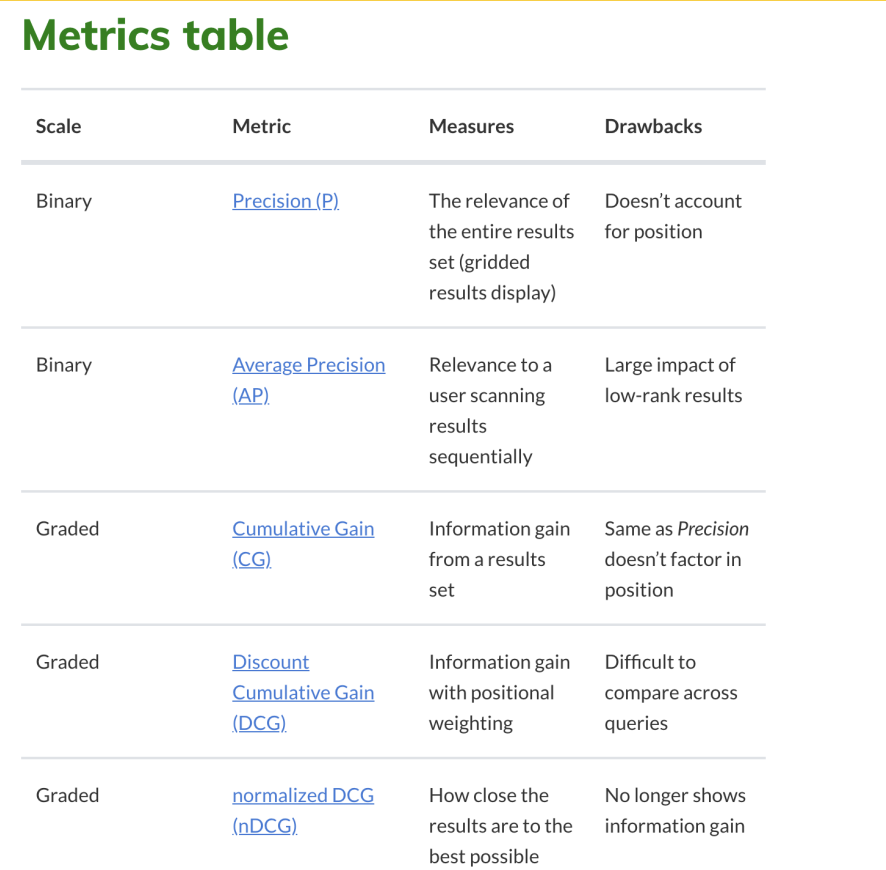

How Evaluation is Done at Web Search Engines

§ Search engines have test collections of queries and hand-ranked results § Recall is difficult to measure on the web § Search engines often use precision at top k positions, e.g., k = 10 § . . . or measures that reward you more for getting rank 1 right than for getting rank 10 right. § Search engines also use non-relevance-based measures § Click-through on first result § Not very reliable if you look at a single click-through … but pretty reliable in the aggregate. § Studies of user behavior in the lab § A/B testing

Google's Search Quality Rating Guidelines Document

Google relies on raters, working in many countries and languages around the world • The data they generate is rolled up statistically to give – a view of the quality of search results and search experience over time, and – an ability to measure the effect of proposed changes to Google’s search algorithms

Google's Search Quality Ratings Guidelines Document

This document gives evaluators examples and guidelines for appropriate ratings. • the evaluator looks at a search query and a result that could be returned. They rate the relevance of the result for that query on a scale described within the document.

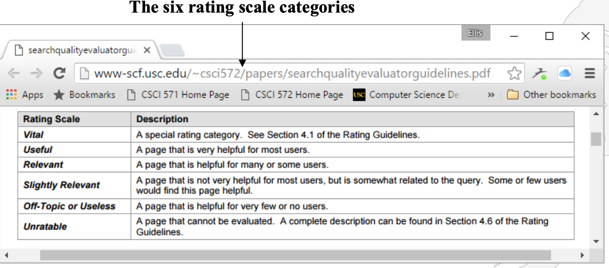

Google's 4-Step Process for Changing Their Search Algorithm

1. Precision Evaluations People use the Guidelines to rate search results 2. Side-by-Side Experiments people are shown two different sets of search results and asked which they prefer 3. Live Traffic Experiments the search algorithm is altered for a small number of actual users 4. Full Launch A final analysis by Google engineers and the improvement is released

A/B Testing at Web Search Engines

A/B testing is comparing two versions of a web page to see which one performs better. You compare two web pages by showing the two variants (let's call them A and B) to similar visitors at the same time. The one that gives a better conversion rate, wins! 1. Purpose: Test a single innovation 2. Prerequisite: You have a large search engine up and running. 3. Have most users use old system 4. Divert a small proportion of traffic (e.g., 1%) to an experiment to evaluate an innovation 5. Evaluate with an automatic measure like click through on first result • we directly see if the innovation does improve user happiness • This is the evaluation methodology large search engines trust the most

USING USER CLICKS FOR EVALUATION

What Do Clicks Tell Us?

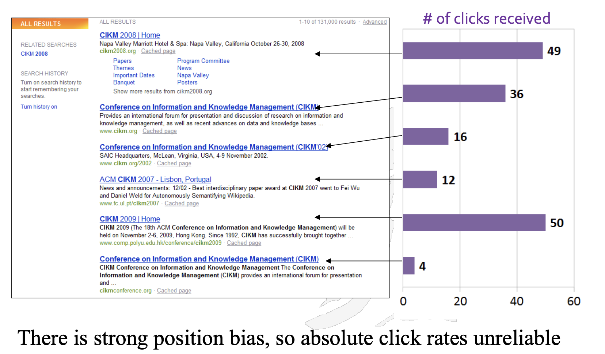

Relative vs Absolute Ratings

User's click sequence: Result 1 -> Result 2 -> Result 3

Hard to conclude Result1 > Result3 Probably can conclude Result3 > Result2

Query Logs

Used for both tuning and evaluating search engines – also for various techniques such as query suggestion • Typical contents of the query log files – User identifier or user session identifier – Query terms - stored exactly as user entered them – List of URLs of results, their ranks on the result list, and whether they were clicked on – Timestamp(s) - records the time of user events such as query submission, clicks

How Query Logs Can Be Used

Clicks are not relevance judgments – although they are correlated – biased by a number of factors such as rank on result list • Can use clickthough data to predict preferences between pairs of documents – appropriate for tasks with multiple levels of relevance, focused on user relevance – various “policies” used to generate preferences

A Final Thought Google's Enhancements of Search Results

Display improvements • immediate answers • autocomplete anticipations Extensions to More Data • results from books • results from news • results from images • results from patents • results from air schedules New Input forms • search by voice • search by image information retrieval improvements • snippets • spelling correction • translations • People Also Ask boxes • use of synonyms • use of knowledge graph

The page below discusses the many aspects that go into producing search results at Google https://www.google.com/search/howsearchworks


### Crawlers and Crawling

There are Many Crawlers

A web crawler is a computer program that visits web pages in an organized way – Sometimes called a spider or robot • A list of web crawlers can be found at http://en.wikipedia.org/wiki/Web_crawler Google’s crawler is called googlebot, see http://support.google.com/webmasters/bin/answer.py?hl=en&answer=182072 • Yahoo’s web crawler is/was called Yahoo! Slurp, see http://en.wikipedia.org/wiki/Yahoo!_Search • Bing uses five crawlers – Bingbot, standard crawler – Adidxbot, used by Bing Ads – MSNbot, remnant from MSN, but still in use – MSNBotMedia, crawls images and video – BingPreview, generates page snapshots • For details see: http://www.bing.com/webmaster/help/which-crawlers-does-bing-use-8c184ec0

Web Crawling Issues

How to crawl? – Quality: how to find the “Best” pages first – Efficiency: how to avoid duplication (or near duplication) – Etiquette: behave politely by not disturbing a website’s performance • How much to crawl? How much to index? – Coverage: What percentage of the web should be covered? – Relative Coverage: How much do competitors have? • How often to crawl? – Freshness: How much has changed? – How much has really changed?

Simplest Crawler Operation

Initialize (begin with known “seed” pages) • Loop: Fetch and parse a page – Place the page in a database – Extract the URLs within the page – Place the extracted URLs on a queue – Fetch a URL on the queue and repeat

Crawling Picture

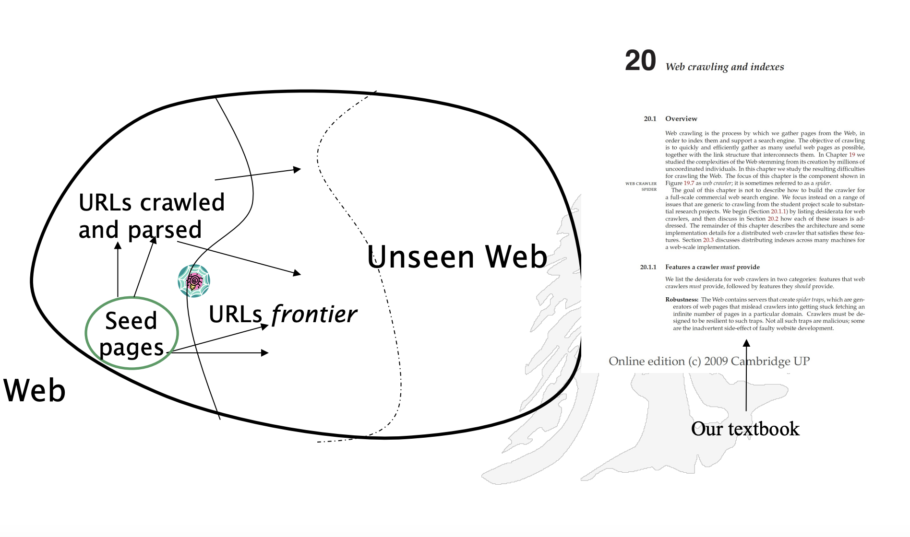

Simple Picture – Complications

Crawling the entire web isn’t feasible with one machine – But all of the above steps can be distributed • Challenges – Handling/Avoiding malicious pages • Some pages contain spam • Some pages contain spider traps – especially dynamically generated pages – Even non-malicious pages pose challenges • Latency/bandwidth to remote servers can vary widely • Robots.txt stipulations can prevent web pages from being visited • How can one avoid mirrored sites and duplicate pages – Maintain politeness – don’t hit a server too often

Robots.txt

There is a protocol that defines the limitations for a web crawler as it visits a website; its definition is here – http://www.robotstxt.org/orig.html • The website announces its request on what can(not) be crawled by placing a robots.txt file in the root directory – e.g. see http://www.ticketmaster.com/robots.txt

Robots.txt Example

No robot visiting this domain should visit any URL starting with "/yoursite/temp/": User-agent: * Disallow: /yoursite/temp/ • Directives are case sensitive • Additional symbols allowed in the robots.txt directives include: – '*‘ - matches a sequence of characters – '$' - anchors at the end of the URL string • Example of '*': User-agent: Slurp Allow: /public*/ Disallow: /*_print*.html Disallow: /*?sessionid

Websites Give Preference to Googlebot

In researching how websites treat crawlers, Zack Maril looked at 17 million robots.txt files and discovered many places where Google is given an advantage; e.g. see • https://www.sciencedirect.com/robots.txt • E.g. • # go away ? tell all others not in the list below to stay out! • User-agent: * • Disallow: / • # As of 02/09/2021, there are 10 crawlers welcomed by SD • User-agent: Googlebot • Disallow: /cache/MiamiImageURL/ • Disallow: /science?_ob=MiamiCaptionURL* 

A Study of Robots.txt Files

• Determining bias to search engines from robots.txt, Giles, Sun, Zhuang, Penn State

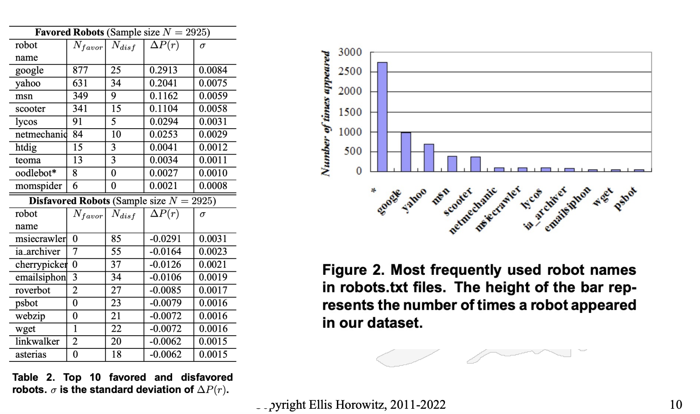

Breadth-first Search

Examine all pages at level i before examining pages at level i+1

Depth-first Search

At each step move to a page down the tree

Web Wide Crawl (328M pages) [Najo01] 

BFS crawling brings in high quality pages early in the crawl

Page Rank is an algorithm developed by Google for determining the value of a page

Crawling Algorithm – Version 2

Initialize queue (Q) with initial set of known URL’s. Loop until Q empty or page or time limit exhausted: Pop a URL, call it L, from the front of Q. If L is not an HTML page (e.g. .gif, .jpeg, .…) continue the loop If L has already been visited, continue the loop. Download page, P, for L If cannot download P (e.g. 404 error, robot excluded) continue loop Index P (e.g. add to inverted index and store cached copy) Parse P to obtain list of new links N. Append N to the end of Q End loop

Queueing Strategy

How new links are added to the queue determines the search strategy. • FIFO (append to end of Q) gives breadth-first search. • LIFO (add to front of Q) gives depth-first search. • Heuristically ordering the Q gives a “focused crawler” that directs its search towards “interesting” pages; e.g. – A document that changes frequently could be moved forward – A document whose content appears relevant to some topic can be moved forward – e.g. see Focused Crawling: A New Approach by S. Chakrabarti et al – https://www.sciencedirect.com/science/article/pii/S1389128699000523 • One way to re-order the URLs on the queue is to: • Move forward URLs whose In-degree is large • Move forward URLs whose PageRank is large – We will discuss the PageRank algorithm later

Avoiding Page Duplication 

• A crawler must detect when revisiting a page that has already been crawled (Remember: the web is a graph not a tree). • Therefore, a crawler must efficiently index URLs as well as already visited pages • To determine if a URL has already been seen, – Must store URLs in a standard format (discussed ahead) – Must develop a fast way to check if a URL has already been seen • To determine if a new page has already been seen, – Must develop a fast way to determine if an identical page was already indexed – Must develop a fast way to determine if a near-identical page was already indexed

Link Extraction

• Must find all links in a page and extract URLs; 

var links = document.querySelectorAll("a"); 

for (var i = 0; i < links.length; i++) { var link = links[i].getAttribute("href"); console.log(link); } 

– But URLs occur in tags other than , e.g.

```
– <frame src=“site-index.html”>, <area, href=“…”>, <meta>, <link>, <script>
• Relative URL’s must be completed, e.g. using current page URL or <base> tag
– <a href=“proj.html”> to http://www.myco.com/special/tools/proj.html
– <a href=“../outline/syllabus.html”> to http://www.myco.com/special/outline/syllabus.html
• Two Anomalies
1. Some anchors don’t have links, e.g. <a name=“banner”>
2. Some anchors produce dynamic pages which can lead to looping
<a href=http://www.mysite.com/search?x=arg1&y=arg2>
```

Representing URLs

• URLs are rather long, 80 bytes on the average, implying 1 trillion URLs will require 80 Terabytes • Recently Google reported finding 30 trillion unique URLs, which by the above would require 2400 terabytes (or 2.4 petabytes) to store 1. One Proposed Method: To determine if a new URL has already been seen – First hash on host/domain name, then – Use a trie data structure to determine if the path/resource is the same as one in the URL database 2. Another Proposed Method: URLs are sorted lexicographically and then stored as a delta-encoded text file • Each entry is stored as the difference (delta) between the current and previous URL; this substantially reduces storage • However, restoring the actual URL is slower, requiring all deltas to be applied to the initial URL • To improve speed, checkpointing (storing the full URL) is done periodically

Trie for URL Exact Matching


Simplest (and worst) algorithm to determine if a new URL is in your set – grep –i <search_url> <url_file> – For N URLs and maximum length K, time is O(NK) • Characteristics of tries – They share the same prefix among multiple “words” – Each path from the root to a leaf corresponds to one “word” – Endmarker symbol, $, at the ends of all words

• To avoid confusion between words with almost identical elements – Assume all words are $ terminated

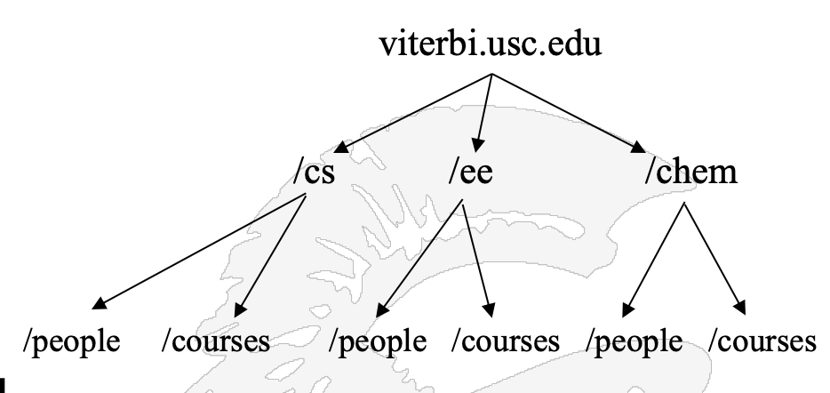

If we store N URLs, each of maximum length K, in a binary search tree, then the search time is O(K*log N); however, using a trie, the search time is O(K), at the expense of more storage

Why Normalizing URLs is Important

For example, all the following URLs have the same meaning (return the same web page), but different hashes: – http://www.google.com – http://www.google.com/ – https://www.google.com – www.google.com – google.com – google.com/ – google.com.

Normalizing URLs (4 rules)

1.Convert the scheme and host to lower case. The scheme and host components of the URL are case-insensitive. – HTTP://www.Example.com/ → http://www.example.com/ 2. Capitalize letters in escape sequences. All letters within a percent-encoding triplet (e.g., "%3A") are case-insensitive, and should be capitalized. Example: – http://www.example.com/a%c2%b1b → http://www.example.com/a%C2%B1b 3. Decode percent-encoded octets of unreserved characters. http://www.example.com/%7Eusername/ → http://www.example.com/~username/ 4. Remove the default port. The default port (port 80 for the “http” scheme) may be removed from (or added to) a URL. Example: – http://www.example.com:80/bar.html → http://www.example.com/bar.html • See https://en.wikipedia.org/wiki/URL_normalization

Avoiding Spider Traps

• A spider trap is when a crawler re-visits the same page over and over again • The most well-known spider trap is the one created by the use of Session ID’s – J2EE, ASP, .NET, and PHP all provide session ID management • A Session ID is often used to keep track of visitors, and some sites puts a unique ID in the URL: – An example is www.webmasterworld.com/page.php?id=264684413484654 (Note this URL doesn't exist). Each user gets a unique ID and it's often requested from each page. The problem here is when Googlebot comes to the page, it spiders the page and then leaves, it goes to another page and it finds a link to the previous page, but since it has been given a different session id now, the link shows up as another URL. • One way to avoid such traps is for the crawler to be careful when the querystring “ID=“ is present in the URL • Another technique is to monitor the length of the URL, and stop if the length gets “too long”

Handling Spam Web Pages

• The first generation of spam web pages consisted of pages with a high number of repeated terms, so as to score high on search engines that ranked by word frequency – Words were typically rendered in the same color as the background, so as to not be visible, but still count • The second generation of spam used a technique called cloaking; – When the web server detects a request from a crawler, it returns a different page than the page it returns from a user request – The page is mistakenly indexed • A third generation, called a doorway page, contains text and metadata chosen to rank highly on certain search keywords, but when a browser requests the doorway page it instead gets a more “commercially oriented” (more ads) page • Cloaking and doorway pages are not permitted according to Google’s webmaster suggestions See http://support.google.com/webmasters/bin/answer.py?hl=en&answer=66355


The Mercator Web Crawler

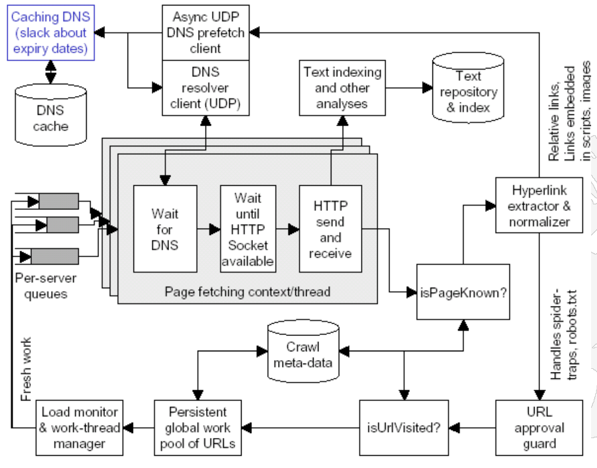

The diagram points out all of the key elements of a crawler; Notice 1. The DNS caching server 2. Use of UDP for DNS 3. Load and thread monitor 4. Parallel threads waiting for a page to download

Measuring and Tuning a Crawler

Measuring and tuning a crawler for peak performance eventually reduces to – Improving URL parsing speed – Improving network bandwidth speed – Improving fault tolerance • More Issues (some of which are discussed ahead) – Refresh Strategies: how often is the process re-started – Detecting duplicate pages – Detecting mirror sites – Speeding up DNS lookup (see previous slide) – URL normalization (discussed earlier) – Handling malformed HTML

DNS caching, pre-fetching and resolution

– A common operating system's implementation of DNS lookup is blocking: only one outstanding request at a time; so 1. DNS caching: build a caching server that retains IP-domain name mappings previously discovered 2. Pre-fetching client • once a page is parsed, – immediately make DNS resolution requests to the caching server; and – if unresolved, use UDP (User Datagram Protocol) to resolve from the DNS server 3. Customize the crawler so it allows issuing of many resolution requests simultaneously; there should be many DNS resolvers

Multi-Threaded Crawling

One bottleneck is network delay in downloading individual pages. • It is best to have multiple threads running in parallel each requesting a page from a different host. – a thread of execution is the smallest sequence of programmed instructions that can be managed independently by a scheduler. – In most cases, a thread is a component of a process. – Multiple threads can exist within the same process and share resources • Distribute URL’s to threads to guarantee equitable distribution of requests across different hosts to maximize through-put and avoid overloading any single server. • Early Google spider had multiple coordinated crawlers with about 300 threads each, – together they were able to download over 100 pages per second back in 2010 – It is estimated that in 2021 Google downloads ~50,000 pages/seconds or 4billion+ in a day, see https://www.quora.com/How-many-pages-are-Google-bots-crawling-every-second

Distributed Crawling Approaches

Once the crawler program itself has been optimized, the next issue to decide is how many crawlers will be running at any time • Scenario 1: A centralized crawler controling a set of parallel crawlers all running on a LAN – A parallel crawler consists of multiple crawling processes communicating via local network (sometimes called an intra-site parallel crawler) • Scenario 2: A distributed set of crawlers running on widely distributed machines, with or without cross communication

Distributed Model

If crawlers are running in diverse geographic locations, how do we organize them – By country, by region, by available bandwidth – Distributed crawlers must periodically update a master index – But incremental update is generally “cheap” • Why? Because – a. you can compress the update, and – b. you need only send a differential update both of which will limit the required communication

Issues and Benefits of Distributed Crawling

Benefits: – scalability: for large-scale web-crawls – costs: use of cheaper machines – network-load dispersion and reduction: by dividing the web into regions and crawling only the nearest pages • Issues: – overlap: minimization of multiple downloaded pages – quality: depends on the crawl strategy – communication bandwidth: minimization

Coordination of Distributed Crawling

Three strategies 1. Independent: ► no coordination, every process follows its extracted links 2. Dynamic assignment: ► a central coordinator dynamically divides the web into small partitions and assigns each partition to a process 3. Static assignment: ► Web is partitioned and assigned without a central coordinator before the crawl starts

Static Assignment

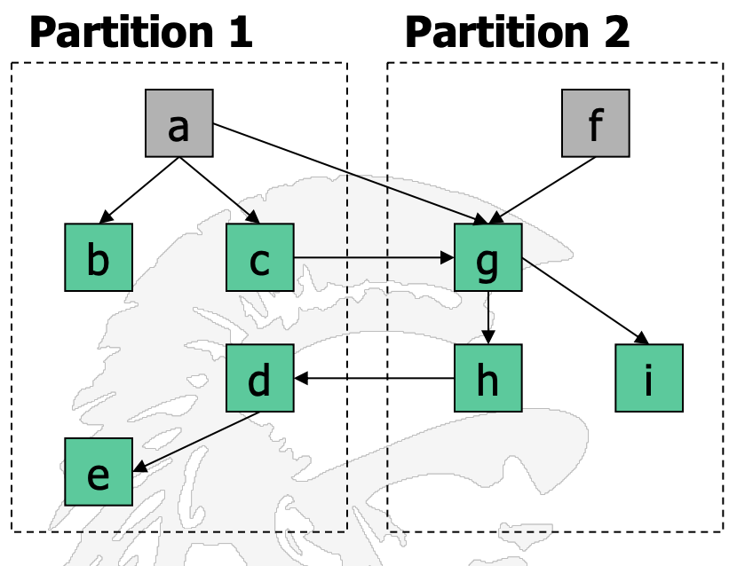

Links from one partition to another (inter-partition links) can be handled in one of three ways: 1. Firewall mode: a process does not follow any inter-partition link 2. Cross-over mode: a process also follows interpartition links and possibly discovers also more pages in its partition 3. Exchange mode: processes exchange interpartition URLs; this mode requires communication


Classification of Parallel Crawlers

If exchange mode is used, communication can be limited by: – Batch communication: every process collects some URLs and sends them in a batch – Replication: the k most popular URLs are replicated at each process and are not exchanged (previous crawl or on the fly) • Some ways to partition the Web: – URL-hash based: this yields many inter-partition links – Site-hash based: reduces the inter partition links – Hierarchical: by TLD, e.g. .com domain, .net domain … • General Conclusions of Cho and Garcia-Molina – Firewall crawlers attain good, general coverage with low cost – Cross-over ensures 100% quality, but suffer from overlap – Replicating URLs and batch communication can reduce overhead

Freshness

The behavior of a Web crawler is the outcome of a combination of policies: – A selection policy that states which pages to download. – A re-visit policy that states when to check for changes to the pages. – A politeness policy that states how to avoid overloading websites. – A parallelization policy that states how to coordinate distributed web crawlers. 

Keeping Spidered Pages Up to Date

Web is very dynamic: many new pages, updated pages, deleted pages, etc. • Periodically check crawled pages for updates and deletions: – Just look at LastModified indicator to determine if page has changed, only reload entire page if needed • Track how often each page is updated and preferentially return to pages which are historically more dynamic. • Preferentially update pages that are accessed more often to optimize freshness of more popular pages. 

Implications for a Web Crawler

A steady crawler runs continuously without pause – Typically search engines use multiple crawlers • When a crawler replaces an old version by a new page, does it do it “in-place” or “shadowing” – Shadowing implies a new set of pages are collected and stored separately and all are updated at the same time – The above implies that queries need to check two databases, the current database and the database of new pages – Shadowing either slows down query processing or decreases freshness • Conclusions: – running multiple types of crawlers is best – Updating in-place keeps the index current

Cho and Garcia-Molina, 2000 

Two simple re-visiting policies – Uniform policy: This involves re-visiting all pages in the collection with the same frequency, regardless of their rates of change. – Proportional policy: This involves re-visiting more often the pages that change more frequently. The visiting frequency is directly proportional to the (estimated) change frequency. • Cho and Garcia-Molina proved the surprising result that, in terms of average freshness, the uniform policy outperforms the proportional policy in both a simulated Web and a real Web crawl. • The explanation for this result comes from the fact that, when a page changes too often, the crawler will waste time by trying to recrawl it too fast and still will not be able to keep its copy of the page fresh. • To improve freshness, we should penalize the elements that change too often 

Help the Search Engine Crawler Creating a SiteMap

A sitemap is a list of pages of a web site accessible to crawlers • This helps search engine crawlers find pages on the site • XML is used as the standard for representing sitemaps • Here is an example of an XML sitemap for a three page website -Back in 2006 Google introduced the sitemap format; now Bing, Yahoo, and Ask also support sitemaps See the Google, Bing, Yahoo, Ask announcement: http://www.google.com/press/pressrel/sitemapsorg.html

```
<?xml version="1.0" encoding="UTF-8"?>
<urlset xmlns="http://www.sitemaps.org/schemas/sitemap/0.9">
<url>
<loc>http://www.example.com/?id=who</loc>
<lastmod>2009-09-22</lastmod>
<changefreq>monthly</changefreq>
<priority>0.8</priority> </url>
<url>
<loc>http://www.example.com/?id=what</loc>
<lastmod>2009-09-22</lastmod>
<changefreq>monthly</changefreq>
<priority>0.5</priority> </url>
<url>
<loc>http://www.example.com/?id=how</loc>
<lastmod>2009-09-22</lastmod>
<changefreq>monthly</changefreq>
<priority>0.5</priority> </url>
</urlset>
```

General Sitemap Guidelines

```
• Use consistent, fully-qualified URLs. Google will crawl your URLs exactly as listed
• A sitemap can be posted anywhere on your site, but a sitemap affects only descendants of
the parent directory
• Don't include session IDs from URLs in your sitemap.
• Sitemap files must be UTF-8 encoded, and URLs escaped appropriately.
• If you have two versions of a page, list in the sitemap only the one you prefer to appear in
search results
• If you have alternate pages for different languages or regions, you can use hreflang to
indicate the alternate URLs.
• <head>
<title>Widgets, Inc</title>
<link rel="alternate" hreflang="en-gb"
href="https://en-gb.example.com/page.html" />
<link rel="alternate" hreflang="en-us"
href="https://en-us.example.com/page.html" />
<link rel="alternate" hreflang="en”
href="https://en.example.com/page.html" />
• There are many sitemap generator tools, e.g. https://slickplan.com/sitemap
```

Google Crawlers

• Google now uses multiple crawlers – APIs-Google – AdSense – AdsBot Mobile Web Android – AdsBot Mobile Web – AdsBot – Googlebot Images – Googlebot News – Googlebot Video – Googlebot (desktop) – Googlebot (smartphone) – Mobile AdSense – Mobile Apps Android – Feedfetcher – Google Read Aloud For details see https://support.google.com/webmasters/answer/1061943?hl=en see also Google's tool for checking how Googlebot sees your website https://support.google.com/webmasters/answer/6066468?rd=2

Google’s Googlebot

Begins with a list of webpage URLs generated from previous crawls • Uses Sitemap data provided by webmasters • Many versions of Googlebot are run on multiple machines located near the site they are indexing • Googlebot cannot see within Flash files, audio/video tracks, and content within programs • Advice – To prevent “File not found” in a website’s error log, create an empty robots.txt file – To prevent Googlebot from following any links on a page, use “nofollow” meta tag – To prevent Googlebot from following an individual link, add “rel=‘nofollow’” attribute to the link

To verify That The Visitor is Googlebot

• Method 1 1. Run a reverse DNS lookup on the accessing IP address from your logs, using the host command. 2. Verify that the domain name is either googlebot.com or google.com. 3. Run a forward DNS lookup on the domain name retrieved in step 1 using the host command on the retrieved domain name. 4. Verify that it's the same as the original accessing IP address from your logs. • Method 2 – match the crawler's IP address to the list of Googlebot IP addresses

Controlling How Often Googlebot Visits Your Site

The term crawl rate means how many requests per second Googlebot makes to your site when it is crawling it: for example, 5 requests per second. • You cannot change how often Google crawls your site, but if you want Google to crawl new or updated content on your site, you can request a recrawl; for details see https://developers.google.com/search/docs/advanced/crawling/ask-google-to-recrawl • You can reduce the crawl rate by – returning pages with 500, 503 or 429 http status codes – Setting a new rate in the Search Console – A video discussing Google’s Crawl Status Report can be found here: https://support.google.com/webmasters/answer/9679690

Googlebot is Really Chrome Re-packaged

Why: browsers don’t just render the DOM hierarchy of HTML, they include transformations via CSS and JavaScript, and for Googlebot to extract the most meaningful features from a web page it would be necessary to have access to these transformations – Therefore Googlebot must understand and execute JavaScript code • Conclusion: Googlebot and Chrome share a great deal of code • Googlebot processes web pages with JavaScript in 3 phases 1. Crawling – processing all links 2. Rendering – executing JS and then looping back to 1 3. Indexing • As of 2019 Googlebot runs the latest Chromium rendering engine • Note: Server-side rendering saves Googlebot from rendering the page


### Deduplication

##### Definition [of deduplication]

- *De-Duplication* — the process of identifying and avoiding essentially identical web pages 
- The term is often used in connection with *locker storage* where only a single copy of a file is stored and multiple links to the single file are managed 
  - Whether this strategy effectively saves space is not clear and needs analysis for each particular application 
  - However, this is **not** the meaning of the term that we are concerned about in this class 
- With respect to web crawling, de-duplication essentially refers to the identification of identical and nearly identical web pages and indexing only a single version to return as a search result 

##### Duplicates 

- One example is the same page, referenced by different URLs 
  - http://espn.go.com vs. http://www.espn.com

- How can two URLs differ yet still point to the same page? 
  - the URL’s host name can be distinct (virtual hosts) sharing the same document folder,
  - the URL’s protocol can be distinct (http, https), but still deliver the same document
  - the URL’s path and/or page name can be distinct 

##### Totally distinct URLs - but same content 

- At one time* all 3 URLs below pointed to the identical page
- Structural Classification of Proteins
  - http://scop.mre-lmb.cam.ac.uk/scop 
  - http://scop.berkeley.edu/ 
  - http://scop.protres.ru/ 
- The three URLS have distinct domain names, but all redirect to the same page 
- At least they did when I took this snapshot, no longer 

##### 'Near'-duplicates [almost identical] 

- Another example is two web pages whose content differs slightly 

- Two copies of www.nytimes.com snapshot within a few seconds of each other; The pages are cssentially identical except for the ads at the top and the photo in the middle 

- In examining a web page a web page a search engine may want to ignore ads, navigation links and other elements that do not specifically relate to the contents of the web page.
- One way to do this is to delve into the structure of a web page and focus on content blocks
- E.g. the Document Object Model for HTML display a webpage as a tree hierarchy  
  - Document - Head - Body

- However this is time consuming

##### Duplicates: mirroring 

- Mirroring is the systematic replication of web pages across hosts.

  - Mirroring is the **single largest cause** of duplication on the web 

- Host 1/α and Host 2/β are mirrors iff 

  - For all (or most) paths p such that when 

    http://Host1/α/p exists 

    http://Host2/β p exists as well 

    with identical (or near identical) content, and vice versa. 

*List of countries, 281 sites in 55 regions* 

##### Why worry about exact duplicates? 

- Smarter crawling 
  - Avoid returning many duplicate results to a query 
  - Allow fetching from the fastest or freshest server 
- Better connectivity analysis 
  - By combining in-links from the multiple mirror sites to get an accurate PageRank (measure of importance) 
  - Avoid double counting out-links 
- Add redundancy in result listings 
  - “If that fails you can try: `<mirror>/samepath`
- Reduce Crawl Time: Crawlers need not crawl pages that are identical or near identical 
- Ideally: given the web’ s scale and complexity, priority must be given to content that has not already been seen before or has recently changed 
  - Saves resources (on the crawler end, as well as the remote host) 
  - Increases crawler politeness 
  - Reduces the analysis that a crawler will have to do later 

- Clustering
  - Given a news article some people might wish to see “related articles” describing the same event 
- Data extraction 
  - Given a collection of similar pages, e.g. movie reviews, a search engine can extract and categorize the information 
- Plagiarism
  - Identify pairs that seem to have significantly borrowed from each other 
- Spam detection 
  - Spammers typically send similar emails en masse, so one can use near-similarity techniques to identify the spam 
- Duplicates within a domain 
  - To identify near-duplicates arising out of revisions, modifications, copying or merging of documents 

##### Solving the issue of duplicates/near-duplicates 

1. Duplicate Problem: Exact match; 
   - Solution: compute fingerprints using cryptographic hashing 
   - Useful for URL matching and also works for detecting identical web pages 
   - Hashes can be stored in sorted order for log N access
2. Near-Duplicate Problem: Approximate match 
   - Solution: compute the syntactic similarity with an edit-distance measure, and 
   - Use a similarity threshold to detect near-duplicates 
     - e.g., Similarity > 80% => Documents are “near duplicates” 

- The remaining slides are devoted to specific methods for duplicate and near duplicate detection 

##### Cryptographic hash function: webpage -> number 

- A **cryptographic hash function** is a hash function which takes an input (or ‘'message’) and returns a fixed-size alphanumeric string, which is called the hash value (sometimes called a **message digest, digital fingerprint, digest** or a **checksum**). 
- The cryptographic hash function has four main properties: 
  1. It is extremely easy (i.e. fast) to calculate a hash for any given data. 
  2. It is extremely computationally difficult to calculate an alphanumeric text that has a given hash.
  3. A small change to the text yields a totally different hash value. 
  4. It is extremely unlikely that two slightly different messages will have the same hash. 

- The **MD5** (message-digest) hash function is a widely used cryptographic hash function producing a 128-bit (16-byte) hash value, typically expressed in text format as a 32 digit hexadecimal number.
  - Invented by Ron Rivest of MIT in 1991; replaced the earlier MD4 
- The **SHA-1, SHA-2** hash functions are also quite popular (160 bit, 20 byte value) 
  - SHA-1 was broken in 2005; using SHA-2 family of algorithms is now favored, see 
  - https://en.wikipedia.org/wiki/SHA-2 
- **SHA-3,** released in 2015; it produces digests of size 224, 256, 384 and 512 bits 
- **RIPEMD-160** — a family of cryptographic hash functions and so far has not been broken; produces a 160 bit (20 byte) digest 
- E.g. See Chrome, Settings, Security and Privacy, Security, Manage certificates, certificates, Verisign

https://bytes.usc.edu/~saty/tools/xem/run.html?x=MD5

##### Identifying identicals, near-identicals 

1. **Compare character by character** two documents to sce if they are identical 
   - very time consuming !! 
2. **Hash just the first few characters and compare** only those documents that hash to the same bucket
   - But what about web pages where every page begins with `<html>`?? 
3. **Use a hash function** that examines the entire document 
   - But this requires lots of buckets 
4. **Better approach** - pick some fixed random positions for all documents and make the hash function depend only on these; 
   - This avoids the problem of a common prefix for all or most documents, yet we need not examine entire documents unless they fall into a bucket with another document 
   - But we still need a lot of buckets 
5. **Even better approach**: Compute the cryptographic hash (SHA-2 or MD5) of each web page and maintain in sorted order, O(log n) to search 

1. **Produce fingerprints and test for similarity** - Treat web documents as defined by a set of features, constituting an n-dimensional vector, and transform this vector into an f-bit fingerprint of a small size 
   - Use Simhash or Hamming Distance to compute the fingerprint 
     - SimHash is an algorithm for testing how similar two sets are 
   - Compare fingerprints and look for a difference in at most k bits 
   - E.g. see Manku et al., WWW 2007, Detecting Near-Duplicates for Web Crawling, http://www2007.org/papers/paper215.pdf 
2. Instead of documents defined by n-vector of features, compute subsets of words (called shingles) and test for similarity of the sets 
   - Broder et al., WWW 1997, Finding Near Duplicate Documents 

##### Identifying (near) duplicates - overall idea 

1. Define a function fthat captures the contents of each document in a number 
   - E.g. hash function, signature, or a fingerprint 
2. Create the pair `<f(doc_i), ID for doc_i>`for all doc; 
3. Sort the pairs 
4. Documents that have the same f~value or an f-value within a small threshold are believed to be duplicates or near duplicates.

##### Distance and set measures (to compute similarity) 

- To compute similarity, we need a distance measure 
- A distance measure must satisfy 4 properties 
  1. No negative distances 
  2. D(x, y) = 0 iff x = y
  3. D(x, y) = D(y, x) symmetric 
  4. D(x,y) <= D(x,z) + D(z,y) triangle inequality 
- There are several distance measures that can play a role in locating duplicate and nearduplicate documents 
  - Euclidean distance —$D([x_1...x_n], [y_1,...y_n]) = \sqrt{Sum(x_i-y_i)^2}$ $i = 1...n$
  - Jaccard distance — D(x,y) = 1 - SIM(x,y) or 1 minus the ratio of the sizes of the intersection and union of sets x and y 
  - Cosine distance — the cosine distance between two points (two n element vectors) is the angle that the vectors to those points make; in the range 0 to 180 degrees
  - Edit distance — the distance between two strings is the smallest number of insertions and deletions of single characters that will convert one string into the other 
  - Hamming distance — between two vectors is the number of components in which they differ (usually used on Boolean vectors) 

- A set is an unordered collection of objects, e.g. {a, b, c} 
- Focusing on the notion of distance of two sets we define a distance d(A, B) as 
  - small, if objects in A and B are close; 
  - large, if objects in A and B are far apart; 
  - 0, if they are the same, and finally 
  - d(A, B) is in the range [0, infinity] 
- Focusing on the notion of similarity we define s(A, B) as: 
  - large, if the objects in A and B are close; 
  - small, if the objects in A and B are far apart; 
  - 1, if they are the same, and finally 
  - s(A, B) is in the range [0, 1] 
- Often we can convert between the two, as d(A, B) = 1-s(A, B)

### 'Jaccard similarity/index' 

- Consider **A** = {0, 1, 2, 5, 6} and **B** = {0, 2, 3, 5, 7, 9}

- Jaccard Similarity (JS) between A and B:

  - $JS(A, B) = \frac{\text{size}(A \cap B)}{\text{size}(A \cup B)}$

    $= \frac{\text{size}(\{0, 2, 5\})}{\text{size}(\{0, 1, 2, 3, 5, 6, 7, 9\})}$

    $= \frac{3}{8} = 0.375$

###### Clustering Example

Suppose we divide our items into four clusters:

- **C₁** = {0, 1, 2}
- **C₂** = {3, 4}
- **C₃** = {5, 6}
- **C₄** = {7, 8, 9}

(For example, **C₁** might represent action movies, **C₂** comedies, **C₃** documentaries, and **C₄** horror movies.)

- If A_clu = {C₁, C₃} and B_clu = {C₁, C₂, C₃, C₄}, then:
  - $JS_{\text{clu}}(A, B) = JS(A_{\text{clu}}, B_{\text{clu}})$
  - $= \frac{\text{size}(\{C₁, C₃\} \cap \{C₁, C₂, C₃, C₄\})}{\text{size}(\{C₁, C₃\} \cup \{C₁, C₂, C₃, C₄\})}$
  - $= \frac{5}{10} = 0.5$

- If we are going to use Jaccard similarity to determine when two web pages are near duplicates, we need to specify what elements are being compared.

##### **Definition of Shingle**

- A contiguous subsequence of words in a document is called a **shingle**.

- The **4-shingling** of the phrase below produces a bag of 5 items:

  **"a rose is a rose is a rose"**
   ⇒ A set $S(D, w)$ is defined as:

  - { *(a_rose_is_a)*, *(rose_is_a_rose)*, *(is_a_rose_is)*, *(a_rose_is_a)*, *(rose_is_a_rose)* }

- $S(D, w)$ is the set of shingles of a document **D** of width **w**.

##### **Similarity Measures**

- **Jaccard Similarity $Jaccard(A,B)$** (also known as *Resemblance*) is defined as: $\frac{\text{size}(S(A, w) \cap S(B, w))}{\text{size}(S(A, w) \cup S(B, w))}$

- **Containment $Containment(A,B)$** is defined as: $\frac{\text{size}(S(A, w) \cap S(B, w))}{\text{size}(S(A, w))}$

- Bounds:
  - $0 \leq$ Resemblance $\leq 1$
  - $0 \leq$ Containment $\leq 1$

  

- **White space?**

  - Should we include spaces and returns? Sometimes it makes sense, e.g.:
    - *"plane has touch down"* versus *"threw a touchdown"*
    - (The space between *"touch"* and *"down"* is significant)


- **Capitalization?**

  - *Sam* versus *sam*.

  - Can help distinguish proper nouns.


- **Punctuation**

  - English is punctuated differently in the **US** and **India**.

  - Punctuation differs in articles, blogs, and tweets.

- **How large should k be?**

  - General rule:
    - High enough so the probability of almost all shingles matching is low,
    - Ensuring a **collision** is meaningful.

- **Count replicas?**

  - Typically, **bag of words** counts replicas, but **shingling does not**.

- **Stop words?**

  - Typically omitted as they are so common.

  

- ##### **Original text**

  - *"Tropical fish include fish found in tropical environments around the world, including both freshwater and salt water species."*

  ##### **All 3-shingles** (there are 16 of them)

  - *(Tropical fish include)*, *(fish include fish)*, *(include fish found)*, *(fish found in)*, *(found in tropical)*, *(in tropical environments)*, *(tropical environments around)*, *(environments around the)*, *(around the world)*, *(the world including)*, *(world including both)*, *(including both freshwater)*, *(both freshwater and)*, *(freshwater and salt)*, *(and salt water)*, *(salt water species)*

  ##### **Hash values for the 3-shingles**

  (Sets of shingles are large, so we hash them to make them more manageable, and we select a subset)

  - **Hash values:** 938, 664, 463, 822, 492, 798, 78, 969, 143, 236, 913, 908, 694, 553, 870, 779

  ##### **Selecting only those hash values that are divisible by some number**

  - Here, we select hash values using 0 mod 4
    - **Selected fingerprints:** 664, 492, 236, 908
    - *These are considered the fingerprints*

  ##### **Near duplicates**

  - Found by comparing **fingerprints** and identifying pairs with a **high overlap**.

##### **Jaccard Similarity and Near Duplicate Detection**

##### **Jaccard Similarity Definition**

- $J(A,B) = \frac{|A \cap B|}{|A \cup B|}$

##### **Jaccard Distance** (measuring dissimilarity)

- $1 - J(A, B)$, or equivalently: $\frac{|A \cup B| - |A \cap B|}{|A \cup B|}$

##### **Testing for Near Duplicate Pages**

1. Compute the **k-shingles** of the two pages.
2. Map the **k-shingles** into numbers (e.g., by hashing).
3. Select a subset of the shingles to act as **fingerprints**.
4. Compute the **Jaccard similarity** of the **k-shingle fingerprints**.

##### **Near Duplicate Criteria**

- **A high Jaccard similarity** (e.g., **greater than 0.9**) implies the pages are near duplicates.
- Alternatively:
  - If $J(\text{fingerprint}(A), \text{fingerprint}(B)) > k$, then the pages are similar.

FYI if you are interested: in p.475 of our text is a probabilistic approach to this that reduces the # of shingle comparisons we need to make. 

### SimHash LSH [Locality-Sensitive Hashing] 

- There is another way to determine if two web pages are near duplicates
- The method is called **SimHash**
- It was developed by **Moses Charikar** and is described in his paper  
  *Similarity Estimation Techniques from Rounding Algorithms*, STOC May 2002  
  - [Paper Link](https://www.cs.princeton.edu/courses/archive/spring04/cos598B/bib/CharikarEstim.pdf)
  
- The basic idea is the same as before:
  - Obtain an *f*-bit fingerprint for each document
  - A pair of documents are near duplicates if and only if fingerprints are at most *k*-bits apart
  - But in this case, instead of using permutations and probability, we use **SimHash**

- Documents *D₁* and *D₂* are near duplicates *iff*  
  _Hamming-Distance(Simhash(D₁), Simhash(D₂)) ≤ K_

- Typically, *f* = 64 and *k* = 3

SimHash (aka Charikar Similarity) is essentially a dimension reduction technique - it maps a set of weighted features (contents of a document) to a low dimensional fingerprint, eg. a 64-bit word.

And, **documents that are nearly identical have nearly similar fingerprints that differ only in a small # of bits.** In other words, similar inputs lead to similar outputs (hash values), hence 'Sim'Hash; other hashing techniques, eg. [MD5](https://bytes.usc.edu/~saty/tools/xem/run.html?x=MD5), do not have this property (in other words, even a tiny change in the input leads to a huge change in the output). This similarity property is what makes SimHash, an excellent tool for similarity detection of documents.

[Here](https://bytes.usc.edu/cs572/s25-555-sear-ch/lectures/dedup/docs/SimHash.pdf) is the SimHash paper.

- A hash function usually hashes different values to totally different hash values; here is an example:

  - p1 = 'the cat sat on the mat'

    p2 = 'the cat sat on a mat'

    p3 = 'we all scream for ice cream'

    p1.hash => 415542861
    p2.hash => 668720516
    p3.hash => 767429688

- **Simhash** is one where similar items are hashed to similar hash values (by similar, we mean the bitwise Hamming distance between hash values is small)

  p1.simhash => 851459198
  00110010110000000001111001111110

  p2.simhash => 847263864
  00110010100000000001110001111000

  p3.simhash => 98496088
  00111010101101011010111100110000

- In this case, we can see the Hamming distance of the similar items: (p1, p2) = 4, which is small whereas (p1, p3) = 16 and (p2, p3) = 12, which are considerably larger

The **Simhash** of a phrase is calculated as follows:

1. Pick a hash size, let's say 32 bits
2. Let V = [0] * 32 (i.e., a vector of 32 zeros)
3. Break the input phrase up into shingles, e.g.,
    'the cat sat on a mat'.shingles(2) =>
    { "th", "he", "e ", " c", "ca", "at", "t ", " s", "sa", "at", " o", "on", "n ", "a ", "a c", "m", "ma", "at" }
4. Hash each feature using a normal 32-bit hash algorithm (MD5 or SHA)
   - "th".hash = -502157718
   - "he".hash = -369049682
5. For each hash:
   - If bit[i] of hash is set, then add 1 to V[i]
   - If bit[i] of hash is not set, then subtract 1 from V[i]
6. Simhash bit i is **1** if V[i] > 0 and **0** otherwise

- **Simhash is useful** because if the Simhash bitwise Hamming distance of two phrases is low, then their Jaccard coefficient is high.


Q: which bit pattern pairs are almost similar? 

- In the case that two numbers have a low bitwise Hamming distance and the difference in their bits are in the lower order bits then it turns out that they will end up close to each other if the list is sorted. 

  

- notice that two pairs with very smallest hamming distance hdist(3,6)=1 and hdist(8,5)=2 have ended up adjacent to each other. 

- Rather than check every combo we could just check the adjacent pairs of the list, each is a good candidate. 
- This reduces the runtime from n*(n-1)/2 coefficient calculations, O(n^2) to 
  - n fingerprints calculations O(n) + 
  - a sort O(n log n) + 
  - n coefficient calculations O(n), 
- which is O(n log n) overall; 
- A problem: 
  - there is another pair with a low Hamming distance, hdist(4,2)=2 that have ended up totally apart at other ends of the list... 
  - sorting only picked up the pairs that differed in their lower order bits. 

- To get around this consider another convenient property of bitwise Hamming distance, a permutation of the bits of two numbers preserves Hamming distance 
- If we permute by 'rotating' the bits, i.e. bit shift left and replace lowest order bit with the 'lost' highest order bit we get 'new’ fingerprints that have the same Hamming distances 
  - 

So we can **'rotate, sort, check adjacent'** 'B' times (eg. 64 times; depending on how many bits we have), to discover (almost) all the near-duplicates.

In other words:

- comparing SimHash values (ie computing 'Charikar Similarity' values) is a great way to identify near-duplicates
- for 'n' documents, comparing them all pairwise would take a long time [O(n^2)]
- so as a shortcut, we can sort their decimal representations and only compare adjacents - this will identify similarities based on low-end bits; but this will miss similarities based on the higher-end bits; as an aside, we can look for one more possible low-bits near-duplicate by comparing the top-most and bottom-most values too, like in Gray Code
- so to fix the problem of missing finding high order bit similarities, we can rotate (spin) all the docs' bits identically to the right (so that the high order bits become a 'bit' (lol) lower) to produce 'new' hashes, sort *those*, compare for near-duplicates
- we can progressively spin right by 1 bit, 2 bits, 3 bits... to discover more and more similarities [we will rediscover existing similarities but ignore those]
- note that we can spin left as well
- doing the above is STILL faster than O(n^2) :)

[Here](https://matpalm.com/resemblance/simhash/) is a nice page on SimHash, and [this](https://bytes.usc.edu/cs572/s25-555-sear-ch/lectures/dedup/docs/DetectingNearDups.pdf) is a Google paper that discusses using SimHash at scale.
