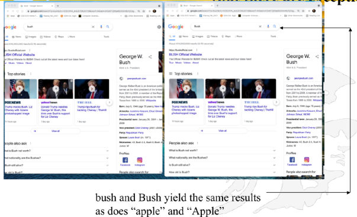
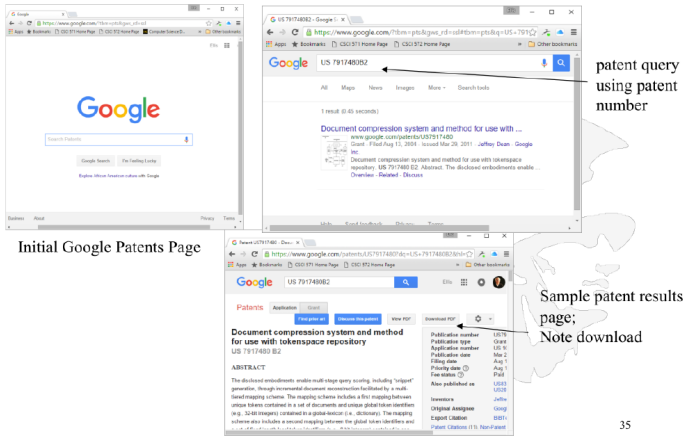

# Query formulation - how to ask 'properly'

### The Power of Google Query Box

### Traditional Boolean Queries in a Search Box Don't Work as Expected

### But Google Advanced Search Permits Boolean Queries

https://www.google.com/advanced_search

- Search engines typically offer an “Advanced Search” page where users **can enter**, in effect, a Boolean query; e.g. Here is Google’s “advanced search” screen 

  

### Advanced Search Works Properly

### Query Box Default is AND

- If you search for more than one keyword at a time, Google/Bing will automatically search for pages that contain ALL of your keywords 
  - This is called “implicit AND” 
- A search for 
  - disney disneyland pirates 
  - is the same as searching for 
  - disney AND disneyland AND pirates (without the ANDs needed) 
- Google sometimes returns pages that don’t contain all of your query terms 

### Put Exact Phrases in Quotes

- To search for phrases, just put your phrase in quotes. 
- For example, 
  - disney disneyland “pirates of the caribbean” 

- This would show you all the pages in Google’s index that contain the word **disney** AND the word **disneyland** AND the exact phrase “**pirates of the Caribbean**” (of course, without the quotes) 

### Differences With/Without Quotes - Query: general principles of electricity

### Google Stemming and Stop Words

- The query [ child bicycle helmet ] finds pages that contain words that are similar to some or all of your search terms
  - e.g., “child,” “children,” or “children's,” “bicycle,” “bicycles,” “bicycle's,” “bicycling,” or “bicyclists,” and “helmet” or “helmets.”
  - Google calls this feature word variations or automatic stemming 
- Google will often ignore Stop Words 
  - However, a query with only Stop Words, e.g. [the who] gets treated as significant, returning pages for the Rock Group, the Who 
- Google limits queries to 32 words 
  - Google will return nonsense results for this nonsense query 
  - aardvark aback abacus abalone abandon abashed abbey abbreviate abdicate abdomen abduct aberration abhor abide ability abject able abnormal aboard abode abolish abolitionist abort about above abrade abridge abroad abrupt abscond absent absinthe 

### Other Google Query Rules

- Google favors results that have your search terms near each other 
  - The query [snake grass] finds pages about plants; 
  - The query [snake in the grass] finds pages about sneaky people 
- Google gives higher priority to pages that have the terms in the same order as in your query 
- Google is NOT case sensitive; it shows both upper- and lowercase results 
  - [Red Cross ], [red cross ], and [ RED CROSS ] return the same results. 
- Google ignores some punctuation and special characters, including ! ?, . ; [ ] @ / # < > — Exceptions: C++, or math symbols in Google calculator 

### Capitalization Does NOT Matter (but there are exceptions)

##### More Exceptions

### Boolean OR

- The Boolean OR operator is acceptable in Google queries, placed between keywords, and **OR** is always in all caps 
- For example, 
  - **disney disneyland OR “pirates of the caribbean”** 
- This would show you pages in Google’s index that contain the word **disney** AND the word (**disneyland** OR the phrase **pirates of the caribbean**) 
- OR has higher precedence than AND 

### How Google/Bing Treat Queries with Boolean Operators

- All query terms are implicitly ANDed 
- OR has higher precedence than AND 
- Three examples (a, b, c stand for query terms): 
  1. `a b OR c d` is treated as a AND (b OR c) AND d 
  2. `a OR b c OR d`is treated as (a OR b) AND (c OR d) 
  3. `a OR "b c" d` is treated as (a OR "(b c")) AND d 
- and see https://support.google.com/websearch/answer/2466433?hl=en 
- https://help.bing.microsoft.com/#apex/bing/en-US/10002/-1 

### Google and Wildcards

- Google offers full-word wildcard
- For example, if you search Google for
  - it's +a * world,
- Google shows you all of the pages in its database that contain the phrase, e.g. “it’s a small world” ... and “it’s a nano world” ... and “it’s a Linux world” ... and so on 
- The + before **a** is required because it is a stop word and would otherwise be ignored 
- This query works the same in Bing 
- There must be a space after the +a 

### Searching by Date

### Google Advanced Operators

##### filetype:

- **filetype:** restricts your results to files ending in a specific file suffix, e.g ".doc" (or .xls, .ppt. etc.), and shows you only files created with the corresponding program 
- There can be no space between **filetype:** and the file extension 
- The “dot” in the file extension — .doc —is optional 
- filetype:doc will NOT return docx

##### inanchor:

- **inanchor**: will restrict the results to pages containing the query terms you specify in the anchor text or links to the page.
- For example, [ **restaurants inanchor:gourmet** ] will return pages in which the anchor text on links to the pages contain the word “gourmet” and the page contains the word “restaurants.” 
- **allinanchor**: restricts results to pages containing all query terms you specify in the anchor text on links to the page. 
  - For example, [ **allinanchor: best muscums sydney **] will return only pages in which the anchor text on links to the pages contain the words “best,” “museums,” and “sydney.”

##### intext: 

- **intext**: ignores link text, URLs, and titles, and only searches body text. 
- **intext**: helps you avoid query words that are too common in URLs and links. 
- pirates intext:"Disney.com" requires Disney.com to be within the body of the web page 

##### intitle:

- **intitle**: restricts the results to documents containing a particular word in its title. 
- You can also search for phrases. Just put your phrase in quotes 
- **intitle:pirates** 
- **intitle:”pirates of the caribbean”** 

##### inurl:

- **inurl**: restricts the results to documents containing a particular word in its URL. 
- **inurl:disney** 
  - Results include 
    - Disney.go.com
    - www.disney.de 

##### site:

- **site:** restricts the results to those websites in a domain. 
- There can be no space between **site:** and the domain. 
- Query is: masters site:cs.usc.edu 

##### Using site:

- You can use **site:** in conjunction with another search term or phrase. 
  - **pirates site:disney.com** 
- You can also use **site:** and negation to exclude sites. 
  - **pirates -site:disney.com** 
- You can use **site:** to exclude or include entire top level domains (and, like with filetype, the dot is optional). 
  - **pirates -site:com** 
  - **pirates site:edu** 

##### cache:

- **cache:url** shows the version of a web page that Google has in its cache. 

##### link:

- **link:** restricts the results to those web pages that have links to the specified URL. 
- **link:Disney.com** 
- Note: apparently the link operator only returns a sample of web pages pointing to the link 

##### related:

- **related:** lists web pages that are "similar" to a specified web page. 
- There can be no space between **related:** and the URL. 

##### info:

- **info:** presents some information that Google has about a particular web page. 

##### stocks:

- If you begin a query with **stocks:** Google will treat the rest of the query terms as stock ticker symbols, and will link to a finance page showing stock information for those symbols. 

### Even More Special Features of the Google Query Box

- Math expressions are evaluated: 12+34+10 * (150 /7) =260.285714 
- Dictionary definitions: define: antidisestablishmentarianism 
- Put @ in front of a word to search social media. For example: @twitter. 
- Put `$` in front of a number and search for a price. For example: camera $400. 
- Put .. between two numbers and search in a range. For example, `camera $50..$100`. 
- Put a valid tracking number from FedEx or UPS and it will take you to the tracking site 
- Put a valid airline and flight number and it will give you its status 
- Put a tilde, ~car repair and it queries on ALL synonyms of car, like auto 
  - See the following links to further discussion of Google’s operators — http://www.google.com/support/websearch/bin/answer.py?hl=en&answer=136861 http://www.googleguide.com/advanced_operators_reference.html — http://searchengineland.com/google-power-user-tips-query-operators-48126 

### Even More Things One Can Do with Google

### A Failed Google Experiment - phonebook: operator

- There were actually three different Google phonebook operators. 
  - **phonebook:** searches the entire Google phonebook. 
  - **rphonebook:** searches residential listings only. 
  - **bphonebook:** searches business listings only 

As of 2010, Google's phone book feature has been officially retired. Both the phonebook: and the rphonebook: search operator have both been dropped due to many complaints about privacy violations 

### A Failed Google Experiment - Reading Level Examples

The feature is based primarily on statistical models built with the help of teachers. Google paid teachers to classify pages for different reading levels, and then took their classifications to build a statistical model. With this model, they can compare the words on any webpage with the words in the model to classify reading levels. **Google dropped this feature in 2015.** 

##### A Failed Google Experiment - The Wonder Wheel

- Google puts up a wheel of possible interpretations including the jaguar car and the animal; clicking on the spokes — of the wheel bring up a refined wheel which eventually lead to a modified query

- In 2009 Google introduced the Wonder Wheel, a flash-based interface 

  In 2011 Google removed the Wonder Wheel but provided no concrete explanation for why it did so; 

  In 2012 Google restored the wonder wheel, renaming it the Contextual Targeting Tool 

  In 2014 it was re-focused to help advertisers chose their keywords 

In 2011 Google removed the Wonder Wheel 

##### A Failed Google Experiment - Google Code Search

### Special Content Search Engines - Google Patents

##### Special Content Search Engines - Google Books

- Google Books is a service that searches the full text of books and magazines that Google has scanned, converted to text using optical character recognition (OCR), and stored in its digital database 
- Books are provided either by 
  - publishers and authors, through the Google Books Partner Program, or by 
  - Google's library partners, through the Library Project. 
- Controversy: Google has been criticized for potential copyright violations, and lack of editing to correct the many errors introduced into the scanned texts by the OCR process. 
- As of October 2015, the number of scanned book titles was over 25 million. 
- Google estimated in 2010 that there were about 130 million distinct titles in the world, and stated that it intended to scan all of them 

##### What you see on Google Books

##### Special Content Search Engines - Google Scholar

- Google Scholar is a freely accessible search engine that indexes the full text or metadata of scholarly literature across an array of publishing formats and disciplines. 
- The Google Scholar index includes most peer-reviewed online academic journals and books, conference papers, theses, dissertations, etc.

### Relevance Feedback & Query Expansion 

##### Relevance Feedback

- After initial retrieval results are presented, allow the user to provide feedback on the relevance of one or more of the retrieved documents 

##### Google Related Searches

- Google has enhanced their related searches, e.g. 
  - If you search for the name of a category, Google will show the most popular members, e.g. “german cars” 
- If you search for a category like "rock bands" You get related searches including a few top rock bands such as metallica and led zeppelin 

- If you search for famous people you get photos of their work, e.g. Pablo Picasso returns photos of his famous painting

##### Search Engines and Relevance Feedback

### Auto-Completion

- Auto-completion is the process of predicting a word or phrase that the user wants to type in without the user actually typing it in completely 
- Auto-completion is a form of relevance feedback 
  - This feature is effective when it is easy to predict the word being typed, e.g. when a browser fills in your name, address and/or email in a form; 
  - Search engines may use past history, phonetic Soundex algorithms, and spelling corrections algorithms to assist in making guesses; 
  - The challenge is to search a large index or a long list of popular queries in a very short amount of time so the results pop up while the user is typing 

##### Google Auto-Completion

- Google has been offering autocompletion since 2008, though it was an experimental feature as far back as 2004. 
- Google does automatic completion even after the user enters just the first character 
- When the second character is entered a totally different set of possibilities may be offered 

- By the time the fourth character is entered Google has already guessed that the word has been misspelled, and shows this by the squiggly red line; so autocompletion and spelling correction are intertwined 

##### Google Combines Spelling Correction and Auto Completion

- After hitting Enter, Google will display results for “Mikhail Gorbachev”, but also provide a link if instead the user actually wanted to search for “mike garbachev” 

### Yahoo Auto-Completion

- Yahoo does auto-completion though it starts after typing the third character, whereas Google starts on the first character 
- As the user types more characters in this example Yahoo runs out of alternatives and when one more character is added there will be no more auto-complete suggestions

##### Yahoo Also Offers Spelling Correction

- After hitting Enter, Yahoo does offer the correct spelling of “Gorbachev” and returns many results; in case the user actually wanted to search for “garbachev” it provides a link to produce those results, but after clicking Yahoo delivers more results for Gorbachev and none for Garbachev

### Bing Auto-Correction

- On the other hand, Bing does not even wait for the first character to be entered, as seen on the left they make use of previous queries and enter some possibilities before the user even types a single character 
- After entering “mike garbac” bing finally comes up with the correct spelling, see below 

##### Bing Final Result with Spelling Corrected

- As with Google and Yahoo, Bing will offer results using the corrected spelling and include a link for the user spelling 

### Judging the Quality of Answers: Mean Reciprocal Rank (MRR) Scoring

- The mean reciprocal rank is a statistical measure for evaluating any process that produces a list of possible responses to a sample of queries, ordered by probability of correctness.
   The **reciprocal rank** of a query response is the multiplicative inverse of the **rank** of the first correct answer.
- The mean reciprocal rank is the average of the reciprocal ranks of results for a sample of queries

$$
MRR = \frac{1}{|Q|} \sum_{i=1}^{|Q|} \frac{1}{\text{rank}_i}
$$

- For example, suppose we have the following three sample queries for a system that tries to translate English words to their plurals. In each case, the system makes three guesses, with the first one being the one it thinks is most likely correct:

| Query | Results                  | Correct response | Rank | Reciprocal rank |
| ----- | ------------------------ | ---------------- | ---- | --------------- |
| cat   | catten, cati, **cats**   | cats             | 3    | 1/3             |
| tori  | torii, **tori**, toruses | tori             | 2    | 1/2             |
| virus | **viruses**, virii, viri | viruses          | 1    | 1               |

- The mean reciprocal rank is calculated as:
  $$
  \left(\frac{1}{3} + \frac{1}{2} + 1\right) / 3 = \frac{11}{18} \approx 0.61
  $$