# Video search engines

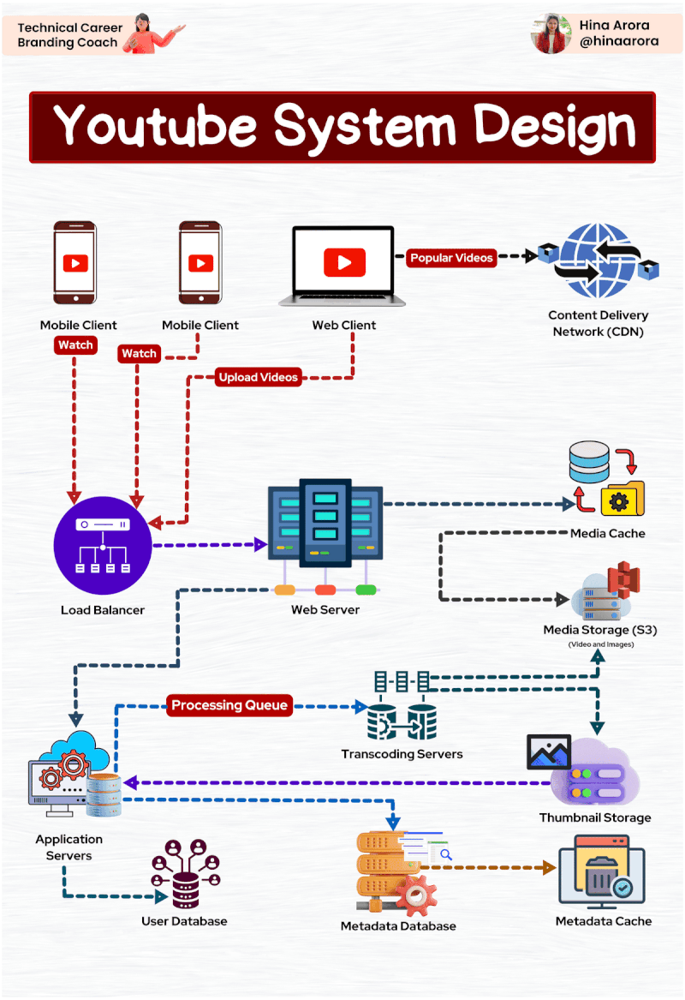

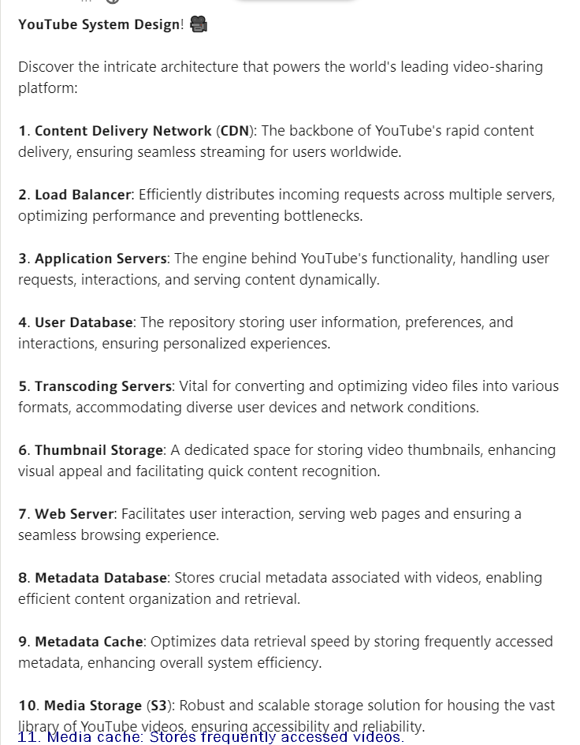

[Here](https://bytes.usc.edu/~saty/courses/snipps/YT-5rF) is an alternative schematic.

### Video Search Engines - Quick Summary

- A **video search engine** is a web-based search engine which crawls the web primarily for video content. 
  - YouTube is not strictly a video search engine as it does not crawl the web looking for video content
- The **indexing** of video content is normally done by acquiring meta-data associated with the video, e.g.
  - Author, title, creation date, duration, coding quality, tags, description
  - Other aspects of video recognition are subtitles (using formats STR or SUB) and transcription (using format TTXT)  
- The **ranking** of videos under a query is generally done using:  
  - Relevance: using metadata and user preferences  
  - Ordered by date of upload  
  - Ordered by number of views  
  - Ordered by duration 
  - Ordered by user rating 

So indexing and ranking are a lot simpler than for document search  engines 

### Video Search Engines That Crawl for Content

- Those no longer existing
  - **CastTV** was a Web-wide video search engine that was founded in 2006
    - No longer active 
  - **Munax** released their first version all-content search engine in 2005 and powers both nationwide and worldwide search engines with video search 
    - http://www.munax.com/ no longer active
  - ScienceStage is an integrated universal search engine for science-oriented videos. All videos are also semantically matched to millions of research documents from open-access databases. 
    - No longer active 
  - A few remain
    - Bing does crawl for videos, see https://www.bing.com/videos/ 

##### Video Search Engines That Host

- Largely because of the large file sizes involved, video hosting is highly concentrated on a fairly small number of websites
  - **vimeo.com**, first to support HD video, focuses on short, arty, films
  - **vevo.com**, a joint venture of Universal Music Group, Sony Music Entertainment and Warner Music Group
  - **dailymotion.com**, owned by Vivendi, hosts high quality videos 
- Most of these websites which host video allow their videos to be embedded on other websites
- **YouTube.com** has become the defacto site for uploading videos 
- It is legal to crawl YouTube, see their Terms of Service, www.youtube.com/static?template=terms 
- “3. You are not allowed to access the Service using any automated means (such as robots, botnets or scrapers) except (a) in the case of public search engines, in accordance with YouTube’s robots.txt file; or (b) with YouTube’s prior written permission;” 

##### Video Search Engines That Stream Entertainment

- **Hulu** is an America subscription video on demand service jointly owned by Walt Disney, 21st Century Fox, Comcast, and Time Warner 

  - In December 2017, Disney acquired Fox's partial ownership, giving it a majority stake; other owners include Comcast 

- **Netflix** is an American subscription video on demand service, that originally delivered DVDs; 

  - They develop their own content as well as offering content from major film distributors

- **Amazon Prime** is an American subscription video on demand service offering television and file shows for rent or purchase 

- **Disney+** a recent entry 

- There are many others: XtremeHD, Sling TV, Apple TV+, HBO Max, Acorn TV, etc * 

  **Entertainment** 

### Some Technologies Supporting Video Content

- Subtitles: there are two formats, one for subtitles and one for transcripts 
  - There are three main types of video subtitling service: 
    1. **open caption**: burned into the video
    2. **closed caption**: can be turned on/off, generally at the bottom of the screen 
    3. **SDH (Subtitles for the Deaf and Hard of Hearing)**: similar to closed caption, but includes words describing actions or moods 
  - **SRT or SUB for subtitles** 
    - SRT (. srt) stands for “SubRip Subtitle” file, and it's the most common subtitle/caption file format. It is **a text format** 
    - TTXT for transcripts
- Speech Recognition, used to extract phrases from audio transcripts for better indexing
  - **Gaudi, Google Audio Indexing** uses voice recognition to locate the exact spot where words are spoken 
  - https://www.searchenginejournal.com/google-audio-search-will-it-cver-bepossible/397129/
  - **Text Recognition**: uses OCR on video slides to detect words,
  - e.g. TalkMiner System, see https://www.youtube.com/watch?v=7TN6I_m9LywM 

### YouTube Background

- YouTube is an American video hosting website headquartered in San Bruno, California, created by three = former PayPal employees: Chad Hurley, Steve Chen, Jawed Karim in February 2005.
- In November 2006, it was bought by Google for US $1.65 billion
- In 2020 Google announced that YouTube generated revenue of $19.8 billion
- The site allows users to upload, view, rate, share, add to favorites, report and comment on videos.
- In January 2022, the website was ranked as the second most popular site by Alexa Internet, a web traffic analysis company (now owned by Amazon) 

##### YouTube as a Search Engine

- YouTube - The 2nd Largest Search Engine (cite: Infographic)
- YouTube processes more than 3 billion searches a month
- It's bigger than Bing, Yahoo!, Ask and AOL combined!

##### YouTube Traffic - Some Facts

- As of 2021: 
  - 60 hours of video are uploaded every minute, or one hour of video is uploaded to YouTube every second. 
  - Over 4 billion videos are viewed a day 
  - Over 800 million unique users visit YouTube each month 
  - Over 3 billion hours of video are watched each month on YouTube 
  - More video is uploaded to YouTube in one month than the 3 major US networks created in 60 years 
  - 70% of YouTube traffic comes from outside the US 
  - YouTube is localized in 39 countries and across 54 languages 
  - It is estimated that YouTube holds 1 sextillion gigabytes of data 

### YouTube Search Engine Issues to Consider

- Since crawling, indexing and ranking are not big challenges for YouTube, what are the major hurdles 
  1. What video formats are acceptable
     - For uploading
     - For downloading 
  2. How are videos to be displayed on: desktops, iPhones, iPads, Android devices, etc 
  3. How does YouTube distribute videos worldwide 
     - A content distribution network (CDN) 
  4. How does YouTube monetize its website? 
     - YouTube’ s ContentID system 
  5. How does YouTube keep users watching 
     - The YouTube Recommendation System 

##### YouTube Upload Characteristics

- YouTube Upload Characteristics
  - **YouTube** supports 8 video formats for uploading: MOV, MP4 (MPEG4), AVI, WMV, FLV, 3GP, MPEGPS, WebM
  - **Aspect Ratio**: the standard aspect ratios are: 4:3 or 16:9. When the video is uploaded to the site, YouTube will either leave it as-is (for 16:9) or add vertical black bars (for 4:3)
  - The maximum file size you can upload to YouTube is 128GB. 
  - By default, you can upload videos that are up to 15 minutes long, though that can be extended 
  - Many videos have a short life cycle, e.g. a recent tennis match that is soon forgotten, however, there is no time limit for videos to remain on YouTube, unless 
    - You delete the video. 
    - You delete your account. 
    - You violate copyright or community guidelines 

##### YouTube Videos Run On Multiple Platforms

- Desktops/laptops 
  - Videos are played in your browser assuming it supports HTMLS 
  - This avoided the need to use Adobe Flash Player 
- Smartphones 
  - YouTube apps exist for Android and iPhone devices 
    - There is no native support for running YouTube videos so a separate app is required 
  - For YouTube's videos to run on Apple products YouTube's content had to be transcoded into Apple's preferred video standard, H.264 
- Other Devices 
  - Apple TV, Fire TV, iPod Touch,
  - TiVo, PlayStation, Wii Game consoles, 
  - Xbox Live, Roku Players 
  - Google Chromecast 

### YouTube Channels

- In order to upload a video you must be a registered user 
- In addition YouTube offers a special type of account called a **channel**; channels include 
  - thumbnails of videos you've uploaded, 
  - members to whom you’ve subscribed, 
  - videos from other members you've picked as favorites, 
  - list of members who are your friends.
  - your subscribers

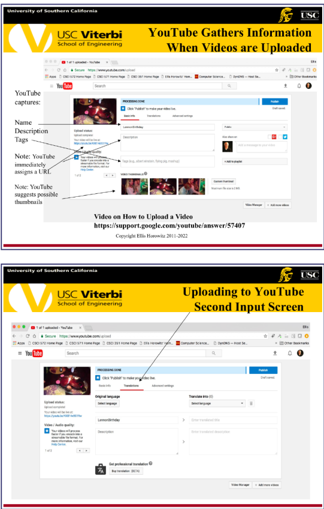

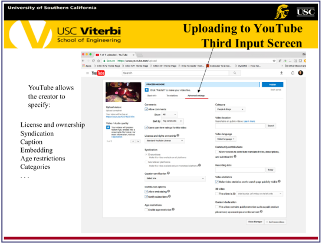

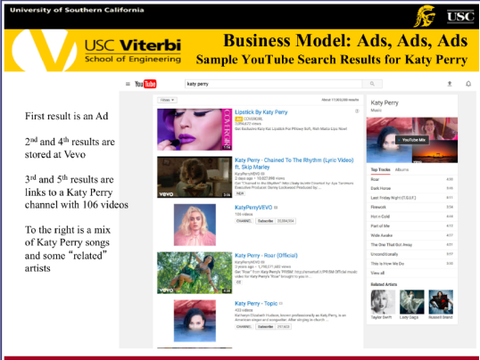

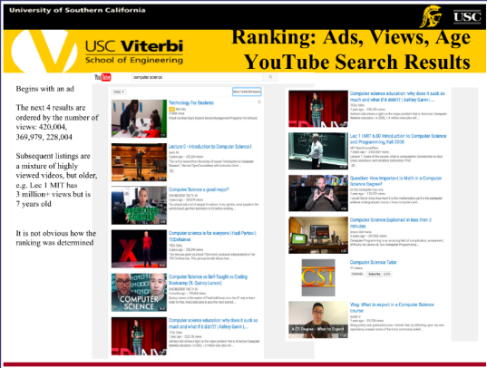

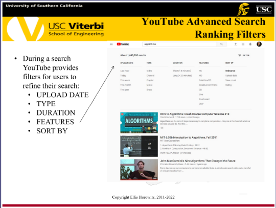

### YouTube Ranking Factors

- YouTube uses the following metrics for ranking search results: 
  1. Meta Data
     - video titles, descriptions and tags are core ranking factors
     - include links to a website and social profiles 
  2. Video Quality
     - HD ranks higher than low quality videos 
  3. Number of views, likes, shares and links
  4. Subtitles and Closed Captions 
     - captions are crawled by the YouTube search engine and used for ranking 
- What is not known is how YouTube weights the individual factors to make up their final ranking 

### YouTube Makes Recommendations to Retain Viewers

- YouTube Search Results Example for query “computer algorithms” 
- Assume we choose the first result 

Recommendations are made to maximize watch time 

##### YouTube Recommendation Algorithm

- Given the query “computer algorithms” followed by a selection, YouTube makes recommendations for subsequent videos 
- Recommendations account for 60% of all video clicks 

### YouTube Recommendation System Uses Graph Properties

- Association Rule Mining 

  - For each pair of videos $v_i, v_j$ compute co-visitation counts, i.e. they count how often they were co-watched; if $c_{i, j}$ is the co-visitation count, then relatedness is defined as 

    $r(v_i, v_j) = \frac{c_{i, j}}{f(v_i, v_j)}$

    where $c_i$ and $c_j$ are the total occurrence counts across all sessions for videos $v_i$ and $v_j$. $f(v_i, v_j)$ is a normalization function that takes the global popularity of both the seed video and the candidate video into account; e.g. $f(v_i,v_j) = c_i * c_j$

    The set of related videos, $R_i$, for a given seed video $v_i$ is determined by taking the top N candidate videos ranked by their scores $r(v_i, v_j)$

    Related videos induce a directed graph over the set of videos, namely: For each pair of videos $(v_i, v_j)$, there is an edge $e_ij$ from $v_i$ to $v_j$ iff $v_j$ is in $R_i$ 

    - [Here](https://bytes.usc.edu/cs572/s25-555-sear-ch/lectures/YouTube/docs/The_YouTube_video_recommendation_system.pdf) is the paper referenced above. Also, [here](https://www.gantry.io/blog/monolith-the-recommendation-system-behind-tiktok) [and [here](https://arxiv.org/pdf/2209.07663)] is TikTok's recommendation engine!

### Google Search is Biased Towards YouTube Videos

A **video rich snippet** means that when someone searches for something on Google, you can have a small tiny **video** show up next to your result to let the user know that particular result (yours) has a **video** to help

Google weeded out the video competition in Web search by predominantly displaying **only video-rich snippets** for YouTube videos back in 2014. Here is a graph outlining the percentage share of video-rich snippets in Google; 91% are from YouTube 

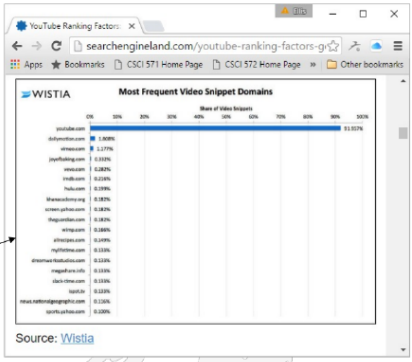

### Content Delivery Networks

- A content distribution network (CDN) consists of a large set of content servers and a means for dynamically selecting servers based on knowledge of the location of the user and possibly the content being requested 
- Some sights operate their own CDN, e.g. Google, YouTube 
- There are third party companies that offer CDN services such as Akamai, Limelight and Level 3 Communications (now part of Century Link) 
- See the Akamai video for 5 minutes (Tom Leighton, start at 0:44-5:00), 
- https://www.youtube.com/watch?v=Ni_60cbMydg 

##### YouTube Video Delivery System

- Two Critical Technology Challenges for YouTube: 
  - How to identify billions of videos
  - How to efficiently deliver the video to the desktop/mobile device 
- The Solutions: 
  - Identification: YouTube assigns a fixed-length, 11 character string, base 64, unique identifier to each video, see 
    - https://www.youtube.com/watch?v=gocwRvLhDf8 (5 min) 
  - Efficient Delivery: YouTube makes use of Google's data centers using them as a content distribution network
    - https://www.youtube.com/watch?v=6yrijdhvAtl (2 mins) 

##### YouTube (Google's Content Delivery Datacenters)

-  A map of Google’ s data centers, see 
- https://www.google.com/about/datacenters/inside/locations/index.html 

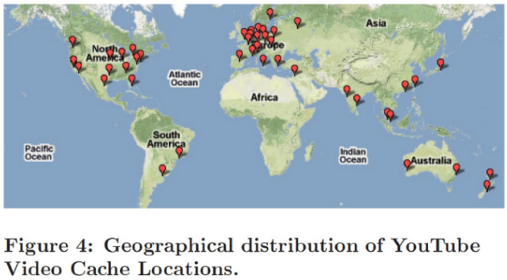

##### Uploading a YouTube Video

1. videos are uploaded from a desktop to a central Data Center 
2. the video is then transcoded into multiple formats 
3. transcoded copies are sent to the Content Distribution Network 

Video transcoding is a technique of converting a video into multiple different formats and resolutions to make it playable across different devices and bandwidths. The technique is also known as video encoding. This enables YouTube to stream videos in different resolutions such as. 144p, 240p, 360p, 480p, 720p, 1080p & 4K. 

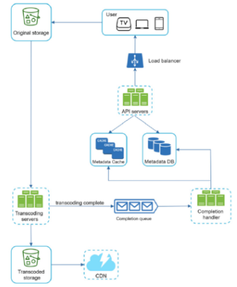

##### YouTube's Content Distribution Network Downloading a YouTube Video

A local DNS server resolves www.youtube.com and is redirected to a YouTube server which downloads the page information and a pointer to a YouTube server that can deliver the video, e.g. v23.Iscache5.c.youtube.com The request to v23.Iscache$ ..  may be further resolved 

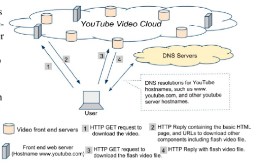

##### YouTube Delivery System

- The design of the YouTube video delivery system consists of a three components:
  1. a "flat" video id space,
  2. a multi-layered logical server organization consisting of five anycast namespaces (and two unicast namespaces), and 
  3. a 3-tiered physical cache hierarchy with (at least) 38 primary locations, 8 secondary and 5 tertiary locations. 

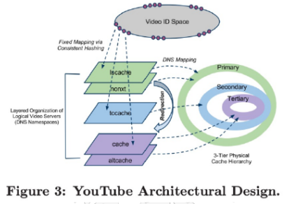

##### Reference to YouTube's CDN

- There are four research papers that investigated and discussed the YouTube CDN, they are: 
  1. Vivisecting YouTube: An Active Measurement Study, 2012, cited by Jefay 
  2. Dissecting Video Server Selection Strategies in the YouTube CDN, 2011, cited by Jefay 
  3. YouTube Traffic Dynamics and Its InterPlay with a Tier-1 ISP, 2010 
  4. https://www-users.cse.umn.edu/~zhang089/Papers/youtube-tech-report.pdf 
- All of the papers describe a complicated re-direction scheme to find the nearest data center to serve the video; they attempt to minimize Round Trip Time or RTT 
- For rarely-called-for videos the “Dissecting” paper did a study requesting in California a rare video and observed that the first request came from the Netherlands, but future requests were served from California 
- Conclusion: videos are constantly being moved around to be closer to the place that is requesting them.

### Monetizing YouTube

- YouTube challenges in the early days 
  - YouTube had no way of making money and its infrastructure is very expensive 
  - YouTube was being sued by content creators as many of YouTube’ s videos were uploaded illegally
  - YouTube solved both problems at once, by 
    - Developing a system for spotting copyrighted content 
    - Allowing the copyright owner to decide if he wants to keep the content on the site and let ads appear, splitting the revenue with YouTube or taking the content down 

### ContentID

- YouTube’s solution was to create a fingerprint database of copyrighted content, called Content ID 
- YouTube solicited cooperation from content owners asking them to submit copies of their content so YouTube could fingerprint them 
  - There are millions of reference files in YouTube’ s Content ID database. 
- When a new video is uploaded, it is immediately checked against the database, and the video is flagged as a copyright violation if a match is found. 
- When this occurs, the content owner has the choice of 
  1. blocking the video to make it unviewable, 
  2. tracking the viewing statistics of the video, or 
  3. adding advertisements to the video 

##### More Details on ContentID

1. Content ID is based off audio and video samples that rights holders have uploaded to YouTube 
2. User uploads a video. 
3. YouTube then queues up the video to be processed i.e. it is transcoded into multiple formats including: 
   - HTML5, H.264, WebM VP8, HD, non-HD, and others 
4. If the video contains audio, a hash is then calculated based off a time frequency graph called a spectrogram.
   - Target zones (peak points in the spectrogram) are marked, then the target arca between them is also taken and hashed 
5. For the video portion, a sample section of frames of the video is taken 
   - A hash is created from those sampled frames of the video 

**Note** recently YouTube has introduced a new version of ContentID it calls Copyright Match 

See the following videos for details, (2 min). https://youtu.be/5-2R-IZITZ8 

### Creating an Acoustic Fingerprint

- The audio signal is digitized and converted to a spectrogram: a time-frequency graph 

  - The graph below plots three dimensions of audio: frequency versus amplitude versus time 

  - A common format is a graph with two dimensions: one axis represents time, and the other axis represents frequency; a third dimension indicating the amplitude of a particular frequency at a particular time is represented by the intensity or color of each point in the image. 

    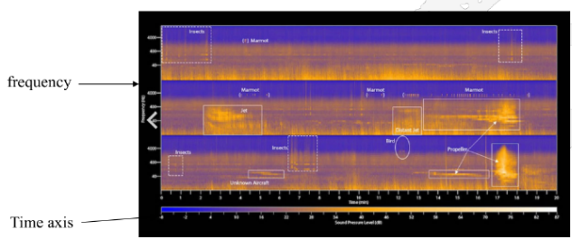

    

##### How Good is Content ID

- According to stats released by YouTube 99.5 percent of all copyright issues specifically related to sound recordings are automatically resolved by Content ID 
- In addition to music, Content ID also identifies 98% of copyright claims, including those tied to film, TV, gaming 
- The actual hashing algorithm used by YouTube remains proprietary, but it has been suggested that YouTube uses finite-state transducers to compute the hash function, e.g. see 
- Eugene Weinstein, Pedro J. Moreno; Music Identification with Weighted Finite-State Transducers, Proceedings of the International Conference in Acoustics, Speech and Signal Processing (ICASSP), 2007 

### Will YouTube Ever Run Out of Storage

- The storage you can buy with $100 has grown exponentially — or equivalently, the cost of storing 1GB of videos has decreased exponentially 

  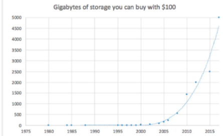

##### Total Capacity of YouTube Storage

- An answer by Rasty Turek from Quora 

- There is roughly 24TB of new videos uploaded daily 

- Each video is re-encoded based on pre-selected profiles and each is stored as a separate file 

- Here is his computation: 

  24TB * 4x (for profiles) * 365 days = 35PB/year 

  So YouTube needs to store roughly 35PB of new data every year. From multiple sources we know that there is roughly 1 Billion videos that have been uploaded to YouTube to date. Assuming each video has on average size of 86MB we can compute their total storage needs as:

  86MB * 4 (for profiles) * 1,000,000,000 = 320PB 

  So it is estimated that YouTube needs to have at least 320PB of storage currently and that the storage needs are growing each year by 35 PetaBytes.

