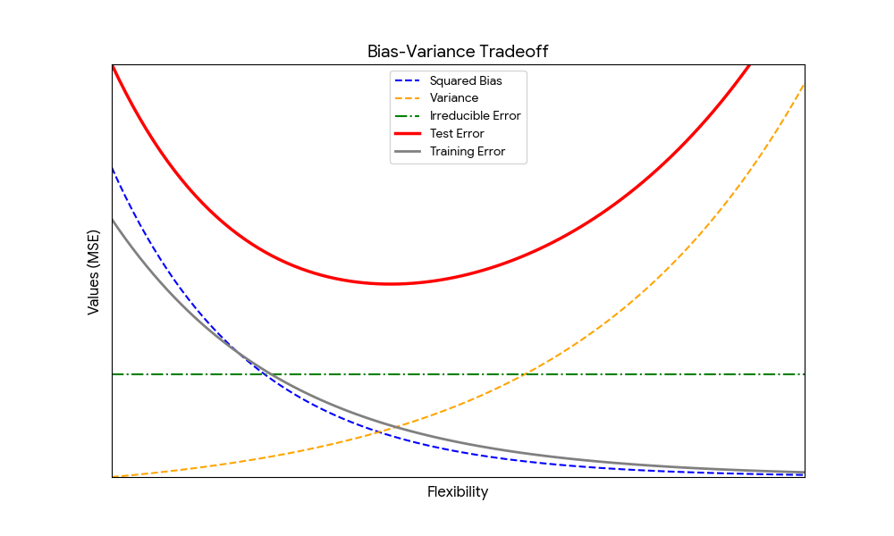

# ISE529 Homework 1

1. (15 points)
    For each of parts (a) through (d), indicate whether we would generally expect the performance of a flexible statistical learning method to be better or worse than an inflexible method. Justify your answer.
    (a) The sample size \(n\) is extremely large, and the number of predictors \(p\) is small.
    (b) The number of predictors \(p\) is extremely large, and the number of observations \(n\) is small.
    (c) The relationship between the predictors and response is highly non-linear.
    (d) The variance of the error terms, i.e. \(\sigma^2 = \text{Var}(\epsilon)\), is extremely high.

  ###### Answer

(a) Better. When $n$ is extremely large and $p$ is small, flexible methods generally perform better because abundant data reduces variance and overfitting risk. This allows the model to capture complex patterns with low bias, whereas inflexible methods may underfit by failing to learn subtler relationships present in the data.

(b) *Worse.* When $p$ is extremely large and $n$ is small, flexible methods tend to overfit due to high variance and the curse of dimensionality. With too few observations to support many predictors, flexible models often fit noise instead of signal, while inflexible methods provide more stable estimates by imposing stronger structural constraints.

(c) Better. If the true relationship is highly non-linear, flexible methods usually outperform inflexible ones because they can adapt to complex functional forms. Inflexible methods (e.g., linear models) suffer from high bias in this setting, whereas flexible methods reduce bias by better approximating the underlying pattern.

(d) Worse. When the error variance $\sigma^2$ is extremely high, flexible methods perform worse because they tend to fit random noise, leading to overfitting and poor generalization. Inflexible methods are preferred since their rigidity helps smooth out noise and capture only the main trend.


2. (20 points)
    Answer the following questions.
    (a) Provide a sketch of typical (squared) bias, model variance, training error, test error, and irreducible error curves, on a single plot, as we go from less flexible statistical learning methods towards more flexible approaches. The x-axis should represent the amount of flexibility in the method, and the y-axis should represent the values for each curve. There should be five curves. Make sure to label each one.
    (b) Explain why each of the five curves has the shape displayed in part (a).
    (c) According to the bias-variance decomposition, show that the following equation holds.

$$
E[f(x_0) - \hat{f}(x_0)]^2 = Var(\hat{f}(x_0)) + [Bias(\hat{f}(x_0))]^2
$$

###### Answer

(a)



(b)As model flexibility increases, **squared bias decreases** because more flexible models can better approximate complex true relationships, reducing systematic underfitting. **Variance increases** since highly flexible models are sensitive to small changes in the training data and tend to fit noise, making them unstable. **Training error decreases monotonically** because added flexibility allows the model to fit the training data more closely, potentially reaching zero with extreme flexibility. **Test error follows a U-shape**: it is high at low flexibility due to large bias, decreases as bias drops, and then increases again when growing variance dominates due to overfitting. **Irreducible error remains constant** because it reflects inherent noise in the data-generating process and cannot be reduced by any modeling choice.


(c)

Let $\theta=f(x_0)$ and $\hat{\theta}=\hat f(x_0)$. Then
$$
E[(\theta-\hat{\theta})^2]=E[(\theta-E[\hat{\theta}]+E[\hat{\theta}]-\hat{\theta})^2].
$$
Expanding the square gives a bias term, variance term, and cross term. 

$$= E\left[ \underbrace{(\theta - E[\hat{\theta}])^2}_{\text{Bias term}} + \underbrace{(E[\hat{\theta}] - \hat{\theta})^2}_{\text{Variance term}} + 2(\theta - E[\hat{\theta}])(E[\hat{\theta}] - \hat{\theta}) \right]$$

Then apply the expectation to each of the three terms.

Bias term: Since $\theta$ and $E[\hat{\theta}]$ are constants, the expectation does not change them.

$$E\left[ (\theta - E[\hat{\theta}])^2 \right] = (\theta - E[\hat{\theta}])^2 = [\text{Bias}(\hat{\theta})]^2$$

Variance term:  By definition, the expected squared deviation from the mean is Variance.

$$E\left[ (E[\hat{\theta}] - \hat{\theta})^2 \right] = E\left[ (\hat{\theta} - E[\hat{\theta}])^2 \right] = \text{Var}(\hat{\theta})$$

Cross term: We can pull the constant part $(\theta - E[\hat{\theta}])$ out of the expectation.

$$2(\theta - E[\hat{\theta}]) \cdot E\left[ E[\hat{\theta}] - \hat{\theta} \right]$$

Inside the expectation: $E[E[\hat{\theta}] - \hat{\theta}] = E[\hat{\theta}] - E[\hat{\theta}] = 0$.

Therefore, the entire cross term is 0.

Combining the parts back together:

$$E\left[ (\theta - \hat{\theta})^2 \right] = [\text{Bias}(\hat{\theta})]^2 + \text{Var}(\hat{\theta})$$

Substituting our original notation back in:

$$E\left[ (f(x_0) - \hat{f}(x_0))^2 \right] = [\text{Bias}(\hat{f}(x_0))]^2 + \text{Var}(\hat{f}(x_0))$$


3. (10 points)
    If X is Bernoulli random variable with parameter p, use the definition of expectation and variance learned in the class, show that its $E(X) = p$, $Var(X) = p(1-p)$.

  ###### Answer

  For a Bernoulli random variable $X$ with parameter $p$, we have $P(X=1)=p$ and $P(X=0)=1-p$. The expectation is
$$
  E[X]=1\cdot p + 0\cdot(1-p)=p.
$$
  Using the variance formula $\text{Var}(X)=E[X^2]-(E[X])^2$, note that $X^2=X$ for Bernoulli variables, so $E[X^2]=p$. Therefore,
$$
  \text{Var}(X)=p-p^2=p(1-p).
$$
  Hence, $E[X]=p$ and $\text{Var}(X)=p(1-p)$.


4. (15 points)
    Let X be the amount (in ounces) of soft drink in a randomly chosen bottle from company A, and Y be the amount of soft drink in a randomly chosen bottle from company B. A study has shown that the probability distributions of X and Y are as follows:

x           | 15.85 | 15.9 | 16 | 16.1 | 16.2
------------|-------|------|----|------|------
P(X = x)    | 0.15  | 0.21 | 0.35 | 0.15 | 0.14
P(Y = x)    | 0.14  | 0.05 | 0.64 | 0.08 | 0.09

Find E(X), E(Y), Var(X), and Var(Y) and interpret them.

###### Answer

Using $E[X]=\sum x_iP(x_i)$ and $\text{Var}(X)=E[X^2]-(E[X])^2$, Company A has expected fill 

$$E[X] = (15.85)(0.15) + (15.9)(0.21) + (16)(0.35) + (16.1)(0.15) + (16.2)(0.14)$$

$$E[X] = 2.3775 + 3.339 + 5.6 + 2.415 + 2.268$$

$$E[X] = 15.9995 \text{ oz}$$

Therefore, the $E[X^2]$ is

$$E[X^2] = (15.85^2)(0.15) + (15.9^2)(0.21) + (16^2)(0.35) + (16.1^2)(0.15) + (16.2^2)(0.14)$$

$$E[X^2] = 37.683375 + 53.0901 + 89.6 + 38.8815 + 36.7416$$

$$E[X^2] = 255.996575$$

so variance of X is 

$$\text{Var}(X) = 255.996575 - (15.9995)^2$$

$$\text{Var}(X) = 255.996575 - 255.98400025$$

$$\text{Var}(X) \approx 0.0126 \text{ oz}^2$$

Company B has expected fill 

$$E[Y] = (15.85)(0.14) + (15.9)(0.05) + (16)(0.64) + (16.1)(0.08) + (16.2)(0.09)$$

$$E[Y] = 2.219 + 0.795 + 10.24 + 1.288 + 1.458$$

$$E[Y] = 16.0 \text{ oz}$$

Therefore the **$E[Y^2]$** is

$$E[Y^2] = (15.85^2)(0.14) + (15.9^2)(0.05) + (16^2)(0.64) + (16.1^2)(0.08) + (16.2^2)(0.09)$$

$$E[Y^2] = 35.17115 + 12.6405 + 163.84 + 20.7368 + 23.6196$$

$$E[Y^2] = 256.00805$$

and variance $$\text{Var}(Y) = 256.00805 - (16)^2$$

$$\text{Var}(Y) = 256.00805 - 256$$

$$\text{Var}(Y) = 0.00805 \text{ oz}^2$$

Thus, both companies deliver essentially the same average amount (about 16 oz). However, Company B has a smaller variance, indicating greater consistency in bottle filling. In particular, Company B places much higher probability on exactly 16 oz, while Company A’s distribution is more spread out. Therefore, although both companies meet the target on average, Company B demonstrates better quality control due to its lower variability.


5. (15 points)
The table below provides a training data set containing six observations, three predictors, and one qualitative response variable. Use Jupyter Lab with Python to answer the following questions.

| Obs. |  X1  |  X2  |  X3  |   Y   |
| :--: | :--: | :--: | :--: | :---: |
|  1   |  0   |  3   |  0   |  Red  |
|  2   |  2   |  0   |  0   |  Red  |
|  3   |  0   |  1   |  3   |  Red  |
|  4   |  0   |  1   |  2   | Green |
|  5   |  -1  |  0   |  1   | Green |
|  6   |  1   |  1   |  1   |  Red  |

Suppose we wish to use this data set to make a prediction for Y when $X1 = X2 = X3 = 0$ using K-nearest neighbors.
(a) Compute the Euclidean distance between each observation and the test point, $X1 = X2 = X3 = 0$.
(b) What is our prediction with K = 1 or 3? Why?
(c) If the Bayes decision boundary in this problem is highly nonlinear, then what would be the best choice for the value of K? Why?

###### Answer

```python
import pandas as pd
import numpy as np

# Define the dataset
data = {
    'Obs': [1, 2, 3, 4, 5, 6],
    'X1': [0, 2, 0, 0, -1, 1],
    'X2': [3, 0, 1, 1, 0, 1],
    'X3': [0, 0, 3, 2, 1, 1],
    'Y': ['Red', 'Red', 'Red', 'Green', 'Green', 'Red']
}

df = pd.DataFrame(data)

# Test point
test_point = np.array([0, 0, 0])

# Calculate Euclidean distance
# distance = sqrt((x1-0)^2 + (x2-0)^2 + (x3-0)^2) = sqrt(x1^2 + x2^2 + x3^2)
df['Distance'] = np.sqrt((df['X1'] - test_point[0])**2 + 
                         (df['X2'] - test_point[1])**2 + 
                         (df['X3'] - test_point[2])**2)

# Sort by distance
df_sorted = df.sort_values(by='Distance')

print("Distances for each observation:")
print(df[['Obs', 'Distance', 'Y']])

# Predictions
# K=1
k1_neighbors = df_sorted.head(1)
k1_prediction = k1_neighbors['Y'].mode()[0]
print(f"\nK=1 Prediction: {k1_prediction}")
print("Nearest Neighbor for K=1:")
print(k1_neighbors)

# K=3
k3_neighbors = df_sorted.head(3)
k3_prediction = k3_neighbors['Y'].mode()[0]
print(f"\nK=3 Prediction: {k3_prediction}")
print("Nearest Neighbors for K=3:")
print(k3_neighbors)
```


(a)We calculated the Euclidean distance between each observation and the test point $X = (0, 0, 0)$ using the formula:

$$d = \sqrt{(X_1 - 0)^2 + (X_2 - 0)^2 + (X_3 - 0)^2} = \sqrt{X_1^2 + X_2^2 + X_3^2}$$

| **Obs.** | **X1** | **X2** | **X3** | **Calculation**                        | **Distance** | **Y** |
| -------- | ------ | ------ | ------ | -------------------------------------- | ------------ | ----- |
| 1        | 0      | 3      | 0      | $\sqrt{0^2 + 3^2 + 0^2} = \sqrt{9}$    | **3.00**     | Red   |
| 2        | 2      | 0      | 0      | $\sqrt{2^2 + 0^2 + 0^2} = \sqrt{4}$    | **2.00**     | Red   |
| 3        | 0      | 1      | 3      | $\sqrt{0^2 + 1^2 + 3^2} = \sqrt{10}$   | **3.16**     | Red   |
| 4        | 0      | 1      | 2      | $\sqrt{0^2 + 1^2 + 2^2} = \sqrt{5}$    | **2.24**     | Green |
| 5        | -1     | 0      | 1      | $\sqrt{(-1)^2 + 0^2 + 1^2} = \sqrt{2}$ | **1.41**     | Green |
| 6        | 1      | 1      | 1      | $\sqrt{1^2 + 1^2 + 1^2} = \sqrt{3}$    | **1.73**     | Red   |


6. (25 points)
    Given the Auto data set (see attached Auto.csv), use Jupyter Lab with Python to answer the following questions. Make sure that the missing values in the data set have been removed before analysis is performed.

  (a) Which of the predictors are quantitative, and which are qualitative?
  (b) What is the range of each quantitative predictor?
  (c) What is the mean and standard deviation of each quantitative predictor?
  (d) Now remove the 10th through 85th observations. What is the range, mean, and standard deviation of each predictor in the subset of the data that remains?
  (e) Using the full data set, investigate the predictors graphically, using scatterplots or other tools of your choice. Create matrix of scatter plots highlighting the relationships among the predictors.
  (f) Suppose that we wish to predict gas mileage (mpg) on the basis of the other variables. Do your plots suggest that any of the other variables might be useful in predicting mpg?.
