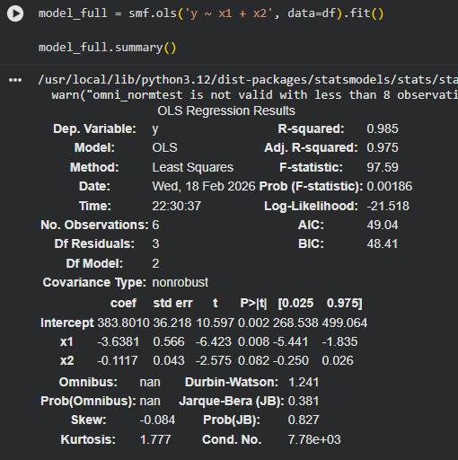
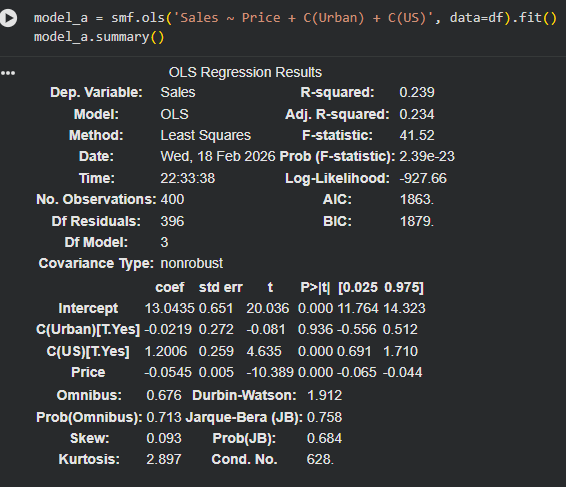

Letian Yang, USC ID: 5867225705

# ISE529 Homework 2

### 1. (20 points)
Consider the following computer output:

**Regression Equation:** $Y = 254 + 2.77x_1 - 3.58x_2$

| Predictor | Coef | SE Coef | T |
| :--- | :--- | :--- | :--- |
| Constant | 253.810 | 4.781 | ? |
| x1 | 2.7738 | 0.1846 | 15.02 |
| x2 | -3.5753 | 0.1526 | ? |

$S = 5.05756$,  $R\text{-}Sq = ?$  , $R\text{-}Sq(adj) = 98.4\%$

**Analysis of Variance:**

| Source | DF | SS | MS | F |
| :--- | :--- | :--- | :--- | :--- |
| Regression | 2 | 22784 | 11392 | ? |
| Residual Error | ? | ? | ? | |
| Total | 14 | 23091 | | |

(a) Fill in the missing quantities.  
(b) What conclusions can you draw about the significance of regression?  
(c) What conclusions can you draw about the contributions of the individual regressors to the model?  
*Note: check the critical value in the F-distribution or t-distribution table.*


##### Answer

**(a)**

To find the missing quantities, I use the standard formulas for regression output:

- **T-statistic ($T$):** Calculated by dividing the coefficient by its standard error ($T = \text{Coef} / \text{SE Coef}$).

  - $T_{\text{Constant}} = 253.810 / 4.781 = \mathbf{53.09}$
  - $T_{x_2} = -3.5753 / 0.1526 = \mathbf{-23.43}$

- **Residual Error DF:** Total DF minus Regression DF.

  - $\text{Residual DF} = 14 - 2 = \mathbf{12}$

- **Residual Error SS:** Total SS minus Regression SS.

  - $\text{Residual SS} = 23091 - 22784 = \mathbf{307}$

- **Residual Error MS:** Residual SS divided by Residual DF.

  - $\text{Residual MS} = 307 / 12 = \mathbf{25.58}$

    (also $S^2 = 5.05756^2 \approx 25.58$)

- **F-statistic ($F$):** Regression MS divided by Residual MS.

  - $F = 11392 / 25.58 = \mathbf{445.35}$ (Also MS = $307/12$, $F = 445.29$)

- **R-Sq ($R^2$):** Regression SS divided by Total SS.

  - $R^2 = 22784 / 23091 = 0.9867 = \mathbf{98.67\%}$

Complete table:

| **Predictor** | **Coef** | **SE Coef** | **T**      |
| ------------- | -------- | ----------- | ---------- |
| Constant      | 253.810  | 4.781       | **53.09**  |
| x1            | 2.7738   | 0.1846      | 15.02      |
| x2            | -3.5753  | 0.1526      | **-23.43** |

$S = 5.05756$,  $R\text{-}Sq =$ **$98.67\%$** , $R\text{-}Sq(adj) = 98.4\%$

**Analysis of Variance:**

| **Source**     | **DF** | **SS**  | **MS**    | **F**      |
| -------------- | ------ | ------- | --------- | ---------- |
| Regression     | 2      | 22784   | 11392     | **445.29** |
| Residual Error | **12** | **307** | **25.58** |            |
| Total          | 14     | 23091   |           |            |

**(b)**

To test the overall significance of the regression model, I conduct an F-test:

- **Null Hypothesis ($H_0$):** $\beta_1 = \beta_2 = 0$ (The model has no predictive value).
- **Alternative Hypothesis ($H_a$):** At least one coefficient ($\beta_1$ or $\beta_2$) is not equal to 0.

Based on the table, the test statistic is $F = 445.29$.

By looking at the critical value for an F-distribution with degrees of freedom $df_1 = 2$ and $df_2 = 12$. For a typical significance level of $\alpha = 0.05$, the critical value is $F_{0.05, 2, 12} = 3.89$.

Since the computed $F$ statistic ($445.29$) is larger than the critical value ($3.89$), we reject the null hypothesis.

Conclusion: The overall regression model is highly statistically significant, meaning that $x_1$ and $x_2$ considered together strongly explain the variance in $Y$.

**(c)**

To test the significance of individual predictors, we look at the T-statistics:

- **Null Hypothesis for each ($H_0$):** $\beta_j = 0$
- **Alternative Hypothesis for each ($H_a$):** $\beta_j \neq 0$

We compare the T-values to the critical t-value with $df = 12$ (Residual DF). For a significance level of $\alpha = 0.05$ (two-tailed), the critical value is $t_{0.025, 12} = 2.179$.

- For $x_1$: $T = 15.02$. Since $|15.02| > 2.179$, we reject the null hypothesis for $x_1$.
- For $x_2$: $T = -23.43$. Since $|-23.43| > 2.179$, we reject the null hypothesis for $x_2$.

Conclusion: Both $x_1$ and $x_2$ make highly significant individual contributions to the model. The magnitude of the T-values indicates that both variables are very strong predictors of $Y$ on their own when the other variable is held constant.

---

### 2. (20 points)
A study was performed on wear of a bearing and its relationship to $x_1 =$ oil viscosity and $x_2 =$ load. Data: `bearingdata.csv`.

(a) Fit a multiple linear regression model: $y = \beta_0 + \beta_1x_1 + \beta_2x_2 + \epsilon$. Write out the estimated model.  
(b) Estimate $\sigma^2$ and compute the t-statistics for each coefficient. Using $\alpha = 0.05$, what conclusions can you draw?  
(c) Test for significance of overall regression using $\alpha = 0.05$. What is the P-value?  
(d) Predict wear when $x_1 = 25$ and $x_2 = 1000$.  
(e) Use the extra sum of squares method to investigate the usefulness of adding $x_2$ to a model that already contains $x_1$. Use $\alpha = 0.05$.  
(f) Refit the model with an interaction term. Test for significance ($\alpha = 0.05$).  
(g) Use the extra sum of squares method to determine if the interaction term contributes significantly ($\alpha = 0.05$).


**Answer on ipynb**

> Review
>
> 
>
> $\hat y = 383.8 - 3.638x_1-0.1117x_2$
>
> $\hat{\sigma}^2 = MSE = 153$
> $$
> F_0 = \frac{[SS_r(full)-SS_r(sub)]/1}{MS_e(full)}
> $$
> Full model (with x1 and x2), sub model (with only x1)

---

### 3. (20 points)
Sample of 30 observations. Full model has 9 regressors, $\hat{\sigma}^2 = MS_E = 100$ and $R^2 = 0.92$.

(a) Calculate the F-statistic for significance of regression. Using $\alpha = 0.05$, what is your conclusion?  
(b) A reduced model uses 4 regressors; $SS_E = 2200$. Find the estimate of $\sigma^2$. Is the reduced model superior? Why?  
(c) Find $C_p$ for the reduced model. Is it better than the old model?


##### Answer

Given

- Sample size ($n$) = $30$
- Full model regressors ($k$) = $9$
- Full model $\hat{\sigma}^2 = MS_E = 100$
- $R^2 = 0.92$

**(a)**

First, to find the Sum of Squares Error ($SS_E$) and Sum of Squares Total ($SS_T$).

The degrees of freedom for the error in the full model ($df_E$) is:

$$df_E = n - k - 1 = 30 - 9 - 1 = 20$$

Knowing that $MS_E = \frac{SS_E}{df_E}$, so:

$$SS_E = MS_E \times df_E = 100 \times 20 = 2000$$

Using the $R^2$ formula to find $SS_T$:

$$R^2 = 1 - \frac{SS_E}{SS_T}$$

$$0.92 = 1 - \frac{2000}{SS_T} \implies \frac{2000}{SS_T} = 0.08 \implies SS_T = \frac{2000}{0.08} = 25000$$

Now calculate the Regression Sum of Squares ($SS_R$):

$$SS_R = SS_T - SS_E = 25000 - 2000 = 23000$$

The Mean Square Regression ($MS_R$) with $df_R = k = 9$ is:

$$MS_R = \frac{SS_R}{k} = \frac{23000}{9} \approx 2555.56$$

The F-statistic is:

$$F = \frac{MS_R}{MS_E} = \frac{2555.56}{100} = 25.56$$

Conclusion: The critical value for $F$ with $\alpha = 0.05$ and degrees of freedom $9$ and $20$ is $F_{0.05, 9, 20} \approx 2.39$. Since $25.56 > 2.39$ (p-value $\approx 4.5 \times 10^{-9}$), reject the null hypothesis. The overall regression is highly significant.

**(b)**

The reduced model uses $k_{red} = 4$ regressors.

The degrees of freedom for the reduced error is:

$$df_{E(red)} = n - k_{red} - 1 = 30 - 4 - 1 = 25$$

Given $SS_{E(red)} = 2200$, the new estimate of $\sigma^2$ ($MS_E$ for the reduced model) is:

$$\hat{\sigma}^2_{red} = MS_{E(red)} = \frac{SS_{E(red)}}{df_{E(red)}} = \frac{2200}{25} = 88$$

The reduced model is superior. Even though by removing 5 regressors and $SS_E$ increased slightly (from 2000 to 2200), the overall estimate for the error variance ($\hat{\sigma}^2$) dropped from $100$ to $88$. This happens because the variables removed were likely adding more noise and "degrees of freedom penalties" than actual explanatory power. Also, this with a partial F-test for the 5 dropped variables: $F = \frac{(2200 - 2000) / 5}{100} = 0.4$, which is not significant.

**(c)**

Mallows' $C_p$ compares the precision and bias of a reduced model against the full model. The formula is:

$$C_p = \frac{SS_{E(red)}}{MS_{E(full)}} - n + 2p_{red}$$

Where $p_{red}$ is the number of parameters in the reduced model including the intercept ($p_{red} = k_{red} + 1 = 4 + 1 = 5$).

$$C_p = \frac{2200}{100} - 30 + 2(5)$$

$$C_p = 22 - 30 + 10 = 2$$

It is better than the old model because a good model usually has a $C_p$ value that is close to or less than its number of parameters $p$ (here, $p=5$). A $C_p = 2 \le 5$ indicates that the reduced model has very little bias and does not suffer from overfitting. In comparison, the full model's $C_p$ defaults to its parameter count ($p_{full} = 10$). Since a smaller $C_p$ is generally preferred and the reduced model successfully simplified the full model, it is definitively the better choice.


> Given: n = 30, k = 9, p = 9+1 = 10, $\hat{\sigma}^2 = MS_E = 100$, $R^2 = 0.92$
>
> (a) F statistics
> $$
> F_0 = \frac{MS_R}{MS_E}
> $$
> $MS_E = 100$
> $MS_R = \frac {SS_R}{K} =\frac{SS_T - SS_E}{K} $ 
>
> since $R^2 = \frac {SS_R}{SS_T} = 1-\frac{SS_E}{SS_T}$
>
> we can get $SS_E$ from $MS_E$
>
> $\hat{\sigma}^2 = MS_E = 100$, which is equal to $\frac{SS_E}{n-p}$
>
> and n = 30, p = 10, so $\frac{SS_E}{n-p} = \frac{SS_E}{30-10} = 100$
>
> $SS_E = 2000$
>
> $R^2 = 0.92 = 1-\frac{SS_E}{SS_T} = 1 - \frac{2000}{SS_T}$
>
> $SS_T = 25000$
>
> 
>
> (b) 
> $$
> \hat\sigma^2 = MS_E = \frac{SS_E}{n-p}
> \\
> k = 4, p = 5
> \\
> SS_E = 2200, n-p = 25
> \\
> 2200/25 = 88
> $$
> Compare the new 88 and old 100, the new model is doing better job
>
>
> (c)
> $$
> C_p = \frac{SS_E(p)}{\hat\sigma^2} - n + 2p
> \\
> C_5 = \frac{SS_E(5)}{\hat\sigma^2} - 30 + 10
> \\
> C_{10} = \frac{SS_E(10)}{\hat\sigma^2} - 30 + 20
> $$
> $SS_E(5) = 2200, SS_E(10) = 2000, \hat\sigma^2 = 100$
> $$
> C_5 = \frac{SS_E(5)}{\hat\sigma^2} - 30 + 10 = \frac{2200}{100} - 30+10 = 2
> \\
> C_{10} = \frac{SS_E(10)}{\hat\sigma^2} - 30 + 20 = \frac{2000}{100} - 30+20 = 10
> $$


---

### 4. (20 points)
Use `Carseats.csv` dataset.

(a) Fit a model to predict Sales using Price, Urban, and US.  
(b) Interpret each coefficient.  
(c) Write the model in equation form, showing qualitative variables properly.  
(d) For which predictors can you reject $H_0: \beta_j = 0$?  
(e) Fit a smaller model using only significant predictors. Compare it to model (a); which is better?  
(f) Obtain 95% confidence intervals for the coefficient(s) of the model from (e).


**Answer on ipynb**

>
>
>$S = 13.04 - 0.05 price -0.02 Urban + 1.2 US$

---

### 5. (20 points)
Perform the following Python code:
```python
rng = np.random.default_rng(10)
x1 = rng.uniform(0, 1, size=100)
x2 = 0.5 * x1 + rng.normal(size=100) / 10
y = 2 + 2 * x1 + 0.3 * x2 + rng.normal(size=100)
```

(a) Write the form of the underlying true linear model and regression coefficients.
(b) Use `corr()` for correlation between $x_1$ and $x_2$. Create a scatterplot matrix.
(c) Fit a model to predict $y$ using $x_1$ and $x_2$. Can you reject $H_0: \beta_1 = 0$ and/or $H_0: \beta_2 = 0$?
(d) Fit least squares predicting $y$ using only $x_1$, then only $x_2$. Comment on results. If $x_1$ and $x_2$ are not simultaneously significant in (c), what is implied?

##### Answer on ipynb

> df = pd.Dataframe ({'x1':x1, 'x2':x2}), and then call df.corr(), you can get the correlation
