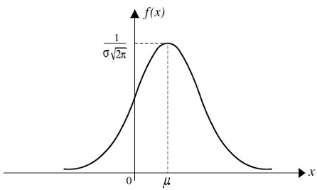
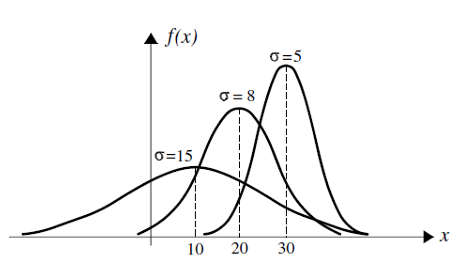

# PROBABILITY REVIEW

## Bernoulli trials

### Definition

A random variable is called **Bernoulli random variable** with parameter  $p$  if its probability mass function is given by equation

$$p(x) = \begin{cases} 1 - p \equiv q & \text{if } x = 0 \\ p & \text{if } x = 1 \\ 0 & \text{otherwise} \end{cases} \quad p(x) = \begin{cases} p^x (1 - p)^{1-x} & \text{if } x = 0 \text{ or } 1 \\ 0 & \text{otherwise} \end{cases}$$

For a Bernoulli random variable  $X$  with parameter  $p$ ,  $0 < p < 1$ ,

$$E(X) = p, \quad \text{Var}(X) = p(1 - p)$$

## Example

If in a throw of a fair die the event of obtaining 4 or 6 is called a success, and the event of obtaining 1, 2, 3, or 5 is called a failure, then  $X$  is a Bernoulli random variable. Determine its probability mass function, its expected value  $E(X)$  and variance  $Var(X)$ .

**Solution:**

$$X = \begin{cases} 1 & \text{if 4 or 6 is obtained} \\ 0 & \text{otherwise} \end{cases}$$

The parameter  $p = 1/3$ . Therefore, its probability mass function is

$$p(x) = \begin{cases} 2/3 & \text{if } x = 0 \\ 1/3 & \text{if } x = 1 \\ 0 & \text{elsewhere.} \end{cases}$$

$$E(X) = p = 1/3, \text{ and } Var(X) = 1/3(1 - 1/3) = 2/9.$$

If  $n$  Bernoulli trials all with probability of success  $p$  are performed independently, then  $X$ , the number of successes, is called a **binomial** with parameters  $n$  and  $p$ .

**Theorem** *Let  $X$  be a binomial random variable with parameters  $n$  and  $p$ . Then  $p(x)$ , the probability mass function of  $X$ , is*

$$p(x) = P(X = x) = \begin{cases} \binom{n}{x} p^x (1-p)^{n-x} & \text{if } x = 0, 1, 2, \dots, n \\ 0 & \text{elsewhere} \end{cases}$$

If  $X$  is a binomial random variable with parameters  $n$  and  $p$ , then

$$E(X) = np \quad \text{and} \quad \text{Var}(X) = np(1-p)$$

## Example

A restaurant serves 8 entrées of fish, 12 of beef, and 10 of poultry. If customers select from these entrées randomly, what is the probability that two of the next four customers order fish entrées?

**Solution:**

Let  $X$  denote the number of fish entrées (successes) ordered by the next four customers. Then  $X$  is binomial with the parameters ( $n=4$ ,  $p=8/30 = 4/15$ ). Thus

$$P(X = 2) = \binom{4}{2} \left(\frac{4}{15}\right)^2 \left(\frac{11}{15}\right)^2 = 0.23.$$

### Poisson Distribution

By the French mathematician Simeon-Denis Poisson in 1837

##### Definition

*A discrete random variable  $X$  with possible values  $0, 1, 2, 3, \dots$  is called **Poisson random variable** with parameter  $\lambda$ ,  $\lambda > 0$ , if*

$$P(X = x) = \frac{e^{-\lambda} \lambda^x}{x!}, \quad x = 0, 1, 2, 3, \dots$$

If  $X$  is a Poisson random variable with parameter  $\lambda$ , then

$$E(X) = Var(X) = \lambda$$

### Example

Suppose that, on average, in every three pages of a book there is one typographical error. If the number of typographical errors on a single page of the book is a Poisson random variable, what is the probability of at least one error on a specific page of the book?

### Solution:

Let  $X$  be the number of errors on the page we are interested in. Then  $X$  is a Poisson random variable with  $E(X) = 1/3$ . Hence  $\lambda = E(X) = 1/3$ , and thus

$$P(X = n) = \frac{(1/3)^n e^{-1/3}}{n!}.$$

Therefore,

$$P(X \ge 1) = 1 - P(X = 0) = 1 - e^{-1/3} \approx 0.28.$$

### Poisson Processes

If random events occur during time  $t$  in a way that for  $t = 0$ ,  $N(0) = 0$  and, for all  $t > 0$ ,  $0 < P[N(t) = 0] < 1$ , then there exists a positive number  $\lambda$  such that

$$P(N(t) = n) = \frac{(\lambda t)^n e^{-\lambda t}}{n!}$$

That is, for all  $t > 0$ ,  $N(t)$  is a Poisson random variable with parameter  $\lambda t$ .

Hence  $E[N(t)] = \lambda t$  and for unit time  $t = 1$ ,  $E[N(1)] = \lambda$ .

##### Example

Suppose that children are born at a Poisson rate of **five** per day in a certain hospital. What is the probability that

- (a) at least two babies are born during the next six hours;
- (b) no babies are born during the next two days?

**Solution:**

Let  $N(t)$  denote the number of babies born at or prior to  $t$ . If we choose one day as time unit, then  $\lambda = E[N(1)] = 5$ . Therefore,

$$P(N(t) = n) = \frac{(5t)^n e^{-5t}}{n!}.$$

Hence for (a),

$$\begin{aligned} P(N(1/4) \ge 2) &= 1 - P(N(1/4) = 0) - P(N(1/4) = 1) \\ &= 1 - \frac{(5/4)^0 e^{-5/4}}{0!} - \frac{(5/4)^1 e^{-5/4}}{1!} \approx 0.36, \end{aligned}$$

for (b),

$$P(N(2) = 0) = \frac{(10)^0 e^{-10}}{0!} \approx 4.54 \times 10^{-5}.$$

### Where is normal distribution from?

In search of formulas to approximate binomial probabilities, Poisson was not alone. In 1718, before Poisson, De Moivre had discovered approximation to a binomial random variable with parameters  $n$  and  $p = 1/2$ , which is completely different from Poisson's. In 1812 Laplace generalized it to binomial random variables with parameters  $n$  and  $p$ .

**Theorem (De Moivre-Laplace Theorem)** *Let  $X$  be a binomial random variable with parameters  $n$  and  $p$ . Then for any numbers  $a$  and  $b$ ,  $a < b$ ,*

$$\lim_{n \to \infty} P \left( a < \frac{X - np}{\sqrt{np(1-p)}} < b \right) = \frac{1}{\sqrt{2\pi}} \int_{a}^{b} e^{-x^2/2} dx$$

The De Moivre-Laplace formula yields excellent approximations for values of  $n$  and  $p$  for which  $np(1-p) \ge 10$ .

### Where is normal distribution from?

By this theorem, if  $X$  is a binomial random variable with parameters  $(n, p)$ , the sequence of probabilities

$$P\left(\frac{X - np}{\sqrt{np(1 - p)}} \le t\right), \quad n = 1, 2, 3, 4, \dots,$$

converges to  $\frac{1}{\sqrt{2\pi}} \int_{-\infty}^{t} e^{-x^2/2} dx$

thus,

$$\lim_{n \to \infty} P\left(\frac{X - np}{\sqrt{np(1 - p)}} < t\right) = \frac{1}{\sqrt{2\pi}} \int_{-\infty}^{t} e^{-x^2/2} dx$$

### Where is normal distribution from?

Such that the function

$$\Phi(t) = \frac{1}{\sqrt{2\pi}} \int_{-\infty}^{t} e^{-x^2/2} dx$$

should be a distribution function (CDF) itself.

To prove that  $\Phi(t)$  is a distribution function, **Gauss** showed that

$$I = \int_{-\infty}^{\infty} e^{-x^2/2} dx = \sqrt{2\pi},$$

and hence

$$\Phi(\infty) = \frac{1}{\sqrt{2\pi}} \int_{-\infty}^{\infty} e^{-x^2/2} dx = 1$$

Therefore,  $\Phi(t)$  is a distribution function.

**Definition** A random variable  $X$  is called *standard normal* if its distribution function is  $\Phi$ , that is, if

$$\Phi(t) = P(X < t) \equiv \frac{1}{\sqrt{2\pi}} \int_{-\infty}^{t} e^{-x^2/2} dx$$

The density function  $f$  of a standard normal random variable, is given by

$$f(x) = \Phi'(x) = \frac{1}{\sqrt{2\pi}} e^{-x^2/2}$$

## Standard Normal Distribution

The standard normal density function is a bell-shaped curve that is symmetric about the  $v$ -axis.

$$\Phi(0) = 1/2, \quad \Phi(\infty) = 1, \quad \Phi(-t) = 1 - \Phi(t)$$

$$E(X) = 0 \quad Var(X) = 1$$

### Definition

*A random variable  $X$  is called **normal**, with parameters  $\mu$  and  $\sigma$ , if its density function is given by*

$$f(x) = \frac{1}{\sigma\sqrt{2\pi}} \exp\left[-\frac{(x - \mu)^2}{2\sigma^2}\right], \quad -\infty < x < \infty.$$

*If  $X$  is a normal random variable with parameters  $\mu$  and  $\sigma$ , we write  $X \sim N(\mu, \sigma^2)$ .*

### Lemma

*If  $X \sim N(\mu, \sigma^2)$ , then  $Z = (X - \mu)/\sigma$  is  $N(0, 1)$ . That is, if  $X \sim N(\mu, \sigma^2)$ , the **standardized**  $X$  is  $N(0, 1)$ .*

## Normal Distribution

*One of the first applications of  $N(\mu, \sigma^2)$  was given by Gauss in 1809. Gauss used  $N(\mu, \sigma^2)$  to model the errors of observations in astronomy. For this reason, the normal distribution is sometimes called the **Gaussian distribution**.*

Density of  $N(\mu, \sigma^2)$

Different normal densities with specified parameters

### Example

Suppose that a Scottish soldier's chest size is normally distributed with mean 39.8 and standard deviation 2.05 inches, respectively. What is the probability that of 20 randomly selected Scottish soldiers, five have a chest of at least 40 inches?

#### Solution:

Let  $p$  be the probability that a randomly selected Scottish soldier has a chest of 40 or more inches. If  $X$  is the normal random variable with mean 39.8 and standard deviation 2.05, then

$$\begin{aligned} p &= P(X \ge 40) = P\left(\frac{X - 39.8}{2.05} \ge \frac{40 - 39.8}{2.05}\right) = P\left(\frac{X - 39.8}{2.05} \ge 0.10\right) \\ &= P(Z \ge 0.10) = 1 - \Phi(0.1) \approx 1 - 0.5398 \approx 0.46. \end{aligned}$$

### Example

Suppose that a Scottish soldier's chest size is normally distributed with mean 39.8 and standard deviation 2.05 inches, respectively. What is the probability that of 20 randomly selected Scottish soldiers, five have a chest of at least 40 inches?

### **Solution:**

Therefore, the probability that of 20 randomly selected Scottish soldiers, five have a chest of at least 40 inches is

$$\binom{20}{5} (0.46)^5 (0.54)^{15} \approx 0.03.$$

### Conditional probability

##### Definition

If  $P(B) > 0$ , the conditional probability of  $A$  given  $B$ , denoted by  $P(A|B)$ , is

$$P(A | B) = \frac{P(AB)}{P(B)}.$$

### Example

Suppose that all of the freshmen of an engineering college took calculus and discrete math last semester. Suppose that 70% of the students passed calculus, 55% passed discrete math, and 45% passed both. If a randomly selected freshman is found to have passed calculus last semester, what is the probability that he or she also passed discrete math last semester?

### Bayes’ formula

It is study of the calculation of  $P(B|A)$  in terms of  $P(A|B)$

$$P(B|A) = \frac{P(A \cap B)}{P(A)} = \frac{P(A|B)P(B)}{P(A)}$$

### Example

In a bolt factory, 30, 50, and 20% of production is manufactured by machines I, II, and III, respectively. If 4, 5, and 3% of the output of these respective machines is defective, what is the probability that a randomly selected bolt that is found to be defective is manufactured by machine III?

## Bayes' formula

### Solution

Let A be the event that a random bolt is defective.

Let B1 be the event that it is manufactured by machine I.

Let B2 be the event that it is manufactured by machine II.

Let B3 be the event that it is manufactured by machine III.

Solve  $P(B_3 | A)$

$$P(B_3 | A) = \frac{P(B_3 A)}{P(A)}, \quad P(B_3 A) = P(A | B_3)P(B_3).$$

To calculate  $P(A)$ , we must use the law of total probability.

$$P(A) = P(A | B_1)P(B_1) + P(A | B_2)P(B_2) + P(A | B_3)P(B_3).$$

Use Bayes' formula:

$$\begin{aligned} P(B_3 | A) &= \frac{P(B_3 A)}{P(A)} \\ &= \frac{P(A | B_3)P(B_3)}{P(A | B_1)P(B_1) + P(A | B_2)P(B_2) + P(A | B_3)P(B_3)} \\ &= \frac{(0.03)(0.20)}{(0.04)(0.30) + (0.05)(0.50) + (0.03)(0.20)} \approx 0.14. \end{aligned}$$

# STATISTICS REVIEW

### Expectation

Consider a casino game in which the probability of losing \$1 per game is 0.6, and the probabilities of winning \$1, \$2, and \$3 per game are 0.3, 0.08, and 0.02, respectively.

The gain or loss of a gambler who plays this game only a few times depends on his luck more than anything else.

However, if a gambler decides to play the game a large number of times, his loss or gain depends more on the number of plays than on his luck. If he plays the game  $n$  times, for a large  $n$ , then in approximately  $(0.6)n$  games he will lose \$1 per game, and in approximately  $(0.3)n$ ,  $(0.08)n$ , and  $(0.02)n$  games he will win \$1, \$2, and \$3, respectively. Therefore, his total gain is

$$(0.6)n \cdot (-1) + (0.3)n \cdot 1 + (0.08)n \cdot 2 + (0.02)n \cdot 3 = (-0.08)n.$$

This gives an average of \$ -0.08, or about 8 cents of loss per game.

If  $X$  is the random variable denoting the gain in one play, then the number  $-0.08$  is called the **expected value** of  $X$ . We write  $E(X) = -0.08$ .  $E(X)$  is the average value of  $X$ . That is, if we play the game  $n$  times and find the average of the values of  $X$ , then as  $n \to \infty$ ,  $E(X)$  is obtained.

In this example,  $X$  is a discrete random variable with the set of possible values  $\{-1, 1, 2, 3\}$ . The probability mass function of  $X$ ,  $p(x)$ , is given by

| $i$               | -1  | 1   | 2    | 3    |
|-------------------|-----|-----|------|------|
| $p(i) = P(X = i)$ | 0.6 | 0.3 | 0.08 | 0.02 |

$$(0.6) \cdot (-1) + (0.3) \cdot 1 + (0.08) \cdot 2 + (0.02) \cdot 3 = -0.08.$$

Hence,

$$-1 \cdot p(-1) + 1 \cdot p(1) + 2 \cdot p(2) + 3 \cdot p(3) = -0.08,$$

a relation showing that the **expected value** of  $X$  can be calculated directly by summing up the product of possible values of  $X$  by their probabilities.

##### Definition

*The **expected value** of a discrete random variable  $X$  with the set of possible values  $\Lambda$  and probability mass function  $p(x)$  is defined by*

$$E(X) = \sum_{x \in \Lambda} xp(x)$$

*We say that  $E(X)$  exists if this sum converges absolutely.*

The expected value of a random variable  $X$  is also called the **mean**, or the **mathematical expectation**, or simply the **expectation** of  $X$ . It is also occasionally denoted by  $E[X]$ ,  $EX$ ,  $\mu_X$  or  $\mu$ .

### Variance

##### Definition

*Let  $X$  be a discrete random variable with a set of possible values  $A$ , probability mass function  $p(x)$ , and  $E(X) = \mu$ . Then  $\sigma_X$  and  $Var(X)$ , called the **standard deviation** and the **variance** of  $X$ , respectively, are defined by*

$$\sigma_X = \sqrt{E[(X - \mu)^2]} \quad \text{and} \quad Var(X) = E[(X - \mu)^2]$$

Note that by this definition and Theorem 1

$$Var(X) = E[(X - \mu)^2] = \sum_{x \in A} (x - \mu)^2 p(x)$$

##### Example 9

Karen is interested in two games, Keno and Bolita. To play Bolita, she buys a ticket for \$1, draws a ball at random from a box of 100 balls numbered 1 to 100. If the ball drawn matches the number on her ticket, she wins \$75; otherwise, she loses. To play Keno, Karen bets \$1 on a single number that has a 25% chance to win. If she wins, they will return her dollar plus two dollars more; otherwise, they keep the dollar.

Let  $B$  and  $K$  be the amounts that Karen gains in one play of Bolita and Keno, respectively. Then

$$E(B) = (74)(0.01) + (-1)(0.99) = -0.25,$$

$$E(K) = (2)(0.25) + (-1)(0.75) = -0.25.$$

##### Example 9

Therefore, in the long run, it does not matter which of the two games Karen plays. Her gain would be about the same.

However,

$$\text{Var}(B) = E[(B - \mu)^2] = (74 + 0.25)^2(0.01) + (-1 + 0.25)^2(0.99) = 55.69$$

$$\text{Var}(K) = E[(K - \mu)^2] = (2 + 0.25)^2(0.25) + (-1 + 0.25)^2(0.75) = 1.6875,$$

In Bolita, on average, the deviation of the gain from the expectation is much higher than in Keno. In other words, the risk with Keno is far less than the risk with Bolita. In Bolita, the probability of winning is very small, but the amount one might win is high. In Keno, players win more often but in smaller amounts.

### Variance

##### Theorem 2

$$\begin{aligned} \text{Var}(X) &= E(X^2) - [E(X)]^2 \\ &= \sum_{x \in A} x^2 p(x) - \mu^2 \end{aligned}$$

##### Theorem 3

*Let  $X$  be a discrete random variable, then for constants  $a$  and  $b$  we have that*

$$\begin{aligned} \text{Var}(aX + b) &= a^2 \text{Var}(X) \\ \sigma_{aX+b} &= |a| \sigma_X \end{aligned}$$

##### Example

What is the expected number of floods a year?

What is the variance of RV  $X$ ?

| Number of flood | Probability | Cumulative Prob | $x_i * p(x_i)$ | $(x_i - \text{mean})^2 * p(x_i)$ |
|-----------------|-------------|-----------------|----------------|----------------------------------|
| 0               | 0.00        | 0.00            | 0              | 0                                |
| 1               | 0.06        | 0.06            | 0.06           | 0.511584                         |
| 2               | 0.18        | 0.24            | 0.36           | 0.663552                         |
| 3               | 0.20        | 0.44            | 0.6            | 0.16928                          |
| 4               | 0.26        | 0.70            | 1.04           | 0.001664                         |
| 5               | 0.12        | 0.82            | 0.6            | 0.139968                         |
| 6               | 0.03        | 0.85            | 0.18           | 0.129792                         |
| 7               | 0.12        | 0.97            | 0.84           | 1.138368                         |
| 8               | 0.03        | 1.00            | 0.24           | 0.499392                         |
| > 8             | 0.00        | 1.00            | 0              | 0                                |
| sum             | 1.00        |                 | 3.92           | 3.2536                           |

### Expectation

**Definition** *If  $X$  is a continuous random variable with probability density function  $f$ , the expected value of  $X$  is defined by*

$$E(X) = \int_{-\infty}^{\infty} xf(x) dx$$

The expected value of  $X$  is also called the **mean**, or the **mathematical expectation**, or simply the **expectation** of  $X$ . It is denoted by  $E[X]$ ,  $EX$ ,  $\mu_X$ , or  $\mu$ .

### Variance

**Definition** If  $X$  is a continuous random variable with  $E(X) = \mu$ , then  $Var(X)$  and  $\sigma_X$ , called the variance and standard deviation of  $X$ , respectively, are defined by

$$Var(X) = E[(X - \mu)^2]$$

$$\sigma_X = \sqrt{E[(X - \mu)^2]}$$

Therefore, if  $f$  is the density function of  $X$ , then

$$Var(X) = E[(X - \mu)^2] = \int_{-\infty}^{\infty} (x - \mu)^2 f(x) dx$$

The following important relations are analogous to those in the discrete case

$$\begin{aligned} \text{Var}(X) &= E(X^2) - [E(X)]^2 \\ &= \int_{-\infty}^{\infty} x^2 f(x) dx - \mu^2 \end{aligned}$$

*Let  $X$  be a continuous random variable, then for constants  $a$  and  $b$  we have that*

$$\text{Var}(aX + b) = a^2 \text{Var}(X)$$

$$\sigma_{aX+b} = |a| \sigma_X$$

### Covariance and Correlation

For two rvs  $X$  and  $Y$  each with finite variance, the *covariance* is defined as the expected product,

$$\sigma_{xy} = \text{cov}(X, Y) = E[(X - \mu_x)(Y - \mu_y)]. \quad (\text{B.1})$$

Some properties of covariance are:

- (i)  $\sigma_{xy} = \text{cov}(X, Y) = \text{cov}(Y, X) = \sigma_{yx}$ .
- (ii)  $|\sigma_{xy}| \le \sigma_x \sigma_y$ .
- (iii)  $\text{var}(X) = \text{cov}(X, X)$ .
- (iv)  $\text{var}(X \pm Y) = \text{cov}(X \pm Y, X \pm Y) = \text{var}(X) + \text{var}(Y) \pm 2\text{cov}(X, Y)$ .
- (v) For two independent rvs  $X$  and  $Y$ ,  $\text{cov}(X, Y) = 0$ . However, the other direction is not true; i.e.,  $\text{cov}(X, Y) = 0$  does not imply  $X$  and  $Y$  are independent.

*Correlation* is defined as scaled covariance:

$$\rho = \text{corr}(X, Y) = \frac{\sigma_{xy}}{\sigma_x \sigma_y}.$$

Some properties of correlation are:

- (i)  $-1 \le \rho \le 1$ .
- (ii) If  $\rho = 0$ , we say that  $X$  and  $Y$  are uncorrelated. This means that  $X$  and  $Y$  are not *linearly* related. They may, however, be dependent rvs.
- (iii) If  $\rho = \pm 1$ , then  $X = a \pm bY$ , for some numbers  $a$  and  $b > 0$ .

## Standardized random variable

Let  $X$  be a random variable with mean  $\mu$  and standard deviation  $\sigma$ . The random variable

$$X^* = \frac{(X - \mu)}{\sigma}$$

is called the **standardized**  $X$ .

When standardizing a random variable  $X$ , we change the origin to  $\mu$  and the scale to the units of standard deviation. The value that is obtained for  $X^*$  is independent of the units in which  $X$  is measured. It is the number of standard deviation units by which  $X$  differs from  $E(X)$ .