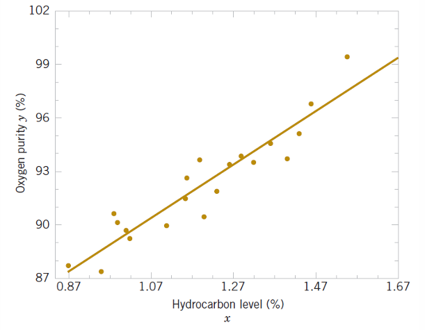
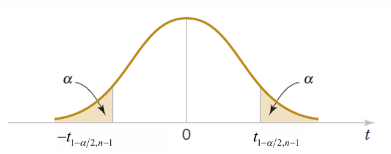
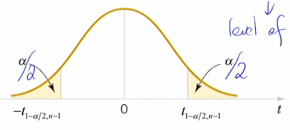
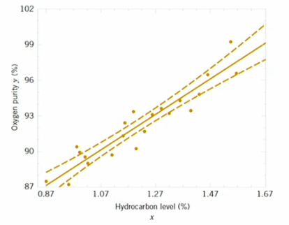

# Predictive Analytics (ISE529)

## Linear Regression (I)

Dr. Tao Ma  
ma.tao@usc.edu  
*2026 Spring*

### LEAST SQUARE METHOD

- Linear Regression Model
- Hypothesis Tests
- Confidence Intervals
- Prediction
- Model Adequacy Checking
- Correlation

#### Simple Linear Regression

Scatter diagram of oxygen purity versus hydrocarbon

#### Simple Linear Regression

Suppose that the true relationship between  $Y$  and  $x$  is a straight line and that the observation  $Y$  at each level of  $x$  is a random variable. We assume that each observation,  $Y$ , can be described by the model

dependent or response variable  $\rightarrow Y$

regressor or predictor or independent  $\rightarrow x$

$Y = \beta_0 + \beta_1 x + \epsilon$

intercept  $\rightarrow \beta_0$

slope  $\rightarrow \beta_1$

where the intercept  $\beta_0$  and the slope  $\beta_1$  are unknown regression coefficients.  $\epsilon$  is a random error with mean zero and (unknown) variance  $\sigma^2$ .

#### Simple Linear Regression

Model structure  $Y = \beta_0 + \beta_1 x + \epsilon$

$$E(Y|x) = E(\beta_0 + \beta_1 x + \epsilon) = \beta_0 + \beta_1 x + E(\epsilon) = \beta_0 + \beta_1 x$$

$$V(Y|x) = V(\beta_0 + \beta_1 x + \epsilon) = V(\beta_0 + \beta_1 x) + V(\epsilon) = 0 + \sigma^2 = \sigma^2$$

The distribution of  $Y$  for a given value of  $x$   
for the oxygen purity-hydrocarbon data

### Least Square Method

We call the method for estimating the regression coefficients the **least squares**.

Suppose that we have  $n$  pairs of observations  $(x_1, y_1), (x_2, y_2), \dots, (x_n, y_n)$ . The sum of the squares of the deviations of the observations from the true regression line is

$$L = \sum_{i=1}^{n} \epsilon_i^2 = \sum_{i=1}^{n} (y_i - \beta_0 - \beta_1 x_i)^2$$

Normal equations

$$\begin{aligned} n\hat{\beta}_0 + \hat{\beta}_1 \sum_{i=1}^{n} x_i &= \sum_{i=1}^{n} y_i \\ \hat{\beta}_0 \sum_{i=1}^{n} x_i + \hat{\beta}_1 \sum_{i=1}^{n} x_i^2 &= \sum_{i=1}^{n} y_i x_i \end{aligned}$$

#### Least Square Estimate

The least squares estimates of the intercept and slope in the simple linear regression model are

$$\hat{\beta}_0 = \bar{y} - \hat{\beta}_1 \bar{x}$$

$$\hat{\beta}_1 = \frac{\sum_{i=1}^{n} y_i x_i - \frac{1}{n} \left( \sum_{i=1}^{n} y_i \right) \left( \sum_{i=1}^{n} x_i \right)}{\sum_{i=1}^{n} x_i^2 - \frac{1}{n} \left( \sum_{i=1}^{n} x_i \right)^2}$$

where  $\bar{y} = \frac{1}{n} \sum_{i=1}^{n} y_i$  and  $\bar{x} = \frac{1}{n} \sum_{i=1}^{n} x_i$

The fitted or estimated regression line is therefore

$$\hat{y} = \hat{\beta}_0 + \hat{\beta}_1 x$$

where  $\varepsilon_i = y_i - \hat{y}_i$  is called the **residual**.

### Alternative Formula

Let

$$S_{xx} = \sum_{i=1}^{n} (x_i - \bar{x})^2 = \sum_{i=1}^{n} x_i^2 - \frac{\left( \sum_{i=1}^{n} x_i \right)^2}{n}$$
$$S_{xy} = \sum_{i=1}^{n} (y_i - \bar{y})(x_i - \bar{x}) = \sum_{i=1}^{n} x_i y_i - \frac{\left( \sum_{i=1}^{n} x_i \right) \left( \sum_{i=1}^{n} y_i \right)}{n}$$

Thus

$$\hat{\beta}_1 = \frac{S_{xy}}{S_{xx}}$$

$$\hat{\beta}_0 = \bar{y} - \hat{\beta}_1 \bar{x}$$

##### Example

$$\begin{aligned} n &= 20 & \sum_{i=1}^{20} x_i &= 23.92 & \sum_{i=1}^{20} y_i &= 1,843.21 \\ \bar{x} &= 1.1960 & \bar{y} &= 92.1605 \\ \sum_{i=1}^{20} y_i^2 &= 170,044.5321 & \sum_{i=1}^{20} x_i^2 &= 29.2892 \\ \sum_{i=1}^{20} x_i y_i &= 2,214.6566 \end{aligned}$$

##### Example

Scatter plot of oxygen purity  $y$  versus hydrocarbon level  $x$   
and regression model  $\hat{y} = 74.283 + 14.947x$

### Estimating $\sigma ^2$

the error sum of squares

$$SS_E = \sum_{i=1}^{n} e_i^2 = \sum_{i=1}^{n} (y_i - \hat{y}_i)^2$$

unbiased estimator of  $\sigma^2$

$$\hat{\sigma}^2 = \frac{SS_E}{n - 2}$$

### Hypothesis test

If  $X_1, X_2, \dots, X_n$  is a random sample of size  $n$  from a normal distribution with unknown mean  $\mu$  and **unknown variance**  $\sigma^2$  and if  $\bar{X}$  is the sample mean, The random variable

$$T = \frac{\bar{X} - \mu}{S/\sqrt{n}}$$

has a  **$t$  distribution** with  $n - 1$  degrees of freedom.

$$P\left(-t_{1-\alpha/2, n-1} \le \frac{\bar{X} - \mu}{S/\sqrt{n}} \le t_{1-\alpha/2, n-1}\right) = 1 - \alpha$$

where  $t_{1-\alpha/2, n-1}$  is the upper  $100\alpha / 2$  percentage point of  $t$  distribution with  $n-1$  degrees of freedom.

Make hypothesis:

e.g.  $H_0 : \mu = \mu_0$  (null hypothesis regarding the mean)

$H_A : \mu \neq \mu_0$  (alternative hypothesis regarding the means)

$$P \left( -t_{1-\alpha/2, n-1} \le \frac{\bar{X} - \mu_0}{S/\sqrt{n}} \le t_{1-\alpha/2, n-1} \right) = 1 - \alpha$$

Hypothesis testing is to test the following probability:

$P(\text{sample data} \mid \text{null hypothesis is true})$

### Expectation & Variance of Parameters

Properties of the Least Squares Estimators

$$E(\hat{\beta}_1) = \beta_1 \quad V(\hat{\beta}_1) = \frac{\sigma^2}{S_{xx}}$$
$$E(\hat{\beta}_0) = \beta_0 \quad \text{and} \quad V(\hat{\beta}_0) = \sigma^2 \left[ \frac{1}{n} + \frac{\bar{x}^2}{S_{xx}} \right]$$

In simple linear regression, the estimated standard error of the slope and the estimated standard error of the intercept are

$$se(\hat{\beta}_1) = \sqrt{\frac{\hat{\sigma}^2}{S_{xx}}} \quad \text{and} \quad se(\hat{\beta}_0) = \sqrt{\hat{\sigma}^2 \left[ \frac{1}{n} + \frac{\bar{x}^2}{S_{xx}} \right]}$$

The complete assumptions are that the errors are normally and independently distributed with mean zero and variance  $\sigma^2$ , abbreviated NID  $(0, \sigma^2)$ .

$$H_0: \beta_1 = \beta_{1,0}$$

$$H_1: \beta_1 \neq \beta_{1,0}$$

Test Statistic for the Slope

$$T_0 = \frac{\hat{\beta}_1 - \beta_{1,0}}{se(\hat{\beta}_1)}$$

follows the  $t$  distribution with  $n - 2$  degrees of freedom under  $H_0$

Test Statistic for the Intercept

$$H_0: \beta_0 = \beta_{0,0}$$

$$H_1: \beta_0 \neq \beta_{0,0}$$

$$T_0 = \frac{\hat{\beta}_0 - \beta_{0,0}}{\sqrt{\hat{\sigma}^2 \left[ \frac{1}{n} + \frac{\bar{x}^2}{S_{xx}} \right]}} = \frac{\hat{\beta}_0 - \beta_{0,0}}{se(\hat{\beta}_0)}$$

##### Oxygen Purity Tests of Coefficients

$$H_0: \beta_1 = 0$$

$$H_1: \beta_1 \neq 0$$

$$\hat{\beta}_1 = 14.947 \quad n = 20, \quad S_{xx} = 0.68088, \quad \hat{\sigma}^2 = 1.18$$

###### Answer

1. **$H_0: \beta_1 = 0$**： This is our cynical starting point. We are mathematically assuming that hydrocarbon levels have absolutely no relationship with oxygen purity.

​	**$H_1: \beta_1 \neq 0$**： This is what we actually want to prove: that a meaningful relationship *does* exist.

2. To find our "evidence score," we first need to figure out the Standard Error ($SE$) of our slope, and then plug that into the $t$-statistic formula.

   1. Calculate the Standard Error: The formula for the standard error of the slope is: 

      $$SE(\hat{\beta}_1) = \sqrt{\frac{\hat{\sigma}^2}{S_{xx}}}$$

      Plug in the numbers provided:

      $$SE(\hat{\beta}_1) = \sqrt{\frac{1.18}{0.68088}} \approx 1.316$$

   2. Calculate the t-statistic: Now, we take our estimated slope ($\hat{\beta}_1$) and divide it by the standard error we just found: 

      $$t = \frac{\hat{\beta}_1 - 0}{SE(\hat{\beta}_1)}$$

      $$t = \frac{14.947}{1.316} \approx 11.35$$

      Your evidence score is **11.35**.

3. Now we need to find the boundary that our evidence score needs to cross.

   - **Degrees of Freedom:** Because we estimated two parameters for this line (the intercept and the slope), our degrees of freedom is $n - 2$. So, $20 - 2 = 18$.
   - **Significance Level:** In the lecture, the professor uses a 99% confidence level ($\alpha = 0.01$) for this test.
   - **The Threshold:** If you look at a $t$-distribution table for 18 degrees of freedom at a 0.01 significance level, the critical value boundary is **2.88**.

4. The Verdict (Compare and Conclude)

   Finally, we compare our evidence against the threshold.

   - Our $t$-statistic is 11.35.
   - Our critical value threshold is 2.88.

   Because 11.35 is massively greater than 2.88, it shatters the threshold. The theoretical probability model is broken, which means we get to reject the Null Hypothesis.

   You have successfully proven that $\hat{\beta}_1 \neq 0$, meaning the regression model is meaningful and hydrocarbon levels are a statistically significant predictor of oxygen purity.

#### Confidence Interval

Letting  $t_{1-\alpha/2, n-1}$  be the upper  $100(1-\alpha/2)$  percentage point of the  $t$  distribution with  $n - 1$  degrees of freedom, we may write

$$P\left(-t_{1-\alpha/2, n-1} \le \frac{\bar{X} - \mu}{S/\sqrt{n}} \le t_{1-\alpha/2, n-1}\right) = 1 - \alpha$$

Rearranging this equation yields

$$P\left(\bar{X} - t_{1-\alpha/2, n-1} S/\sqrt{n} \le \mu \le \bar{X} + t_{1-\alpha/2, n-1} S/\sqrt{n}\right) = 1 - \alpha$$

##### Confidence Intervals on **Parameters**

Under the assumption that the observations are normally and independently distributed, a  $100(1 - \alpha)\%$  confidence interval on the slope  $\beta_1$  in simple linear regression is

$$\hat{\beta}_1 \pm t_{\alpha/2, n-2} \sqrt{\frac{\hat{\sigma}^2}{S_{xx}}}$$

Similarly, a  $100(1 - \alpha)\%$  confidence interval on the intercept  $\beta_0$  is

$$\hat{\beta}_0 \pm t_{\alpha/2, n-2} \sqrt{\hat{\sigma}^2 \left[ \frac{1}{n} + \frac{\bar{x}^2}{S_{xx}} \right]}$$

##### Confidence interval

##### Confidence Interval on the Mean Response

$$\hat{\mu}_{Y|x_0} = \hat{\beta}_0 + \hat{\beta}_1 x_0$$

$$V(\hat{\mu}_{Y|x_0}) = \sigma^2 \left[ \frac{1}{n} + \frac{(x_0 - \bar{x})^2}{S_{xx}} \right]$$

$$\sqrt{\frac{\hat{\mu}_{Y|x_0} - \mu_{Y|x_0}}{\hat{\sigma}^2 \left[ \frac{1}{n} + \frac{(x_0 - \bar{x})^2}{S_{xx}} \right]}}$$

has a  $t$  distribution with  $n - 2$  degrees of freedom

A  $100(1 - \alpha)\%$  confidence interval on the mean response at the value of  $x = x_0$ , say  $\mu_{Y|x_0}$ , is given by

$$\hat{\mu}_{Y|x_0} \pm t_{\alpha/2, n-2} \sqrt{\hat{\sigma}^2 \left[ \frac{1}{n} + \frac{(x_0 - \bar{x})^2}{S_{xx}} \right]}$$

where  $\hat{\mu}_{Y|x_0} = \hat{\beta}_0 + \hat{\beta}_1 x_0$  is computed from the fitted regression model.

##### Confidence interval

##### Confidence Interval on the Mean Response

Scatter diagram of oxygen purity data with fitted regression line and 95 percent confidence limits on

### Prediction

Note that the error in prediction  $e_{\hat{p}} = Y_0 - \hat{Y}_0$

is a normally distributed random variable with mean zero and variance

$$V(e_{\hat{p}}) = V(Y_0 - \hat{Y}_0) = \alpha^2 \left[ 1 + \frac{1}{n} + \frac{(x_0 - \bar{x})^2}{S_{xx}} \right]$$

If we use  $\hat{\sigma}^2$  to estimate  $\alpha^2$ , we can show that

A  $100(1 - \alpha)\%$  prediction interval on a future observation  $Y_0$  at the value  $x_0$  is given by

$$\hat{y}_0 \pm t_{\alpha/2, n-2} \sqrt{\hat{\sigma}^2 \left[ 1 + \frac{1}{n} + \frac{(x_0 - \bar{x})^2}{S_{xx}} \right]}$$

The value  $\hat{y}_0$  is computed from the regression model  $\hat{y}_0 = \hat{\beta}_0 + \hat{\beta}_1 x_0$

the **prediction** interval at the point  $x_0$  is always wider than the confidence interval at  $x_0$ . because the prediction interval depends on both the error from the fitted model and the error associated with future observations.

#### Model Adequacy Checking

the **error sum of squares**  $SS_E = \sum_{i=1}^{n} (y_i - \hat{y}_i)^2$

the **regression sum of squares**  $SS_R = \sum_{i=1}^{n} (\hat{y}_i - \bar{y})^2$

the **total corrected sum of squares of  $y$**   $SS_T = \sum_{i=1}^{n} (y_i - \bar{y})^2$

Analysis of Variance (ANOVA)

$$\sum_{i=1}^{n} (y_i - \bar{y})^2 = \sum_{i=1}^{n} (\hat{y}_i - \bar{y})^2 + \sum_{i=1}^{n} (y_i - \hat{y}_i)^2$$

$$SS_T = SS_R + SS_E$$

> ($\hat{y}_i$ is the model output)

#### Model Adequacy Checking

The **coefficient of determination** is 
$$R^2 = \frac{SS_R}{SS_T} = 1 - \frac{SS_E}{SS_T}$$

![A scatter plot illustrating the components of the coefficient of determination (R-squared). The vertical axis is labeled Y and the horizontal axis is labeled X. A horizontal dashed line represents the Mean (Y-bar). A solid line represents the Predicted Value (Fitted Line). A vertical dashed line is drawn at X_i. An observed data point (X_i, Y_i) is shown. The vertical distance from the mean to the observed point is labeled 'Total Variation'. The vertical distance from the fitted line to the observed point is labeled 'Unexplained' Variance. The vertical distance from the mean to the fitted line is labeled 'Explained' Variation.](Slide 03 datalab.assets/image-20260303124208859.png)

#### Model Adequacy Checking

#### Test for Significance of Regression

If the null hypothesis  $H_0: \beta_1 = 0$  is true, the statistic

$$F_0 = \frac{SS_R / 1}{SS_E / (n - 2)} = \frac{MS_R}{MS_E}$$

follows the  $F_{1,n-2}$  distribution, and we would reject  $H_0$  if  $f_0 > f_{\alpha,1,n-2}$ .

| Source of Variation | Sum of Squares                       | Degrees of Freedom | Mean Square | $F_0$         |
|---------------------|--------------------------------------|--------------------|-------------|---------------|
| Regression          | $SS_R = \hat{\beta}_1 S_{xy}$        | 1                  | $MS_R$      | $MS_R / MS_E$ |
| Error               | $SS_E = SS_T - \hat{\beta}_1 S_{xy}$ | $n - 2$            | $MS_E$      |               |
| Total               | $SS_T$                               | $n - 1$            |             |               |

Note that  $MS_E = \hat{\sigma}^2$ .

#### Model Adequacy Checking

#### Residual analysis, checking assumptions

1. The errors are uncorrelated random variables with mean zero and constant variance
2. Tests of hypotheses and interval estimation require that the errors be normally distributed.
  - a normal probability plot of residuals
  - plot the residuals against the  $\hat{y}_i$  and against the independent variable  $x$ .

### Correlation

Both  $X$  and  $Y$  are random variables, assumed that the observations  $(X_i, Y_i)$ ,  $i = 1, 2, \dots, n$  are jointly distributed random variables obtained from the distribution  $f(x, y)$

$\mu_Y$  and  $\sigma_Y^2$  are the mean and variance of  $Y$ ,  $\mu_X$ ,  $\sigma_X^2$  are the mean and variance of  $X$ , The **correlation coefficient** between  $Y$  and  $X$  is defined as

$$Corr(x, y) = \rho = \frac{\sigma_{XY}}{\sigma_X \sigma_Y} =\frac{Cov(x, y)}{\sqrt{Var(x)Var(y)}}$$

where  $\sigma_{XY}$  is the covariance between  $Y$  and  $X$   
Regression model estimators can be written as

$$
\beta_0 = \mu_y - \mu_x \rho \frac{\sigma_y}{\sigma_x}
= \bar{y} - \bar{x}\hat{\beta}_1
$$

$$
\hat{\beta}_1
= \frac{\sigma_y}{\sigma_x}\rho
= \frac{\operatorname{Cov}(x,y)}{\operatorname{Var}(x)}
= \frac{\sigma_{xy}}{\sigma_x^2}
$$

##### Example

Regression methods were used to analyze the data from a study investigating the relationship between roadway surface temperature ( $x$ ) and pavement deflection ( $y$ ). Summary quantities were

$$n = 20, \Sigma y_i = 12.75, \Sigma y_i^2 = 8.86, \Sigma x_i = 1478, \Sigma x_i^2 = 143,215.8, \text{ and } \Sigma x_i y_i = 1083.67.$$

- (a) Calculate the least squares estimates of the slope and intercept. Estimate  $\sigma^2$ .
- (b) What is the mean pavement deflection when the surface temperature is 90°F?
- (c) What change in mean pavement deflection would be expected for a 1°F change in surface temperature?
- (d) Find a 99% confidence interval on slope.

###### Slides Answer

$$\hat{y} = 0.32999 + 0.00416x \quad \hat{\sigma}^2 = MS_E = \frac{SS_E}{n-2} = \frac{0.143275}{18} = 0.00796$$

$$\hat{y} = 0.32999 + 0.00416(90) = 0.7044$$

$$\hat{\beta}_1 \pm \left( t_{0.005,18} \right) se(\hat{\beta}_1) \quad t_{\alpha/2, n-2} = t_{0.005, 18} = 2.878$$

$$0.0041612 \pm (2.878)(0.000484)$$

$$0.0027682 \le \beta_1 \le 0.0055542$$

###### Gemini Answer

To start, it is helpful to calculate the sample means and the sums of squares, which will be used throughout the equations.

**1. Sample Means:**

- $\bar{x}=\frac{\sum x_i}{n}=\frac{1478}{20}=73.9$
- $\bar{y}=\frac{\sum y_i}{n}=\frac{12.75}{20}=0.6375$

**2. Sums of Squares:**

- $S_{xx}=\sum x_i^2-\frac{(\sum x_i)^2}{n}=143215.8-\frac{1478^2}{20}=33991.6$
- $S_{xy}=\sum x_i y_i-\frac{(\sum x_i)(\sum y_i)}{n}=1083.67-\frac{1478\times 12.75}{20}=141.445$
- $S_{yy}=\sum y_i^2-\frac{(\sum y_i)^2}{n}=8.86-\frac{12.75^2}{20}=0.731875$

------

### (a) Least Squares Estimates and Estimated Variance ($\sigma^2$)

**Slope ($\hat{\beta}_1$):**

$$\hat{\beta}_1=\frac{S_{xy}}{S_{xx}}=\frac{141.445}{33991.6}\approx 0.00416$$

**Intercept ($\hat{\beta}_0$):**

$$\hat{\beta}_0=\bar{y}-\hat{\beta}_1\bar{x}=0.6375-(0.004161\times 73.9)\approx 0.3300$$

The least squares regression equation is **$\hat{y}=0.3300+0.00416x$**.

**Estimate of $\sigma^2$ (Mean Squared Error, $s^2$):**

First, we need the Sum of Squared Errors ($SSE$):

$$SSE=S_{yy}-\hat{\beta}_1S_{xy}=0.731875-(0.004161\times 141.445)\approx 0.1433$$

Now, divide by the degrees of freedom ($n-2$):

$$\hat{\sigma}^2=s^2=\frac{SSE}{n-2}=\frac{0.1433}{18}\approx 0.00796$$

------

### (b) Mean Pavement Deflection at 90°F

To find the expected pavement deflection when the surface temperature is 90°F, plug $x=90$ into the regression equation:

$$\hat{y}=0.3300+0.00416(90)$$

$$\hat{y}=0.3300+0.3744=0.7044$$

The mean pavement deflection is expected to be **0.7044**.

------

### (c) Expected Change for a 1°F Change

In a linear regression model, the slope ($\hat{\beta}_1$) represents the expected change in the dependent variable ($y$) for a one-unit change in the independent variable ($x$).

Therefore, for a 1°F change in surface temperature, the mean pavement deflection is expected to change by the value of the slope, which is **0.00416**.

------

### (d) 99% Confidence Interval on the Slope

The formula for the confidence interval of the slope is:

$$\hat{\beta}_1\pm t_{\alpha/2, n-2}\times SE(\hat{\beta}_1)$$

**1. Calculate the Standard Error of the slope ($SE$):**

$$SE(\hat{\beta}_1)=\sqrt{\frac{s^2}{S_{xx}}}=\sqrt{\frac{0.00796}{33991.6}}\approx 0.000484$$

**2. Find the Critical $t$-value:**

For a 99% confidence interval, $\alpha=0.01$, so $\alpha/2=0.005$. With degrees of freedom $df=n-2=18$, we look up the $t$-value in a standard $t$-distribution table:

$$t_{0.005, 18}=2.878$$

**3. Calculate the Margin of Error and Interval:**

$$\text{Margin of Error}=2.878\times 0.000484\approx 0.00139$$

$$\text{Interval}=0.00416\pm 0.00139$$

- Lower bound: $0.00416-0.00139=0.00277$
- Upper bound: $0.00416+0.00139=0.00555$

The 99% confidence interval on the slope is **(0.00277, 0.00555)**.

##### Example

The regression equation is

$$Y = 12.9 + 2.34 x$$

| Predictor                                  | Coef   | SE Coef | T |
|--------------------------------------------|--------|---------|---|
| Constant                                   | 12.857 | 1.032   | ? |
| X                                          | 2.3445 | 0.1150  | ? |
| S = 1.48111 R-sq = 98.1% R-sq(adj) = 97.9% |        |         |   |

Analysis of Variance

| Source         | DF | SS     | MS     | F |
|----------------|----|--------|--------|---|
| Regression     | 1  | 912.43 | 912.43 | ? |
| Residual error | ?  | 17.55  | ?      |   |
| Total          | 9  | 929.98 |        |   |

- (a) Fill in the missing information.
- (b) Use 3 ways to check that the model defines a useful linear relationship,  $\alpha = 0.05$ ?
- (c) What is your estimate of  $\sigma^2$ ?

$$T_0 = \frac{\hat{\beta}_0 - \beta_0}{se(\beta_0)} = \frac{12.857}{1.032} = 12.4583$$

$$F_0 = \frac{MS_R}{MS_E} = \frac{912.43}{2.1938} = 415.913$$

$$T_1 = \frac{\hat{\beta}_1 - \beta_1}{se(\beta_1)} = \frac{2.3445}{0.115} = 20.387$$

$$MS_E = \frac{SS_E}{n-2} = \frac{17.55}{8} = 2.1938$$

###### Answer from Gemini

### (a) Missing Information

Here are the calculations used to fill in the missing values:

- **T for Constant:** Calculated by dividing the coefficient by its standard error.

  $$T = \frac{12.857}{1.032} = 12.46$$

- **T for X:** Calculated by dividing the coefficient by its standard error.

  $$T = \frac{2.3445}{0.1150} = 20.39$$

- **DF for Residual error:** The Total degrees of freedom (9) minus the Regression degrees of freedom (1).

  $$DF = 9 - 1 = 8$$

- **MS for Residual error:** Calculated by dividing the Sum of Squares (SS) by its degrees of freedom (DF).

  $$MS = \frac{17.55}{8} \approx 2.194$$

- **F for Regression:** Calculated by dividing the Regression MS by the Residual error MS.

  $$F = \frac{912.43}{2.19375} \approx 415.92$$

**Completed Tables:**

| **Predictor** | **Coef** | **SE Coef** | **T**     |
| ------------- | -------- | ----------- | --------- |
| Constant      | 12.857   | 1.032       | **12.46** |
| X             | 2.3445   | 0.1150      | **20.39** |

| **Source**     | **DF** | **SS** | **MS**    | **F**      |
| -------------- | ------ | ------ | --------- | ---------- |
| Regression     | 1      | 912.43 | 912.43    | **415.92** |
| Residual error | **8**  | 17.55  | **2.194** |            |
| Total          | 9      | 929.98 |           |            |

------

### (b) 3 Ways to Check for a Useful Linear Relationship ($\alpha = 0.05$)

To check if the model defines a useful linear relationship, we are fundamentally testing whether the slope ($\beta_1$) is significantly different from zero.

**1. The t-test for the Slope**

- **Hypothesis:** $H_0: \beta_1 = 0$ versus $H_a: \beta_1 \neq 0$
- **Test Statistic:** $t = 20.39$ (from the predictor table).
- **Critical Value:** For a two-tailed test with $\alpha = 0.05$ and $df = 8$, the critical $t$-value is $2.306$.
- **Conclusion:** Since $20.39 > 2.306$, we reject the null hypothesis. The slope is significantly different from zero, indicating a useful linear relationship.

**2. The F-test for Overall Significance**

- **Hypothesis:** $H_0: \beta_1 = 0$ versus $H_a: \beta_1 \neq 0$
- **Test Statistic:** $F = 415.92$ (from the ANOVA table).
- **Critical Value:** For $\alpha = 0.05$ with numerator $df = 1$ and denominator $df = 8$, the critical $F$-value is $5.32$.
- **Conclusion:** Since $415.92 > 5.32$, we reject the null hypothesis. The model as a whole is significant. *(Note: In simple linear regression, the F-statistic is simply the square of the t-statistic for the slope: $20.39^2 \approx 415.75$, with the minor discrepancy due to rounding).*

**3. Confidence Interval for the Slope**

- **Formula:** $\hat{\beta}_1 \pm t_{\alpha/2, n-2} \cdot SE(\hat{\beta}_1)$

- **Calculation:** $2.3445 \pm (2.306 \cdot 0.1150) \Rightarrow 2.3445 \pm 0.2652$

- **Interval:** $(2.079, 2.610)$

- **Conclusion:** Because the 95% confidence interval does not contain zero, we are 95% confident that the true slope is positive. Therefore, the linear relationship is useful.

  *(Alternatively, you can cite the Coefficient of Determination ($R^2 = 98.1\%$), which tells us that 98.1% of the variance in $Y$ is explained by $X$, heavily implying a strong and useful model).*

------

### (c) Estimate of $\sigma^2$

The estimate of the error variance, $\sigma^2$, is the Mean Square for the Residual Error ($MS_{Resid}$). It is also equal to the square of the standard error of the regression ($S^2$).

- $\hat{\sigma}^2 = \frac{SS_{Resid}}{DF} = \frac{17.55}{8} = \textbf{2.19375}$

  *(Checking our work: $S^2 = 1.48111^2 \approx 2.1936$, which aligns perfectly barring minor rounding differences in the prompt's provided $S$ value).*

### **MAXIMUM LIKELIHOOD METHOD**

#### Method of Maximum Likelihood

- Suppose that  $X$  is a random variable with probability mass or density function  $f(x | \theta)$ , where  $\theta$  is unknown parameters. Let  $x_1, x_2, \dots, x_n$  be the observed values in a random sample of size  $n$ . Then the **likelihood function** of the sample is:

$$
L(\theta) = f(x_1 | \theta) \cdot f(x_2 | \theta) \cdot \dots \cdot f(x_n | \theta)
$$

- Note that the likelihood function is now a function of only the unknown parameters  $\theta$ . The **maximum likelihood estimator** (MLE) of  $\theta$  is the value of  $\theta$  that maximizes the likelihood function  $L(\theta)$ . Intuitively, it is the value of  $\theta$  that makes the observed data “most probable” or “most likely”.

Optimization – the 1st order partial derivative

$$\frac{\partial L(x_1, x_2, \dots, x_n \mid \theta)}{\partial \theta} = 0$$

Because the likelihood function is a product function, it is more convenient to maximize the logarithm of the likelihood function; i.e.,

$$\frac{\partial \log L(x_1, x_2, \dots, x_n \mid \theta)}{\partial \theta} = 0$$

##### Example

Let  $y_1, y_2, \dots, y_n \sim \mathcal{N}(\mu, \sigma^2)$ , i.e., the density function is

$$f(y_i | \mu, \sigma^2) = \frac{1}{\sqrt{2\pi\sigma^2}} \exp\left[-\frac{(y_i - \mu)^2}{2\sigma^2}\right]$$

Also recall,  $\mu = E(y_i | x_i) = f(x_i) = \beta_0 + \beta_1 x_i$ .

> Expectation of observed $y_i$ = model output

Then the likelihood function of a random sample of size  $n$  is

$$\begin{aligned} L(y_i | \mu, \sigma^2) &= f(y_1 | \mu, \sigma^2) f(y_2 | \mu, \sigma^2) \cdots f(y_n | \mu, \sigma^2) \\ &= (2\pi\sigma^2)^{-\frac{n}{2}} \exp\left[-\frac{1}{2\sigma^2} \sum_{i=1}^{n} (y_i - \mu)^2\right] \end{aligned}$$

Therefore, the log-likelihood is

$$l(\beta_0, \beta_1, \sigma^2) = -\frac{n}{2} \ln 2\pi - \frac{n}{2} \ln \sigma^2 - \frac{1}{2\sigma^2} \sum_{i=1}^{n} (y_i - \beta_0 - \beta_1 x_i)^2$$

Take the 1st order derivative and set it to zero, we get

$$\frac{\partial l}{\partial \sigma^2} = -\frac{n}{2\sigma^2} + \frac{1}{2\sigma^4} \sum_{i=1}^{n} (y_i - \beta_0 - \beta_1 x_i)^2 = 0$$

$$\frac{\partial l}{\partial \beta_0} = \frac{1}{\sigma^2} \sum_{i=1}^{n} (y_i - \beta_0 - \beta_1 x_i) = 0$$

$$\frac{\partial l}{\partial \beta_1} = \frac{1}{\sigma^2} \sum_{i=1}^{n} (y_i - \beta_0 - \beta_1 x_i) x_i = 0$$

Take the 1st order derivative and set it to zero, we get

$$\hat{\sigma}^2 = \frac{1}{n} \sum_{i=1}^{n} (y_i - \hat{\beta}_0 - \hat{\beta}_1 x_i)^2 = \frac{1}{n} \sum_{i=1}^{n} \varepsilon_i^2$$

$$\hat{\beta}_1 = \frac{n \sum_{i=1}^{n} x_i y_i - \sum_{i=1}^{n} x_i \sum_{i=1}^{n} y_i}{n \sum_{i=1}^{n} x_i^2 - \left( \sum_{i=1}^{n} x_i \right)^2}$$

$$\hat{\beta}_0 = \bar{y} - \beta_1 \bar{x}$$