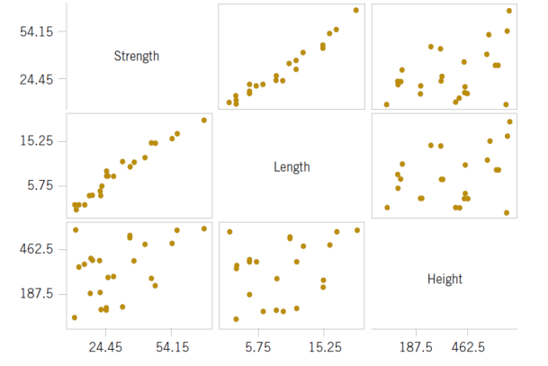
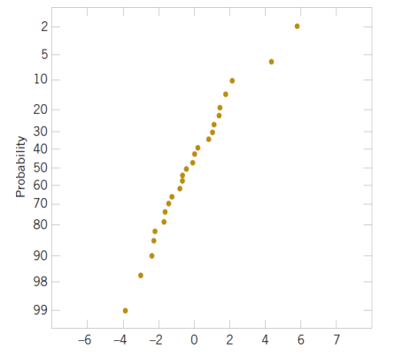
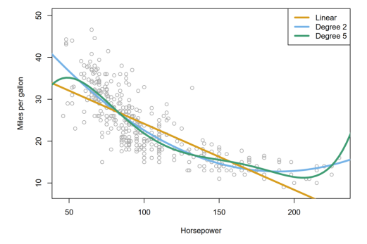
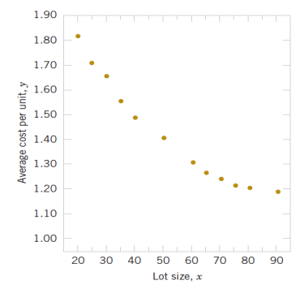

# Predictive Analytics (ISE529)

## Multiple Linear Regression

Dr. Tao Ma  
ma.tao@usc.edu  
*2026 Spring*

- Multiple Linear Regression
- Hypothesis Tests
- Confidence Intervals
- Model Adequacy Checking
- Other Considerations in Regression Modeling
- Selection of Important Variables
- Multicollinearity

## **MULTIPLE LINEAR REGRESSION**

### Multiple Regression Model

A regression model that contains more than one regressor variable is called a **multiple regression model**.

$$y = \beta_0 + \beta_1 x_1 + \beta_2 x_2 + \cdots + \beta_k x_k + \varepsilon$$

Suppose that  $n > k$  observations are available and let  $x_{ij}$  denote the  $i$ th observation or level of variable  $x_j$ . The observations are

$$(y_i, x_{i1}, x_{i2}, \dots, x_{ik}), \quad i = 1, 2, \dots, n \quad \text{and} \quad n > k$$

Data set looks like:

| <u>Y</u> | <u>X1</u> | <u>X2</u> | <u>...</u> | <u>Xk</u> |
| -------- | -------------------- | -------------------- | ---------- | -------------------- |
| $Y_1$    | $X_{11}$             | $X_{12}$             | $\dots$    | $X_{1k}$             |
| $Y_2$    | $X_{21}$             | $X_{22}$             | $\dots$    | $X_{2k}$             |
| $\vdots$ | $\vdots$             | $\vdots$             | $\ddots$   | $\vdots$             |
| $Y_n$    | $X_{n1}$             | $X_{n2}$             | ...        | $X_{nk}$             |

A regression coefficient  $\beta_j$  estimates the expected change in  $Y$  per unit change in  $X_j$ , with all other predictors held fixed.

### LEAST SQUARE ESTIMATION

#### Method of Least Square

The method of least square may be used to estimate the regression coefficients.  
The objective function is

$$L = \sum_{i=1}^{n} \epsilon_i^2 = \sum_{i=1}^{n} \left( y_i - \beta_0 - \sum_{j=1}^{k} \beta_j x_{ij} \right)^2$$

Find  $\beta_0, \beta_1, \dots, \beta_k$  to minimize  $L$ .

$$\frac{\partial L}{\partial \beta_j} \bigg|_{\hat{\beta}_0, \hat{\beta}_1, \dots, \hat{\beta}_k} = -2 \sum_{i=1}^{n} \left( y_i - \hat{\beta}_0 - \sum_{j=1}^{k} \hat{\beta}_j x_{ij} \right) = 0$$

$$\frac{\partial L}{\partial \beta_j} \bigg|_{\hat{\beta}_0, \hat{\beta}_1, \dots, \hat{\beta}_k} = -2 \sum_{i=1}^{n} \left( y_i - \hat{\beta}_0 - \sum_{j=1}^{k} \hat{\beta}_j x_{ij} \right) x_{ij} = 0 \quad j = 1, 2, \dots, k$$

#### Method of Least Square

The normal equations are shown below.

$$\begin{aligned} \hat{\beta}_0 n + \hat{\beta}_1 \sum_{i=1}^{n} x_{i1} + \hat{\beta}_2 \sum_{i=1}^{n} x_{i2} + \cdots + \hat{\beta}_k \sum_{i=1}^{n} x_{ik} &= \sum_{i=1}^{n} y_i \\ \hat{\beta}_0 \sum_{i=1}^{n} x_{i1} + \hat{\beta}_1 \sum_{i=1}^{n} x_{i1}^2 + \hat{\beta}_2 \sum_{i=1}^{n} x_{i1}x_{i2} + \cdots + \hat{\beta}_k \sum_{i=1}^{n} x_{i1}x_{ik} &= \sum_{i=1}^{n} x_{i1}y_i \\ \vdots & \vdots \\ \hat{\beta}_0 \sum_{i=1}^{n} x_{ik} + \hat{\beta}_1 \sum_{i=1}^{n} x_{ik}x_{i1} + \hat{\beta}_2 \sum_{i=1}^{n} x_{ik}x_{i2} + \cdots + \hat{\beta}_k \sum_{i=1}^{n} x_{ik}^2 &= \sum_{i=1}^{n} x_{ik}y_i \end{aligned}$$

#### Method of Least Square

The matrix form of the normal equations is shown below.

$$\begin{bmatrix} n & \sum_{i=1}^{n} x_{i1} & \sum_{i=1}^{n} x_{i2} & \cdots & \sum_{i=1}^{n} x_{ik} \\ \sum_{i=1}^{n} x_{i1} & \sum_{i=1}^{n} x_{i1}^2 & \sum_{i=1}^{n} x_{i1}x_{i2} & \cdots & \sum_{i=1}^{n} x_{i1}x_{ik} \\ \vdots & \vdots & \vdots & & \vdots \\ \sum_{i=1}^{n} x_{ik} & \sum_{i=1}^{n} x_{ik}x_{i1} & \sum_{i=1}^{n} x_{ik}x_{i2} & \cdots & \sum_{i=1}^{n} x_{ik}^2 \end{bmatrix} \begin{bmatrix} \hat{\beta}_0 \\ \hat{\beta}_1 \\ \vdots \\ \hat{\beta}_k \end{bmatrix} = \begin{bmatrix} \sum_{i=1}^{n} y_i \\ \sum_{i=1}^{n} x_{i1}y_i \\ \vdots \\ \sum_{i=1}^{n} x_{ik}y_i \end{bmatrix}$$

##### Example

Table 1 Wire Bond Data

| Observation Number | Pull Strength $y$ | Wire Length $x_1$ | Die Height $x_2$ | Observation Number | Pull Strength $y$ | Wire Length $x_1$ | Die Height $x_2$ |
|--------------------|-------------------|-------------------|------------------|--------------------|-------------------|-------------------|------------------|
| 1                  | 9.95              | 2                 | 50               | 14                 | 11.66             | 2                 | 360              |
| 2                  | 24.45             | 8                 | 110              | 15                 | 21.65             | 4                 | 205              |
| 3                  | 31.75             | 11                | 120              | 16                 | 17.89             | 4                 | 400              |
| 4                  | 35.00             | 10                | 550              | 17                 | 69.00             | 20                | 600              |
| 5                  | 25.02             | 8                 | 295              | 18                 | 10.30             | 1                 | 585              |
| 6                  | 16.86             | 4                 | 200              | 19                 | 34.93             | 10                | 540              |
| 7                  | 14.38             | 2                 | 375              | 20                 | 46.59             | 15                | 250              |
| 8                  | 9.60              | 2                 | 52               | 21                 | 44.88             | 15                | 290              |
| 9                  | 24.35             | 9                 | 100              | 22                 | 54.12             | 16                | 510              |
| 10                 | 27.50             | 8                 | 300              | 23                 | 56.63             | 17                | 590              |
| 11                 | 17.08             | 4                 | 412              | 24                 | 22.13             | 6                 | 100              |
| 12                 | 37.00             | 11                | 400              | 25                 | 21.15             | 5                 | 400              |
| 13                 | 41.95             | 12                | 500              |                    |                   |                   |                  |

##### Example

Figure 1 Matrix of scatter plots for the wire bond pull strength data in Table 1.

##### Example

Specifically, we will fit the multiple linear regression model

$$y = \beta_0 + \beta_1 x_1 + \beta_2 x_2 + \varepsilon$$

where  $y$  = pull strength,  $x_1$  = wire length, and  $x_2$  = die height.

From the data in Table 1 we calculate

$$\begin{aligned} n &= 25, \sum_{i=1}^{25} y_i = 725.82, \sum_{i=1}^{25} x_{i1} = 206, \sum_{i=1}^{25} x_{i2} = 8,294 \\ \sum_{i=1}^{25} x_{i1}^2 &= 2,396, \sum_{i=1}^{25} x_{i2}^2 = 3,531,848, \sum_{i=1}^{25} x_{i1} x_{i2} = 77,177 \\ \sum_{i=1}^{25} x_{i1} y_i &= 8,008.47, \sum_{i=1}^{25} x_{i2} y_i = 274,816.71 \end{aligned}$$

##### Example

For the model  $y = \beta_0 + \beta_1 x_1 + \beta_2 x_2 + \varepsilon$ , the normal equations are

$$\begin{aligned} n\hat{\beta}_0 + \hat{\beta}_1 \sum_{i=1}^{n} x_{i1} + \hat{\beta}_2 \sum_{i=1}^{n} x_{i2} &= \sum_{i=1}^{n} y_i \\ \hat{\beta}_0 \sum_{i=1}^{n} x_{i1} + \hat{\beta}_1 \sum_{i=1}^{n} x_{i1}^2 + \hat{\beta}_2 \sum_{i=1}^{n} x_{i1} x_{i2} &= \sum_{i=1}^{n} x_{i1} y_i \\ \hat{\beta}_0 \sum_{i=1}^{n} x_{i2} + \hat{\beta}_1 \sum_{i=1}^{n} x_{i1} x_{i2} + \hat{\beta}_2 \sum_{i=1}^{n} x_{i2}^2 &= \sum_{i=1}^{n} x_{i2} y_i \end{aligned}$$

Inserting the computed quantities into the normal equations, we obtain

$$\begin{aligned} 25\hat{\beta}_0 + 206\hat{\beta}_1 + 8294\hat{\beta}_2 &= 725.82 \\ 206\hat{\beta}_0 + 2396\hat{\beta}_1 + 77,177\hat{\beta}_2 &= 8,008.47 \\ 8294\hat{\beta}_0 + 77,177\hat{\beta}_1 + 3,531,848\hat{\beta}_2 &= 274,816.71 \end{aligned}$$

##### Example

The solution to this set of equations is

$$\hat{\beta}_0 = 2.26379, \hat{\beta}_1 = 2.74427, \hat{\beta}_2 = 0.01253$$

Therefore, the fitted regression equation is

$$\hat{y} = 2.26379 + 2.74427x_1 + 0.01253x_2$$

Practical Interpretation: this equation can be used to predict pull strength for pairs of values of the regressor variables wire length ( $x_1$ ) and die height ( $x_2$ ).

### Matrix Representation

For computation convenience, the multiple regression model

$$y_i = \beta_0 + \beta_1 x_{i1} + \beta_2 x_{i2} + \cdots + \beta_k x_{ik} + \varepsilon_i \quad i = 1, 2, \dots, n$$

can be written in matrix form as

$$\mathbf{Y} = \mathbf{X}\boldsymbol{\beta} + \boldsymbol{\varepsilon}$$

where

$$\mathbf{y} = \begin{bmatrix} y_1 \\ y_2 \\ \vdots \\ y_n \end{bmatrix} \quad \mathbf{X} = \begin{bmatrix} 1 & x_{11} & x_{12} & \cdots & x_{1k} \\ 1 & x_{21} & x_{22} & \cdots & x_{2k} \\ \vdots & \vdots & \vdots & & \vdots \\ 1 & x_{n1} & x_{n2} & \cdots & x_{nk} \end{bmatrix} \quad \boldsymbol{\beta} = \begin{bmatrix} \beta_0 \\ \beta_1 \\ \vdots \\ \beta_k \end{bmatrix} \quad \text{and} \quad \boldsymbol{\varepsilon} = \begin{bmatrix} \varepsilon_1 \\ \varepsilon_2 \\ \vdots \\ \varepsilon_n \end{bmatrix}$$

We wish to find the vector of least square estimates that minimizes:

$$\min_{\beta} L(\beta) = \sum_{i=1}^{n} \varepsilon_i^2 = \varepsilon' \varepsilon = (\mathbf{y} - \mathbf{X}\beta)' (\mathbf{y} - \mathbf{X}\beta)$$

> $(y-\hat y)'(y-\hat y)$

The resulting least square estimate is

$$\hat{\beta} = (\mathbf{X}'\mathbf{X})^{-1} \mathbf{X}'\mathbf{y}$$

> $\frac{Cov(x,y)}{Var(x)} = \hat{\beta}$

The fitted regression model in matrix form is

$$\hat{\mathbf{y}} = \mathbf{X} \hat{\beta}$$

$$\hat{y}_i = \hat{\beta}_0 + \sum_{j=1}^{k} \hat{\beta}_j x_{ij} \quad i = 1, 2, \dots, n$$

The difference between the observation  $y_i$  and the fitted value  $\hat{y}_i$  is a **residual**, say,  $\varepsilon_i = y_i - \hat{y}_i$ . The  $(n \times 1)$  vector of residuals is denoted by  $\varepsilon = y - \hat{y}$

An unbiased estimator of  $\sigma^2$  is

$$\hat{\sigma}^2 = \frac{\sum_{i=1}^{n} \varepsilon_i^2}{n - p} = \frac{SS_E}{n - p}$$

> $SS_E = y'y - \hat \beta' x'y$

##### Example

Re-estimate previous example with the matrix approach, the model matrix  $X$  and  $y$  vector for this model are

$$X = \begin{bmatrix} 1 & 2 & 50 \\ 1 & 8 & 110 \\ 1 & 11 & 120 \\ 1 & 10 & 550 \\ 1 & 8 & 295 \\ 1 & 4 & 200 \\ 1 & 2 & 375 \\ 1 & 2 & 52 \\ 1 & 9 & 100 \\ 1 & 8 & 300 \\ 1 & 4 & 412 \\ 1 & 11 & 400 \\ 1 & 12 & 500 \\ 1 & 2 & 360 \end{bmatrix} \quad y = \begin{bmatrix} 9.95 \\ 24.45 \\ 31.75 \\ 35.00 \\ 25.02 \\ 16.86 \\ 14.38 \\ 9.60 \\ 24.35 \\ 27.50 \\ 17.08 \\ 37.00 \\ 41.95 \\ 11.66 \end{bmatrix} \quad X = \begin{bmatrix} 1 & 11 & 400 \\ 1 & 12 & 500 \\ 1 & 2 & 360 \\ 1 & 4 & 205 \\ 1 & 4 & 400 \\ 1 & 20 & 600 \\ 1 & 1 & 585 \\ 1 & 10 & 540 \\ 1 & 15 & 250 \\ 1 & 15 & 290 \\ 1 & 16 & 510 \\ 1 & 17 & 590 \\ 1 & 6 & 100 \\ 1 & 5 & 400 \end{bmatrix} \quad y = \begin{bmatrix} 37.00 \\ 41.95 \\ 11.66 \\ 21.65 \\ 17.89 \\ 69.00 \\ 10.30 \\ 34.93 \\ 46.59 \\ 44.88 \\ 54.12 \\ 56.63 \\ 22.13 \\ 21.15 \end{bmatrix}$$

##### Example

The  $\mathbf{X}'\mathbf{X}$  matrix is

> $Cov(x, x)$

$$\begin{aligned}\mathbf{X}'\mathbf{X} &= \begin{bmatrix} 1 & 1 & \dots & 1 \\ 2 & 8 & \dots & 5 \\ 50 & 110 & \dots & 400 \end{bmatrix} \begin{bmatrix} 1 & 2 & 50 \\ 1 & 8 & 110 \\ \vdots & \vdots & \vdots \\ 1 & 5 & 400 \end{bmatrix} \\ &= \begin{bmatrix} 25 & 206 & 8,294 \\ 206 & 2,396 & 77,177 \\ 8,294 & 77,177 & 3,531,848 \end{bmatrix}\end{aligned}$$

and the  $\mathbf{X}'\mathbf{y}$  vector is

> $Cov(x, y)$

$$\mathbf{X}'\mathbf{y} = \begin{bmatrix} 1 & 1 & \dots & 1 \\ 2 & 8 & \dots & 5 \\ 50 & 110 & \dots & 400 \end{bmatrix} \begin{bmatrix} 9.95 \\ 24.45 \\ \vdots \\ 21.15 \end{bmatrix} = \begin{bmatrix} 725.82 \\ 8,008.47 \\ 274,816.71 \end{bmatrix}$$

##### Example

$$\hat{\beta} = (\mathbf{X}'\mathbf{X})^{-1} \mathbf{X}'\mathbf{y}$$

>  = $\frac{Cov(x, y)}{Cov(x, x)}$

$$\begin{aligned}\begin{bmatrix} \hat{\beta}_0 \\ \hat{\beta}_1 \\ \hat{\beta}_2 \end{bmatrix} &= \begin{bmatrix} 25 & 206 & 8,294 \\ 206 & 2,396 & 77,177 \\ 8,294 & 77,177 & 3,531,848 \end{bmatrix}^{-1} \begin{bmatrix} 725.82 \\ 8,008.37 \\ 274,811.31 \end{bmatrix} \\ &= \begin{bmatrix} 0.214653 & -0.007491 & -0.000340 \\ -0.007491 & 0.001671 & -0.000019 \\ -0.000340 & -0.000019 & +0.0000015 \end{bmatrix} \begin{bmatrix} 725.82 \\ 8,008.47 \\ 274,811.31 \end{bmatrix} \\ &= \begin{bmatrix} 2.26379143 \\ 2.74426964 \\ 0.01252781 \end{bmatrix}\end{aligned}$$

Therefore, the fitted regression model is

$$\hat{y} = 2.26379 + 2.74427x_1 + 0.01253x_2$$

This is identical to the results obtained by least square method.

##### Example

We can obtain the **fitted values** by substituting each observation  $(x_{i1}, x_{i2})$ ,  $i = 1, 2, \dots, n$ , into the equation. For example, the first observation has  $x_{11} = 2$  and  $x_{12} = 50$ , and the fitted value is

$$\begin{aligned}\hat{y}_1 &= 2.26379 + 2.74427x_{11} + 0.01253x_{12} \\ &= 2.26379 + 2.74427(2) + 0.01253(50) \\ &= 8.38\end{aligned}$$

The corresponding observed value is  $y_1 = 9.95$ . The *residual* corresponding to the first observation is

$$\begin{aligned}\varepsilon_1 &= y_1 - \hat{y}_1 \\ &= 9.95 - 8.38 \\ &= 1.57\end{aligned}$$

Table 2 displays all 25 fitted values and the corresponding residuals.

##### Example

Table 2 observations, fitted Values, and residuals

| Observation Number | $y_i$ | $\hat{y}_i$ | $e_i = y_i - \hat{y}_i$ | Observation Number | $y_i$ | $\hat{y}_i$ | $e_i = y_i - \hat{y}_i$ |
|--------------------|-------|-------------|-------------------------|--------------------|-------|-------------|-------------------------|
| 1                  | 9.95  | 8.38        | 1.57                    | 14                 | 11.66 | 12.26       | -0.60                   |
| 2                  | 24.45 | 25.60       | -1.15                   | 15                 | 21.65 | 15.81       | 5.84                    |
| 3                  | 31.75 | 33.95       | -2.20                   | 16                 | 17.89 | 18.25       | -0.36                   |
| 4                  | 35.00 | 36.60       | -1.60                   | 17                 | 69.00 | 64.67       | 4.33                    |
| 5                  | 25.02 | 27.91       | -2.89                   | 18                 | 10.30 | 12.34       | -2.04                   |
| 6                  | 16.86 | 15.75       | 1.11                    | 19                 | 34.93 | 36.47       | -1.54                   |
| 7                  | 14.38 | 12.45       | 1.93                    | 20                 | 46.59 | 46.56       | 0.03                    |
| 8                  | 9.60  | 8.40        | 1.20                    | 21                 | 44.88 | 47.06       | -2.18                   |
| 9                  | 24.35 | 28.21       | -3.86                   | 22                 | 54.12 | 52.56       | 1.56                    |
| 10                 | 27.50 | 27.98       | -0.48                   | 23                 | 56.63 | 56.31       | 0.32                    |
| 11                 | 17.08 | 18.40       | -1.32                   | 24                 | 22.13 | 19.98       | 2.15                    |
| 12                 | 37.00 | 37.46       | -0.46                   | 25                 | 21.15 | 21.00       | 0.15                    |
| 13                 | 41.95 | 41.46       | 0.49                    |                    |       |             |                         |

### Computer Output

**Table 3** Multiple Regression Output by MiniTab for the Wire Bond Pull Strength Data  
Regression Analysis: Strength versus :Length, Height

The regression equation is  
Strength = 2.26 + 2.74 Length + 0.0125 Height

| Predictor | Coef     | SE Coef  | T     | P     | VIF |
|-----------|----------|----------|-------|-------|-----|
| Constant  | 2.264    | 1.060    | 2.14  | 0.044 |     |
| Length    | 2.74427  | 0.09352  | 29.34 | 0.000 | 1.2 |
| Height    | 0.012528 | 0.002798 | 4.48  | 0.000 | 1.2 |

S = 2.288      R-Sq = 98.1% R-Sq (adj) = 97.9%  
PRESS = 156.163      R-Sq (pred) = 97.44%

#### Analysis of Variance

| Source         | DF | SS     | MS     | F      | P     |
|----------------|----|--------|--------|--------|-------|
| Regression     | 2  | 5990.8 | 2995.4 | 572.17 | 0.000 |
| Residual Error | 22 | 115.2  | 5.2    |        |       |
| Total          | 24 | 6105.9 |        |        |       |

| Source DF | Seq SS |
|-----------|--------|
| Length 1  | 5885.9 |
| Height 1  | 104.9  |

**Table 3** (Cont'd)

#### Predicted Values for New Observations

| New Obs | Fit    | SE Fit | 95.0% CI         | 95.0% PI         |
|---------|--------|--------|------------------|------------------|
| 1       | 27.663 | 0.482  | (26.663, 28.663) | (22.814, 32.512) |

#### Values of Predictors for New Observations

| News Obs | Length | Height |
|----------|--------|--------|
| 1        | 8.00   | 275    |

### HYPOTHESIS TEST

### Test on Overall Regression Model

The appropriate hypotheses for overall regression are

$$H_0 : \beta_1 = \beta_2 = \dots = \beta_k = 0$$

$$H_A : \beta_j \neq 0 \text{ for at least one } j$$

The test statistic is

$$F_0 = \frac{SS_R/k}{SS_E/(n - p)} = \frac{MS_R}{MS_E} \sim f_{k,p}$$

> $p = k+1$

Table 4 Analysis of Variance

| Source of Variation | Sum of Squares | Degrees of Freedom | Mean Square | $F_0$       |
|---------------------|----------------|--------------------|-------------|-------------|
| Regression          | $SS_R$         | $k$                | $MS_R$      | $MS_R/MS_E$ |
| Error or residual   | $SS_E$         | $n - p$            | $MS_E$      |             |
| Total               | $SS_T$         | $n - 1$            |             |             |

##### Example

We will test for significance of regression (with  $\alpha = 0.05$ ) using the wire bond pull strength data from previous example. The total sum of squares is

$$\begin{aligned} SS_T &= \mathbf{y}'\mathbf{y} - \frac{\left(\sum_{i=1}^{n} y_i\right)^2}{n} = 27,178.5316 - \frac{(725.82)^2}{25} \\ &= 6105.9447 \end{aligned}$$

The regression or model sum of squares is computed as follows:

$$\begin{aligned} SS_R &= \hat{\boldsymbol{\beta}}' \mathbf{X}' \mathbf{y} - \frac{\left(\sum_{i=1}^{n} y_i\right)^2}{n} = 27,063.3581 - \frac{(725.82)^2}{25} \\ &= 5990.7712 \end{aligned}$$

and by subtraction

$$SS_E = SS_T - SS_R = \mathbf{y}'\mathbf{y} - \boldsymbol{\beta}' \mathbf{X}' \mathbf{y} = 115.1716$$

##### Example

Table 5 Outcome of Test for Significance of Regression

| Source of Variation | Sum of Squares | Degrees of Freedom | Mean Square | $f_0$  | $P$ -value |
|---------------------|----------------|--------------------|-------------|--------|------------|
| Regression          | 5990.7712      | 2                  | 2995.3856   | 572.17 | 1.08E-19   |
| Error or residual   | 115.1735       | 22                 | 5.2352      |        |            |
| Total               | 6105.9447      | 24                 |             |        |            |

Since  $f_0 > f_{0.05,2,22} = 3.44$  (or since the  $P$ -value is considerably smaller than  $\alpha = 0.05$ ), we reject the null hypothesis and conclude that pull strength is linearly related to either wire length or die height, or both.

Note that rejection of  $H_0$  does not necessarily imply that the relationship found is an appropriate model for predicting pull strength as a function of wire length and die height. Further tests of model adequacy are required before we can be comfortable using this model in practice.

### Properties of Coefficients

Unbiased estimators:

> $\hat{\beta}$ random variable due to Sampling distribution

$$\begin{aligned} E(\hat{\beta}) &= E\left[\left(X'X\right)^{-1} X'Y\right] \\ &= E\left[\left(X'X\right)^{-1} X'(X\beta + \varepsilon)\right] \\ &= E\left[\left(X'X\right)^{-1} X'X\beta + \left(X'X\right)^{-1} X'\varepsilon\right] \\ &= \beta \end{aligned}$$

Covariance Matrix:

$$C = (X'X)^{-1} = \begin{bmatrix} C_{00} & C_{01} & C_{02} \\ C_{10} & C_{11} & C_{12} \\ C_{20} & C_{21} & C_{22} \end{bmatrix}$$

### Properties of Coefficients

Variances and covariances for individual coefficient:

$$Var(\hat{\beta}_j) = \sigma^2 C_{jj}, \quad j = 0, 1, 2$$

$$Cov(\hat{\beta}_i, \hat{\beta}_j) = \sigma^2 C_{ij}, \quad i \neq j$$

In general,

$$Cov(\hat{\beta}) = \sigma^2 (X'X)^{-1} = \sigma^2 C$$

### Tests on Individual Coefficient

The hypotheses for testing the significance of any individual regression coefficient:

$$H_0: \beta_j = \beta_{j0}$$ 

> = 0

$$H_1: \beta_j \neq \beta_{j0}$$

The test statistic is

$$
T_0 = \frac{\hat{\beta}_j - \beta_{j0}}{\sqrt{\sigma^2 C_{jj}}} = \frac{\hat{\beta}_j - \beta_{j0}}{se(\hat{\beta}_j)}
$$

- Reject  $H_0$  if  $|t_0| > t_{\alpha/2, n-p}$
- This is called a **partial** or **marginal test** in multiple linear regression.

##### Example

Consider the wire bond pull strength data and suppose that we want to test the hypothesis that the regression coefficient for  $x_2$  (die height) is zero. The hypotheses are

$$H_0: \beta_j = 0$$

$$H_1: \beta_j \neq 0$$

The main diagonal element of the  $(\mathbf{X}'\mathbf{X})^{-1}$  matrix corresponding to  $\hat{\beta}_2$  is  $C_{22} = 0.0000015$ , so the  $t$ -statistic is

$$
t_0 = \frac{\hat{\beta}_2}{\sqrt{\hat{\sigma}^2 C_{22}}} = \frac{0.01253}{\sqrt{(5.2352)(0.0000015)}} = 4.477
$$
Since  $t_{0.025, 22} = 2.074$ , we reject  $H_0: \beta_2 = 0$  and conclude that the variable  $x_2$  (die height) contributes significantly to the model. We could also have used a  $P$ -value to draw conclusions. The  $P$ -value for  $t_0 = 4.477$  is  $P = 0.0002$ , so with  $\alpha = 0.05$  we would reject the null hypothesis.

### CONFIDENCE INTERVALS

##### Definition

A  $100(1 - \alpha)\%$  **confidence interval on the regression coefficient**  $\beta_j, j = 0, 1, \dots, k$  in the multiple linear regression model is given by

$$
\hat{\beta}_j - t_{\alpha/2, n-p} \sqrt{\hat{\sigma}^2 C_{jj}} \le \beta_j \le \hat{\beta}_j + t_{\alpha/2, n-p} \sqrt{\hat{\sigma}^2 C_{jj}}
$$

##### Example

Construct a 95% confidence interval on the parameter  $\beta_1$  in the wire bond pull strength problem. The point estimate of  $\beta_1$  is  $\hat{\beta}_1 = 2.74427$  and the diagonal element of  $(\mathbf{X}'\mathbf{X})^{-1}$  corresponding to  $\beta_1$  is  $C_{11} = 0.001671$ . The estimate of  $\sigma^2$  is  $\hat{\sigma}^2 = 5.2352$ , and  $t_{0.025,22} = 2.074$ . Therefore, the 95% CI on  $\beta_1$  is computed as

$$2.74427 - (2.074)\sqrt{(5.2352)(.001671)} \le \beta_1 \le 2.74427 + (2.074)\sqrt{(5.2352)(.001671)}$$

which reduces to

$$2.55029 \le \beta_1 \le 2.93825$$

#### CI on the Mean Response

The mean response at a point  $\mathbf{x}_0$  is estimated by

$$
\hat{\mu}_{Y|x_0} = \mathbf{x}'_0 \hat{\beta}
$$
The variance of the estimated mean response is

$$
Var(\hat{\mu}_{Y|x_0}) = \sigma^2 \mathbf{x}'_0 (\mathbf{X}' \mathbf{X})^{-1} \mathbf{x}_0
$$

> $Var(ax) = a^2Var(x)$
>
> $Var(\hat \beta) = \sigma^2C$
>
> $C = (x'x)^{-1}$

##### Definition

For the multiple linear regression model, a  $100(1 - \alpha)\%$  **confidence interval on the mean response** at the point  $x_{01}, x_{02}, \dots, x_{0k}$  is

$$
\begin{aligned} \hat{\mu}_{Y|x_0} - t_{\alpha/2, n-p} \sqrt{\hat{\sigma}^2 \mathbf{x}'_0 (\mathbf{X}' \mathbf{X})^{-1} \mathbf{x}_0} \\ \le \mu_{Y|x_0} \le \hat{\mu}_{Y|x_0} + t_{\alpha/2, n-p} \sqrt{\hat{\sigma}^2 \mathbf{x}'_0 (\mathbf{X}' \mathbf{X})^{-1} \mathbf{x}_0} \end{aligned}
$$

##### Example

Construct a 95% CI on the mean pull strength for a wire bond with wire length  $x_1 = 8$  and die height  $x_2 = 275$ . Therefore, plug in the value of predictor vector to the model.

$$\mathbf{x}_0 = \begin{bmatrix} 1 \\ 8 \\ 275 \end{bmatrix}$$

The estimated mean response at this point is found as

$$\hat{\mu}_{Y|x_0} = \mathbf{x}_0' \hat{\beta} = [1 \quad 8 \quad 275] \begin{bmatrix} 2.26379 \\ 2.74427 \\ 0.01253 \end{bmatrix} = 27.66$$

##### Example

The variance of  $\hat{\mu}_{Y|x_0}$  is estimated by

$$\hat{\sigma}^2 \mathbf{x}'_0 (\mathbf{X}'\mathbf{X})^{-1} \mathbf{x}_0 = 5.2352 [1 \ 8 \ 275] \begin{bmatrix} .214653 & -.007491 & -.000340 \\ -.007491 & .001671 & -.000019 \\ -.000340 & -.000019 & .0000015 \end{bmatrix} \begin{bmatrix} 1 \\ 8 \\ 275 \end{bmatrix}$$
$$= 5.2352 (0.0444) = 0.23244$$

Therefore, a 95% CI on the mean pull strength at this point is found as

$$27.66 - 2.074 \sqrt{0.23244} \le \mu_{Y|x_0} \le 27.66 + 2.074 \sqrt{0.23244}$$

which reduces to

$$26.66 \le \mu_{Y|x_0} \le 28.66$$

##### CI on Prediction

A point estimate of the future observation  $Y_0$  is

$$\hat{y}_0 = \mathbf{x}'_0 \hat{\beta}$$

A  $100(1-\alpha)\%$  **prediction interval** for this future observation is

$$\hat{y}_0 - t_{\alpha/2, n-p} \sqrt{\hat{\sigma}^2 (1 + \mathbf{x}'_0 (X' X)^{-1} \mathbf{x}_0)} \le Y_0 \le \hat{y}_0 + t_{\alpha/2, n-p} \sqrt{\hat{\sigma}^2 (1 + \mathbf{x}'_0 (X' X)^{-1} \mathbf{x}_0)}$$

> 1 is variance of future observation

##### Example

Construct a 95% prediction interval on the wire bond pull strength when the wire length is  $x_1 = 8$  and the die height is  $x_2 = 275$ . Note that  $x'_0 = [1 \ 8 \ 275]$ , and the point estimate of the pull strength is  $\hat{y}_0 = x'_0 \hat{\beta} = 27.66$ . Also, the calculated  $x'_0 (X' X)^{-1} x_0 = 0.04444$ . Therefore, we have

$$27.66 - 2.074 \sqrt{5.2352(1 + 0.0444)} \le Y_0 \le 27.66 + 2.074 \sqrt{5.2352(1 + 0.0444)}$$

and the 95% prediction interval is

$$22.81 \le Y_0 \le 32.51$$

Notice that the prediction interval is wider than the confidence interval on the mean response at the same point.

### **MODEL ADEQUACY CHECKING**

#### The Coefficient of Determination

$$
R^2 = \frac{SS_R}{SS_T} = 1 - \frac{SS_E}{SS_T}
$$

For the wire bond pull strength data, we find that  $R^2 = SS_R / SS_T = 5990.7712 / 6105.9447 = 0.9811$ .

Thus, the model accounts for about 98% of the variability in the pull strength response.

The **adjusted  $R^2$**  is 
$$R_{\text{adj}}^2 = 1 - \frac{SS_E / (n - p)}{SS_T / (n - 1)}$$

The adjusted  $R^2$  statistic penalizes the analyst for adding terms to the model.

It can help guard against **overfitting** (including regressors that are not useful).

#### Residual Analysis

A normal probability plot of the **residuals** is shown in Fig. 2. No severe deviations from normality are obviously apparent, although the two largest residuals ( $\varepsilon_{15} = 5.84$  and  $\varepsilon_{17} = 4.33$ ) do not fall close to a straight line drawn through the remaining residuals.

Figure 2 Normal probability plot of residuals.

The standardized residuals

$$
d_i = \frac{\varepsilon_i}{\sqrt{MS_E}} = \frac{\varepsilon_i}{\sqrt{\hat{\sigma}^2}}
$$
are often more useful than the ordinary residuals when assessing residual magnitude. For the wire bond strength example, the standardized residuals corresponding to  $\varepsilon_{15}$  and  $\varepsilon_{17}$  are  $d_{15} = 5.84/\sqrt{5.2352} = 2.55$  and  $d_{17} = 4.33/\sqrt{5.2352} = 1.89$ , and they do not seem unusually large.

#### Residual Analysis

The residuals are plotted against  $\hat{y}_i$  in Fig. 3, and against  $x_1$  and  $x_2$  in Figs. 4 and 5, respectively. The two largest residuals,  $\varepsilon_{15}$  and  $\varepsilon_{17}$ , are apparent. **Figure 4** gives some indication that the model underpredicts the pull strength for assemblies with short wire length ( $x_1 \le 6$ ) and long wire length ( $x_1 \ge 15$ ) and overpredicts the strength for assemblies with intermediate wire length ( $7 \le x_1 \le 14$ ). The same impression is obtained from Fig. 3.

Figure 3 Plot of residuals against  $\hat{y}_i$ .

> $\epsilon_i = y_i-\hat{y_i}$
>
> $\epsilon_i > 0, y_i > \hat{y_i} \text{  underpredict}$
>
> $\epsilon_i < 0, y_i < \hat{y_i} \text{  overpredict}$

#### Residual Analysis

Either the relationship between strength and wire length is not linear (requiring that a term involving  $x_1^2$ , say, be added to the model), or other regressor variables not presently in the model affected the response.

### **OTHER CONSIDERATIONS IN THE REGRESSION MODEL**

In our previous analysis of the Advertising data, we assumed that the effect on sales of increasing one advertising medium is independent of the amount spent on the other media.

For example, the linear model

$$\widehat{\text{sales}} = \beta_0 + \beta_1 \times \text{TV} + \beta_2 \times \text{radio} + \beta_3 \times \text{newspaper}$$

states that the average effect on sales of a one-unit increase in TV is always  $\beta_1$ , regardless of the amount spent on radio.

But suppose that spending money on radio advertising actually increases the effectiveness of TV advertising, so that the slope term for TV should increase as radio increases.

In marketing, this is known as a **synergy** effect, and in statistics it is referred to as an **interaction** effect.

##### Modelling Interaction

- When levels of either TV or radio are low, then the true sales are lower than predicted by the linear model.
- But when advertising is split between the two media, then the model tends to underestimate sales.

Model takes the form

$$\begin{aligned}\text{sales} &= \beta_0 + \beta_1 \times \text{TV} + \beta_2 \times \text{radio} + \beta_3 \times (\text{radio} \times \text{TV}) + \epsilon \\ &= \beta_0 + (\beta_1 + \beta_3 \times \text{radio}) \times \text{TV} + \beta_2 \times \text{radio} + \epsilon.\end{aligned}$$

Results:

|           | Coefficient | Std. Error | t-statistic | p-value  |
|-----------|-------------|------------|-------------|----------|
| Intercept | 6.7502      | 0.248      | 27.23       | < 0.0001 |
| TV        | 0.0191      | 0.002      | 12.70       | < 0.0001 |
| radio     | 0.0289      | 0.009      | 3.24        | 0.0014   |
| TV×radio  | 0.0011      | 0.000      | 20.73       | < 0.0001 |

- The results in this table suggests that interactions are important.
- The p-value for the interaction term  $TV \times radio$  is extremely low, indicating that there is strong evidence for  $H_A: \beta_3 \neq 0$ .
- The  $R^2$  for the interaction model is 96.8%, compared to only 89.7% for the model without an interaction term.
- This means that  $(96.8 - 89.7)/(100 - 89.7) = 69\%$  of the unexplained variability in sales has been explained by the interaction term.
- The coefficient estimates in the table suggest that an increase in TV advertising of \$1, 000 is associated with increased sales of

$$(\hat{\beta}_1 + \hat{\beta}_3 \times \text{radio}) \times 1000 = 19 + 1.1 \times \text{radio} \text{ units.}$$

- An increase in radio advertising of \$1, 000 will be associated with an increase in sales of

$$(\hat{\beta}_2 + \hat{\beta}_3 \times \text{TV}) \times 1000 = 29 + 1.1 \times \text{TV} \text{ units.}$$

- Sometimes it is the case that an interaction term has a very small  $p$ -value, but the associated main effects (in this case, TV and radio) do not.

#### The **hierarchy principle**:

- If we include an interaction in a model, we should also include the main effects, even if the  $p$ -values associated with their coefficients are not significant.
- The rationale for this principle is that interactions are hard to interpret in a model without main effects — their meaning is changed.
- Specifically, the interaction terms also contain main effects, if the model has no main effect terms.

#### Modelling Nonlinearity

The figure suggests polynomial regression on Auto data may provide a better fit.

$$\text{mpg} = \beta_0 + \beta_1 \times \text{horsepower} + \beta_2 \times \text{horsepower}^2 + \epsilon$$

|                         | Coefficient | Std. Error | t-statistic | p-value  |
|-------------------------|-------------|------------|-------------|----------|
| Intercept               | 56.9001     | 1.8004     | 31.6        | < 0.0001 |
| horsepower              | -0.4662     | 0.0311     | -15.0       | < 0.0001 |
| horsepower 2 | 0.0012      | 0.0001     | 10.1        | < 0.0001 |

### Polynomial Regression Models

The linear model  $Y = X\beta + \varepsilon$  is a general model that can be used to fit any relationship that is **linear in the unknown parameters  $\beta$** . This includes the important class of **polynomial regression models**.

For example, the second-degree polynomial in one variable

$$Y = \beta_0 + \beta_1 x + \beta_{11} x^2 + \varepsilon$$

and the second-degree polynomial in two variables

$$Y = \beta_0 + \beta_1 \mathbf{x}_1 + \beta_2 \mathbf{x}_2 + \beta_{11} \mathbf{x}_1^2 + \beta_{22} \mathbf{x}_2^2 + \beta_{12} \mathbf{x}_1 \mathbf{x}_2 + \varepsilon$$

are linear regression models.

##### Example

Sidewall panels for the interior of an airplane are formed in a 1500-ton press. The unit manufacturing cost varies with the production lot size. The data shown below give the average cost per unit (in hundreds of dollars) for this product ( $y$ ) and the production lot size ( $x$ ).

|     |      |      |      |      |      |      |
|-----|------|------|------|------|------|------|
| $y$ | 1.81 | 1.70 | 1.65 | 1.55 | 1.48 | 1.40 |
| $x$ | 20   | 25   | 30   | 35   | 40   | 50   |
| $y$ | 1.30 | 1.26 | 1.24 | 1.21 | 1.20 | 1.18 |
| $x$ | 60   | 65   | 70   | 75   | 80   | 90   |

The scatter diagram, shown in Fig. 5, indicates that a second-order polynomial may be appropriate.

Figure 5 Data for airplane sidewall

##### Example

We will fit the model

$$Y = \beta_0 + \beta_1 x + \beta_{11} x^2 + \varepsilon$$

The  $\mathbf{y}$  vector, the model matrix  $\mathbf{X}$  and the  $\boldsymbol{\beta}$  vector are as follows

> ​					  $x$       $x^2$

$$\mathbf{y} = \begin{bmatrix} 1.81 \\ 1.70 \\ 1.65 \\ 1.55 \\ 1.48 \\ 1.40 \\ 1.30 \\ 1.26 \\ 1.24 \\ 1.21 \\ 1.20 \\ 1.18 \end{bmatrix} \quad \mathbf{X} = \begin{bmatrix} 1 & 20 & 400 \\ 1 & 25 & 625 \\ 1 & 30 & 900 \\ 1 & 35 & 1225 \\ 1 & 40 & 1600 \\ 1 & 45 & 2025 \\ 1 & 50 & 2500 \\ 1 & 55 & 3025 \\ 1 & 60 & 3600 \\ 1 & 65 & 4225 \\ 1 & 70 & 4900 \\ 1 & 75 & 5625 \\ 1 & 80 & 6400 \\ 1 & 85 & 7225 \\ 1 & 90 & 8100 \end{bmatrix} \quad \boldsymbol{\beta} = \begin{bmatrix} \beta_0 \\ \beta_1 \\ \beta_{11} \end{bmatrix}$$

##### Example

Solving the normal equations  $X'X\hat{\beta} = X'y$  gives the fitted model

$$\hat{y} = 2.19826629 - 0.02252236x + 0.00012507x^2$$

**TABLE • 6** Test for Significance of Regression for the Second-Order Model for airplane sidewall

| Source of Variation | Sum of Squares | Degrees of Freedom | Mean Square | $f_0$   | $P$ -value |
|---------------------|----------------|--------------------|-------------|---------|------------|
| Regression          | 0.52516        | 2                  | 0.26258     | 1762.28 | 2.12E-12   |
| Error               | 0.00134        | 9                  | 0.00015     |         |            |
| Total               | 0.5265         | 11                 |             |         |            |

The test for significance of the overall regression is shown in Table 6. Since  $f_0 = 1762.3$  is significant at 1%, we conclude that **at least** one of the parameters  $\beta_{10}$  and  $\beta_{11}$  is not zero.

### Qualitative or Categorical Predictors

Many problems may involve **qualitative** or **categorical** variables.

The usual method for the different levels of a qualitative variable is to use **indicator** variables.

For example, to introduce the effect of two different operators into a regression model, we could define an indicator variable as follows:

$$x = \begin{cases} 0 & \text{if the observation is from operator 1} \\ 1 & \text{if the observation is from operator 2} \end{cases}$$

##### Example

**Surface Finish** A mechanical engineer is investigating the surface finish of metal parts produced on a lathe and its relationship to the speed (in revolutions per minute) of the lathe. The data are shown in Table 7. Note that the data have been collected using two different types of cutting tools. Since the type of cutting tool likely affects the surface finish, we will fit the model

$$Y = \beta_0 + \beta_1 x_1 + \beta_2 x_2 + \varepsilon$$

where  $Y$  is the surface finish,  $x_1$  is the lathe speed in revolutions per minute, and  $x_2$  is an indicator variable denoting the type of cutting tool used; that is,

$$x_2 = \begin{cases} 0, & \text{for tool type 302} \\ 1, & \text{for tool type 416} \end{cases}$$

##### Example

TABLE • 7 Surface Finish Data

| Observation Number, $i$ | Surface Finish $y_i$ | RPM | Type of Cutting Tool | Observation Number, $i$ | Surface Finish $y_i$ | RPM | Type of Cutting Tool |
|-------------------------|----------------------|-----|----------------------|-------------------------|----------------------|-----|----------------------|
| 1                       | 45.44                | 225 | 302                  | 11                      | 33.50                | 224 | 416                  |
| 2                       | 42.03                | 200 | 302                  | 12                      | 31.23                | 212 | 416                  |
| 3                       | 50.10                | 250 | 302                  | 13                      | 37.52                | 248 | 416                  |
| 4                       | 48.75                | 245 | 302                  | 14                      | 37.13                | 260 | 416                  |
| 5                       | 47.92                | 235 | 302                  | 15                      | 34.70                | 243 | 416                  |
| 6                       | 47.79                | 237 | 302                  | 16                      | 33.92                | 238 | 416                  |
| 7                       | 52.26                | 265 | 302                  | 17                      | 32.13                | 224 | 416                  |
| 8                       | 50.52                | 259 | 302                  | 18                      | 35.47                | 251 | 416                  |
| 9                       | 45.58                | 221 | 302                  | 19                      | 33.49                | 232 | 416                  |
| 10                      | 44.78                | 218 | 302                  | 20                      | 32.29                | 216 | 416                  |

##### Example

The parameters in this model may be easily interpreted. If  $x_2 = 0$ , the model becomes

$$Y = \beta_0 + \beta_1 x_1 + \varepsilon$$

which is a straight-line model with slope  $\beta_1$  and intercept  $\beta_0$ . However, if  $x_2 = 1$ , the model becomes

$$Y = \beta_0 + \beta_1 x_1 + \beta_2(1) + \varepsilon = (\beta_0 + \beta_2) + \beta_1 x_1 + \varepsilon$$

which is a straight-line model with slope  $\beta_1$  and intercept  $\beta_0 + \beta_2$ . Thus, the model  $Y = \beta_0 + \beta_1 x_1 + \beta_2 x_2 + \varepsilon$  implies that surface finish is linearly related to lathe speed and that the slope  $\beta_1$  does not depend on the type of cutting tool used. However, the type of cutting tool does affect the intercept, and  $\beta_2$  indicates the change in the intercept associated with a change in tool type from 302 to 416.

##### Example

The model matrix  $X$  and  $y$  vector for this problem are as follows:

$$X = \begin{bmatrix} 1 & 225 & 0 \\ 1 & 200 & 0 \\ 1 & 250 & 0 \\ 1 & 245 & 0 \\ 1 & 235 & 0 \\ 1 & 237 & 0 \\ 1 & 265 & 0 \\ 1 & 259 & 0 \\ 1 & 221 & 0 \\ 1 & 218 & 0 \\ 1 & 224 & 1 \\ 1 & 212 & 1 \\ 1 & 248 & 1 \\ 1 & 260 & 1 \\ 1 & 243 & 1 \\ 1 & 238 & 1 \\ 1 & 224 & 1 \\ 1 & 251 & 1 \\ 1 & 232 & 1 \\ 1 & 216 & 1 \end{bmatrix} \quad y = \begin{bmatrix} 45.44 \\ 42.03 \\ 50.10 \\ 48.75 \\ 47.92 \\ 47.79 \\ 52.26 \\ 50.52 \\ 45.58 \\ 44.78 \\ 33.50 \\ 31.23 \\ 37.52 \\ 37.13 \\ 34.70 \\ 33.92 \\ 32.13 \\ 35.47 \\ 33.49 \\ 32.29 \end{bmatrix}$$

##### Example

The fitted model is

$$\hat{y} = 14.27620 + 0.14115x_1 - 13.28020x_2$$

The analysis of variance for this model is shown in Table 8.

TABLE • 8 Analysis of Variance for Surface Finish Example

| Source of Variation              | Sum of Squares | Degrees of Freedom | Mean Square | $f_0$   | $P$ -value |
|----------------------------------|----------------|--------------------|-------------|---------|------------|
| Regression                       | 1012.0595      | 2                  | 506.0297    | 1103.69 | 1.02E-18   |
| $SS_R(\beta_1 \beta_0)$          | 130.6091       | 1                  | 130.6091    | 284.87  | 4.70E-12   |
| $SS_R(\beta_2 \beta_1, \beta_0)$ | 881.4504       | 1                  | 881.4504    | 1922.52 | 6.24E-19   |
| Error                            | 7.7943         | 17                 | 0.4585      |         |            |
| Total                            | 1019.8538      | 19                 |             |         |            |

##### Example

Note that the hypothesis  $H_0: \beta_1 = \beta_2 = 0$  (significance of regression) would be rejected at any reasonable level of significance because the  $p$  value is very small.

This table also contains the sums of squares

$$\begin{aligned} SS_R &= SS_R(\beta_1, \beta_2 | \beta_0) \\ &= SS_R(\beta_1 | \beta_0) + SS_R(\beta_2 | \beta_1, \beta_0) \end{aligned}$$

hence, a test of the hypothesis  $H_0: \beta_2 = 0$  made. Since this hypothesis is also rejected, we conclude that **tool type** has an effect on surface finish.

### Categorical variable $> 2$ levels

With more than two levels, we create additional dummy variables.  
For example, for the **ethnicity** variable we create two dummy variables.  
The first could be

$$\mathbf{x}_{i1} = \begin{cases} 0, & \text{if } i\text{th person is not Asian} \\ 1, & \text{if } i\text{th person is Asian} \end{cases}$$

the second could be

$$\mathbf{x}_{i2} = \begin{cases} 0, & \text{if } i\text{th person is not Caucasian} \\ 1, & \text{if } i\text{th person is Caucasian} \end{cases}$$

Then both of these variables can be used in the regression equation in order to obtain the model

$$y_i = \beta_0 + \beta_1 x_{i1} + \beta_2 x_{i2} + \epsilon_i = \begin{cases} \beta_0 + \beta_1 + \epsilon_i & \text{if } i\text{th person is Asian} \\ \beta_0 + \beta_2 + \epsilon_i & \text{if } i\text{th person is Caucasian} \\ \beta_0 + \epsilon_i & \text{if } i\text{th person is AA.} \end{cases}$$

There will always be one fewer dummy variable than the number of levels. The level with no dummy variable — African American in this example — is known as the baseline.

|                      | Coefficient | Std. Error | t-statistic | p-value  |
|----------------------|-------------|------------|-------------|----------|
| Intercept            | 531.00      | 46.32      | 11.464      | < 0.0001 |
| ethnicity[Asian]     | -18.69      | 65.02      | -0.287      | 0.7740   |
| ethnicity[Caucasian] | -12.50      | 56.68      | -0.221      | 0.8260   |

### SELECTION OF VARIABLES

#### The extra sum of squares method

A general form of the model can be written:

$$y = X\beta + \varepsilon = X_1\beta_1 + X_2\beta_2 + \varepsilon$$

where  $X_1$  represents the columns of  $X$  associated with  $\beta_1$  and  $X_2$  represents the columns of  $X$  associated with  $\beta_2$

The general regression significance test or the extra sum of squares method:

$$\beta = \begin{bmatrix} \beta_1 \\ \beta_2 \end{bmatrix}$$

We wish to test the hypotheses:

$$H_0: \beta_1 = 0$$

$$H_1: \beta_1 \neq 0$$

#### The extra sum of squares method

For the full model:

> includes all variables in $X_1$ and $X_2$

$$SS_R(\beta) = \hat{\beta}' X' y - \frac{\left( \sum_{i=1}^{n} y_i \right)^2}{n} \quad (p = k + 1 \text{ degrees of freedom})$$

$$MS_E = \frac{y' y - \beta' X' y}{n - p}$$

> = $SS_E$

If  $H_0$  is true, the reduced model is

$$y = X_2 \beta_2 + \varepsilon$$

$$SS_R(\beta_2) = \hat{\beta}_2' X_2' y - \frac{\left( \sum_{i=1}^{n} y_i \right)^2}{n} \quad (p - r \text{ degrees of freedom})$$

> r is the number of variables in $X_1$

### Partial F-test

The test statistic is: 
$$
F_0 = \frac{SS_R(\beta_1 | \beta_2)/r}{MS_E}
$$

> $MS_E$ full model

where 
$$SS_R(\beta_1 | \beta_2) = SS_R(\beta) - SS_R(\beta_2)$$

> The benefit for including $X_1$

Reject  $H_0$  if  $f_0 > f_{\alpha, r, n-p}$

The test is often referred to as a **partial  $F$ -test**

##### Example

Consider the wire bond pull-strength data. We will investigate the contribution of two new variables,  $x_3$  and  $x_4$ , to the model using the **partial  $F$ -test** approach. The new variables are explained at the end of this example. That is, we wish to test

$$H_0: \beta_3 = \beta_4 = 0 \quad H_1: \beta_3 \neq 0 \text{ or } \beta_4 \neq 0$$

To test this hypothesis, we need the **extra sum of squares** due to  $\beta_3$  and  $\beta_4$  or

$$\begin{aligned} SS_R(\beta_4, \beta_3 | \beta_2, \beta_1, \beta_0) &= SS_R(\beta_4, \beta_3, \beta_2, \beta_1, \beta_0) - SS_R(\beta_2, \beta_1, \beta_0) \\ &= SS_R(\beta_4, \beta_3, \beta_2, \beta_1 | \beta_0) - SS_R(\beta_2, \beta_1 | \beta_0) \end{aligned}$$

##### Example

In example of Wire Bond Strength, we calculated

$$SS_R(\beta_2, \beta_1 | \beta_0) = \beta' \mathbf{X}' \mathbf{y} - \frac{\left( \sum_{i=1}^{n} y_i \right)^2}{n} = 5990.7712 \text{ (two degrees of freedom)}$$

The output shows only  $x_1$  and  $x_2$  as predictors.

If we fit the model  $Y = \beta_0 + \beta_1 x_1 + \beta_2 x_2 + \beta_3 x_3 + \beta_4 x_4$ , we can use the same matrix formula.

The analysis of variance shows that

$$SS_R(\beta_4, \beta_3, \beta_2, \beta_1 | \beta_0) = 6024.0 \text{ (four degrees of freedom)}$$

Therefore,

$$SS_R(\beta_4, \beta_3, | \beta_2, \beta_1, \beta_0) = 6024.0 - 5990.8 = 33.2 \text{ (two degrees of freedom)}$$

##### Example

This is the **increase** in the regression sum of squares due to adding  $x_3$  and  $x_4$  to a model already containing  $x_1$  and  $x_2$ . To test  $H_0$ , calculate the test statistic

$$f_0 = \frac{SS_R(\beta_4, \beta_3 | \beta_2, \beta_1, \beta_0)/2}{MS_E} = \frac{33.2/2}{4.1} = 4.05$$

Note that  $MS_E$  from the **full model** using  $x_1$ ,  $x_2$ ,  $x_3$  and  $x_4$  is used in the denominator of the test statistic. Because  $f_{0.05, 2, 20} = 3.49$ , we reject  $H_0$  and conclude that **at least** one of the new variables contributes significantly to the model. Further analysis and tests will be needed to refine the model and determine if **one or both** of  $x_3$  and  $x_4$  are important.

The mystery of the new variables can now be explained. These are quadratic powers of the original predictors wire length and wire height. That is,  $x_3 = x_1^2$  and  $x_4 = x_2^2$ . A test for quadratic terms is a common use of partial  $F$ -tests.

#### **OTHER METHODS FOR SELECTION OF VARIABLES**

The indicators that are often used to measure the performance of regression models include:

- Akaike information criterion (AIC)

$$AIC = -2 \ln(L) + 2p$$

where,

$p$  = number of estimated parameters in the model

$L$  = the likelihood of the model

$$\ln(L) = -\frac{n}{2} \ln(2\pi) - \frac{n}{2} \ln(\sigma^2) - \frac{1}{2\sigma^2} \sum_{i=1}^{n} \varepsilon_i^2 = -\frac{n}{2} \ln(2\pi) - \frac{n}{2} \ln(\sigma^2) - \frac{n}{2}$$

$$AIC = 2p + n \ln(2\pi) + n \ln(MSE) + n = 2p + n \ln(MSE) + C$$

Lower AIC values indicate a better-fit model, and a model with a  $\Delta AIC$  (the difference between the two AIC values being compared) of more than -2 is considered significantly better than the model it is being compared to.

##### Important Indicators

The indicators that are often used to measure the performance of regression models include:

- Bayesian information criterion (BIC)

$$BIC = -2 \ln(L) + p \ln(n)$$

where,

$p$  = number of estimated parameters in the model

$L$  = the likelihood of the model

$n$  = sample size

$$\ln(L) = -\frac{n}{2} \ln(2\pi) - \frac{n}{2} \ln(\sigma^2) - \frac{1}{2\sigma^2} \sum_{i=1}^{n} \varepsilon_i^2 = -\frac{n}{2} \ln(2\pi) - \frac{n}{2} \ln(\sigma^2) - \frac{n}{2}$$

$$BIC = p \ln(n) + n \ln(2\pi) + n \ln(MSE) + n = p \ln(n) + n \ln(MSE) + C$$

The model giving smallest BIC over the whole set of candidates is preferred. BIC attempts to mitigate the risk of overfitting by introducing the penalty term  $p \ln(n)$ , which grows with the number of parameters. BIC has preference for simpler models compared to AIC.

The indicators that are often used to measure the performance of regression models include:

- $C_p$  statistic, a measure of the total mean square error for the regression model.

$$C_p = \frac{SS_E(p)}{\hat{\sigma}^2} - n + 2p$$

where  $\hat{\sigma}^2$  the mean square error from the **full**  $p$  term model.

Choose a model where  $C_p$  is close to  $p$ .

- Adjusted  $R^2$

$$R_{adj}^2 = 1 - \frac{SS_E / (n - p)}{SS_T / (n - 1)} \quad \text{versus} \quad R^2 = \frac{SS_R}{SS_T} = 1 - \frac{SS_E}{SS_T}$$

- Cross-validation (CV)

$$PRESS = \sum_{i=1}^{n} (y_i - \hat{y}_{(i)})^2 = \sum_{i=1}^{n} \left( \frac{\varepsilon_i}{1 - h_{ii}} \right)^2$$

> Leave-one-out

where  $h_{ii}$  is diagonal elements of Hat Matrix, the variance of the fitted value  $\hat{y}_i$

Choose a model with the smallest  $PRESS$  value.

### All Possible Regressions

The most direct approach is called all subsets or best subsets regression: we compute the least squares fit for all possible subsets and then choose between them based on some criterion that balances training error with model size.

However, we often can't examine all possible models, since they are  $2^p$  of them; for example, when  $p = 40$ , there are over a billion models!

> [1, 2, 3, ... p]	each cell has 2 options

Instead, we need an automated approach that searches through a subset of them. We discuss two commonly use approaches next.

### All Possible Regressions

**Wine Quality** taste-testing 38 brands of pinot noir wine, the response variable is  $y = \text{quality}$ , and we wish to find the “best” regression equation that relates quality to the other five parameters.

Figure 6 is the matrix of scatter plots for the wine quality data. We notice that there are some indications of possible linear relationships between quality and the regressors, but there is no obvious visual impression of which regressors would be appropriate.

Table 8 lists the all-possible regressions output. In this analysis, we present the best **three** equations for each **subset** size with indicators  $R^2$ ,  $R_{\text{adj}}^2$ ,  $C_p$ , and  $S = \sqrt{MS_E}$  for each model.

### All Possible Regressions

Figure 6 is the matrix of scatter plots for the wine quality data

### All Possible Regressions

TABLE • 8 All Possible Regressions Computer Output for the Wine Quality Data

Best Subsets Regression: Quality versus

Clarity, Aroma, ...

Response is quality

| Vars | R-Sq | R-Sq (adj) | C-p  | S      | C l a r i t y | A r o m a | B o d y | F l a v o r | O a k i n e s s |
|------|------|------------|------|--------|---------------------------------|-----------------------|------------------|----------------------------|--------------------------------------|
| 1    | 62.4 | 61.4       | 9.0  | 1.2712 |                                 |                       |                  | X                          |                                      |
| 1    | 50.0 | 48.6       | 23.2 | 1.4658 |                                 | X                     |                  |                            |                                      |
| 1    | 30.1 | 28.2       | 46.0 | 1.7335 |                                 |                       | X                |                            |                                      |
| 2    | 66.1 | 64.2       | 6.8  | 1.2242 |                                 |                       |                  | X                          | X                                    |
| 2    | 65.9 | 63.9       | 7.1  | 1.2288 |                                 | X                     |                  | X                          |                                      |
| 2    | 63.3 | 61.2       | 10.0 | 1.2733 | X                               |                       |                  | X                          |                                      |
| 3    | 70.4 | 67.8       | 3.9  | 1.1613 |                                 | X                     |                  | X                          | X                                    |
| 3    | 68.0 | 65.2       | 6.6  | 1.2068 | X                               |                       |                  | X                          | X                                    |
| 3    | 66.5 | 63.5       | 8.4  | 1.2357 |                                 |                       | X                | X                          | X                                    |
| 4    | 71.5 | 68.0       | 4.7  | 1.1568 | X                               | X                     |                  | X                          | X                                    |
| 4    | 70.5 | 66.9       | 5.8  | 1.1769 |                                 | X                     | X                | X                          | X                                    |
| 4    | 69.3 | 65.6       | 7.1  | 1.1996 | X                               |                       | X                | X                          | X                                    |
| 5    | 72.1 | 67.7       | 6.0  | 1.1625 | X                               | X                     | X                | X                          | X                                    |

### All Possible Regressions

From Table 8 we see that the three-variable equation with  $x_2 = \text{aroma}$ ,  $x_4 = \text{flavor}$ , and  $x_5 = \text{oakiness}$  produces the minimum  $C_p$  equation, whereas the four-variable model, which adds  $x_1 = \text{clarity}$  to the previous three regressors, results in maximum  $R_{\text{adj}}^2$  (or minimum  $MS_E$ ).

The three-variable model is

$$\hat{y} = 6.47 + 0.580x_2 + 1.20x_4 - 0.602x_5$$

and the four-variable model is

$$\hat{y} = 4.99 + 1.79x_1 + 0.530x_2 + 1.26x_4 - 0.659x_5$$

### Forward Selection

- Begin with the null model — a model that contains an intercept but no predictors.
- Fit  $p$  simple linear regressions and add to the null model the variable that results in the lowest RSS.
- Add to that model the variable that results in the lowest  $SS_E$  amongst all two-variable models.
- Continue until some stopping rule is satisfied

For example, when all remaining variables have a  $p$ -value above some threshold.

### Forward Stepwise Regression

TABLE 9 Stepwise Regression Output for the Wine Quality Data

**Forward Stepwise Regression;** Quality versus Clarity, Aroma, ...  
Response is Quality on 5 predictors, with  $N = 38$

| Step                 | 1         | 2         | 3         |
| -------------------- | --------- | --------- | --------- |
| <b>Constant</b>      | 4.941     | 6.912     | 6.467     |
| <b>Flavor</b>        | 1.57      | 1.64      | 1.20      |
| T-Value              | 7.73      | 8.25      | 4.36      |
| P-Value              | 0.000     | 0.000     | 0.000     |
| <b>Oakiness</b>      |           | -0.54     | -0.60     |
| T-Value              |           | -1.95     | -2.28     |
| P-Value              |           | 0.059     | 0.029     |
| <b>Aroma</b>         |           |           | 0.58      |
| T-Value              |           |           | 2.21      |
| P-Value              |           |           | 0.034     |
| **<b>S</b>**         | **1.27**  | **1.22**  | **1.16**  |
| **<b>R-Sq</b>**      | **62.42** | **66.11** | **70.38** |
| **<b>R-Sq(adj)</b>** | **61.37** | **64.17** | **67.76** |
| **<b>C-p</b>**       | **9.0**   | **6.8**   | **3.9**   |

- Start with all variables in the model.
- Remove the variable with the largest  $p$ -value — that is, the variable that is the least statistically significant.
- The new  $(p - 1)$  variable model is fit, and the variable with the largest  $p$ -value is removed.
- Continue until a stopping rule is reached.

For instance, we may stop when all remaining variables have a significant  $p$ -value defined by some significance threshold.

### Backward Elimination

TABLE 10 Backward Elimination Output for the Wine Quality Data

**Backward elimination.** Response is Quality on 5 predictors, with N = 38

| Step            | 1     | 2     | 3     |
|-----------------|-------|-------|-------|
| Constant        | 3.997 | 4.986 | 6.467 |
| <b>Clarity</b>  | 2.3   | 1.8   |       |
| T-Value         | 1.35  | 1.12  |       |
| P-Value         | 0.187 | 0.269 |       |
| <b>Aroma</b>    | 0.48  | 0.53  | 0.58  |
| T-Value         | 1.77  | 2.00  | 2.21  |
| P-Value         | 0.086 | 0.054 | 0.034 |
| <b>Body</b>     | 0.27  |       |       |
| T-Value         | 0.82  |       |       |
| P-Value         | 0.418 |       |       |
| <b>Flavor</b>   | 1.17  | 1.26  | 1.20  |
| T-Value         | 3.84  | 4.52  | 4.36  |
| P-Value         | 0.001 | 0.000 | 0.000 |
| <b>Oakiness</b> | -0.68 | -0.66 | -0.60 |
| T-Value         | -2.52 | -2.46 | -2.28 |
| P-Value         | 0.017 | 0.019 | 0.029 |
| S               | 1.16  | 1.16  | 1.16  |
| R-Sq            | 72.06 | 71.47 | 70.38 |
| R-Sq(adj)       | 67.69 | 68.01 | 67.76 |
| C-p             | 6.0   | 4.7   | 3.9   |

### **MULTI-COLLINEARITY**

The presence of multi-collinearity can be detected in several ways.

1. The **variance** inflation factors ( $VIF$ ) are very useful measures of multi-collinearity. The larger the  $VIF$ , the more severe the multi-collinearity. Some authors have suggested that if any  $VIF > 10$ , multi-collinearity is a problem. Other authors consider this value should be less than 4 or 5.

$$VIF(\beta_j) = \frac{1}{(1 - R_j^2)} \quad j = 1, 2, \dots, k$$

where  $R_j^2$  is the **coefficient of multiple determination** resulting from regressing  $x_j$  on the other  $(k - 1)$  regressor variables.

$R_j^2$  is a measure of the correlation between  $x_j$  and the other regressors. Any  $VIF$  that exceeds 1 indicates some level of multicollinearity in the data.

Recall that the **variance** of coefficient is

$$Var(\hat{\beta}_j) = \sigma^2 C_{jj}, \quad j = 0, 1, 2$$

where  $C_{jj}$  is the diagonal elements of the matrix  $(X'X)^{-1}$ .

$$Let \ C_{jj} = \frac{1}{1 - R_j^2} \ then \ VIF(\beta_j) = \frac{1}{(1 - R_j^2)} \quad j = 1, 2, \dots, k$$

2. If the  $F$ -test for significance of regression is significant, but tests on the individual regression coefficients are not significant, multi-collinearity may be present.