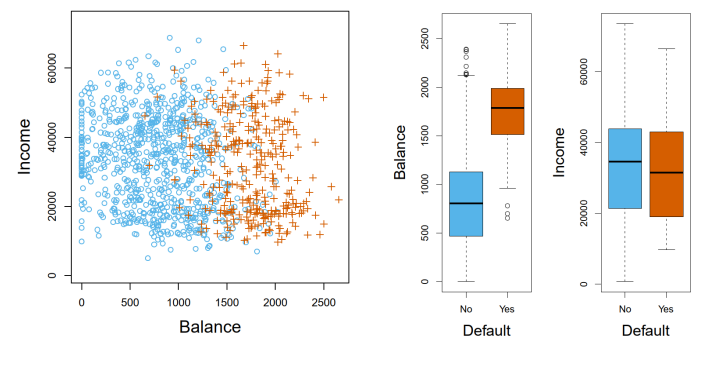

# Predictive Analytics (ISE529)

## Classification (I)

Dr. Tao Ma  
ma.tao@usc.edu  
*2026 Spring*

### LOGISTIC REGRESSION

#### Example of Classification

An internet company would like to understand what factors influence whether a visitor to a webpage clicks on an advertisement. Suppose it has available historical data of  $n$  ad impressions, each impression corresponding to a single ad being shown to a single visitor. For the  $i^{th}$  impression, let  $Y_i \in \{0, 1\}$  be such that

$$Y_i = 1 \text{ if the visitor clicked on the ad} \\ Y_i = 0 \text{ otherwise.}$$

The internet company also has available various attributes for each impression, such as the position and size of the ad on the webpage, the product being advertised, the age and gender of the visitor, the time of day, the month of the year, etc. For each  $i^{th}$  impression, suppose that all these attributes are encoded numerically as  $p$  covariates  $x_{i1}, \dots, x_{ip} \in \mathbb{R}$ .

The methods used for classification is to **predict the probability** that the observation belongs to each of the categories of a qualitative variable, as the basis for making the classification.

$$p(X) = \Pr(Y = k \mid X = x_{i1}, \dots, x_{ip}), \quad k = 0 \text{ or } 1$$

#### Logistic Regression Model

The **logistic regression model** assumes each response  $Y_i$  is an independent random variable with distribution  $\text{Bernoulli}(p)$ , where the **log-odds** corresponding to  $p$  is modeled as a linear combination of the covariates plus a possible intercept term, the logistic regression model can be generalized as follows:

$$\log \frac{p_i}{1 - p_i} = \beta_0 + \beta_1 x_{i1} + \cdots + \beta_p x_{ip}$$

The ratio  $p_i / [1 - p_i]$  is called the **odds** and can take on any value between 0 and  $\infty$ . Odds are a traditional way of probability expression.

Each coefficient  $\beta_j$  represents the amount of increase or decrease in the log-odds, if the value of the covariate  $x_{ij}$  is increased by 1 unit. The above may be equivalently written as

$$
\Pr(Y_i = 1 \mid X = x_{i1}, \dots, x_{ip}) = p_i = \frac{e^{\beta_0 + \beta_1 x_{i1} + \cdots + \beta_p x_{ip}}}{1 + e^{\beta_0 + \beta_1 x_{i1} + \cdots + \beta_p x_{ip}}}
$$

#### Logistic Regression Model

When there is only one covariate,  $p = 1$ , the logistic model simplifies as

$$
p(x) = \frac{e^{\beta_0 + \beta_1 x}}{1 + e^{\beta_0 + \beta_1 x}}
$$
The figure illustrates the logistic regression model, where the red points correspond to the data values  $(x_1, Y_1), \dots, (x_n, Y_n)$  of the covariate and response, and the black curve shows the probability function.

The logistic function will always produce an S-shaped curve, and so regardless of the value of  $X$ , we will obtain  $0 \le p(X) \le 1$ .

> Model outputs prob for X belong to class 1.

### Estimate Coefficients

We use the maximum likelihood method to estimate  $\boldsymbol{\beta} = (\beta_0, \beta_1, \dots, \beta_p)$ . Since the responses  $Y_1, \dots, Y_n$  are independent **Bernoulli** random variables, the likelihood for the logistic regression model is given by

$$L(\beta_0, \dots, \beta_p) = \prod_{i=1}^{n} p_i^{Y_i} (1 - p_i)^{1-Y_i} = \prod_{i=1}^{n} (1 - p_i) \left( \frac{p_i}{1 - p_i} \right)^{Y_i}$$

where  $p_i$  is defined as a function of  $\boldsymbol{\beta} = (\beta_0, \beta_1, \dots, \beta_p)$  and the covariates  $x_{i1}, \dots, x_{ip}$  by the logistic equation. Then, the log-likelihood is

$$\begin{aligned} l(\beta_0, \dots, \beta_p) &= \sum_{i=1}^{n} \left( Y_i \log \left( \frac{p_i}{1 - p_i} \right) + \log(1 - p_i) \right) \\ &= \sum_{i=1}^{n} \left( Y_i \sum_{j=0}^{p} \beta_j x_{ij} - \log \left( 1 + e^{\sum_{j=0}^{p} \beta_j x_{ij}} \right) \right) \end{aligned}$$

To estimate  $\beta = (\beta_0, \beta_1, \dots, \beta_p)$ , set the partial derivatives of the log-likelihood equal to 0 for  $m = 0, \dots, p$ .

$$
\frac{\partial l}{\partial \beta_m} = \sum_{i=1}^{n} x_{im} \left( Y_i - \frac{e^{\sum_{j=0}^{p} \beta_j x_{ij}}}{1 + e^{\sum_{j=0}^{p} \beta_j x_{ij}}} \right) = 0
$$
These equations may be solved numerically (e.g. by **Newton-Raphson**) to obtain the MLEs  $\hat{\beta} = (\hat{\beta}_0, \hat{\beta}_1, \dots, \hat{\beta}_p)$

$$
\hat{\beta}_{n+1} = \hat{\beta}_n - \frac{l'(\hat{\beta})}{l''(\hat{\beta})}
$$
We can iterate this procedure, minimizing one approximation and then using that to get a new approximation until a criterion is met.

### Making Predictions

We may estimate the probability for a new record with covariates  $x_{01}, \dots, x_{0p}$  by plugin the values of those covariates to the model estimated:

$$
\Pr(Y_i = 1 \mid X = x_{01}, \dots, x_{0p}) = \hat{p}_i = \frac{e^{\hat{\beta}_0 + \hat{\beta}_1 x_{01} + \dots + \hat{\beta}_p x_{0p}}}{1 + e^{\hat{\beta}_0 + \hat{\beta}_1 x_{01} + \dots + \hat{\beta}_p x_{0p}}}
$$

### Hypothesis Test

To test if a particular coefficient is 0, say  $H_0: \beta_p = 0$ , one method is using the generalized **likelihood ratio test**. This null hypothesis corresponds to a sub-model with **one fewer parameter**. We use maximum likelihood method to estimate the sub-model and calculate its likelihood. Use the generalized likelihood ratio statistic
$$
D = -2 \log \Lambda = -2 \log \frac{L(\hat{\beta}_0, \dots, \hat{\beta}_{p-1}, 0)}{L(\hat{\beta}_0, \dots, \hat{\beta}_{p-1}, \hat{\beta}_p)}
$$
When  $n$  is large, we may perform an approximate level- $\alpha$  test of  $H_0$  by rejecting  $H_0$  when  $D > \chi^2_1(\alpha)$ , since the difference between model dimensionalities is 1.

##### Example

We are interested in predicting whether an individual will default on his or her credit card payment, on the basis of annual income and monthly credit card balance.

Orange: default; Blue: not default. It appears that individuals who defaulted tended to have higher credit card balances.

##### Example

The table below shows the coefficient estimates and related information that result from fitting a logistic regression model (Y: Default ~ X: Balance).

|           | Coefficient | Std. error | $z$ -statistic | $p$ -value |
|-----------|-------------|------------|----------------|------------|
| Intercept | -10.6513    | 0.3612     | -29.5          | <0.0001    |
| balance   | 0.0055      | 0.0002     | 24.9           | <0.0001    |

To predict the default probability for an individual with a balance of \$1, 000 is

$$
\hat{p}(X) = \frac{e^{\hat{\beta}_0 + \hat{\beta}_1 X}}{1 + e^{\hat{\beta}_0 + \hat{\beta}_1 X}} = \frac{e^{-10.6513 + 0.0055 \times 1,000}}{1 + e^{-10.6513 + 0.0055 \times 1,000}} = 0.00576.
$$

##### Example

The table below shows the coefficient estimates for a logistic regression model that uses  $X$ : *balance*, *income* (in thousands of dollars), and *student* status to predict probability of  $Y$ : *default*.

|               | Coefficient | Std. error | $z$ -statistic | $p$ -value |
|---------------|-------------|------------|----------------|------------|
| Intercept     | -10.8690    | 0.4923     | -22.08         | <0.0001    |
| balance       | 0.0057      | 0.0002     | 24.74          | <0.0001    |
| income        | 0.0030      | 0.0082     | 0.37           | 0.7115     |
| student [Yes] | -0.6468     | 0.2362     | -2.74          | 0.0062     |

We can make predictions for a student whose credit card balance is \$1, 500 and an income of \$40, 000 has an estimated probability of default

$$
\hat{p}(X) = \frac{e^{-10.869+0.00574 \times 1,500+0.003 \times 40-0.6468 \times 1}}{1 + e^{-10.869+0.00574 \times 1,500+0.003 \times 40-0.6468 \times 1}} = 0.058
$$
A non-student with the same balance and income has an estimated probability of default

$$
\hat{p}(X) = \frac{e^{-10.869+0.00574 \times 1,500+0.003 \times 40-0.6468 \times 0}}{1 + e^{-10.869+0.00574 \times 1,500+0.003 \times 40-0.6468 \times 0}} = 0.105
$$

### Confounding Phenomenon

We estimate a logistic regression model that uses  $X$ : *student* status (1 = yes; 0 = no) to predict probability of  $Y$ : *default*. The table below shows the result.

|                      | Coefficient | Std. error | $z$ -statistic | $p$ -value |
|----------------------|-------------|------------|----------------|------------|
| Intercept            | -3.5041     | 0.0707     | -49.55         | <0.0001    |
| <i>student</i> [Yes] | 0.4049      | 0.1150     | 3.52           | 0.0004     |

The coefficient associated with the dummy variable ( $X$ : *student*) is **positive**, and the associated  $p$ -value is statistically significant. This indicates that students tend to have **higher default probabilities** than non-students:

$$\begin{aligned}\widehat{\Pr}(\text{default}=\text{Yes}|\text{student}=\text{Yes}) &= \frac{e^{-3.5041+0.4049 \times 1}}{1 + e^{-3.5041+0.4049 \times 1}} = 0.0431, \\ \widehat{\Pr}(\text{default}=\text{Yes}|\text{student}=\text{No}) &= \frac{e^{-3.5041+0.4049 \times 0}}{1 + e^{-3.5041+0.4049 \times 0}} = 0.0292.\end{aligned}$$

However, the coefficient for the dummy variable is **negative** in previous example, indicating that students are **less likely** to default than non-students. This apparent paradox is known as **confounding**. The root cause is that the variables *student* and *balance* are correlated.

### BINOMIAL LOGISTIC REGRESSION

#### Binomial Logistic Regression

Given a dataset with a total sample size of  $M$ , where each row represents one independent observation with  $p$  columns of predictors.  $Z$  is a column vector of Bernoulli random variables (0 or 1) representing the class of each observation. All rows can be aggregated into  $N$  number of groups.

In the  $i^{th}$  group,  $y_i$  represents the observed counts of the number of successes,  $p_i$  is the probability of success for any given observation in the group,  $n_i$  represents the number of observations, where  $i = 1, 2, \dots, N$ , and  $\sum_{i=1}^{N} n_i = M$

In each group,  $y_i$  follows Binomial distribution.

$$\Pr(y_i) = \binom{n_i}{y_i} p_i^{y_i} (1 - p_i)^{n_i - y_i}$$

### Estimate Binomial Logit Coefficients

We use the maximum likelihood method to estimate  $\boldsymbol{\beta} = (\beta_0, \beta_1, \dots, \beta_p)$ . Since the responses  $y_1, \dots, y_N$  are independent **Binomial**( $p_i, n_i$ ) random variables, the likelihood for the binomial logistic regression model is given by

$$L(\beta_0, \dots, \beta_p) = \prod_{i=1}^{N} \frac{n_i!}{y_i! (n_i - y_i)!} p_i^{y_i} (1 - p_i)^{n_i - y_i} = \prod_{i=1}^{N} (1 - p_i)^{n_i} \left( \frac{p_i}{1 - p_i} \right)^{y_i}$$

where  $p_i$  is defined as a function of  $\boldsymbol{\beta} = (\beta_0, \beta_1, \dots, \beta_p)$  and the covariates  $x_{i1}, \dots, x_{ip}$  by the logistic equation. Then, the log-likelihood is

$$
\begin{aligned} l(\beta_0, \dots, \beta_p) &= \sum_{i=1}^{N} \left( y_i \log \left( \frac{p_i}{1 - p_i} \right) + n_i \log(1 - p_i) \right) \\ &= \sum_{i=1}^{N} \left( y_i \sum_{j=0}^{p} \beta_j x_{ij} - n_i \log \left( 1 + e^{\sum_{j=0}^{p} \beta_j x_{ij}} \right) \right) \end{aligned}
$$

> $y_i$ = # of success, $n_i$ = # obs., $i$ = group

To estimate  $\beta = (\beta_0, \beta_1, \dots, \beta_p)$ , set the partial derivatives of the log-likelihood equal to 0 for  $m = 0, \dots, p$ .

$$
\frac{\partial l}{\partial \beta_m} = \sum_{i=1}^{N} x_{im} \left( y_i - n_i \frac{e^{\sum_{j=0}^{p} \beta_j x_{ij}}}{1 + e^{\sum_{j=0}^{p} \beta_j x_{ij}}} \right) = 0
$$
These equations may be solved numerically (e.g. by **Newton-Raphson**) to obtain the MLEs  $\hat{\beta} = (\hat{\beta}_0, \hat{\beta}_1, \dots, \hat{\beta}_p)$

$$
\hat{\beta}_{n+1} = \hat{\beta}_n - \frac{l'(\hat{\beta})}{l''(\hat{\beta})}
$$
We can iterate this procedure, minimizing one approximation and then using that to get a new approximation until a criterion is met.

### **MULTINOMIAL LOGISTIC REGRESSION**

#### Multinomial Logistic Regression

To extend from  $K = 2$  to  $K > 2$ , known as *multinomial logistic regression*, we first select a single class to serve as the **baseline**; without loss of generality, we select the  $K^{\text{th}}$  class to serve as the baseline class, then the model can be written as

$$
\Pr(Y_i = k \mid X = x_{i1}, \dots, x_{ip}) = \frac{e^{\beta_{k0} + \beta_{k1}x_{i1} + \dots + \beta_{kp}x_{ip}}}{1 + \sum_{l=1}^{K-1} e^{\beta_{l0} + \beta_{l1}x_{i1} + \dots + \beta_{lp}x_{ip}}}
$$
for  $k = 1, \dots, K-1$ , and the probability for baseline class

$$
\Pr(Y_i = K \mid X = x_{i1}, \dots, x_{ip}) = \frac{1}{1 + \sum_{l=1}^{K-1} e^{\beta_{l0} + \beta_{l1}x_{i1} + \dots + \beta_{lp}x_{ip}}}
$$

$$
\log \frac{\Pr(Y_i = k \mid X = x_{i1}, \dots, x_{ip})}{\Pr(Y_i = K \mid X = x_{i1}, \dots, x_{ip})} = \beta_{k0} + \beta_{k1}x_{i1} + \dots + \beta_{kp}x_{ip}
$$

The multinomial logistic model is estimated by maximizing the **multinomial** log likelihood function.

#### Multinomial Logistic Regression

An alternative coding for multinomial logistic regression, known as the **softmax** coding. In the **softmax** coding, rather than selecting a baseline class, we treat all  $K$  classes symmetrically, and assume that for  $k = 1, \dots, K$ ,

$$\Pr(Y_i = k \mid X = x_{i1}, \dots, x_{ip}) = p_i = \frac{e^{\beta_{k0} + \beta_{k1}x_{i1} + \dots + \beta_{kp}x_{ip}}}{\sum_{l=1}^{K} e^{\beta_{l0} + \beta_{l1}x_{i1} + \dots + \beta_{lp}x_{ip}}}$$

A different linear function corresponds to each class. Thus, rather than estimating coefficients for  $K - 1$  classes, we estimate coefficients for all  $K$  classes. The log-odds ratio between the  $h^{\text{th}}$  class and  $k^{\text{th}}$  class equals

$$\log \frac{\Pr(Y_i = h \mid X = x_{i1}, \dots, x_{ip})}{\Pr(Y_i = k \mid X = x_{i1}, \dots, x_{ip})} = (\beta_{h0} - \beta_{k0}) + (\beta_{h1} - \beta_{k1})x_{i1} + \dots + (\beta_{hp} - \beta_{kp})x_{ip}$$