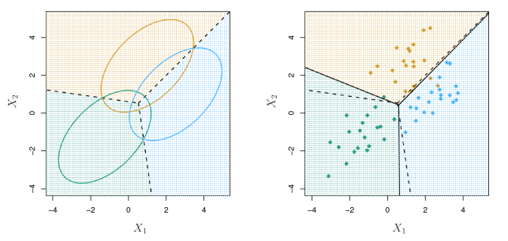
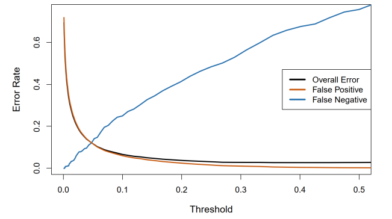
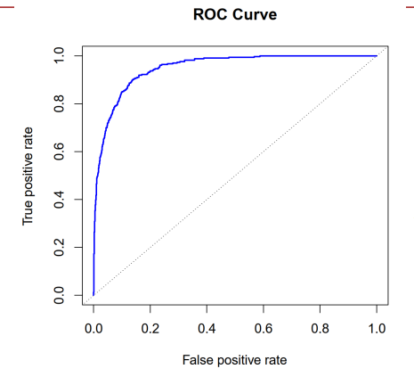
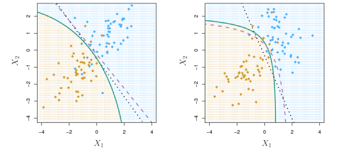
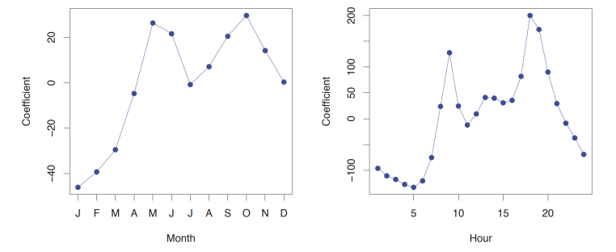
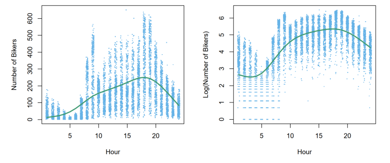

# Predictive Analytics (ISE529)

## Classification (II)

Dr. Tao Ma  
ma.tao@usc.edu  
*2026 Fall*

- Linear Discriminant Analysis
- Quadratic Discriminant Analysis
- Naive Bayes Classification
- Poisson Regression Model
- Generalized Linear Models
- K Nearest Neighbors

### GENERATIVE MODELS FOR CLASSIFICATION

### Discriminant Analysis

Logistic regression models  $\Pr(Y = k | X = x)$  **directly** via the logistic function. Similarly, the multinomial logistic regression uses the softmax function. These all model the conditional distribution of  $Y$  given  $X$ .

By contrast, **generative models** start with the conditional distribution of  $X$  given  $Y$ , then use Bayes' theorem to estimate  $\Pr(Y = k | X = x)$  :

> $P(Y|X) = \frac{P(X|Y)P(Y)}{P(x)}$

$$
p_k(x) = \Pr(Y = k | X = x) = \frac{\pi_k f_k(x)}{\sum_{l=1}^{K} \pi_l f_l(x)}
$$

- $\pi_k = \Pr(Y = k)$  represents the overall or **prior probability** that a randomly chosen observation comes from the  $k$ th class.
- $f_k(x) \equiv \Pr(X | Y = k)$  denotes the density function of  $X$  for an observation that comes from the  $k$ th class ( $Y = k$ ).
- $p_k(x)$  is the **posterior probability** that the observation  $y_i$  belongs to the  $k$ th class, given the predictor value for that observation.

#### Bayes Theorem for Classification

Bayes Theorem:

$$
\Pr(Y_i = k | X_i = x_{i1}, \dots, x_{ip}) = \frac{\Pr(X_i = x_{i1}, \dots, x_{ip} | Y_i = k) \cdot \Pr(Y_i = k)}{\Pr(X_i = x_{i1}, \dots, x_{ip})}
$$
One writes this slightly differently for discriminant analysis:

$$
\Pr(Y_i = k | X_i = x_{i1}, \dots, x_{ip}) = \frac{\pi_k \cdot f_k(x)}{\sum_{l=1}^{K} \pi_l f_l(x)}
$$
where,

$f_k(x) = \Pr(X_i = x_{i1}, \dots, x_{ip} | Y_i = k)$  is the density for  $X_i$  in class  $k$ . Here we will use normal densities for these, separately in each class.

$\pi_k = \Pr(Y_i = k)$  is the marginal or prior probability for class  $k$ .

#### Why discriminant analysis?

Why do we need another method, when we have logistic regression?

- When the classes are well-separated, the parameter estimates for the logistic regression model are surprisingly unstable. Discriminant analysis methods do not suffer from this problem.
- If  $n$  is small and the distribution of the predictors  $X$  is approximately normal in each of the classes, the discriminant models are more stable than the logistic regression model.
- The discriminant models can be naturally extended to the case of more than two response classes (vs. multinomial logit). It also provides low-dimensional views of the data.

### Bayes Classifier

When the distribution of  $X$  within each class is assumed to be **normal**, it turns out that the model is very similar in form to logistic regression.

When we use normal (Gaussian) distributions for each class, this leads to linear or quadratic discriminant analysis.

However, this approach is quite general, and other distributions can be used as well. We will focus on normal distributions.

In the following slides, we discuss three classifiers that use different estimates of  $f_k(x)$  to approximate the **Bayes classifier**:

- linear discriminant analysis
- quadratic discriminant analysis
- naive Bayes.

### LINEAR DISCRIMINANT ANALYSIS

#### Linear Discriminant Analysis, $p = 1$

Assume that  $p = 1$ , that is, we have only one predictor, and that  $f_k(x)$  is normal or Gaussian. In the one-dimensional setting, the normal density takes the form

$$
f_k(x) = \frac{1}{\sqrt{2\pi\sigma_k^2}} \exp\left(-\frac{1}{2\sigma_k^2}(x - \mu_k)^2\right)
$$
where  $\mu_k$  and  $\sigma_k^2$  are the mean and variance parameters for the  $k$ th class. Let us further assume that  $\sigma_1^2 = \dots = \sigma_K^2 = \sigma^2$ . Plugging this into Bayes formula, we get the LDA model for  $p_k(x) = \Pr(Y = k | X = x)$ . Then the classifier is written as

$$
p_k(x) = \frac{\pi_k \frac{1}{\sqrt{2\pi\sigma^2}} \exp\left(-\frac{1}{2\sigma^2}(x - \mu_k)^2\right)}{\sum_{l=1}^{K} \pi_l \frac{1}{\sqrt{2\pi\sigma^2}} \exp\left(-\frac{1}{2\sigma^2}(x - \mu_l)^2\right)}
$$
$\pi_k$  denotes the prior probability that an observation belongs to the  $k$ th class.

The Bayes classifier assigns an observation  $X = x$  to the class for which  $p_k(x)$  is largest. This is equivalent to assigning the observation to the class for which  $\delta_k(x)$  is largest, which is calculated by the following **discriminant function**

> $logP_k(x) \approx$

$$
\delta_k(x) = x \cdot \frac{\mu_k}{\sigma^2} - \frac{\mu_k^2}{2\sigma^2} + \log(\pi_k)
$$

The discriminant function is obtained by taking the log of the LDA model and discarding terms that do not depend on  $k$ . The  $\delta_k(x)$  is discriminant score. Note that  $\delta_k(x)$  is a **linear function** of  $x$ .

*For instance*, if  $K = 2$  and  $\pi_1 = \pi_2 = 0.5$ , then the Bayes classifier assigns an observation to class 1 if  $2x(\mu_1 - \mu_2) > \mu_1^2 - \mu_2^2$ , and to class 2 otherwise.

The Bayes decision boundary is the point for which  $\delta_1(x) = \delta_2(x)$ , i.e.,

$$
x = \frac{\mu_1^2 - \mu_2^2}{2(\mu_1 - \mu_2)} = \frac{\mu_1 + \mu_2}{2}.
$$

> $\mu_1 > \mu_2$

##### Example

![Two plots illustrating a classification problem. The left plot shows two probability density functions (PDFs) for two classes: a green curve for class 1 centered at -1.5 and a purple curve for class 2 centered at 1.5, both with a standard deviation of 1. A vertical dashed line at x=0 represents the Bayes classifier decision boundary. The right plot shows a histogram of 20 samples from each class. The green bars represent class 1 samples, and the purple bars represent class 2 samples. The sample means are approximately -1.5 and 1.5, respectively. A vertical dashed line at x=0 represents the decision boundary based on the sample means.](Slide 06 datalab.assets/image-20260303204725587.png)

The left-hand panel:  $\mu_1 = -1.5$ ,  $\mu_2 = 1.5$ ,  $\pi_1 = \pi_2 = 0.5$ , and  $\sigma^2 = 1$ . The Bayes classifier (i.e., the discriminant function) assigns the observation to class 1 if  $x < 0$  and class 2 otherwise.

The right-hand panel:  $n_1 = n_2 = 20$ , we have  $\pi_1 = \pi_2 = 0.5$ . As a result, the decision boundary corresponds to the midpoint between the sample means for the two classes,  $(\mu_1 + \mu_2)/2$ .

##### Estimate the Parameters

Typically, we don't know these parameters in practice; we simply estimate the parameters  $\mu_1, \dots, \mu_K$ ,  $\pi_1, \dots, \pi_K$ , and  $\sigma^2$  from the training data. Then plug them into the discriminant function to approximate the Bayes classifier.

$$\begin{aligned}\hat{\pi}_k &= \frac{n_k}{n} \\ \hat{\mu}_k &= \frac{1}{n_k} \sum_{i: y_i=k} x_i \\ \hat{\sigma}^2 &= \frac{1}{n - K} \sum_{k=1}^{K} \sum_{i: y_i=k} (x_i - \hat{\mu}_k)^2 \\ &= \sum_{k=1}^{K} \frac{n_k - 1}{n - K} \cdot \hat{\sigma}_k^2\end{aligned}$$

where  $\hat{\sigma}_k^2 = \frac{1}{n_k - 1} \sum_{i: y_i=k} (x_i - \hat{\mu}_k)^2$  is the usual formula for the estimated variance in the  $k^{\text{th}}$  class.

#### Multivariate LDA when $p > 1$

Two multivariate Gaussian density functions are shown, with  $p = 2$ . Left: The two predictors are uncorrelated. Right: The two variables have a correlation of 0.7.

We assume that  $X = (X_1, X_2, \dots, X_p)$  is drawn from a multivariate Gaussian (or multivariate normal) distribution, with a class-specific mean vector and a common covariance matrix. Each individual predictor follows a one-dimensional normal distribution, with some correlation between each pair of predictors.

The bell shape will be distorted if the predictors are correlated or have unequal variances,

#### Multivariate LDA when $p > 1$

To indicate that a  $p$ -dimensional random variable  $X$  has a multivariate Gaussian distribution, we write  $X \sim N(\mu, \Sigma)$ . Here  $E(X) = \mu$  is the mean of  $X$  (a vector with  $p$  components), and  $Cov(X) = \Sigma$  is the  $p \times p$  covariance matrix of  $X$ . Formally, the multivariate Gaussian density

$$
f(x) = \frac{1}{(2\pi)^{p/2} |\Sigma|^{1/2}} \exp \left( -\frac{1}{2} (x - \mu)^T \Sigma^{-1} (x - \mu) \right)
$$
Discriminant function is:

$$
\delta_k(x) = x^T \Sigma^{-1} \mu_k - \frac{1}{2} \mu_k^T \Sigma^{-1} \mu_k + \log \pi_k
$$
where  $\mu_k$  is a class-specific mean vector, and  $\Sigma$  is a covariance matrix that is **common** to all  $K$  classes. This is the vector/matrix version of LDA. The Bayes classifier assigns an observation  $X = x$  to the class for which  $\delta_k(x)$  is largest. Despite its complex form, it is a linear function of  $X$ .

$$\delta_k(x) = c_{k0} + c_{k1}x_1 + c_{k2}x_2 + \dots + c_{kp}x_p$$

##### Example

$p = 2$  predictors and  $K = 3$  classes,  $\pi_1 = \pi_2 = \pi_3 = 1/3$ .

Left: Ellipses that contain 95% of the probability for each of the three classes. The dashed lines are known as the Bayes decision boundaries.

Right: 20 observations were generated from each class, and the corresponding LDA decision boundaries are solid black lines.

### From $\delta_k(x)$ to Probabilities

Once we have estimates  $\hat{\delta}_k(x)$ , we can turn these into estimates for class probabilities:

$$
\widehat{\Pr}(Y = k | X = x) = \frac{e^{\hat{\delta}_k(x)}}{\sum_{l=1}^{K} e^{\hat{\delta}_l(x)}}.
$$

> $\log P_k(x) \approx \delta_k(x)$ <---Utility function

Hence, classifying to the largest  $\hat{\delta}_k(x)$  amounts to classifying to the class for which  $\Pr(Y = k | X = x)$  is largest.

When  $K = 2$ , we classify to class 2 if  $\Pr(Y = 2 | X = x) \ge 0.5$ , else to class 1.

### Confusion Matrix

##### LDA on Credit Data

|                                     |       | <i>True Default Status</i> |     |       |
|-------------------------------------|-------|----------------------------|-----|-------|
|                                     |       | No                         | Yes | Total |
| <i>Predicted Default Status</i> | No    | 9644                       | 252 | 9896  |
|                                     | Yes   | 23                         | 81  | 104   |
|                                     | Total | 9667                       | 333 | 10000 |

$(23 + 252)/10000$  errors — a 2.75% misclassification rate!

Some caveats:

- This is training error and may be overfitting. Not a big concern here since  $n = 10000$  and  $p = 2$ .
- Of the true No's, we make  $23/9667 = 0.2\%$  errors; of the true Yes's, we make  $252/333 = 75.7\%$  errors!

>  Not so good for identifying the risk of individual being default!

|                                 |       | <i>True Default Status</i> |     |       |
|---------------------------------|-------|----------------------------|-----|-------|
|                                 |       | No                         | Yes | Total |
| <i>Predicted Default Status</i> | No    | 9644                       | 252 | 9896  |
|                                 | Yes   | 23                         | 81  | 104   |
|                                 | Total | 9667                       | 333 | 10000 |

Types of errors:

**False positive rate:** the fraction of negative examples that are classified as positive —  $23/9667 = 0.2\%$  in example.

**False negative rate:** The fraction of positive examples that are classified as negative —  $252/333 = 75.7\%$  in example.

**Sensitivity** is the percentage of true defaulters that are correctly identified; it equals  $(1 - 252/333) = 24.3\%$ .

**Specificity** is the percentage of non-defaulters that are correctly identified; it equals  $(1 - 23/9667) = 99.8\%$ .

### Confusion Matrix

We produced this table by classifying to class Yes if

$$\widehat{\Pr}(\text{Default} = \text{Yes} | \text{Balance}, \text{Student}) \ge 0.5$$

We can change the two error rates by **changing the threshold** from 0.5 to some other value in  $[0, 1]$ :

$$\widehat{\Pr}(\text{Default} = \text{Yes} | \text{Balance}, \text{Student}) \ge \text{threshold},$$

and vary threshold.

For instance,  $\Pr(\text{default} = \text{Yes} | X = x) > 0.2$ .

|                             |       | True default status |     | Total |
|-----------------------------|-------|---------------------|-----|-------|
|                             |       | No                  | Yes |       |
| Predicted default status | No    | 9432                | 138 | 9570  |
|                             | Yes   | 235                 | 195 | 430   |
|                             | Total | 9667                | 333 | 10000 |

However, this improvement comes at a cost: now 235 individuals who do not default are incorrectly classified.

### Confusion Matrix

A summary of array of terms used in this context:

|                        |               | <i>True class</i> |                 |       |
|------------------------|---------------|-------------------|-----------------|-------|
|                        |               | – or Null         | + or Non-null   | Total |
| <i>Predicted class</i> | – or Null     | True Neg. (TN)    | False Neg. (FN) | N*    |
|                        | + or Non-null | False Pos. (FP)   | True Pos. (TP)  | P*    |
|                        | Total         | N                 | P               |       |

| Name             | Definition | Synonyms                                    |
|------------------|------------|---------------------------------------------|
| False Pos. rate  | FP/N       | Type I error, 1–Specificity                 |
| True Pos. rate   | TP/P       | 1–Type II error, power, sensitivity, recall |
| Pos. Pred. value | TP/P*      | Precision, 1–false discovery proportion     |
| Neg. Pred. value | TN/N*      |                                             |

### Performance Plot

The figure illustrates the trade-off that results from modifying the threshold value for the posterior probability of default. To reduce the false negative rate, we may want to reduce the threshold to 0.1 or less.

How can we decide which threshold value is best? Such a decision must be based on domain knowledge.

##### Performance Plot

##### ROC Curve

The true positive rate is the sensitivity: the fraction of defaulters that are correctly identified, using a given threshold value. The false positive rate is 1-specificity: the fraction of non-defaulters that we classify incorrectly as defaulters, using that same threshold value.

The ideal ROC curve hugs the top left corner, indicating a high true positive rate and a low false positive rate.

The ROC curve is a popular graphic for simultaneously displaying the two types of errors for all possible thresholds. The name “ROC” is an acronym for receiver operating characteristics. The overall performance of a classifier, summarized over all possible thresholds, is given by the area under the (ROC) curve (AUC).

### QUADRATIC DISCRIMINANT ANALYSIS

#### Quadratic Discriminant Analysis

By altering the forms for  $f_k(x)$ , we get different classifiers.

Assume that  $f_k(x)$  are Gaussian densities, i.e., the observations from each class are drawn from a Gaussian distribution. However, each class has its own covariance matrix. That is an observation from the  $k$ th class is of the form  $X \sim N(\mu_k, \Sigma_k)$ , where  $\Sigma_k$  is a covariance matrix for the  $k$ th class. This leads to *Quadratic discriminant analysis*.

The discriminant function is:

$$\begin{aligned}\delta_k(x) &= -\frac{1}{2}(x - \mu_k)^T \Sigma_k^{-1}(x - \mu_k) - \frac{1}{2} \log |\Sigma_k| + \log \pi_k \\ &= -\frac{1}{2} \mathbf{x}^T \Sigma_k^{-1} \mathbf{x} + x^T \Sigma_k^{-1} \mu_k - \frac{1}{2} \mu_k^T \Sigma_k^{-1} \mu_k - \frac{1}{2} \log |\Sigma_k| + \log \pi_k\end{aligned}$$

where the quantity  $x$  appears as a quadratic function.

The QDA classifier plugs estimates of  $\Sigma_k$ ,  $\mu_k$ , and  $\pi_k$  into the discriminant function, and then assigns an observation  $X = x$  to the class for which  $\delta_k(x)$  quantity is largest.

#### Quadratic Discriminant Analysis

Why does it matter whether or not we assume that the  $K$  classes share a common covariance matrix? The answer lies in the bias-variance trade-off.

When there are  $p$  predictors, then estimating a covariance matrix requires estimating  $p(p+1)/2$  parameters.

QDA estimates a separate covariance matrix for each class for a total of  $Kp(p+1)/2$  parameters; LDA assumes that the  $K$  classes share a common covariance matrix. Hence, QDA has a lot of more parameters than LDA. Consequently, LDA is a much less flexible classifier than QDA, and has substantially lower variance. This can potentially lead to improved prediction performance.

Trade-off: LDA may suffer from high bias. LDA tends to be a better bet if training observations are relatively few. In contrast, QDA is recommended if the training set is very large so that the variance of the classifier is not a major concern.

#### Quadratic Discriminant Analysis

$Corr(x_1,x_2) = \sum$									$corr(x_1, x_2) = 0.7$

The Bayes (purple dashed), LDA (black dotted), and QDA (green solid) decision boundaries for a two-class problem.

Left:  $\Sigma_1 = \Sigma_2$ . Since the Bayes decision boundary is linear, it is more accurately approximated by LDA than by QDA.

Right:  $\Sigma_1 \neq \Sigma_2$ . Orange class has a correlation of 0.7 between the variables and the blue class has a correlation of -0.7. Since the Bayes decision boundary is non-linear, it is accurately approximated by QDA than by LDA.

> QDA fits non-linear boundary

### NAIVE BAYES CLASSIFICATION

### Naive Bayes

The naive Bayes classifier assumes that the  $p$  predictors are independent within the  $k$ th class. Stated mathematically, this assumption means that for  $k = 1, \dots, K$ ,

$$f_k(x) = f_{k1}(x_1) \times f_{k2}(x_2) \times \cdots \times f_{kp}(x_p)$$

where  $f_{kj}$  is the density function of the  $j$ th predictor among observations in the  $k$ th class. Hence, plug  $f_k(x)$  into Bayes formula, we get an expression for the posterior probability

$$\Pr(Y = k | X = x) = \frac{\pi_k \times f_{k1}(x_1) \times f_{k2}(x_2) \times \cdots \times f_{kp}(x_p)}{\sum_{l=1}^{K} \pi_l \times f_{l1}(x_1) \times f_{l2}(x_2) \times \cdots \times f_{lp}(x_p)}$$

Since estimating a joint distribution requires such a huge amount of data, naive Bayes is a good choice in a wide range of settings where  $p$  is large, and  $n$  is small. Essentially, the naive Bayes assumption introduces some bias but reduces variance.

> or x1, x2, ...., xp follow different distribution;
>
> especially when joint PDF is very difficult to obtain, then use Naive

### Naive Bayes

To estimate the one-dimensional density function  $f_{kj}$  using training data  $x_{1j}, \dots, x_{nj}$ , we have a few options.

- If  $X_j$  is quantitative, then we can assume that  $X_j | Y = k \sim N(\mu_{jk}, \sigma_{jk}^2)$ .
- Another option is to use a non-parametric estimate for  $f_{kj}$ : a histogram or a kernel density estimator, which is essentially a smoothed version of a histogram.
- If  $X_j$  is qualitative, then we can simply count the proportion of training observations for the  $j$ th predictor corresponding to each class.

### Naive Bayes

Assumes features  $X = (x_1, x_2, \dots, x_p)$  are independent in each class.

**Gaussian** Naive Bayes assumes each  $\Sigma_k$  is diagonal:

$$\begin{aligned}\delta_k(x) &\propto \log \left[ \pi_k \prod_{j=1}^{p} f_{kj}(x_j) \right] \\ &= -\frac{1}{2} \sum_{j=1}^{p} \left[ \frac{(x_j - \mu_{kj})^2}{\sigma_{kj}^2} + \log \sigma_{kj}^2 \right] + \log \pi_k\end{aligned}$$

can use for mixed feature vectors (qualitative and quantitative). If  $X_j$  is qualitative, replace  $f_{kj}(x_j)$  with probability mass function (histogram) over discrete categories.

Despite strong assumptions, Naive Bayes often produces good classification results.

#### Naive Bayes - Toy Example

Density estimates for class  $k=1$

$p = 3, K = 2$

$x^* = (.4, 1.5, 1)$

$\hat{\pi}_1 = \hat{\pi}_2 = 0.5$

$\hat{f}_{11}(0.4) = 0.368$

$\hat{f}_{12}(1.5) = 0.484$

$\hat{f}_{13}(1) = 0.226$

$\hat{f}_{21}(0.4) = 0.030$

$\hat{f}_{22}(1.5) = 0.130$

$\hat{f}_{23}(1) = 0.616$

The posterior probability estimates are

$\Pr(Y = 1 \mid X = x^*) = 0.944$  and  $\Pr(Y = 2 \mid X = x^*) = 0.056$

### **POISSON REGRESSION MODEL**

#### Example: Bikeshare Data

We may sometimes be faced with situations in which  $Y$  is neither qualitative nor quantitative, and so neither linear regression nor the classification approaches is applicable.

As an example, let's consider the *Bikeshare* data set. The response is bikers, **the number of hourly users** of a bike sharing program in Washington, DC. This response value is neither qualitative nor quantitative: instead, it takes on **non-negative integer values, or counts**.

We want to predict **bikers** (response variable) using the predictors: treat **mnth**, **hr**, and **weathersit** as qualitative variables.

- **mnth** (month of the year)
- **hr** (hour of the day, from 0 to 23)
- **workingday** (an indicator variable = 1 if it is neither a weekend nor a holiday)
- **weathersit** (a qualitative variable: clear; misty or cloudy; light rain or light snow; or heavy rain or heavy snow.)
- **temp** (the normalized temperature in Celsius)

#### Example: Bikeshare Data

Linear regression with *Bikeshare* data set.

|                             | Coefficient | Std. error | <i>t</i> -statistic | <i>p</i> -value |
|-----------------------------|-------------|------------|---------------------|-----------------|
| Intercept                   | 73.60       | 5.13       | 14.34               | 0.00            |
| workingday                  | 1.27        | 1.78       | 0.71                | 0.48            |
| temp                        | 157.21      | 10.26      | 15.32               | 0.00            |
| weathersit[cloudy/misty]    | -12.89      | 1.96       | -6.56               | 0.00            |
| weathersit[light rain/snow] | -66.49      | 2.97       | -22.43              | 0.00            |
| weathersit[heavy rain/snow] | -109.75     | 76.67      | -1.43               | 0.15            |

For the variable weathersit, the baseline level corresponds to clear skies.

#### Issues with Linear Regression

But upon more careful inspection, some issues become apparent.

- We see that the variance mostly increases with the mean, i.e., heteroscedasticity
- 10% of linear model predictions are negative! (not shown here.)
- Taking  $\log(\text{bikers})$  alleviates this but has its own problems: e.g., predictions are on the wrong scale, and  $\log$  cannot take counts that are zero!

#### Poisson Regression Model

The Poisson distribution is typically used to model **counts** :

$$\Pr(Y = k) = \frac{e^{-\lambda} \lambda^k}{k!} \quad \text{for } k = 0, 1, 2, \dots$$

$$E(Y) = \lambda = \text{Var}(Y)$$

> Model output

i.e., there is a mean/variance dependence, the larger the mean of  $Y$  , the larger its variance.

$$\lambda \in (0, \infty) \rightarrow \log(\lambda) \in (-\infty, +\infty)$$

With covariates, we model the expected number of bikers  $Y$ :

$$\log E(Y) = \log(\lambda) = \beta_0 + \beta_1 X_1 + \dots + \beta_p X_p$$

or equivalently

$$\lambda = e^{\beta_0 + \beta_1 X_1 + \dots + \beta_p X_p}$$

Model automatically guarantees that the predictions are non-negative.

#### Poisson Regression Model

To estimate the coefficients  $\beta_0, \beta_1, \dots, \beta_p$ , we use the maximum likelihood approach. Specifically, given  $n$  independent response observations from the Poisson distribution, the likelihood takes the form

$$
L(\beta_0, \beta_1, \dots, \beta_p) = \prod_{i=1}^{n} \frac{\lambda_i^{Y_i} e^{-\lambda_i}}{Y_i!}
$$
where  $\lambda = e^{\beta_0 + \beta_1 X_1 + \dots + \beta_p X_p}$ , the log-likelihood is then

$$
\begin{aligned} l(\beta_0, \beta_1, \dots, \beta_p) &= \sum_{i=1}^{n} Y_i \log \lambda_i - \lambda_i - \log Y_i! \\ &= \sum_{i=1}^{n} Y_i \left( \sum_{j=0}^{p} \beta_j x_{ij} \right) - e^{\sum_{j=0}^{p} \beta_j x_{ij}} - \log Y_i! \end{aligned}
$$
The optimal solution may be solved numerically using the Newton-Raphson method.

#### Poisson Regression Model

We now fit a Poisson regression model to the Bikeshare data set.

|                             | Coefficient | Std. error | z-statistic | p-value |
|-----------------------------|-------------|------------|-------------|---------|
| Intercept                   | 4.12        | 0.01       | 683.96      | 0.00    |
| workingday                  | 0.01        | 0.00       | 7.5         | 0.00    |
| temp                        | 0.79        | 0.01       | 68.43       | 0.00    |
| weathersit[cloudy/misty]    | -0.08       | 0.00       | -34.53      | 0.00    |
| weathersit[light rain/snow] | -0.58       | 0.00       | -141.91     | 0.00    |
| weathersit[heavy rain/snow] | -0.93       | 0.17       | -5.55       | 0.00    |

The bike usage is highest in the spring and fall and during rush hour, and lowest during the winter and in the early morning hours. An increase in  $X_j$  by one unit is associated with a change in  $E(Y) = \lambda$  by a factor of  $\exp(\beta_j)$ . The predictions are nonnegative values. It can capture mean-variance relationship.

### **GENERALIZED LINEAR MODELS**

### Generalized Linear Models

Three types of regression models: linear, logistic and Poisson, share some common characteristics:

- Each approach uses predictors  $X_1, \dots, X_p$  to predict a response  $Y$ . We assume that, conditional on  $X_1, \dots, X_p$ ,  $Y$  belongs to a certain family of distributions.

  - Linear regression -  $Y$  follows a Gaussian or normal distribution.
  - Logistic regression -  $Y$  follows a Bernoulli distribution
  - Poisson regression -  $Y$  follows a Poisson distribution

- Each approach models the mean of  $Y$  as a function of the predictors.

  - Linear regression:

    $$E(Y | X_1, \dots, X_p) = \beta_0 + \beta_1 X_1 + \dots + \beta_p X_p$$

  - Logistic regression:

    $$E(Y | X_1, \dots, X_p) = p = \Pr(Y = 1 | X_1, \dots, X_p)$$

  - Poisson regression:

$$
= \frac{e^{\beta_0 + \beta_1 X_1 + \dots + \beta_p X_p}}{1 + e^{\beta_0 + \beta_1 X_1 + \dots + \beta_p X_p}}
$$

​		$$E(Y | X_1, \dots, X_p) = \lambda = e^{\beta_0 + \beta_1 X_1 + \dots + \beta_p X_p}$$

### Generalized Linear Models

- Linear regression is used for quantitative responses.
- Logistic regression is the counterpart for a binary response and models the logit of the probability as a linear model.
- Poisson regression is used for non-negative integer response and model the log of the expected counts as a linear model.
- Other response types exist.

Generalized linear models provide a **unified framework** for dealing with many different response types. Those equations can be expressed using a link function,  $\eta$ , which applies a transformation to  $E(Y | X_1, \dots, X_p)$  so that the transformed mean is a linear function of the predictors. That is,

$$\eta(E(Y | X_1, \dots, X_p)) = \beta_0 + \beta_1 X_1 + \dots + \beta_p X_p$$

The link functions for linear, logistic and Poisson regression are  $\eta(\mu) = \mu$ ,  $\eta(\mu) = \log(\mu/(1 - \mu))$ , and  $\eta(\mu) = \log(\mu)$ , respectively.

### Generalized Linear Models

The Gaussian, Bernoulli (binomial) and Poisson distributions are all members of a wider class of distributions, known as the **exponential family**. Other well-known members of this family are the exponential distribution, the Gamma family distribution, and the negative binomial distribution.

In general, we can regress the transformed mean of the response  $Y$ , a particular member of the exponential family, on a linear function of the predictors.

Any regression approach that follows this very general recipe is known as a **generalized linear model** (GLM). Thus, linear regression, logistic, and Poisson regression are three examples of GLMs. Other examples not covered here include Gamma regression and negative binomial regression.

The models are fit by maximum-likelihood method.

#### COMPARISON: LOGIT VS. LDA

#### Logistic Regression versus LDA

For a two-class problem, one can show that for LDA

$$\log \left( \frac{p_1(x)}{1 - p_1(x)} \right) = \log \left( \frac{p_1(x)}{p_2(x)} \right) = c_0 + c_1x_1 + \dots + c_px_p$$

Hence, it has the same form as logistic regression.

The difference is in how the parameters are estimated.

- Logistic regression uses the conditional likelihood based on  $\Pr(Y | X)$  (known as discriminative learning).
- LDA uses the full likelihood based on  $\Pr(X, Y)$  (known as generative learning).
- Despite these differences, in practice the results are often very similar.

### Summary

- Logistic regression is very popular for classification, especially when  $K = 2$ .
- LDA is useful when  $n$  is small, or the classes are well separated, and Gaussian assumptions are reasonable. Also when  $K > 2$ .
- Naive Bayes is useful when  $p$  is very large.
- Logistic regression can also fit quadratic boundaries like QDA, by explicitly including quadratic terms in the model.

#### **K NEAREST NEIGHBORS**

#### K Nearest Neighbors

> When we don't know distributions

K nearest neighbors ( $KNN$ ) is a simple algorithm that classifies new cases based on a similarity measure (e.g., distance functions).  $KNN$  is a non-parametric technique. A new case is classified by a majority vote of its  $K$  nearest neighbors measured by a distance function.

Euclidean

$$D = \sqrt{\sum_{i=1}^{k} (x_i - y_i)^2}$$

Manhattan

$$D = \sum_{i=1}^{k} |x_i - y_i|$$

Minkowski

$$D = \left( \sum_{i=1}^{k} (|x_i - y_i|^q) \right)^{1/q}$$

All three distance measures are only valid for continuous variables. In the instance of categorical variables the **Hamming** distance must be used.

Hamming Distance

$$D_H = \sum_{i=1}^{k} |x_i - y_i|$$

$$x = y \Rightarrow D = 0$$

$$x \neq y \Rightarrow D = 1$$

Example:

| X    | Y      | Distance |
|------|--------|----------|
| Male | Male   | 0        |
| Male | Female | 1        |

##### Determine $K$

Choosing the optimal value for  $K$  is best done by first inspecting the data. In general, a large  $K$  value is more precise as it reduces the overall noise but there is no guarantee.

**Cross-validation** is another way to retrospectively determine a good  $K$  value by using an independent dataset to validate the  $K$  value.

Historically, the optimal  $K$  for most datasets has been between 3-10. That produces much better results than 1-NN.

### Example

Consider the following data concerning credit default. Age and loan are two numerical predictors, and default is the response variable. Use the training set to classify an unknown case (age=48 and loan=\$142,000) using Euclidean distance.

$$D = \sqrt{(48 - 33)^2 + (142000 - 150000)^2} = 8000$$

- If  $K=1$  then the nearest neighbor is the last case in the training set with Default= $Y$ .
- With  $K=3$ , there are two Default= $Y$  and one Default= $N$  out of three closest neighbors. The prediction for the unknown case is again Default= $Y$ .

| Age | Loan (\$) | Default | Distance |       |
|-----|-----------|---------|----------|-------|
| 25  | 40000     | N       | 102000   |       |
| 35  | 60000     | N       | 82000    |       |
| 45  | 80000     | N       | 62000    |       |
| 20  | 20000     | N       | 122000   |       |
| 35  | 120000    | N       | 22000    | 2KNN  |
| 52  | 18000     | N       | 124000   |       |
| 23  | 95000     | Y       | 47000    |       |
| 40  | 62000     | Y       | 80000    |       |
| 60  | 100000    | Y       | 42000    | 3KNN  |
| 48  | 220000    | Y       | 78000    |       |
| 33  | 150000    | Y       | 8000     | 1 KNN |
|     |           |         |          |       |
| 48  | 142000    | ?       |          |       |

#### Standardized Distance

One major drawback in calculating distance measures directly from the training set is in the case where variables have different measurement scales or there is a mixture of numerical and categorical variables. One solution is to standardize the training set as shown below.

| Age   | Loan (\$) | Default | Distance |      |
|-------|-----------|---------|----------|------|
| 0.125 | 0.11      | N       | 0.7652   |      |
| 0.375 | 0.21      | N       | 0.5200   |      |
| 0.625 | 0.31      | N       | 0.3160   | 1KNN |
| 0     | 0.01      | N       | 0.9245   |      |
| 0.375 | 0.50      | N       | 0.3428   |      |
| 0.8   | 0.00      | N       | 0.6220   |      |
| 0.075 | 0.38      | Y       | 0.6669   |      |
| 0.5   | 0.22      | Y       | 0.4437   |      |
| 1     | 0.41      | Y       | 0.3650   |      |
| 0.7   | 1.00      | Y       | 0.3861   |      |
| 0.325 | 0.65      | Y       | 0.3771   |      |
|       |           |         |          |      |
| 0.7   | 0.61      | ?       |          |      |

Using the standardized distance on the same training set, the unknown case returned a different neighbor which is not a good sign of robustness.